# 如何下载 Informatica

> 原文：<https://www.tutorialgateway.org/how-to-download-informatica/>

在这篇文章中，我们将向您展示，从哪里或如何下载带有截图的 Informatica。以下是 Informatica 下载中涉及的步骤。

## 下载 Informatica 的逐步过程

第一步:要下载 Informatica，首先点击下载链接进入甲骨文网站。接下来，点击登录按钮登录您的个人账户

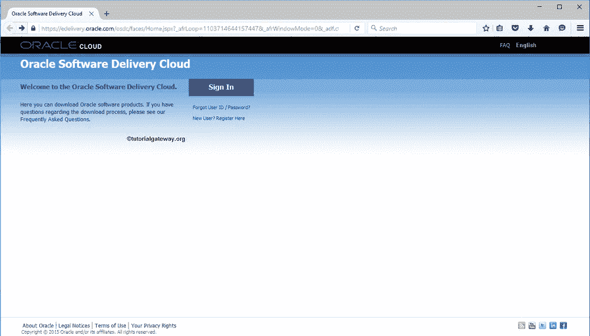

第二步:单击登录按钮后，将打开以下窗口。请提供您的个人或组织帐户的用户名和密码，然后单击登录按钮。

如果您当时没有 oracle 帐户，请单击“创建帐户”按钮创建一个帐户，并填写下载 Informatica 所需的详细信息。

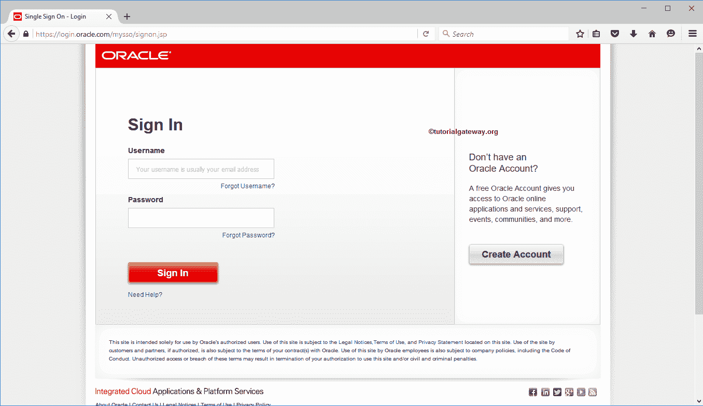

第三步:登录后，请点击

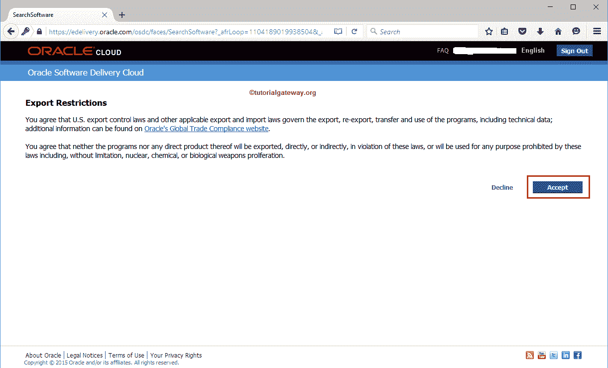

下方的接受按钮

步骤 4:一旦您接受了条款，将显示以下屏幕截图以下载 Informatica。在这里，“产品”字段用于键入所需的产品名称，“选择平台”用于选择操作系统。

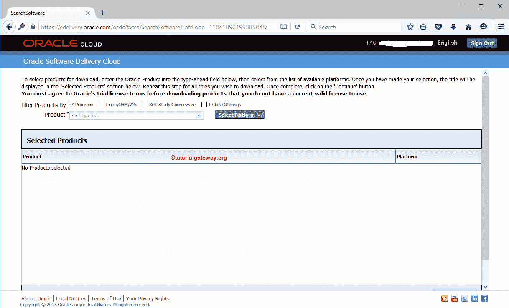

第五步:在这里，我们想下载 Informatica。因此，在产品字段中，开始输入 [Informatica](https://www.tutorialgateway.org/informatica/) 并选择 Oracle Informatica PowerCenter 和 PowerConnect Adapters，如下所示

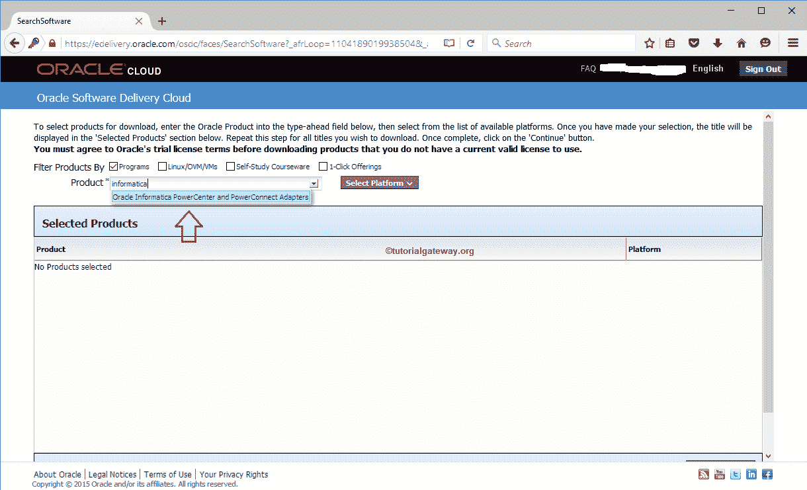

步骤 6:选择选择平台将向您显示可用平台的列表。请选中您需要的平台旁边的复选框，然后单击选择按钮。因为我们运行的是 windows 64 位，所以我们选择了相同的。

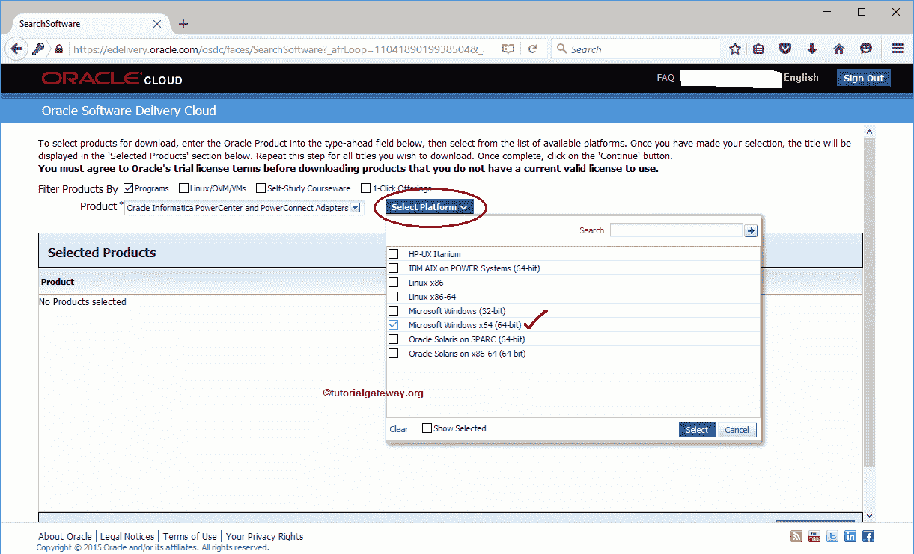

第七步:选择产品和平台后，请点击继续按钮，如下图。

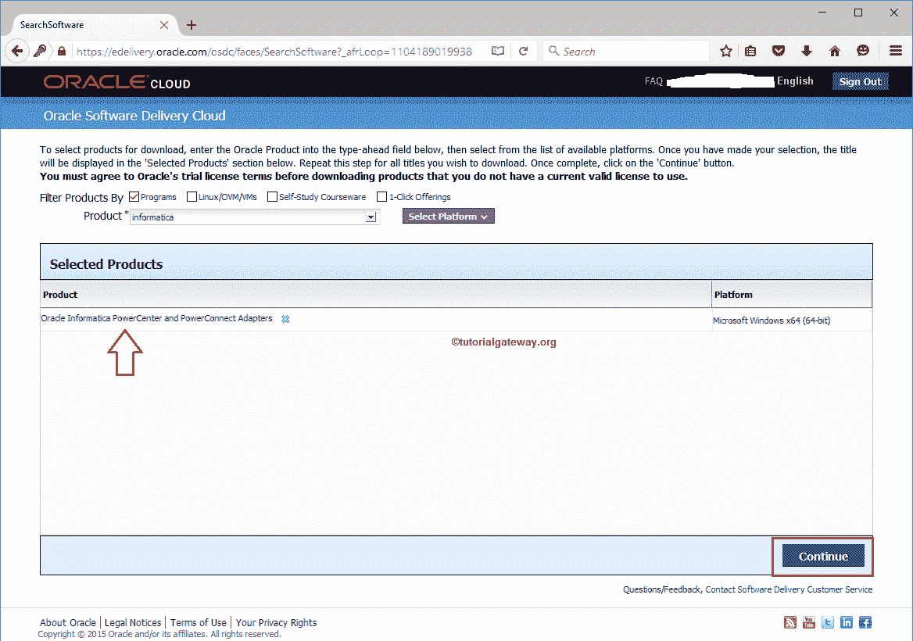

第八步:确保勾选列出的软件，点击【继续】按钮

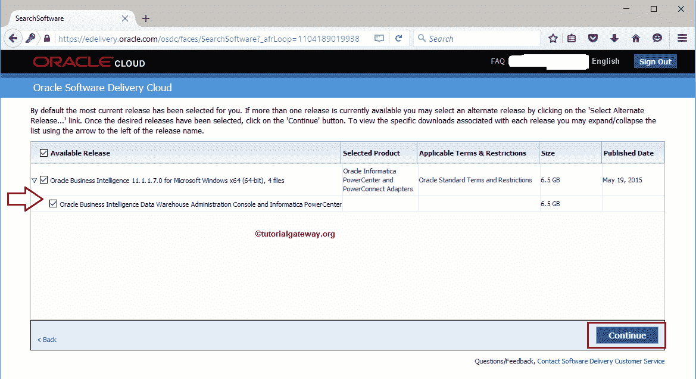

第 9 步:单击继续按钮后，将显示条款和条件弹出窗口。请点击复选框接受条件，然后点击【继续】按钮

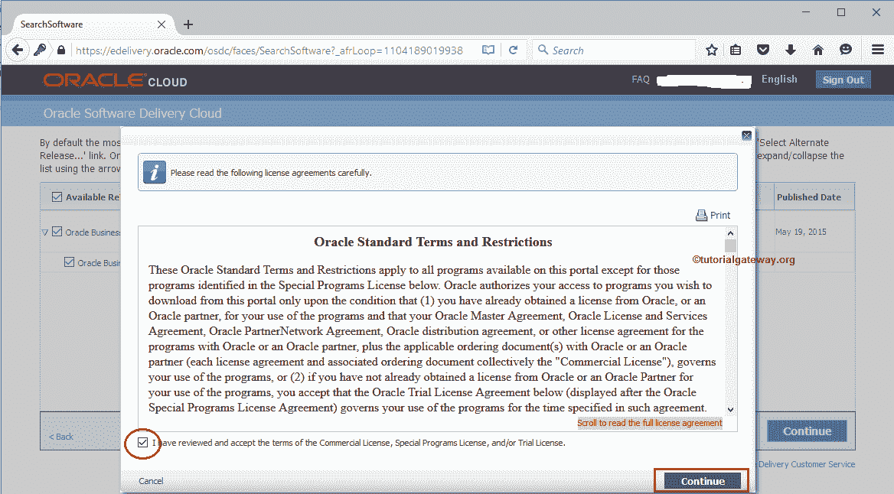

第十步:点击全部下载按钮，它完全下载 Informatica。如果您需要任何特定部件，请单击部件链接并下载。

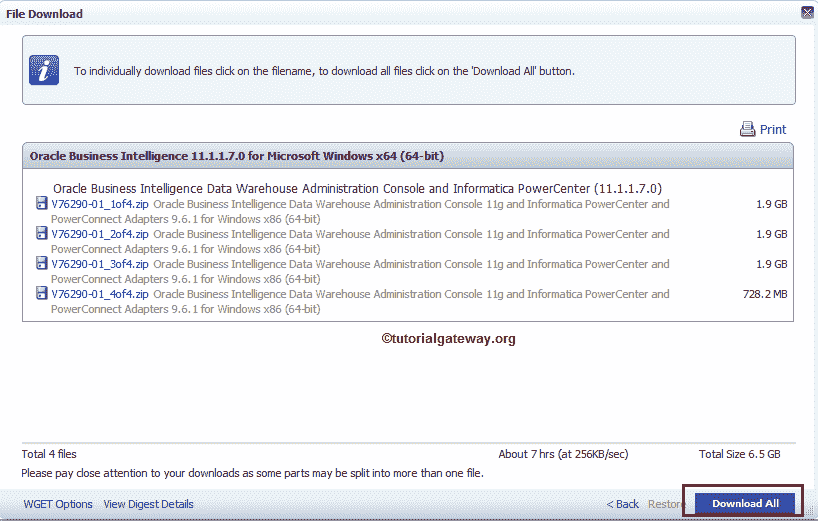

步骤 11:接下来，点击下载安装程序超链接下载 Informatica 安装程序。

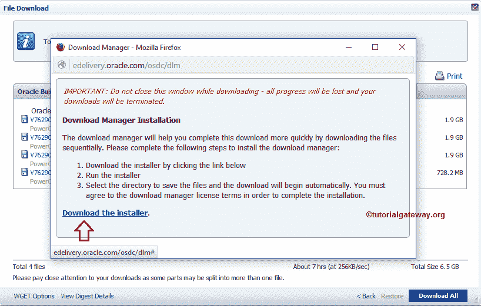

第 12 步:请点击保存文件保存安装程序。

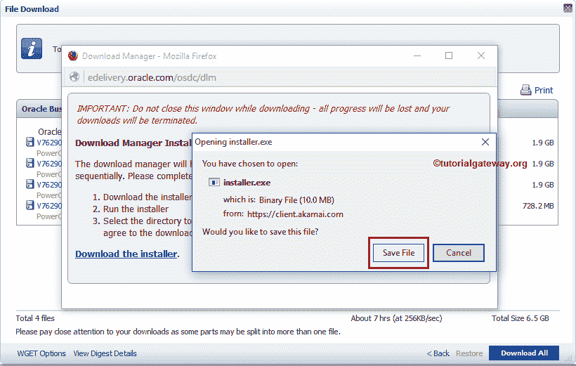

下载完成后，安装它。

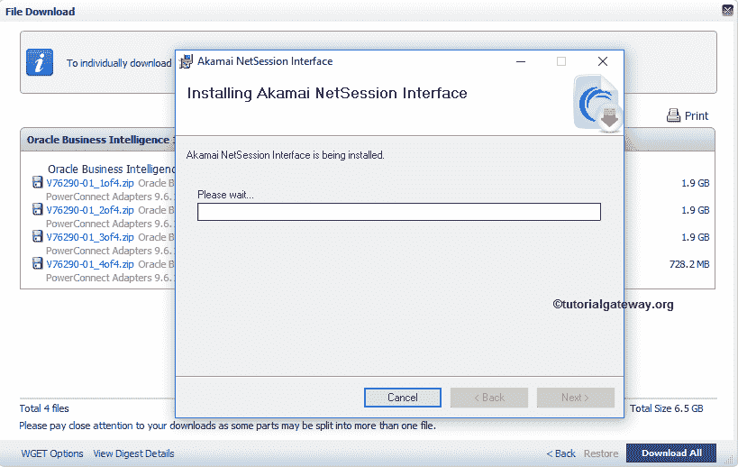

步骤 14:安装完推荐的安装程序后，将显示以下窗口。如你所见，它正在下载四个 zip 文件，其中包含 Informatica 软件

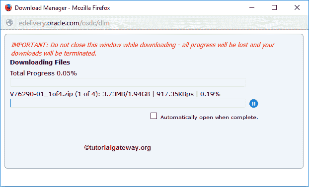

步骤 15:从下面的截图中，你可以注意到四个 ZIP 文件。这意味着我们成功地从甲骨文网站下载了 Informatica。

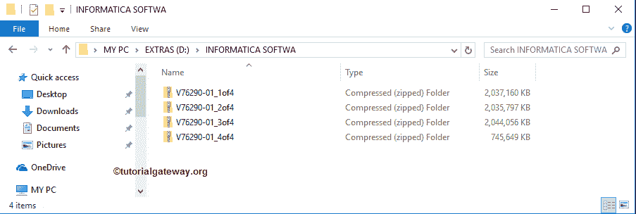

步骤 16:请提取它们

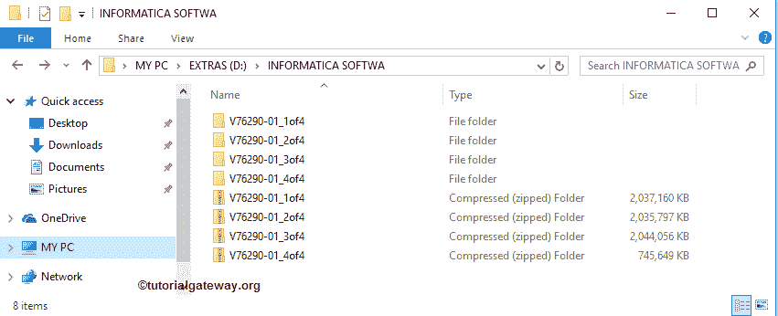

步骤 17:解压完四个部分后，转到 v 76290-01 _ 4 F4 文件夹，选择 DAC _ win _ 11g _ infa _ win _ 64 bit _ 961 zip 文件并解压。

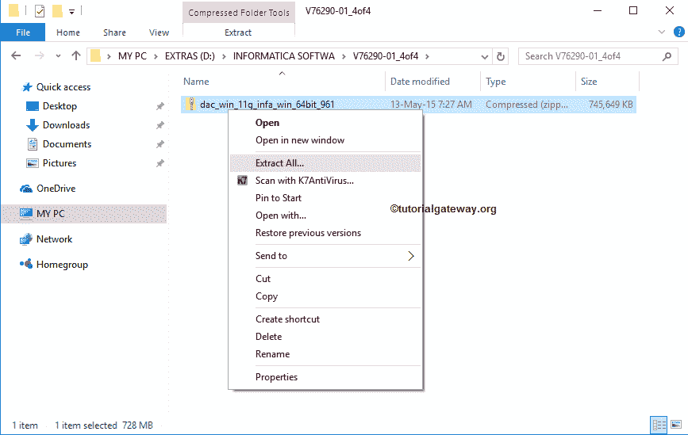

请记住，在提取上面的 RAR 文件时，Win-zip 会询问四个部分的文件路径。所以，

*   对于第一个路径，请选择 V76290-01_1of4 文件夹中的 DAC _ win _ 11g _ infa _ win _ 64 bit _ 961 . z01 文件。
*   对于第二个路径，请选择 V76290-01_2of4 文件夹中的 DAC _ win _ 11g _ infa _ win _ 64 bit _ 961 . z02 文件。
*   第三个路径，请选择 V76290-01_3of4 文件夹内的 DAC _ win _ 11g _ infa _ win _ 64 bit _ 961 . z03 文件。
*   对于第四个路径，请选择 v 76290-01 _ 4 F4 文件夹中的 DAC _ win _ 11g _ infa _ win _ 64 bit _ 961 zip 文件。

提示:请参考[安装 Informatica](https://www.tutorialgateway.org/how-to-install-informatica/) 文章，了解安装下载的 Informatica 所涉及的步骤