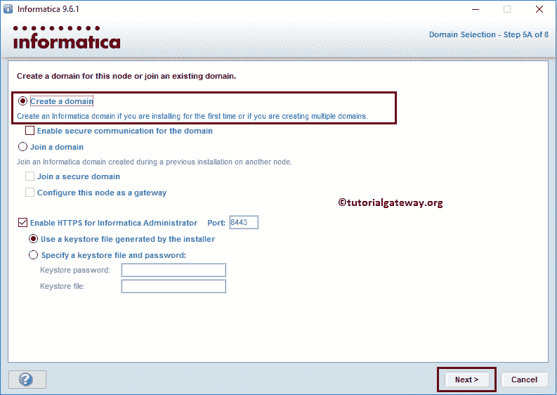
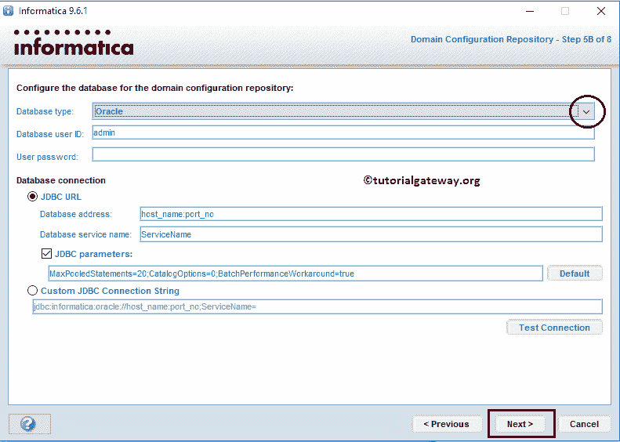
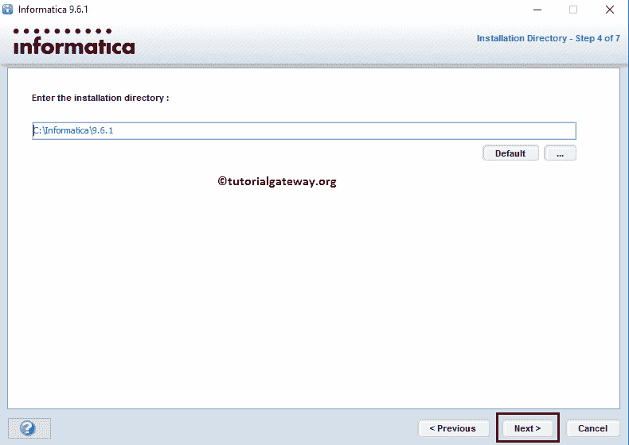

# 如何安装 Informatica

> 原文：<https://www.tutorialgateway.org/how-to-install-informatica/>

在本文中，我们将通过截图向您展示如何在 windows 上安装 Informatica(无论版本如何)。安装 Informatica 包括以下步骤，因此，请按照我们下面提到的相同顺序执行这些步骤:

*   步骤 1:信息服务器安装
*   步骤 2:配置 Informatica 存储库服务和集成服务。请参考[管理控制台](https://www.tutorialgateway.org/informatica-admin-console/)文章来配置存储库和集成服务。
*   步骤 3:信息客户端安装

在我们开始在 windows 上安装 Informatica 之前，

*   我们需要数据库服务器
*   在服务器内创建一个数据库。请记住，这将在创建[信息](https://www.tutorialgateway.org/informatica/)域时分配。参考步骤 5B
*   创建一个数据库用户，并为上面创建的数据库提供管理员凭据。我们将在连接到数据库时使用此用户凭据。参考步骤 5B

提示:请参考[下载](https://www.tutorialgateway.org/how-to-download-informatica/)文章，了解下载 Informatica 9.6.1 涉及的步骤

## 安装 Informatica 的分步过程

提取 DAC _ win _ 11g _ infa _ win _ 64 bit _ 961 zip 文件后，将打开四个 ZIP 文件和一个 KEY 文件。在 windows 上安装 Informatica 之前，请选择并提取它们。下面的截图将向您展示 ZIP 文件和提取的文件夹。

### 安装信息服务器

请将您的文件系统导航到服务器文件夹，然后点击 install.exe 应用程序，如下所示

步骤 1:单击安装应用程序后，将打开 Informatica 安装向导，如下所示。这里我们有两个选择:

*   如果您是第一次安装(像我们一样)，请选择安装 Informatica 9.6.1 选项。
*   如果您要从以前的版本(如 9.5 或任何其他版本)升级，请选择升级到 Informatica 9.6.1

第二步:在这里你可以验证安装 Informatica

的磁盘空间、软硬件要求

步骤 3:在这里，我们必须选择甲骨文许可证密钥。所以点击第一个文本框旁边的…按钮。它打开我们的文件系统来导航和选择 Oracle 许可证密钥。从下面的截图中，您可以观察到我们从 Inf Soft 文件夹中选择了密钥。

注意:这里还可以更改默认安装目录

第四步:点击【下一步】按钮开始安装服务器

第五步:请等到它安装 100%

第 5A 步:在这里，我们有多个选项。如果您是第一次安装 Informatica，请保留默认设置并单击“下一步”按钮:

*   创建域:此选项将帮助您创建域。如果您是第一次安装，请选择此选项。(默认)
*   加入域:如果您想加入在以前的安装中已经创建的现有域，可以选择此选项。

步骤 5B:在第一部分中，我们必须配置数据库设置。

*   数据库类型:请选择您正在使用的数据库类型。
*   数据库用户标识:请提供连接数据库的用户名
*   用户密码:请提供上述数据库用户的密码

在第二部分中，我们有一个数据库连接:

*   数据库地址:请提供上述指定数据库的主机名和端口号。SQL Server 的默认端口号是 1433
*   数据库服务名称:请提供您已经创建的数据库的名称。

请填写您的数据库详细信息。在单击“下一步”按钮之前，请通过单击“测试连接”按钮来测试您的连接设置。

步骤 5C:在这里，我们必须指定加密密钥细节(它是大写、小写和特殊字符的组合)。它只是为了域安全

步骤 6:请提供域密码，并通过重新键入来确认。

TIPS:

1.  这些是我们将用来登录管理控制台的凭据。因此，请记下域用户名作为用户名，域密码作为密码。
2.  请记下域名、主机名和端口号。因为我们将在[存储库中](https://www.tutorialgateway.org/informatica-repository/)添加域和存储库服务时使用这些值。

第 6 步:如果您希望在不同的帐户下运行 Informatica 服务，请选中在不同的用户帐户下运行 Informatica 选项，并提供用户名和密码。

一旦点击下一步按钮，将显示如下截图。从下面的截图中你可以观察到我们成功地将 Informatica Server 安装到了我们的本地硬盘

请单击信息管理员主页网址打开信息管理员控制台。在主页中，我们必须配置信息存储库服务和信息集成服务。

### 安装信息客户端

完成配置信息存储库服务和集成服务后。请将您的文件系统导航到客户端文件夹，然后点击安装批处理文件，如下所示

步骤 1:单击安装批处理文件后，将打开 Informatica 安装向导。这里我们有两个选择:

*   如果您是第一次安装 Informatica 客户端(就像我们一样)，请选择安装 Informatica 9.6.1 客户端选项。
*   如果要从以前的版本(如 9.5 或任何其他客户端)升级，请选择升级到 Informatica 9.6.1 客户端

第三步:请选择所有复选标记，点击【下一步】按钮

第四步:这里可以离开默认安装目录，也可以点击

按钮进行更改

步骤 4A:在这里，我们有多个选择:

*   安装数据转换工作室和 Eclipse 的独立副本:如果您是第一次安装 Informatica，请选择此选项。因为这将创建 Eclipse 的独立副本
*   在现有的 Eclipse 安装上安装数据转换工作室:该选项会将开发环境添加到现有的 Eclipse 安装中

点击下一步按钮开始安装 Informatica 客户端

第六步:请等到它安装 100%

从下面的截图可以观察到，我们成功安装了 Informatica 客户端

