# Informatica 管理控制台

> 原文：<https://www.tutorialgateway.org/informatica-admin-console/>

在本文中，我们将向您展示如何使用 Informatica 管理控制台页面来配置 Informatica 存储库服务和 Informatica 集成服务。

要打开 Informatica 管理控制台，请转到开始菜单->程序->信息->服务器->Informatica 管理器主页。

## Informatica 管理控制台

单击管理员主页后，将打开以下页面。请提供您在安装 Informatica 服务器时指定的用户名和密码。请参考如何安装 Informatica 文章中的步骤 6

注:请参考[如何安装 Informatica](https://www.tutorialgateway.org/how-to-install-informatica/) 一文，了解配置 [Informatica](https://www.tutorialgateway.org/informatica/) 服务器和客户端的步骤。

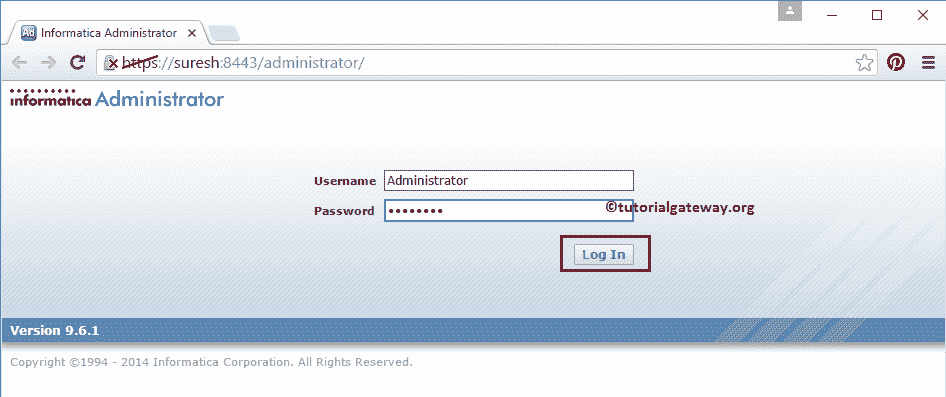

成功登录后，您将进入 Informatica 管理控制台。在这里，您可以看到我们用于安装

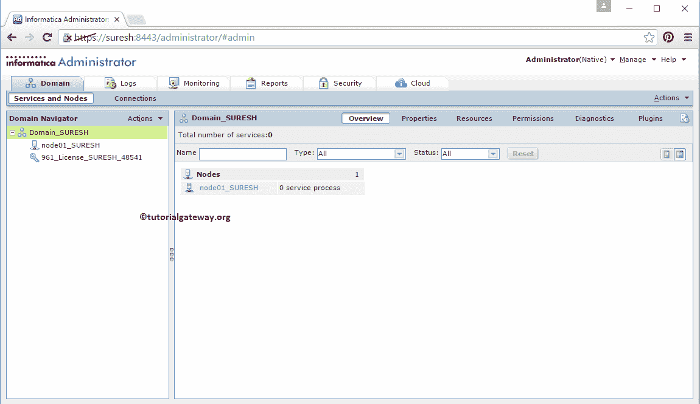

的域名和许可证密钥

### 配置 Informatica 存储库服务

要创建 Informatica 存储库服务，右键单击域名->新建->电力中心存储库服务..如下图截图所示。

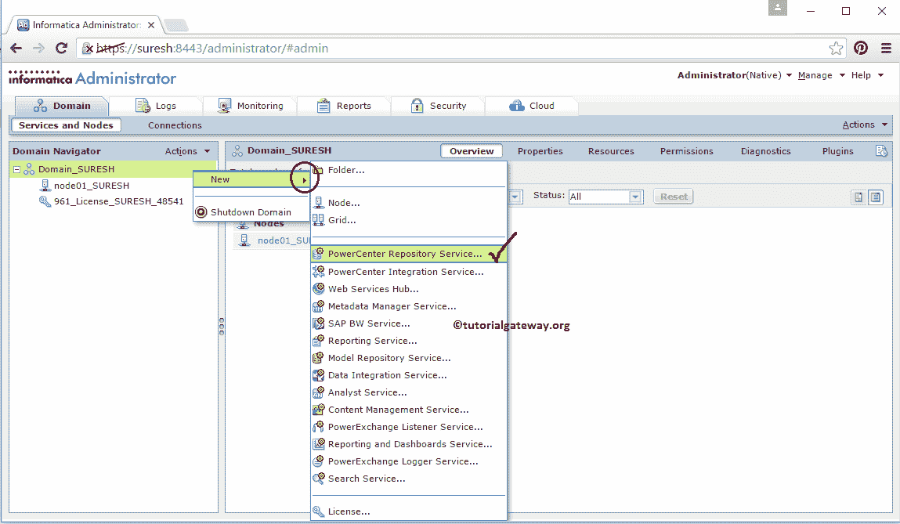

选择电源中心存储库服务后..打开以下选项窗口以创建新的电源中心存储库服务。这里我们有多个选项，例如:

*   名称:请为存储库服务提供任何唯一的名称。
*   描述:请提供存储库服务的有效描述
*   位置:默认情况下，我们的域是自动选择的
*   许可证:从下拉列表中选择许可证密钥。
*   节点:从下拉列表中选择节点。

填写完详细信息后，请点击下一步按钮进入第二步

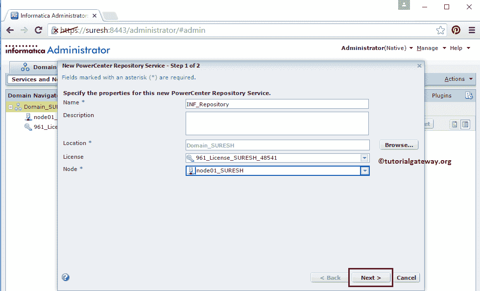

在步骤 2 中，我们必须指定数据库属性:

*   数据库类型:请选择您正在使用的数据库类型。这里我们使用的是 SQL Server 2014，所以我们选择的是 MSSQLServer。
*   用户名:请提供用户名以连接数据库
*   密码:您必须为数据库用户提供密码。
*   连接字符串:您可以保留服务器实例名和数据库名。

接下来，请选中标记版本控制选项。它使我们能够将操作模式从独占模式更改为正常模式

接下来，单击存储库属性旁边的编辑按钮来编辑或更改存储库默认属性。

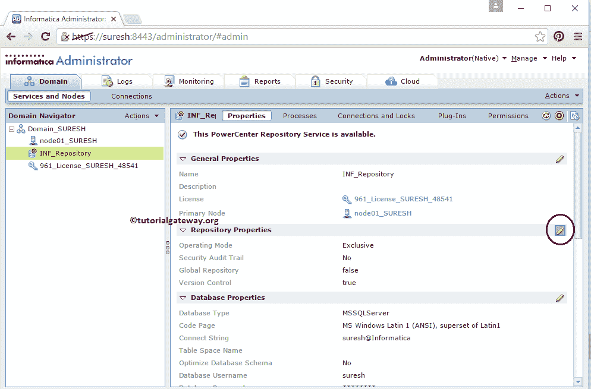

默认情况下，存储库操作模式为独占模式。我们必须将操作模式从独占模式更改为正常模式。

注:如果您在上述步骤中忘记勾选版本控制选项，将无法更改操作模式。

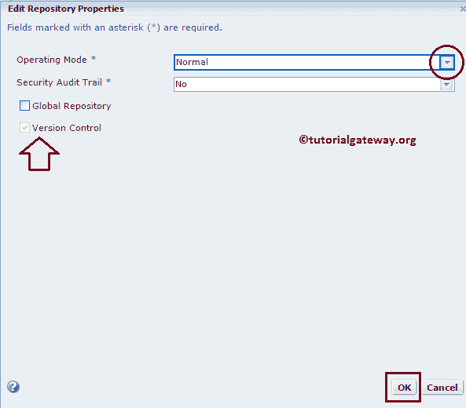

点击【确定】按钮，更改运行模式，然后点击如下所示的

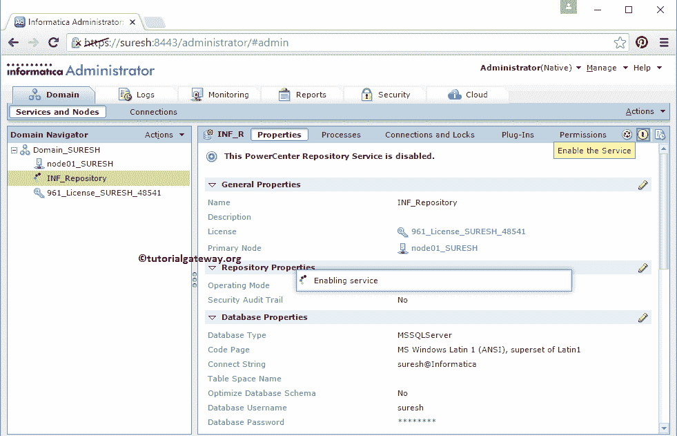

按钮，启用 Informatica 库服务

### 配置 Informatica 集成服务

要创建 Informatica 集成服务，右键单击域名->新建->电力中心集成服务..

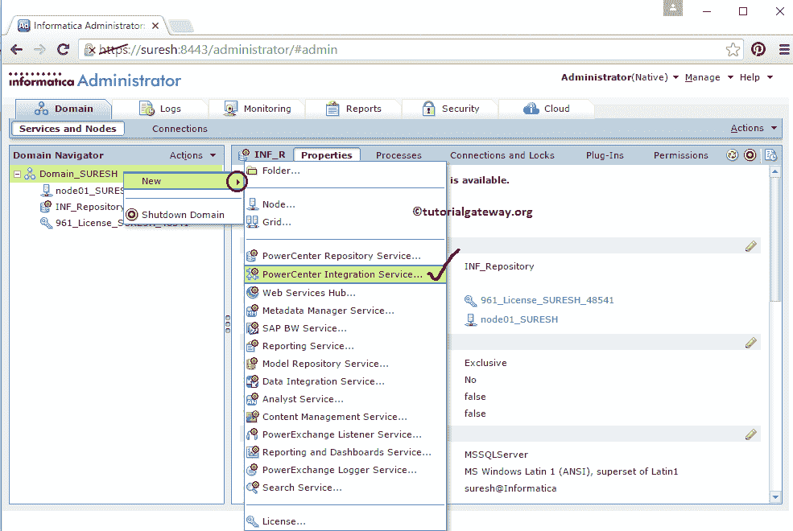

选择电源中心集成服务后..将打开选项以下窗口，以创建新的电力中心集成服务。这里我们有多个选项，例如:

*   名称:请为集成服务提供任何唯一的名称。
*   描述:请提供集成服务的有效描述
*   位置:默认情况下，我们的域是自动选择的
*   许可证:请从下拉列表中选择许可证密钥。
*   节点:从下拉列表中选择节点。

填写完详细信息后，请点击下一步按钮进入第二步

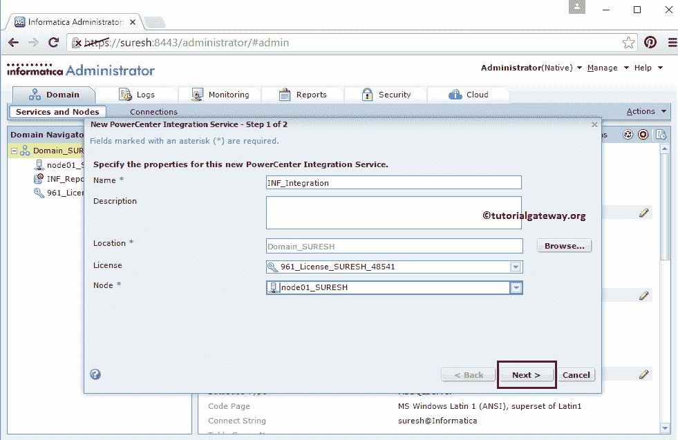

在步骤 2 中，我们必须指定凭据:

*   电源中心存储库服务:在这里，您必须选择已经创建的电源中心存储库服务。如果您忘记这样做，请先创建它，然后创建一个集成服务。
*   用户名:请提供用户名以登录 Informatica 管理控制台
*   密码:请提供登录 Informatica 管理控制台的密码
*   数据移动模式:请保持默认 ASCII 模式。

填写完所需的详细信息后，请点击完成按钮，完成新建电力中心综合服务

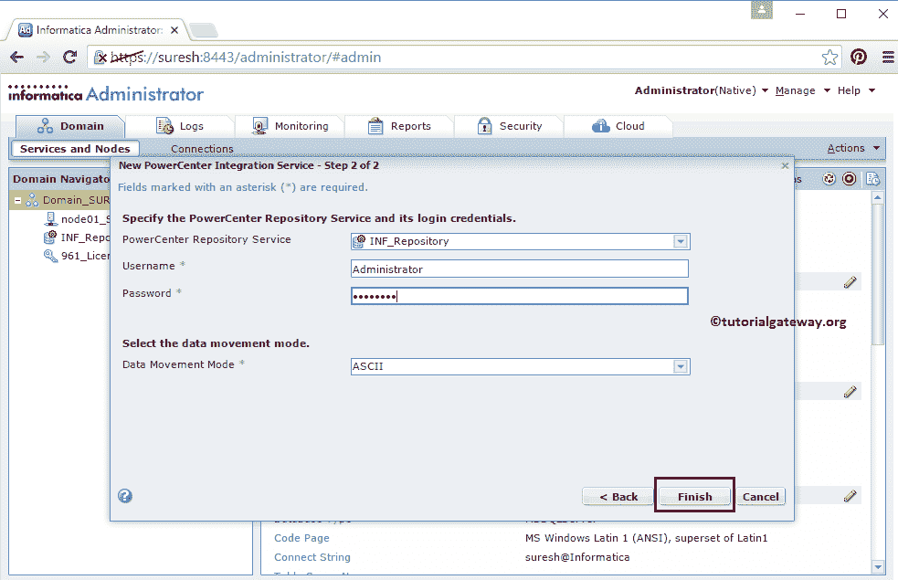

一旦您完成创建新的电力中心集成服务，您必须通过点击如下所示的按钮

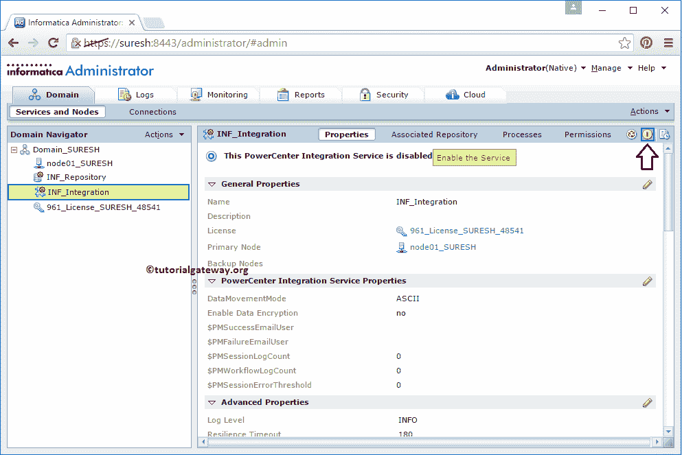

来启用该服务

我们成功地在 Informatica 管理控制台中配置了 Informatica 存储库服务和 Informatica 集成服务。