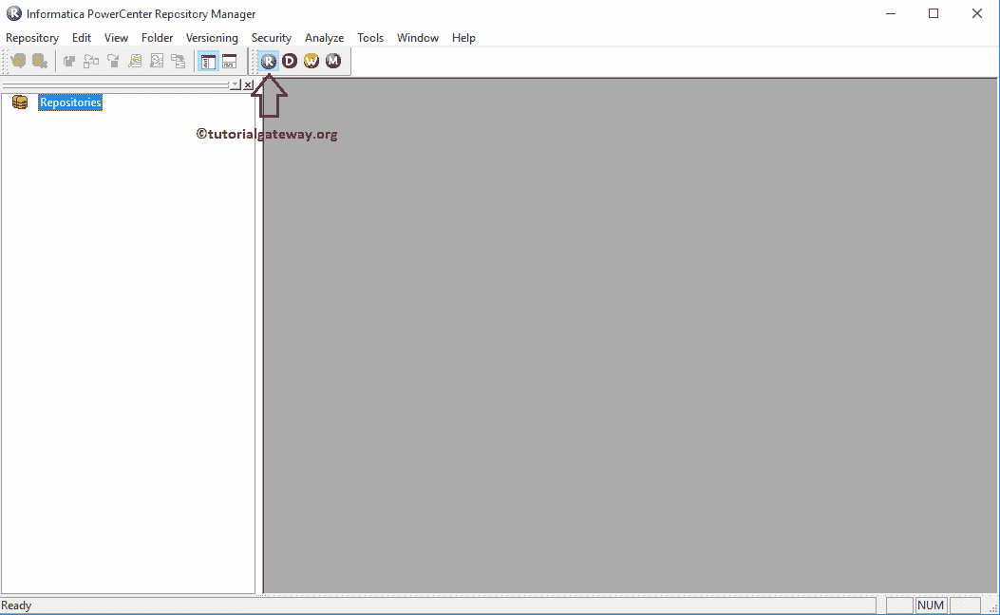
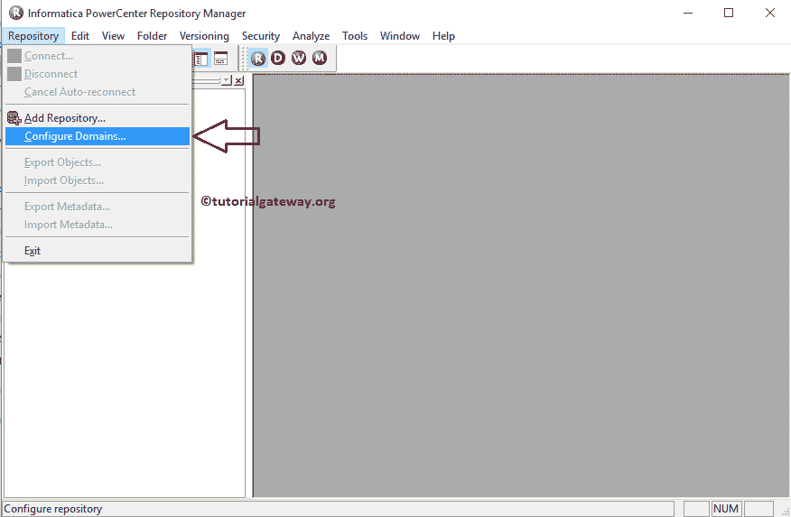
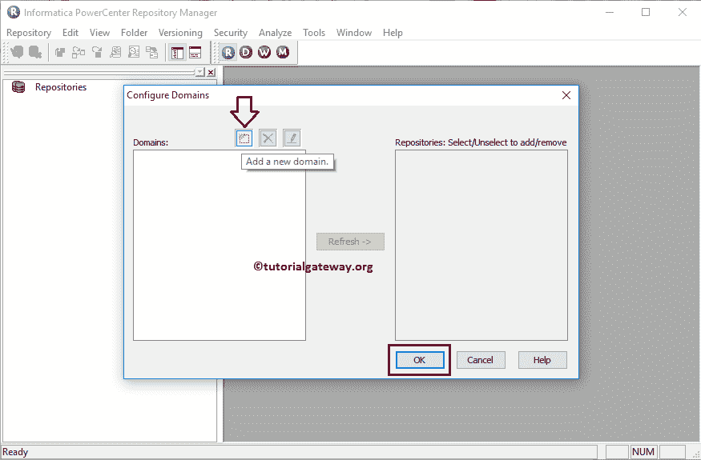
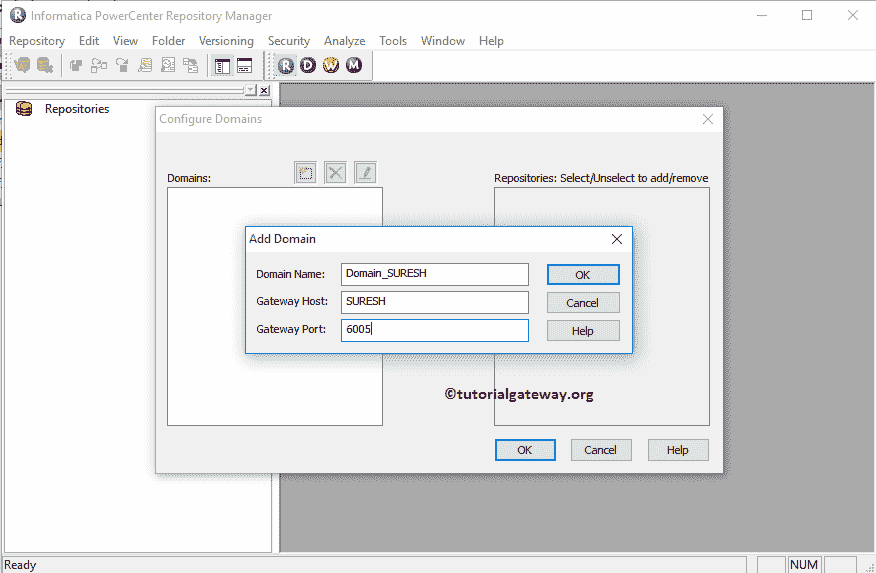
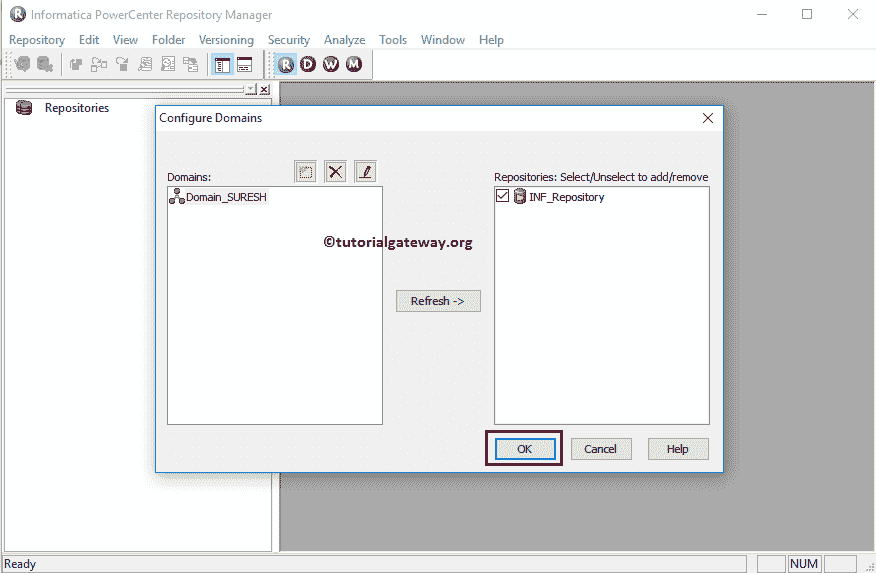
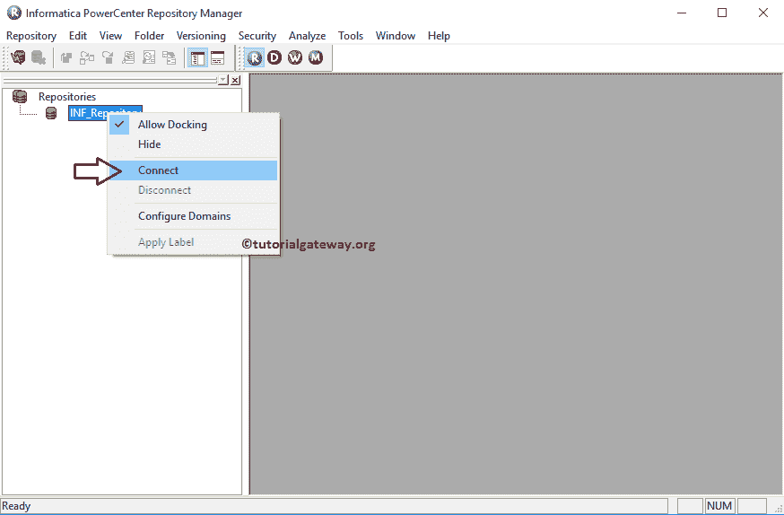
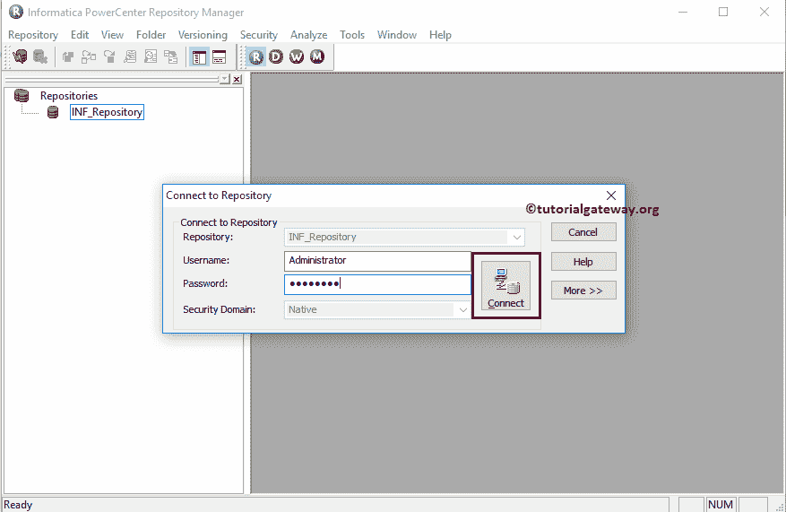
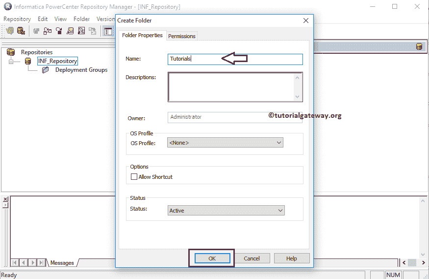
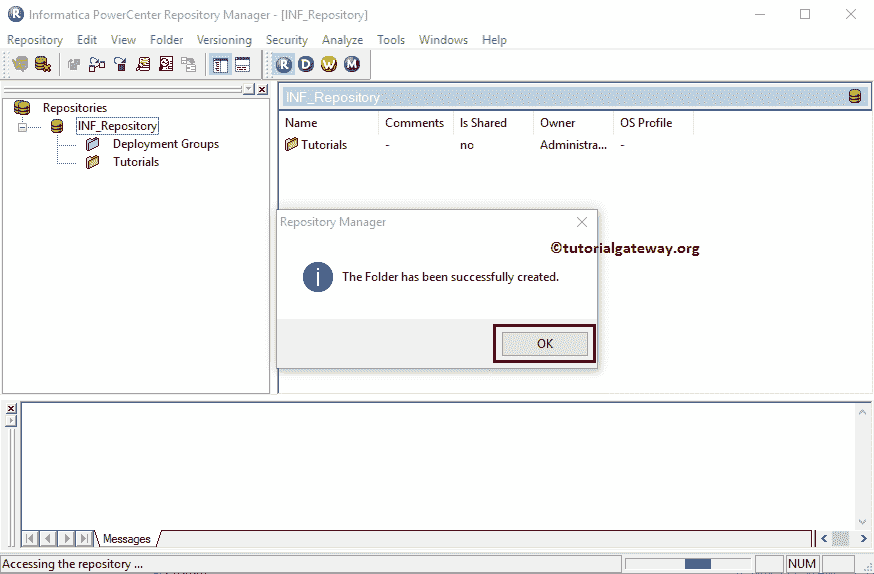

# Informatica存储库

> 原文：<https://www.tutorialgateway.org/informatica-repository/>

Informatica 存储库管理器主要用于两个原因:

*   用于创建新域。它将帮助像 Informatica PowerCenter Designer 这样的客户端工具访问 Informatica 服务器(存储库服务和集成服务)
*   我们使用 Informatica 存储库管理器进行管理工作，例如迁移或部署映射和工作流。

在本文中，我们将向您展示如何创建新域，如何连接到 Informatica 存储库服务，以及创建新文件夹所涉及的步骤。

## 信息存储库管理器

要打开 Informatica 存储库管理器，请转到开始菜单->所有程序-> Informatica 9 . 6 . 1-> power center 存储库管理器。一旦点击，以下窗口将打开

在菜单中，请导航到信息存储库，然后选择配置域..选项。

选择配置域后..选项，将打开一个新窗口来配置域。如果你仔细观察下面的截图，我们的域名部分没有域名，因为我们没有添加任何域名。要添加新域，请单击添加新域按钮。

单击添加新按钮后，将打开一个新窗口来添加域。在这里，我们必须指定域名、主机名和端口号。如果您不知道您的 [Informatica](https://www.tutorialgateway.org/informatica/) 详细信息，那么请参考我们[如何安装](https://www.tutorialgateway.org/how-to-install-informatica/)文章

中的 Informatica 服务器安装步骤 6

请选择电源中心存储库服务，然后单击确定。

完成域配置后，请选择并右键单击新添加的 PowerCenter 存储库服务(INF_Repository)，然后单击连接选项

要连接到 PowerCenter 存储库服务，我们必须提供管理控制台凭据。因此，请提供用户名和密码。

提示:在这里，您必须提供安装信息服务器时指定的管理员用户名和密码。

一旦连接成功，让我们创建一个文件夹来执行提取加载和转换。要创建新文件夹，请导航到文件夹菜单并选择创建..选项。选择该选项将打开以下窗口来创建新文件夹。在这里，您可以将除名称和描述之外的所有属性保留为默认值。

*   名称:请指定唯一的文件夹名称。该文件夹将保存源、目标、映射、映射、转换和函数。
*   描述:请指定此文件夹的有效描述。它将帮助其他人理解文件夹。

单击“确定”按钮会打开一个弹出窗口。它显示消息说文件夹已经成功创建

