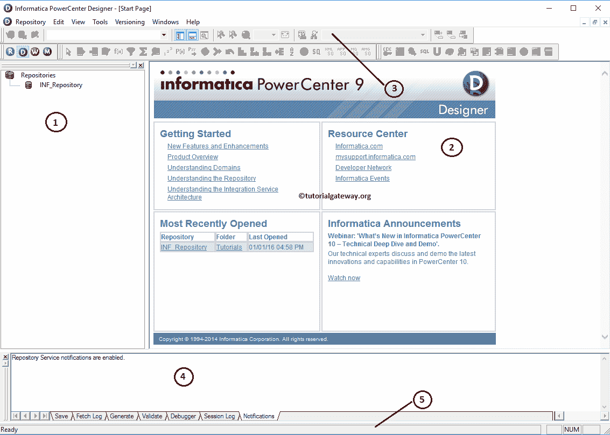

# Informatica PowerCenter设计器

> 原文：<https://www.tutorialgateway.org/informatica-powercenter-designer/>

信息中心设计器帮助我们创建或编辑信息中心对象，如源、转换、目标和映射。在本文中，我们将向您解释 Informatica PowerCenter 设计器中的每个组件。

## Informatica PowerCenter设计器

要打开 Informatica PowerCenter 设计器，请转到开始菜单->所有程序-> Informatica 9 . 6 . 1-> power center 设计器。点击后，将打开以下窗口。

从下面的截图中，您可以观察到我们将 Informatica PowerCenter Designer 屏幕分为五个部分来详细解释每个部分。让我们单独看一看，

1.  导航器:这个部分允许我们连接到 Informatica 存储库服务，并在不同的文件夹之间导航，如源、目标、转换等。
2.  工作空间:此部分用于执行设计，包括创建或修改源和目标、创建可重用的转换、对多个转换进行分组以及执行映射。
3.  工具栏:默认情况下，它显示设计时最常用的组件(如转换)。我们可以按照我们的要求编辑这个部分。
4.  输出窗口:在这里，你可以检查给定的代码是否有效，找到错误。
5.  状态栏:信息中心设计器的这一部分显示当前操作的状态。

在开始设计之前，我们必须连接存储库服务，因此，请选择并右键单击存储库部分下的 PowerCenter 存储库服务(INF_Repository)，然后选择连接选项

要连接到信息中心设计器，我们必须提供[信息管理控制台](https://www.tutorialgateway.org/informatica-admin-console/)凭证。所以，请提供[信息](https://www.tutorialgateway.org/informatica/)用户名和密码。

提示:在这里，您必须提供您在[安装 Informatica](https://www.tutorialgateway.org/how-to-install-informatica/) 服务器时指定的 Informatica PowerCenter 设计器管理员用户名和密码。

一旦成功连接到[信息库](https://www.tutorialgateway.org/informatica-repository/)，将显示以下窗口。如果您观察下面的截图，您可以看到我们的教程文件夹内的子文件夹。

信息中心设计器中可用工具的列表。这些工具将帮助我们处理源、目标和 ETL 操作。

*   源分析器:这将允许我们创建源定义，修改现有的源定义，还允许我们从各种源导入数据，包括平面文件、关系数据库、XML 定义、Excel 工作表等
*   目标设计器:这将使我们能够创建目标定义，修改现有的目标定义和从各种来源导入目标定义，包括平面文件，关系数据库，XML 定义，Excel 工作表
*   转换开发人员:这将允许我们创建可重用的转换。这意味着，我们可以使用现有的转换来创建更健壮的转换。
*   Mapplet 设计器:这将允许我们创建一组可以在多个映射中重用的转换。
*   映射设计器:这是我们将要执行提取、转换和加载的地方。映射意味着源->转换(如果需要)->目标。它允许我们使用一个或多个源、一个或多个转换以及一个或多个目标设计器。

我们可以使用以下图像在源、目标和映射之间导航，而不是使用工具菜单。该信息中心设计器中的每个图像都属于一个组件，它们是:

1.  源分析器
2.  目标
3.  转型开发者
4.  小程式
5.  绘图

