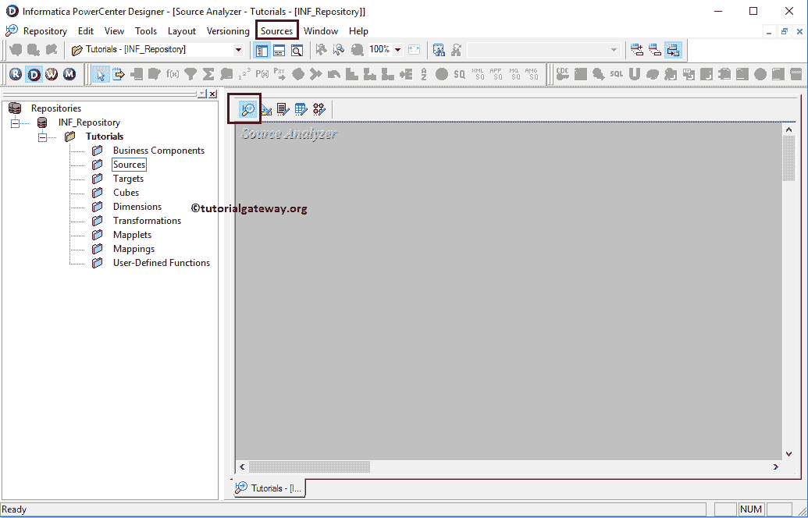
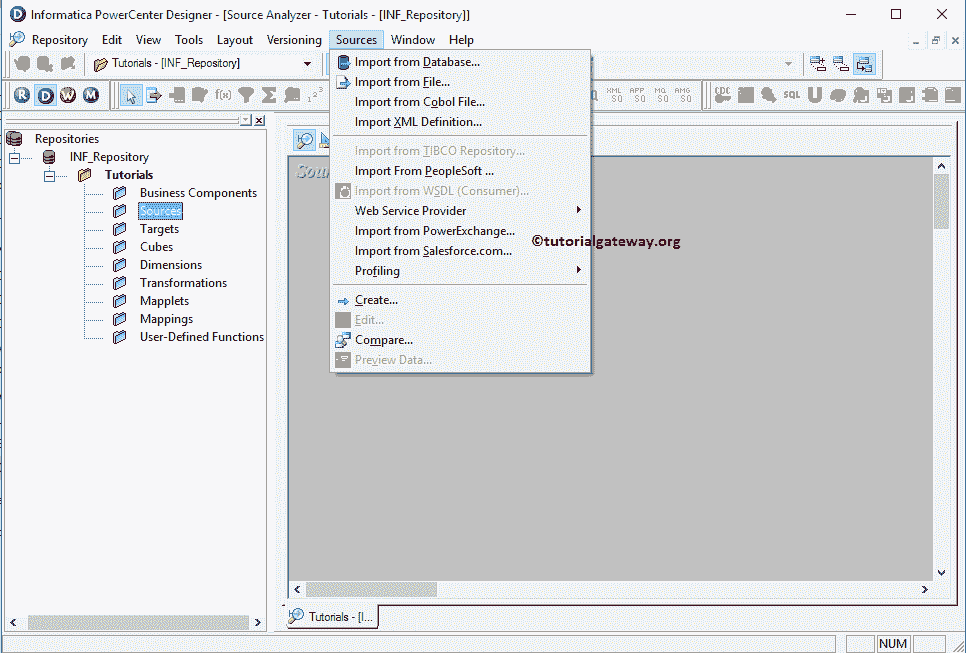

# Informatica 源分析器

> 原文：<https://www.tutorialgateway.org/informatica-source-analyzer/>

为了执行提取、转换和加载(ETL)操作，我们需要源数据、目标表和转换(如果需要的话)。Informatica 源代码分析器允许我们创建源代码定义，修改已经存在的源代码定义。

Informatica 源分析器还允许我们从各种来源导入源数据，包括平面文件、关系数据库、XML 定义、Excel 工作表等。

## Informatica 源分析仪中的可用Informatica 源

要连接[信息卡](https://www.tutorialgateway.org/informatica/)存储库服务，请提供[信息卡管理控制台](https://www.tutorialgateway.org/informatica-admin-console/)凭证。因此，请提供适当的用户名和密码，并点击连接按钮，如下所示。

连接成功后，请导航至菜单栏中的工具菜单。下面的截图将显示 Informatica PowerCenter 设计器中可用工具的列表。在本文中，我们将解释Informatica 源分析器。因此，请选择源分析器选项。

选择信息来源分析器选项后，我们将进入来源分析器屏幕。

提示:菜单栏中的源菜单只有在您位于Informatica 源分析器部分时才可用。否则，它会隐藏起来。

接下来，请导航到菜单栏中的源菜单。从下面的截图中，您可以观察到 Informatica 源分析器中的可用源列表。他们是

*   从数据库导入:该选项允许我们从关系数据库导入源数据。Informatica PowerCenter 支持微软 SQL Server、Oracle、SAP HANA、Sybase、Teradata 等各种关系数据库。
*   从文件导入:此选项允许我们从由分隔符或固定宽度分隔的平面文件导入源数据。
*   从 COBOL 文件导入:这个选项允许我们从 COBOL 文件导入源数据。
*   导入 XML 定义:这个选项允许我们导入 XML 定义
*   从仁科导入:该选项允许我们从仁科导入源数据。
*   网络服务:信息中心帮助我们从网络服务中导入数据
*   从 Salesforce.com 导入:该选项允许我们从 Salesforce.com 导入源数据
*   创建:该选项将使我们能够从头开始创建数据源。

