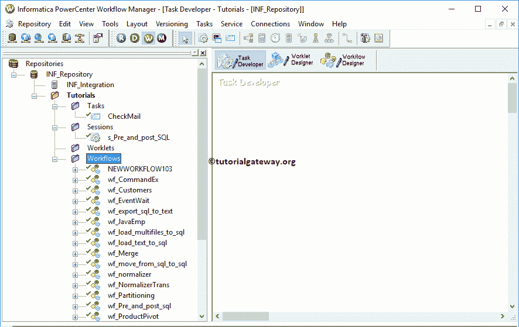

# Informatica 工作流管理器

> 原文：<https://www.tutorialgateway.org/informatica-workflow-manager/>

Informatica 工作流管理器用于创建工作流。工作流只不过是执行我们在 PowerCenter 设计器中设计的映射的一组指令。

通常，Informatica 工作流管理器工作流包含会话任务、命令任务、事件等待任务、电子邮件任务等。它还可以帮助您安排[映射](https://www.tutorialgateway.org/informatica-mapping/)。

Informatica PowerCenter 工作流管理器有一个名为 Worklet designer 的导入选项，用于将一个或多个任务组合(分组)成一个强大的任务。

## Informatica 工作流管理器

要打开 Informatica 工作流管理器，请转到开始菜单->所有程序-> Informatica -> PowerCenter 工作流管理器。单击该按钮后，将打开以下窗口。

在我们开始设计之前，我们必须连接到存储库服务。因此，请选择并右键单击存储库部分下的 PowerCenter 存储库服务(INF_Repository)，然后选择连接选项

要连接到[信息中心](https://www.tutorialgateway.org/informatica/)电力中心工作流管理器，我们必须提供[管理控制台](https://www.tutorialgateway.org/informatica-admin-console/)凭证。因此，请提供用户名和密码。

提示:在这里，您必须提供您在[安装 Informatica](https://www.tutorialgateway.org/how-to-install-informatica/) 服务器时指定的管理员用户名和密码。

连接成功后，将显示以下窗口。如果你观察下面的截图，你可以看到文件夹。要查看现有的任务、小程序和工作流或创建它们，请右键单击文件夹并从上下文菜单中选择打开。

单击打开将显示以下窗口。下面的截图将显示 Informatica 工作流管理器中可用工具的列表。

1.  导航器:这部分将允许我们连接[信息存储库](https://www.tutorialgateway.org/informatica-repository/)服务。接下来，在不同的文件夹(如任务、会话、工作流和工作流)之间导航。
2.  工作空间:使用此部分创建任务、会话和工作流。
3.  输出窗口:在此部分，您可以检查任务或工作流是否有效，查找错误。
4.  任务开发者:这允许我们创建诸如[会话任务](https://www.tutorialgateway.org/session-in-informatica/)、电子邮件任务等任务。
5.  小程序设计者:这允许我们创建小程序
6.  工作流设计器:使用此设计器，您可以通过连接任务来创建工作流。我们在上一篇文章中已经解释了[工作流](https://www.tutorialgateway.org/informatica-workflow/)。

展开工作流文件夹，查看工作流管理器

中的现有工作流

要使用任何工作流、会话、任务、小程序，右键单击并从上下文菜单中选择打开。

