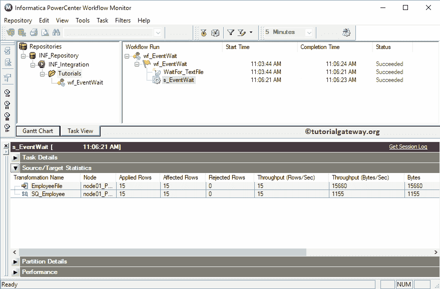

# Informatica 工作流监视器

> 原文：<https://www.tutorialgateway.org/informatica-workflow-monitor/>

Informatica 工作流监视器用于监视工作流或工作流中分配的任务的执行情况。通常，Informatica PowerCenter 可帮助您详细跟踪事件日志信息、已执行工作流列表及其执行时间。

## Informatica 工作流监视器

要打开 Informatica 工作流监视器，请转到开始菜单->所有程序-> Informatica -> PowerCenter 工作流监视器。单击该按钮后，将打开以下窗口。

从下面的截图中，您可以看到我们将 Informatica PowerCenter 工作流监视器屏幕分为四个部分来详细解释每个部分。让我们单独看一看，

1.  导航器:它允许我们连接[存储库](https://www.tutorialgateway.org/informatica-repository/)服务，并在不同的工作流之间导航。
2.  工作流运行:此部分帮助您监控工作流的执行
3.  输出窗口:在本部分，您可以看到我们在[工作流](https://www.tutorialgateway.org/informatica-workflow/)监视器中执行的步骤。
4.  属性窗口:显示当前[信息](https://www.tutorialgateway.org/informatica/)操作的信息。

在我们开始任何事情之前，我们必须连接到存储库服务。因此，请选择并右键单击存储库部分下的 PowerCenter 存储库服务(INF_Repository)，然后选择连接选项

要连接 Informatica 工作流监视器，请提供[管理控制台](https://www.tutorialgateway.org/informatica-admin-console/)凭证。因此，请提供用户名和密码。

提示:在这里，您必须提供您在[安装 Informatica](https://www.tutorialgateway.org/how-to-install-informatica/) 服务器时指定的管理员用户名和密码。

一旦连接成功，将显示以下窗口。如果您观察下面的截图，您可以看到集成服务。要查看现有工作流，请右键单击集成服务，然后从上下文菜单中选择打开。

现在，您可以在 Informatica 工作流监视器中看到文件夹。要查看现有工作流或运行它们，请右键单击文件夹，然后从菜单中选择打开。

展开各个工作流以查看以前的执行详细信息，即工作流运行开始时间、完成时间和运行状态。

Informatica 工作流监视器提供了一个甘特图来详细查看执行情况。要查看，请右键单击工作流，并从上下文菜单中选择“转到甘特图”。

现在，您可以在甘特图

中看到 Informatica 工作流运行

只需选择工作流，您就可以在属性窗口

中看到信息

让我移除“输出”窗口来浏览“属性”窗口信息。接下来，我们将运行事件等待任务工作流来显示工作流的运行。从下面的截图可以观察到，在任务详情选项卡下可以看到

任务的所有信息

在源或目标统计下，您可以看到行流。我是说，通过、失败等的行数。

在分区选项卡下，您可以看到分区信息(如果有)。并使用性能选项卡检查任何任务的性能

要查看任何任务的详细事件日志，请右键单击该任务。接下来，从上下文菜单中选择获取会话日志。

您可以看到详细的事件日志。通常，我们使用这个会话日志来检查错误位置。我的意思是，错误投在什么位置，原因是什么。

