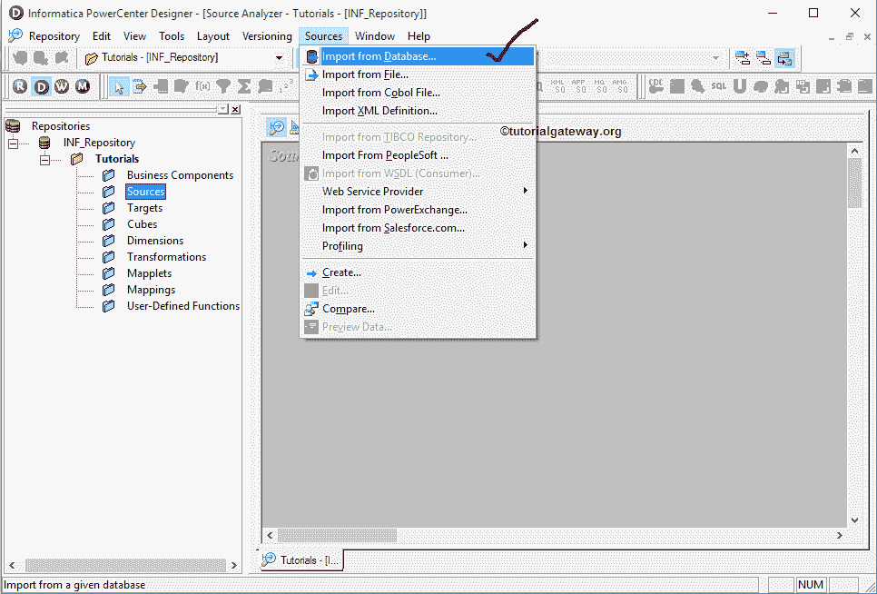
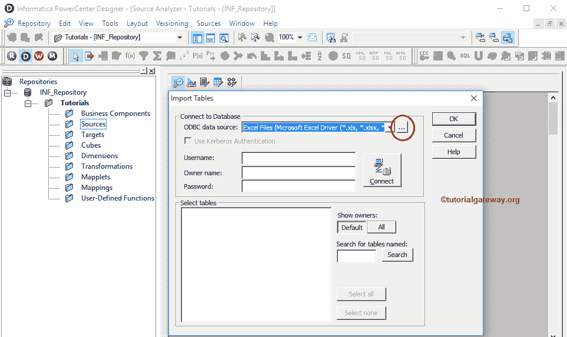
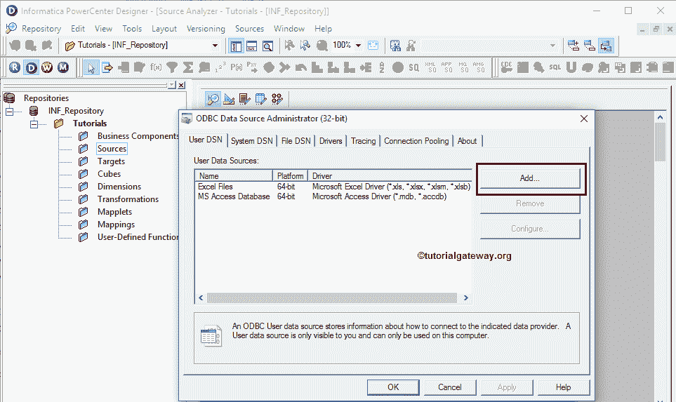
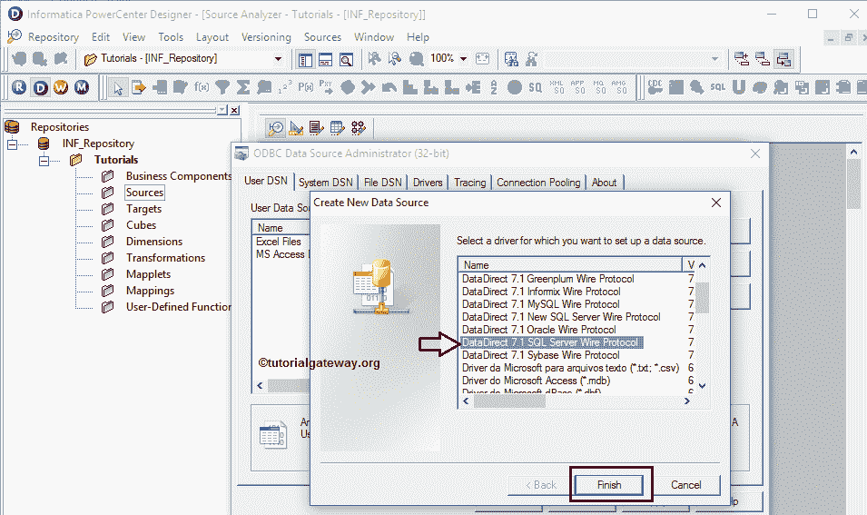
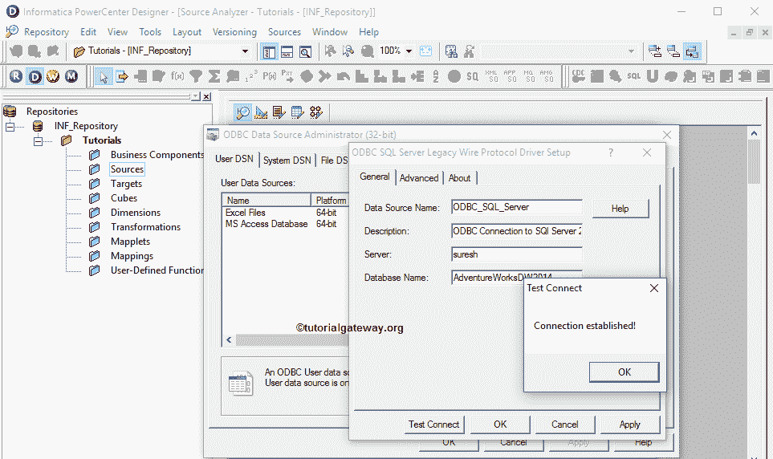
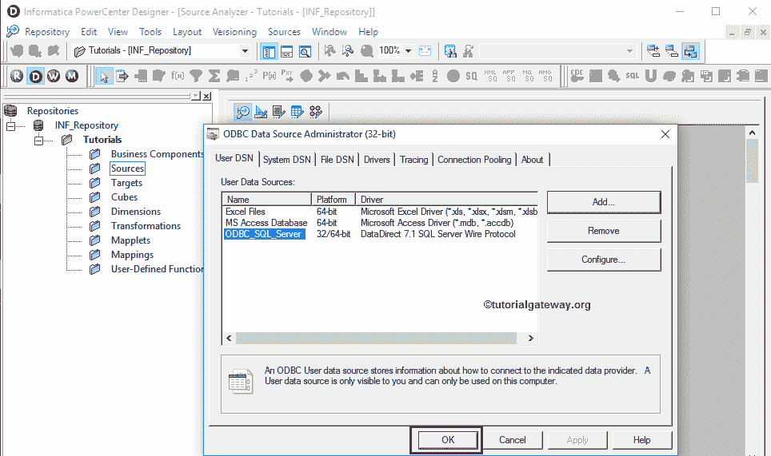

# Informatica 数据库连接

> 原文：<https://www.tutorialgateway.org/informatica-odbc-connection/>

在本文中，我们将通过一个例子向您展示如何使用 Informatica ODBC 连接来连接关系数据库。

在这个 Informatica ODBC 连接演示中，我们使用微软的 SQL Server 作为我们的关系数据库。

## Informatica ODBC 连接中涉及的步骤

从下面的截图中，你可以观察到我们在 Informatica 源分析器中。进入源分析器后，请导航到源菜单并选择从数据库导入..如下所示的选项

提示:请参考[Informatica 源分析仪](https://www.tutorialgateway.org/informatica-source-analyzer/)文章了解[Informatica 源分析仪](https://www.tutorialgateway.org/informatica/)。

选择“从数据库导入”后..选项，将打开“导入表”窗口。目前，我们在 Informatica 中没有任何 ODBC 连接可供下拉列表选择。要添加新的，请点击…按钮

单击…按钮后，将打开 ODBC 数据源管理员窗口，以添加新的 ODBC 连接。点击“添加”按钮进行添加。

单击添加按钮后，将打开创建新数据源窗口。在这里，我们可以选择从可用列表中选择所需的数据库。如前所述，我们使用的是 SQL Server，因此在本例中，我们选择了 DataDirect 7.1 SQL Server Wire 协议。

它将打开一个名为 ODBC SQL Server 传统有线协议驱动程序设置的新弹出窗口。在这里，我们必须填写与我们的数据库连接所需的详细信息。

*   数据源名称:请为此 Informatica 数据库连接指定一个唯一的名称。
*   描述:请指定我们要建立的连接的有效描述。
*   服务器:请指定 SQL Server 实例名称。
*   数据库名称:在这里，您必须写下要从中提取数据的 SQL 数据库名称。目前，我们正在选择冒险作品 DW 2014。

完成后，单击应用按钮，然后单击确定按钮关闭窗口

注:一旦您填写了所需的详细信息，最好使用测试连接按钮

来测试您的连接

从下面的截图中，你可以看到我们新创建的 Informatica ODBC 连接，所以点击 OK 按钮。如果您想选择此连接作为数据源，请参考 Informatica 文章中的[数据库源。](https://www.tutorialgateway.org/database-source-in-informatica/)

