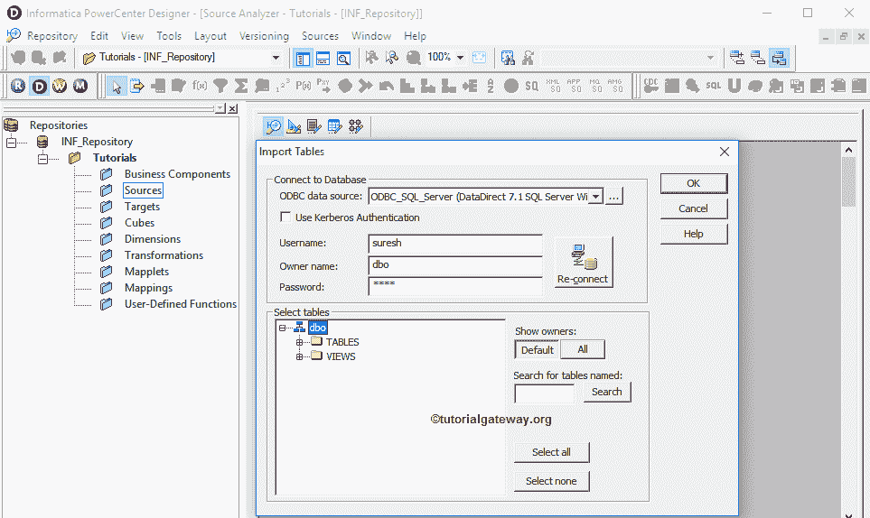

# Informatica 中的数据库源

> 原文：<https://www.tutorialgateway.org/database-source-in-informatica/>

在本文中，我们将向您展示如何从关系数据库中导入数据，如微软的 SQL Server、Oracle、Teradata 等。并将它们用作 Informatica 源分析器中的数据库源。

## Informatica 中的关系数据库源

在我们开始解释 Informatica 数据库源之前，首先使用您的管理员凭据连接到 Informatica 存储库服务，然后导航到源分析器。

请参考[Informatica 源分析仪](https://www.tutorialgateway.org/informatica-source-analyzer/)文章了解[Informatica 源分析仪](https://www.tutorialgateway.org/informatica/)。从下面的截图中，您可以观察到我们在源代码分析器中。

注意:菜单栏中的源菜单只有在您位于源分析器部分时才可用；否则，它隐藏了

进入源分析器后，请导航到源菜单并选择从数据库导入..选项如下所示

选择“从数据库导入”后..选项，将会打开一个名为“导入表”的新窗口。请从下拉列表中选择我们在上一篇文章中已经创建的 ODBC 连接。要新建一个，请参考 [Informatica ODBC 连接](https://www.tutorialgateway.org/informatica-odbc-connection/)一文。

接下来，我们必须提供连接各自数据库所需的凭据。在这里，我们提供了我们的微软 SQL Server 2014 的用户名和密码，以及作为 dbo 的所有者名称。

填写完详细信息后，请点击连接按钮。它将连接数据库并显示数据库中的表和视图。

如果您想查看所有所有者的数据，请将所有者名称从 dbo 更改为默认的全部。我们可以点击“显示所有者”部分

下方的“全部”按钮

从下面的截图中，您可以观察到我们正在从我们的 Adventure Works DW 2014 数据库中选择 DimProducts 表。在这里你也可以选择多张桌子。

提示:如果您发现很难跟踪您所需的表，那么您可以在“搜索已命名的表”下键入表名，然后单击搜索按钮

从下面的截图中，在 Source 子文件夹下，您可以在 Informatica 中看到我们新创建的数据库源，以及我们工作区中的表定义(列名和适当的数据类型)。

### 预览源数据

虽然我们从 SQL 数据库导入了我们的源，但是在我们继续之前，我们应该预览我们的数据。要预览源数据，请右键单击表定义，然后选择预览数据..选项。

选择预览数据后..选项，将打开预览数据窗口。在这里，您必须提供连接到相应数据库所需的凭据(用户名和密码)，然后单击连接按钮。成功连接到数据库后，将显示表(此处为 DimProducts)中的数据。

### 在 Informatica 中编辑现有数据库源

虽然我们选择了 DimProducts，但我们可能不需要该表中的所有列。要解决这个问题，我们可以通过右键单击表定义并选择编辑来编辑该表..选项。

选择编辑后..选项，将打开一个名为“编辑表”的新窗口。要更改现有的表，我们必须导航到列选项卡。

例如，如果您想添加新列，请选择下面显示的按钮，并添加列名、数据类型、精度(如果需要)、比例(如果需要)，如果是主键，则将键类型更改为主键，并勾选“不为空”选项(如果您的列不允许空值)

如果您想删除一些列，请选择不需要的列，然后单击剪刀按钮。这里，我们删除了几个列，用于演示目的。编辑完成后，点击【确定】关闭【编辑表】窗口

从下面的截图中，您可以看到我们成功地从源定义中删除了不想要的列。

注:我们仅从 Informatica 源分析器中删除这些列。它不会反映底层数据库数据。