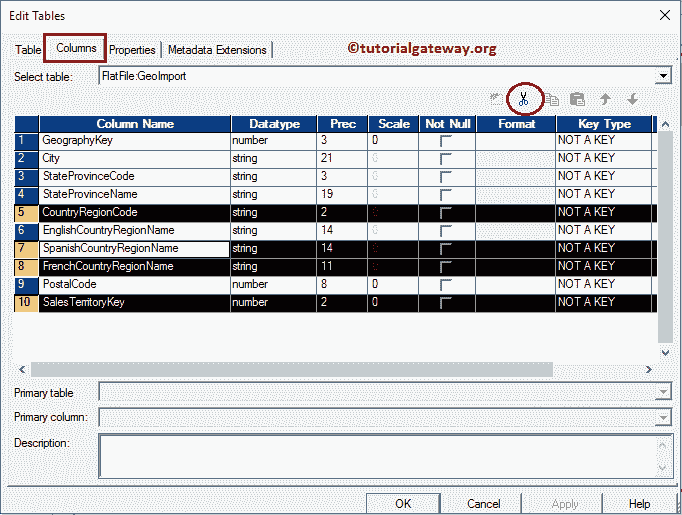
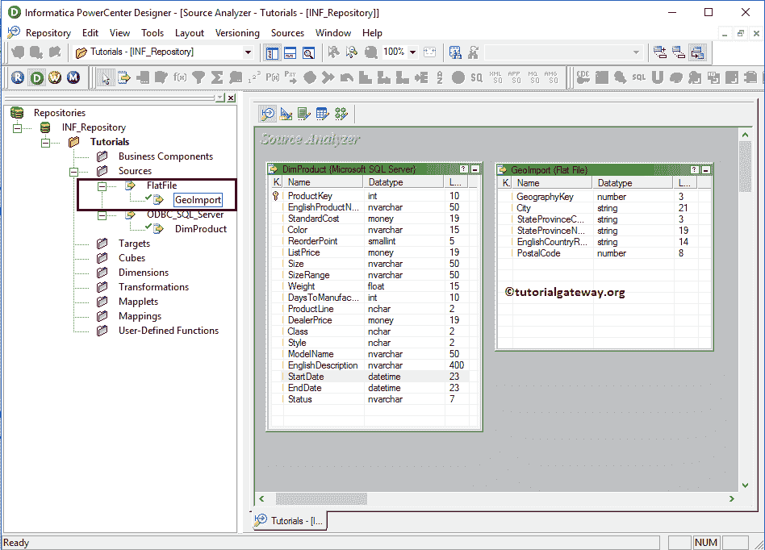

# 信息中的平面文件源

> 原文：<https://www.tutorialgateway.org/flat-file-source-in-informatica/>

在本文中，我们将向您展示如何从分隔类型和固定宽度类型的平面文件中导入数据，并在 Informatica Source Analyzer 中将它们用作平面文件源。

在我们开始将数据从平面文件导入 Informatica 之前，让我们看看平面文件源中的数据。

下面的截图将向您展示同样的内容，我们的任务是导入这个逗号分隔的文本文件作为 Informatica 中的平面文件源。

## 信息中的平面文件源

在我们开始做任何事情之前，首先使用您的管理员凭据连接到 Informatica 存储库服务，然后导航到源分析器。

注意:菜单栏中的源菜单只有在您位于源分析器部分时才可用。

进入源分析器后，请导航到源菜单并选择从文件导入..选项如下所示。请参考[信息源分析器](https://www.tutorialgateway.org/informatica-source-analyzer/)一文了解信息源分析器。

选择“从文件导入”后..选项，将会打开一个名为“打开平面文件”的新窗口。请从本地文件系统中选择所需的平面文件，然后单击“打开”按钮。对于这个 [Informatica](https://www.tutorialgateway.org/informatica/) 的例子，我们选择的是 GeoImport.txt 文件。

单击“打开”按钮后，将会打开一个名为“平面文件导入向导”的新弹出窗口。这个向导可以帮助我们轻松地指定文本格式。

首先，在“选择最能描述您的数据的文件类型”部分，我们必须选择“分隔”或“固定宽度”选项。我们的文本由逗号分隔符分隔，就像我们之前展示的那样。因此，我们选择了一个分隔选项。

如果您的平面文件像我们的示例文件一样包含列名作为第一行数据，那么您必须将“在行开始导入”的值从 1 更改为 2；否则，将其保持为 1。如果您忘记更改，那么在将这些数据导出到数据库时，将会抛出类型转换错误。

从第一行导入文件名:该选项允许我们从平面文件的第一行导入列名。如果您的平面文件像我们的示例文件一样包含列名作为第一行数据，那么通过选择此选项将导入列名，并且这将自动将“在行处开始导入”值从 1 更改为 2

第二步:

*   在“分隔符”部分下，选择此文本文件中使用的分隔符。我们的文本由逗号分隔符分隔，如前所述，所以我们选择逗号。
*   在文本限定符部分，我们选择了无引用，因为我们的平面文件没有任何引用。请根据你的要求改变。

在这里，我们可以编辑列名、数据类型、长度或精度、比例和宽度。一般来说，我们不这样做，但如果你愿意，你可以这样做。

从下图中，在 Source 子文件夹下，您可以在 Informatica 中观察到我们新创建的平面文件源，以及工作区中的表定义(列名和适当的数据类型)。

### 在 Informatica 中预览平面文件中的数据

虽然我们创建了平面文件源，但在继续之前，我们应该预览数据。要预览源数据，请右键单击表定义，然后选择预览数据..选项。

选择预览数据后..选项，将打开预览数据窗口。请从本地文件系统中选择 GeoImport.txt 文件作为平面文件名，然后单击“打开”按钮。

一旦成功选择文件，平面文件(此处为 GeoImport.txt)内的数据将显示如下

### 在 Informatica 中编辑现有平面文件源

虽然我们选择了 GeoImport.txt 文件作为源定义，但是在很多情况下，我们可能不需要该表中的所有列。或者我们可能需要添加额外的列。

要解决这些类型的情况，我们可以通过右键单击表定义并选择编辑来编辑表..选项。

选择编辑后..选项，将打开一个名为“编辑表格”的新窗口。要更改现有的表，我们必须导航到列选项卡。

例如，如果您想添加新列，请选择第一个按钮(在剪刀符号之前)并添加列名、数据类型、精度(如果需要)、比例(如果需要)，如果是主键，则将键类型更改为主键，并勾选“不为空”选项(如果您的列不允许空值)

如果要删除列，请选择不需要的列，然后单击剪刀按钮。这里，我们删除了几个列，用于演示目的。编辑完成后，点击【确定】关闭【编辑表格】窗口

从下面的截图中，您可以看到我们在 Informatica 中成功地从平面文件源定义中删除了不想要的列。

注:我们仅从信息源分析器中删除这些列。它不会反映底层平面文件。