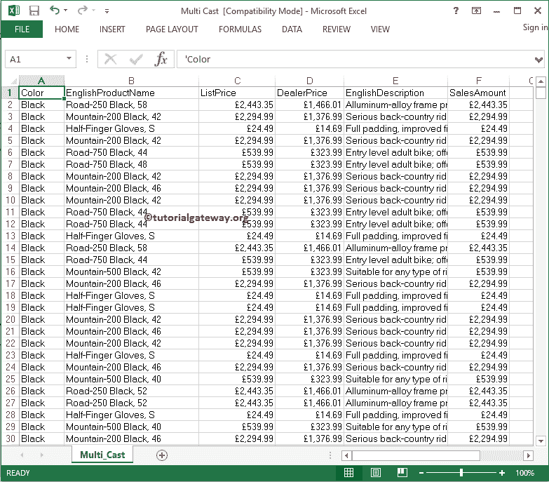
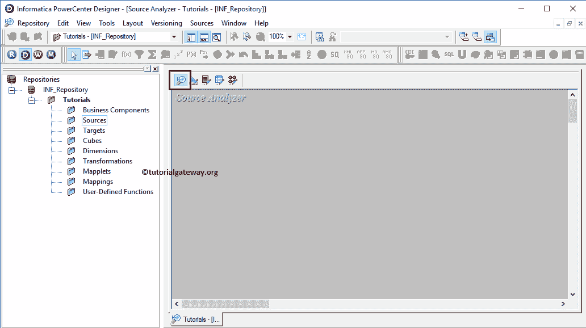
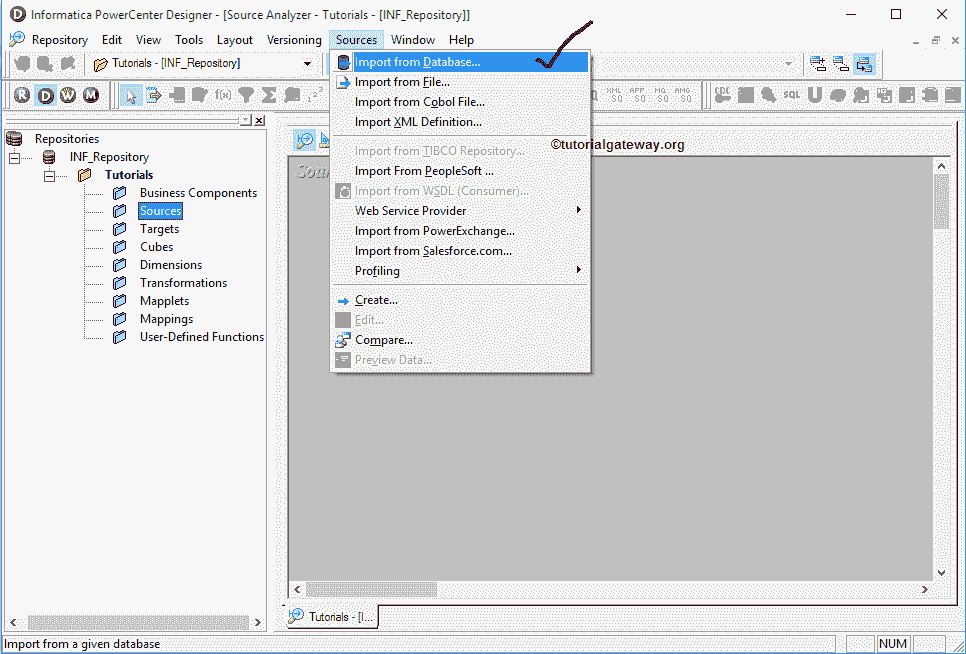

# Informatica 中的 Excel 源

> 原文：<https://www.tutorialgateway.org/excel-source-in-informatica/>

在本文中，我们将向您展示如何从 Excel 工作簿中导入数据，并在 Informatica Source Analyzer 中将它们用作 Excel 源。在我们开始从 excel 文件导入数据之前，让我们看看 excel 工作表中的数据。

下面的截图将向您展示 excel 文件中的数据。我们的任务是导入此 excel 工作簿，并将此数据用作 Informatica 中的 Excel 源。

## Informatica 中的 Excel 源

在我们开始 Excel 源代码演示之前，首先使用您的管理员凭据连接到 Informatica 存储库服务，然后导航到源代码分析器。

请参考[Informatica 源分析器](https://www.tutorialgateway.org/informatica-source-analyzer/)一文了解 Informatica 源分析器。从下面 [Informatica](https://www.tutorialgateway.org/informatica/) 截图，可以观察到我们在源码分析器。

进入源分析器后，请导航到源菜单并选择从数据库导入..选项如下所示

选择“从数据库导入”后..，将打开“导入表”窗口。目前，我们没有任何可以从下拉列表中选择的 ODBC 连接。要添加新的，请点击…按钮

单击…按钮后，将打开 ODBC 数据源管理员窗口，以添加新的 ODBC 连接。点击“添加”按钮进行添加。

单击添加按钮后，将打开创建新数据源窗口。在这里，我们可以选择从可用列表中选择所需的驱动程序。如前所述，我们需要将 excel 文件导入 Informatica。因此，本例中我们选择了微软 Excel 驱动程序。

也可以选择

的微软 Excel 驱动程序

它将打开一个名为 ODBC 微软 Excel 安装程序的新弹出窗口。在这里，我们必须填写所需的详细信息:

*   数据源名称:请在 Informatica 中为此 Excel 源指定一个唯一的名称。
*   描述:请指定我们要建立的连接的有效描述。
*   版本:请指定 Excel 文件版本。

接下来，单击选择工作簿..按钮选择所需的 excel 文件

单击“选择工作簿”后..按钮，下面的窗口打开，从我们的本地文件系统中选择必要的工作簿。选择完成后，点击确定按钮关闭

窗口

从下拉列表中，请选择我们现在创建的 ODBC 连接。

接下来，我们必须从 Excel 工作簿中选择所需的表。从下面的截图中，可以观察到 Multi_Cast 书只有一个表，我们选择的是同一个表。在这里，您还可以选择多个表。

提示:如果您发现很难跟踪您所需的表，那么您可以在“搜索已命名的表”下键入表名，然后单击搜索按钮

从下图的“源”下，可以看到我们在 Informatica 中新创建的 Excel 源，以及工作区中的表定义(列名和数据类型)。

### 预览我们的 Excel 源中的数据

虽然我们创建了 Excel 源，但在继续之前，我们应该预览数据。要预览源数据，请右键单击表定义，然后选择预览数据..选项。

选择预览数据后..选项，将打开预览数据窗口。在这里，您必须提供连接本地文件系统所需的凭据(如果有)，然后单击连接按钮。一旦连接成功，表内数据(此处为多选表)将显示

### 在 Informatica 中编辑现有的 Excel 源

虽然我们选择了 Multi_Cast.xls 文件作为源定义，但是在很多情况下，我们可能不需要该表中的所有列。或者，我们可能需要添加额外的列。要解决这些类型的情况，我们可以通过右键单击表定义并选择编辑来编辑表..选项。

选择编辑..选项打开一个名为“编辑表”的新窗口。要更改现有的表，我们必须导航到列选项卡。例如，

*   如果要添加新列，请选择第一个按钮(在剪刀符号之前)，并添加列名、数据类型、精度(如果需要)、比例(如果需要)，如果是主键，则将键类型更改为主键，并勾选“不为空”选项(如果您的列不允许空值)
*   如果要删除列，请选择不需要的列，然后单击剪刀按钮。完成编辑后，单击确定关闭编辑表窗口

