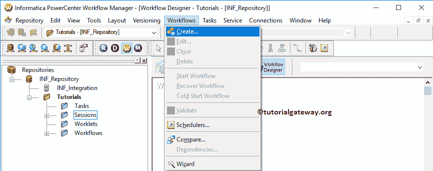

# 将数据从 SQL Server 移动到 Informatica 中的另一个服务器

> 原文：<https://www.tutorialgateway.org/move-data-from-sql-server-to-another-in-informatica/>

在本文中，我们将通过一个例子展示如何在 Informatica 中将数据从一个 SQL Server 移动到另一个。对于此 Informatica 将数据从 SQL Server 移动到另一个示例，我们将使用下面的显示数据(客户表)

目标表是重复客户。如你所见，这是一张空桌子

## 将数据从 SQL Server 移动到 Informatica 中的另一个服务器

在我们开始配置 Informatica 将数据从一个 SQL Server 数据库移动到另一个数据库之前。首先，通过提供您在[安装 Informatica](https://www.tutorialgateway.org/how-to-install-informatica/) 服务器时指定的 [Informatica 管理控制台](https://www.tutorialgateway.org/informatica-admin-console/)用户名和密码，连接到 Informatica 存储库服务。

### 步骤 1:创建信息将数据从 SQL Server 移动到另一个源定义

连接成功后，请导航至[源分析器](https://www.tutorialgateway.org/informatica-source-analyzer/)以定义您的源。如前所述，我们使用来自 [SQL Server](https://www.tutorialgateway.org/sql/) 数据库的客户表作为我们的来源 [Informatica](https://www.tutorialgateway.org/informatica/) 定义。因此，转到源菜单并选择从数据库导入..选项。

请选择将连接信息卡和 SQL 教程数据库的 ODBC 连接。要新建一个，请参考 [Informatica ODBC 连接](https://www.tutorialgateway.org/informatica-odbc-connection/)一文。

从下面的截图中，您可以看到我们正在从我们的 SQL 教程数据库中选择客户表。

它将在源分析器下的工作区内添加表定义(列名和适当的数据类型)。请参考[数据库来源](https://www.tutorialgateway.org/database-source-in-informatica/)了解来源定义

的创建

### 步骤 2:创建信息将数据从 SQL Server 移动到另一个目标定义

请导航至[目标设计器](https://www.tutorialgateway.org/target-designer-in-informatica/)定义目标。在这个例子中，我们使用现有的 SQL 表作为我们的目标定义。因此，转到目标菜单，选择从数据库导入..选项如下所示。

请选择将连接信息和数据库的 ODBC 连接。要新建一个，请参考 [Informatica ODBC 连接](https://www.tutorialgateway.org/informatica-odbc-connection/)一文。

这里，我们从我们的 SQLTest 数据库中选择 DeplicateCust 表。可以参考[使用来源定义](https://www.tutorialgateway.org/create-informatica-target-table-using-source-definition/)

创建目标表

### 步骤 3:创建映射以将数据从一个数据库移动到另一个数据库

要创建新映射，请导航到中的映射菜单，并选择创建..选项。

它将打开[映射](https://www.tutorialgateway.org/informatica-mapping/)名称窗口，为这个映射写一个唯一的名称。让我写 m_move_data_from_SQL_to_sql，然后单击“确定”按钮。

将客户的源定义从“源”文件夹拖放到映射设计器中。拖动源后，动力中心设计器会自动为您创建[源限定符转换](https://www.tutorialgateway.org/source-qualifier-transformation-in-informatica/)。

接下来，将目标定义从“目标”文件夹拖放到映射设计器中。接下来，使用自动链接将源限定符与目标定义连接起来..选项。

让我们保存并验证映射，方法是转到映射菜单并选择验证选项。

### 步骤 4:创建一个工作流，将数据从一台 SQL Server 移动到另一台

创建完映射后，我们必须为它创建工作流。电源中心工作流管理器提供了两种创建工作流的方法。

*   [手动创建工作流](https://www.tutorialgateway.org/informatica-workflow/)
*   [使用向导创建工作流](https://www.tutorialgateway.org/informatica-workflow-using-wizard/)

在本例中，我们将手动创建工作流。为此，请导航至工作流菜单并选择创建选项。

它会打开“创建工作流”窗口。请提供唯一的名称(wf_move_from_SQL_to_SQL)并保留默认设置。

它为你创建了一个工作流程

一旦我们创建了将数据从 SQL Server 移动到另一个工作流的 Informatica，我们的下一步就是为我们的映射创建一个会话任务。

#### 步骤 4(a):创建会话以将数据从一个数据库移动到另一个数据库

Informatica 中有两种类型的会话:

*   [信息中不可重用的会话](https://www.tutorialgateway.org/session-in-informatica/)
*   [Informatica中的可重用会话](https://www.tutorialgateway.org/reusable-session-in-informatica/)

对于这个从 SQL Server 移动数据到另一个例子的信息，我们创建了一个不可重用的会话。要创建不可重复使用的会话，请导航到任务菜单并选择创建选项，如下所示。

将其命名为 s_move_data_from_sql_to_SQL。

单击“创建”按钮后，将打开一个名为“映射”的新窗口。在这里，您必须选择要与此会话关联的映射(m_move_data_from_SQL_to_sql)。

请链接开始任务和会话任务。

双击会话任务将打开编辑任务窗口。在属性选项卡中，我们有两个必须为关系数据库配置的公共属性。

$Source 连接值:该属性将关系源信息存储在$Source 变量中。因此，单击我们在下面标记的箭头，并选择 SQL 教程作为源信息。

$Target 连接值:该属性将关系目标信息存储在$Target 变量中。因此，单击我们在下面标记的箭头，并选择 SQL 测试目标作为目标信息。

在映射选项卡中，我们必须配置源、目标连接和一些常见属性。首先，让我们通过单击“源”文件夹中的 SQ_Customers 源来配置源连接。

在连接中，单击关系类型旁边的箭头按钮，并使用我们在上一步中创建的连接变量，即:$Source

现在，我们必须配置目标连接。因此，让我们通过单击目标文件夹中的副本来配置目标连接。

在连接中，点击关系类型旁边的箭头按钮，使用我们之前创建的连接变量，即:$Target

我们正在将目标负载类型更改为正常。

接下来，导航到工作流菜单并选择验证选项以验证工作流。现在，让我启动工作流。为此，请导航到“工作流”菜单并选择“启动工作流”选项。

选择“启动工作流”选项后，将打开 Informatica PowerCenter 工作流监视器来监视工作流。从下面的截图，看到我们的工作流执行没有任何错误。

让我们打开 [SQL Server](https://www.tutorialgateway.org/sql/) 管理工作室，检查我们是否成功地从一个源传输了数据。

