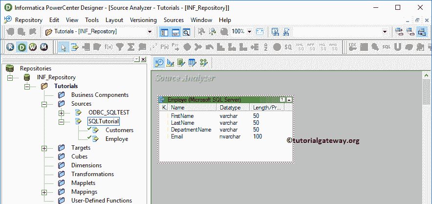

# 将数据从 SQL Server 导出到Informatica中的平面文件

> 原文：<https://www.tutorialgateway.org/export-data-from-sql-server-to-flat-file-in-informatica/>

在本文中，我们将通过一个例子向您展示如何在 Informatica 中将数据从 SQL Server 导出到平面文件。对于这个将数据从 SQL Server 导出到平面文件的信息示例，我们将使用下面的显示数据(雇员表)

## 将数据从 SQL Server 导出到Informatica中的平面文件

在我们开始配置 Informatica 将数据从 SQL Server 导出到文本文件(或平面文件)之前。首先，通过提供您在[安装 Informatica](https://www.tutorialgateway.org/how-to-install-informatica/) 服务器时指定的 [Informatica 管理控制台](https://www.tutorialgateway.org/informatica-admin-console/)用户名和密码，连接到 Informatica 存储库服务。

### 步骤 1:创建一个源定义，将数据从 SQL 导出到 Informatica 中的平面文件

请导航至[来源分析器](https://www.tutorialgateway.org/informatica-source-analyzer/)以定义您的[信息](https://www.tutorialgateway.org/informatica/)来源。如前所述，我们使用 SQL Server 数据库中的雇员表作为我们的源定义。因此，转到源菜单并选择从数据库导入..选项。

请选择将信息与 [SQL 教程](https://www.tutorialgateway.org/sql/)数据库连接的 ODBC 连接。要创建一个新的，请参考 [Informatica ODBC 连接](https://www.tutorialgateway.org/informatica-odbc-connection/)文章。

从下面的截图中，我们从我们的 SQL 教程数据库中选择了雇员表。

它将在源分析器下的工作区内添加表定义(列名和适当的数据类型)。请参考[数据库来源](https://www.tutorialgateway.org/database-source-in-informatica/)了解来源定义

的创建

### 步骤 2:创建目标定义，将数据从 SQL 移动到 Informatica 中的文本文件

请导航至[目标设计器](https://www.tutorialgateway.org/target-designer-in-informatica/)定义目标。在这个信息从 SQL Server 导出数据到平面文件的例子中，我们的任务是创建一个文本文件目标。因此，转到“目标”菜单并选择“创建”选项。

选择创建选项后，将显示一个名为创建目标表的新窗口。请为目标表提供唯一的名称，并将数据库类型选择为平面文件。

完成后，请单击“创建”按钮，在我们的 PowerCenter 目标设计器中创建新的空表。

从下面的截图中，可以看到我们在目标设计器中成功地创建了一个新的空表。

要添加新列，我们必须编辑表定义。这可以通过右键单击表格并选择编辑来完成..选项。选择编辑后..选项，将打开一个名为“编辑表格”的新窗口。

默认情况下，平面文件列由逗号分隔符分隔。但是，你可以通过点击【高级】按钮

进行控制

在这里，您可以更改列分隔符，并且可以为每个列值添加单引号或双引号。

接下来，转到“列”选项卡添加新列。请选择第一个按钮(剪刀符号之前)。它将打开空行，添加列名、数据类型、精度(如果需要)、比例(如果需要)。

如果是主键，将键类型更改为主键，并选中标记“不为空”选项(如果您的列不允许空值)

从下面的截图中，我们添加了四列。

您可以使用属性选项卡定义日期时间格式或更改默认格式。添加所需列后，点击【确定】关闭【编辑表格】窗口

现在，您可以看到目标表具有所需的列名。

### 步骤 3:创建映射，将数据从 SQL 导出到 Informatica 中的平面文件

要创建新映射，请导航到菜单栏中的映射菜单，并选择创建..选项。

它打开[映射](https://www.tutorialgateway.org/informatica-mapping/)名称窗口，为这个映射写一个唯一的名称。让我编写 m_export_SQL_to_text，然后单击“确定”按钮。

将“使用源定义”从“源”文件夹拖放到映射设计器中。拖动源后，动力中心设计器会自动为您创建[源限定符转换](https://www.tutorialgateway.org/source-qualifier-transformation-in-informatica/)。

接下来，将目标定义从目标文件夹拖放到映射设计器中。接下来，使用自动链接将 SQL Server 中的信息导出数据连接到具有目标定义的平面文件源限定符..选项。

让我们通过转到映射并选择验证选项来保存和验证映射。

### 步骤 4:创建一个工作流，将数据从 SQL Server 移动到 Informatica 中的文本文件

在我们完成从 SQL Server 到平面文件映射的信息导出数据的创建之后，我们必须为它创建工作流。电源中心工作流管理器提供了两种创建工作流的方法。

*   [手动创建工作流](https://www.tutorialgateway.org/informatica-workflow/)
*   [使用向导创建工作流](https://www.tutorialgateway.org/informatica-workflow-using-wizard/)

在此信息从 SQL Server 导出数据到平面文件示例中，我们将手动创建工作流。为此，请导航至工作流菜单并选择创建选项。

它会打开“创建工作流”窗口。请提供唯一的名称(wf_export_SQL_to_text)并保留默认设置。

一旦我们创建了工作流，下一步就是为我们的映射创建一个会话任务。

#### 步骤 4(a):创建会话，将数据从 SQL 移动到文本文件

Informatica 中有两种类型的会话:

*   [信息中不可重用的会话](https://www.tutorialgateway.org/session-in-informatica/)
*   [Informatica中的可重用会话](https://www.tutorialgateway.org/reusable-session-in-informatica/)

对于这个从 SQL Server 将数据导出到平面文件的信息示例，我们创建了一个不可重用的会话。要创建不可重复使用的会话，请导航到任务菜单并选择创建选项。

请为此会话提供唯一的名称。在这里，我们将其命名为

单击“创建”按钮后，将打开一个名为“映射”的新窗口。在这里，您必须选择要与此会话关联的映射，即 m_export_sql_to_text。

请链接开始任务和会话任务。

双击会话任务将打开编辑任务窗口。在属性选项卡中，我们配置了$Source 连接值。此属性将关系源信息存储在$Source 变量中。

因此，单击我们在上面标记的箭头，并选择 SQL 教程作为源信息。

您可以在配置对象

中配置会话日志属性、错误属性

在映射选项卡中，我们必须设置源和目标连接。首先，让我们通过单击“源”文件夹中的 SQ _ Employe 源来配置源连接。

在连接中，点击关系类型旁边的箭头按钮，使用我们之前创建的连接变量，即:$Source

现在，我们必须配置目标连接。因此，让我们通过单击目标文件夹中的雇员表来设置目标连接。

如果您的要求是合并数据，请使用此合并类型属性。目前，我们将其留给“不合并”选项。我建议你探索剩下的选择。

*   如果存在则追加:如果文件已经存在，则追加数据。
*   直接输出文件:Informatica 将使用默认目录，但是您可以通过提供完整路径来更改目录。
*   输出文件名:请将扩展名更改为 txt

接下来，导航到工作流菜单并选择验证选项以验证工作流。现在，让我通过选择工作流菜单中的开始工作流选项来启动工作流。

选择“启动工作流”选项后，将打开工作流监视器来监视工作流。从下面的截图中，可以看到我们的信息将数据从 SQL Server 导出到平面文件工作流在没有任何错误的情况下执行。

让我们打开 Informatica 的默认目标位置，检查我们是否成功地创建了一个文本文件，以及是否从一个源传输了数据。

您可以看到雇员表文本文件中的数据。

让我将文件位置从默认信息目标更改为 D 文件夹，同时将名称更改为可雇佣。接下来，保存并启动工作流

现在你可以在 D 驱

看到 employeetable.txt