# 以信息化方式将数据从文本文件加载到 SQL Server

> 原文：<https://www.tutorialgateway.org/load-data-from-text-file-to-sql-server-in-informatica/>

在本文中，我们将通过一个例子向您展示如何在 Informatica 中将数据从文本文件加载到 SQL Server。对于这个从文本文件加载数据到 SQL Server 的信息示例，我们将使用下面的显示文本文件数据(雇员表)

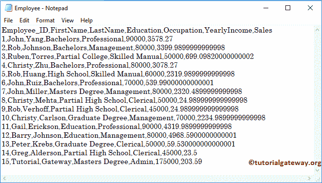

目标表是文件目标。如你所见，这是一张空桌子

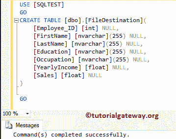

## 以信息化方式将数据从文本文件加载到 SQL Server

在我们开始配置 Informatica 将数据从文本文件(或平面文件)加载到 [SQL Server](https://www.tutorialgateway.org/sql/) 之前。首先，通过提供您在安装 Informatica 服务器时指定的 [Informatica 管理控制台](https://www.tutorialgateway.org/informatica-admin-console/)用户名和密码，连接到 [Informatica](https://www.tutorialgateway.org/informatica/) 存储库服务。

### 步骤 1:为从文本文件到 SQL Server 的信息加载数据创建源定义

请导航至[来源分析器](https://www.tutorialgateway.org/informatica-source-analyzer/)以定义您的来源。如前所述，我们使用本地文件系统中的雇员表作为源定义。因此，请导航到源菜单并选择从文件导入..

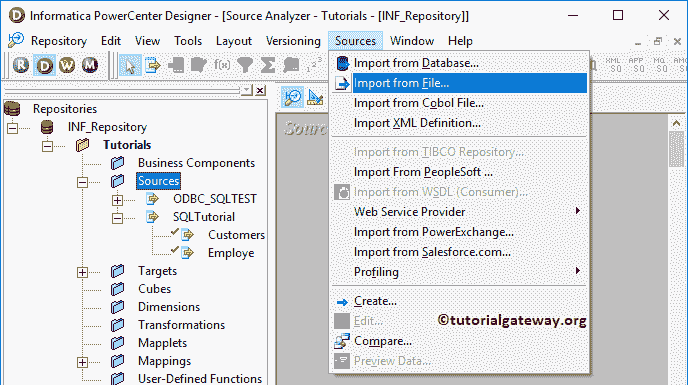

选择“从文件导入”后..选项，将会打开一个名为“打开平面文件”的新窗口。请从本地文件系统中选择雇员. txt 文件，然后单击打开按钮。我建议您在下面的步骤中参考 Informatica 文章中的[平面文件源。](https://www.tutorialgateway.org/flat-file-source-in-informatica/)

[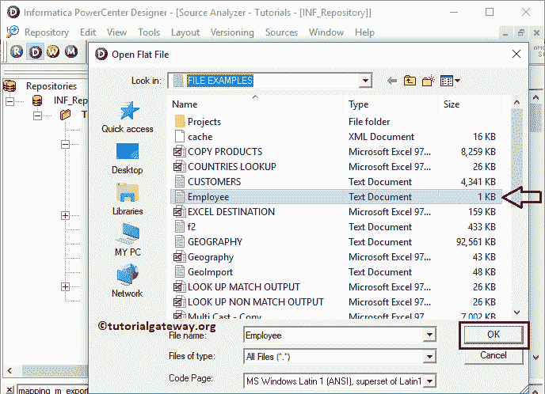](https://www.tutorialgateway.org/flat-file-source-in-informatica/)

单击“打开”按钮后，将会打开一个名为“平面文件导入向导”的新弹出窗口。

*   选择最能描述数据的文件类型:请指定列值的分隔方式(分隔或固定宽度)选项。我们的文本由逗号分隔符分隔，因此我们选择了一个分隔选项。
*   从第一行导入文件名:该选项允许我们从文本文件的第一行导入列名。如果您的文本文件包含列名作为第一行数据，就像我们的示例文件一样，那么勾选这个选项

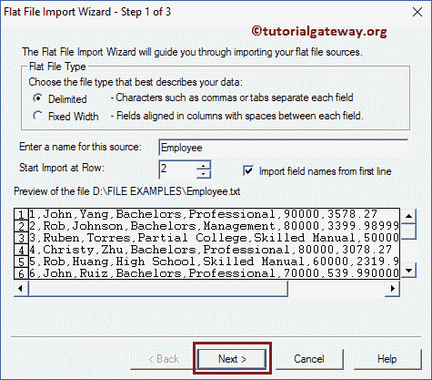

第二步:

*   在分隔符部分，请选择文本文件中使用的分隔符。我们的文本由逗号分隔符分隔，所以我们选择逗号。
*   在文本限定符部分，我们选择了无引用，因为我们的平面文件没有任何引用。请根据你的要求改变。

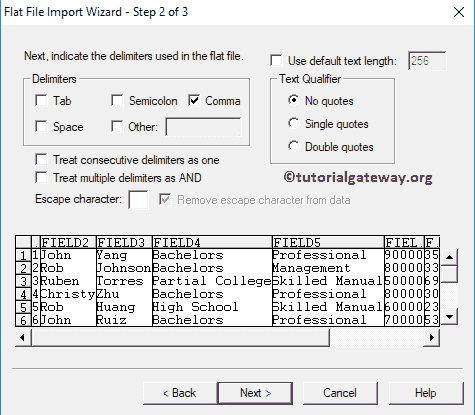

在这里，我们可以编辑列名、数据类型、长度或精度、比例和宽度。一般来说，我们不这样做，但如果你愿意，你可以这样做。

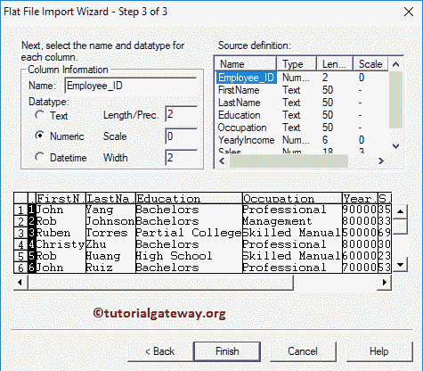

从下面的截图中，可以看到我们在 Informatica

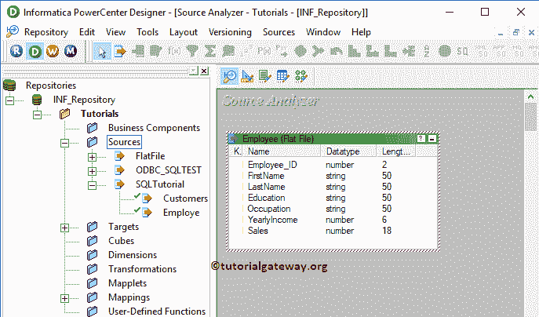

新创建的平面文件源

### 步骤 2:为从文本文件到 SQL Server 的信息加载数据创建目标定义

请导航至[目标设计器](https://www.tutorialgateway.org/target-designer-in-informatica/)定义目标。在这个例子中，我们使用现有的 SQL 表作为我们的目标定义。因此，转到目标菜单，选择从数据库导入..选项。

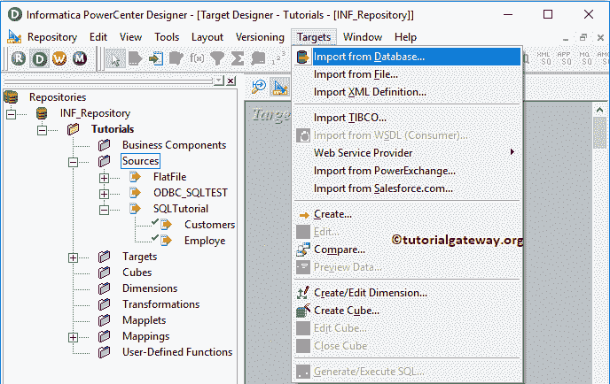

请选择将 Informatica 与 SQLTest 数据库连接的 ODBC 连接。要新建一个，请参考 [Informatica ODBC 连接](https://www.tutorialgateway.org/informatica-odbc-connection/)一文。

从下面的截图中，您可以看到我们正在从我们的 SQLTest 数据库中选择文件目标表。可以参考[使用源定义](https://www.tutorialgateway.org/create-informatica-target-table-using-source-definition/)创建目标表，了解目标定义

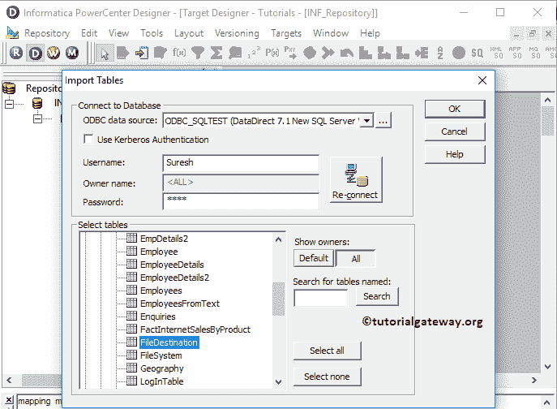

现在，您可以看到带有所需列名的目标表。

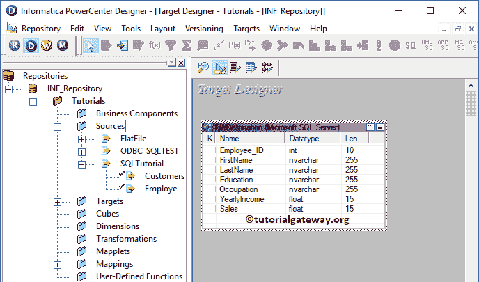

### 步骤 3:创建映射以将数据从文本文件加载到 SQL Server

要为从文本文件加载数据到 SQL Server 创建新的映射，请导航到菜单栏中的映射菜单，并选择创建..选项。

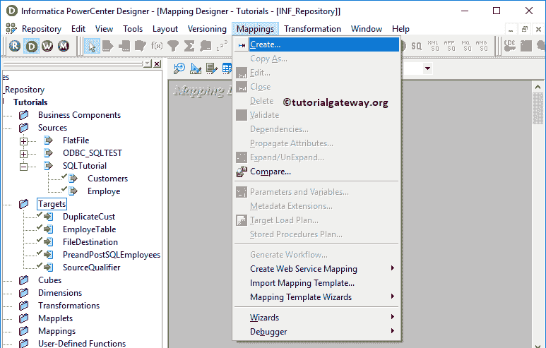

打开[映射](https://www.tutorialgateway.org/informatica-mapping/)名称窗口，为这个映射(m_load_text_to_SQL)写一个唯一的名称，点击确定按钮。

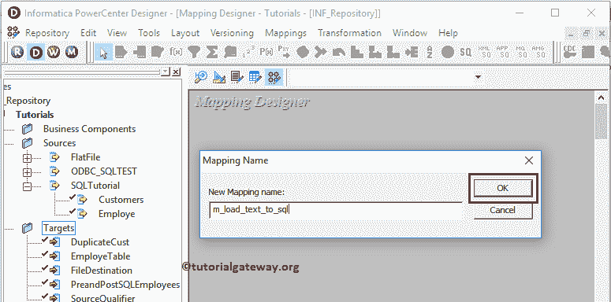

将员工源定义从平面文件源文件夹拖放到映射设计器中。拖动源代码后，PowerCenter 设计器会自动为您创建[源代码限定符转换](https://www.tutorialgateway.org/source-qualifier-transformation-in-informatica/)。

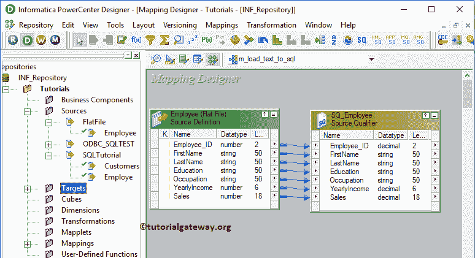

接下来，将目标定义(文件目标)从目标文件夹拖放到映射设计器中。接下来，使用自动链接将源限定符与目标定义连接起来..选项。

在我们关闭映射之前，让我们保存映射，并通过转到映射菜单栏来验证映射，然后选择验证选项。

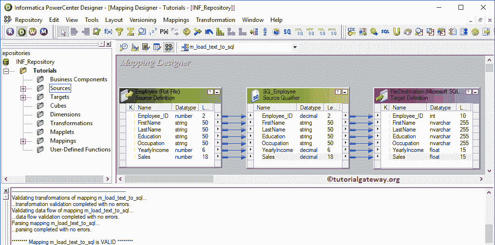

### 步骤 4:创建工作流，将数据从文本文件加载到 SQL Server

创建完映射后，我们必须为它创建工作流。电源中心工作流管理器提供了两种创建工作流的方法。

*   [手动创建工作流](https://www.tutorialgateway.org/informatica-workflow/)
*   [使用向导创建工作流](https://www.tutorialgateway.org/informatica-workflow-using-wizard/)

在本例中，我们将手动创建工作流。为此，请导航至工作流菜单并选择创建选项。

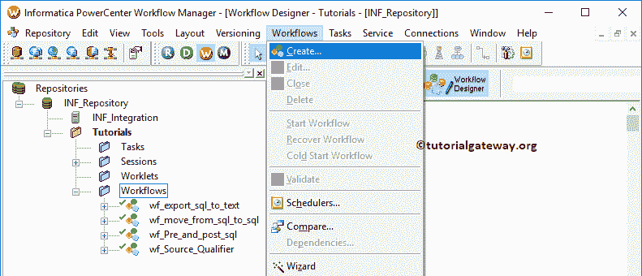

它会打开“创建工作流”窗口。请提供唯一名称(wf_load_text_to_SQL)并保留默认设置。

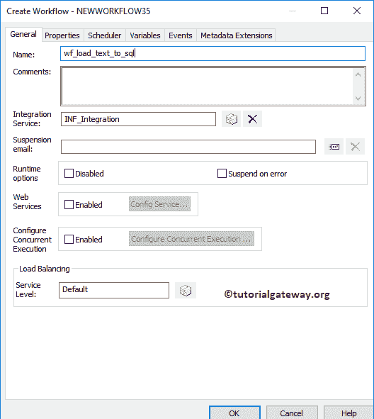

一旦我们创建了从文本文件到 SQL Server 的信息加载数据工作流，我们的下一步就是为我们的映射创建一个会话任务。

#### 步骤 4(a):创建会话，将数据从平面文件加载到信息中的 SQL Server

Informatica 中有两种类型的会话:

*   [信息中不可重用的会话](https://www.tutorialgateway.org/session-in-informatica/)
*   [信息中的可重用会话](https://www.tutorialgateway.org/reusable-session-in-informatica/)

对于这个信息从平面文件加载数据到 SQL Server 的例子，我们创建了一个不可重用的会话。要创建不可重复使用的会话，请导航到任务菜单并选择创建选项，如下所示。

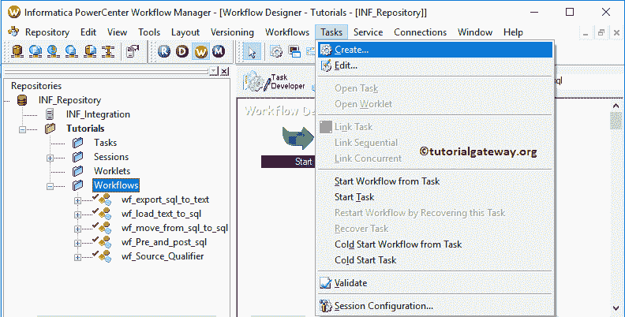

请为此会话提供一个唯一的名称(s_load_text_to_sql)

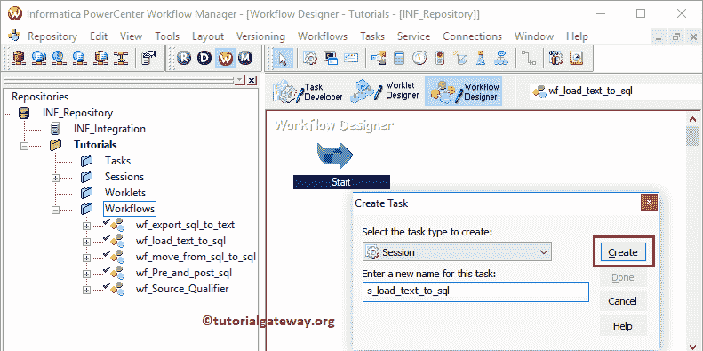

单击“创建”按钮后，将打开一个名为“映射”的新窗口。在此选择要与此会话关联的映射，即 m_load_text_to_sql。

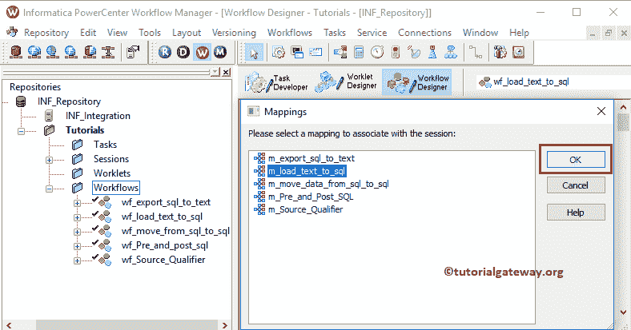

请链接开始任务和会话任务。

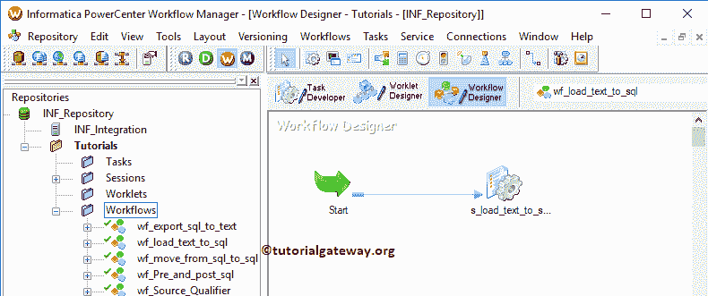

双击会话任务将打开编辑任务窗口。在属性选项卡中，我们配置了$Target 连接值。此属性将关系源信息存储在$Target 变量中。

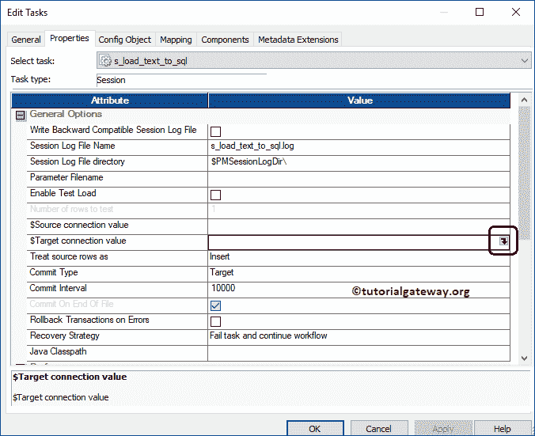

因此，单击我们在上面标记的箭头，并选择 SQL 测试作为目标信息。

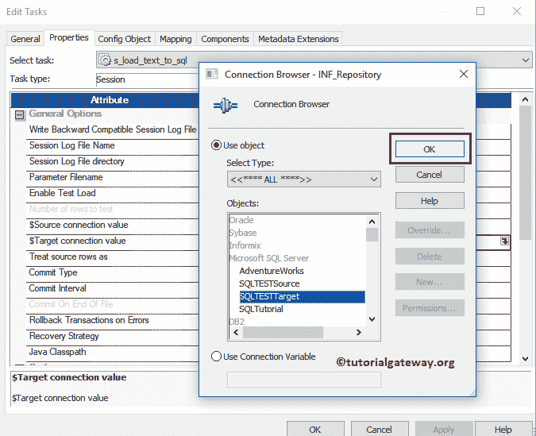

在映射选项卡中，我们必须配置源和目标连接。首先，让我们通过单击文件目标来设置目标连接。

在连接中，点击关系类型旁边的箭头按钮，使用我们之前创建的连接变量，即:$Target

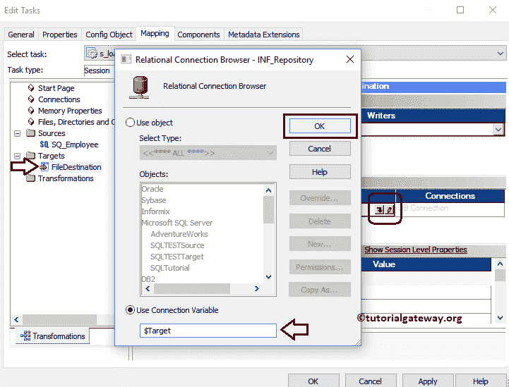

您可以根据需要将目标装载类型从批量更改为普通。

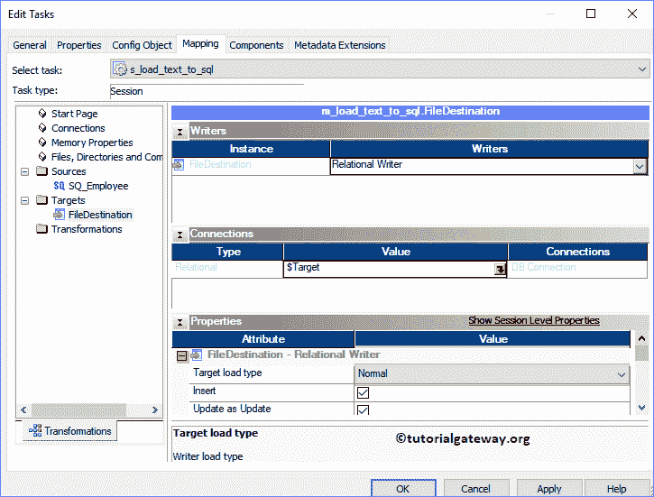

现在，我们必须配置源连接。请单击“来源”文件夹中的 SQ_Employee。

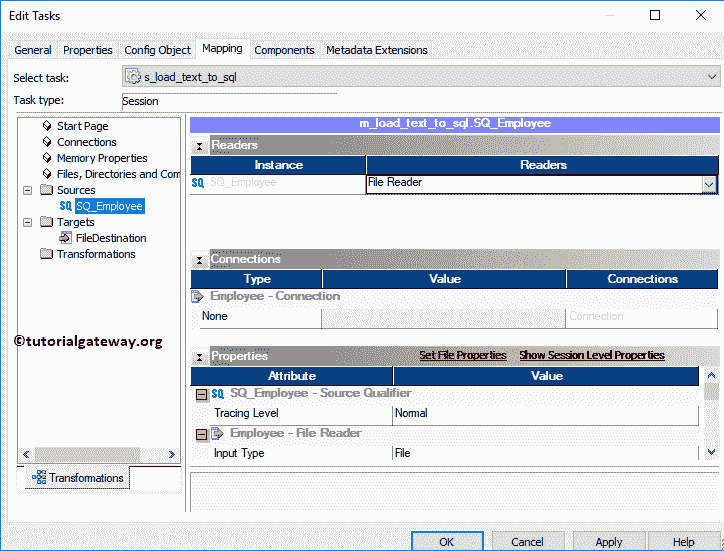

*   来源文件类型:是否使用直接来源。间接手段，来源于多个文本文件。
*   源文件目录:Informatica 将使用默认目录，但是您可以通过提供完整路径来更改目录。这里我们将文件目录更改为 D:\文件示例\
*   来源文件名:它会自动检测。如果没有，请指定文件名和扩展名

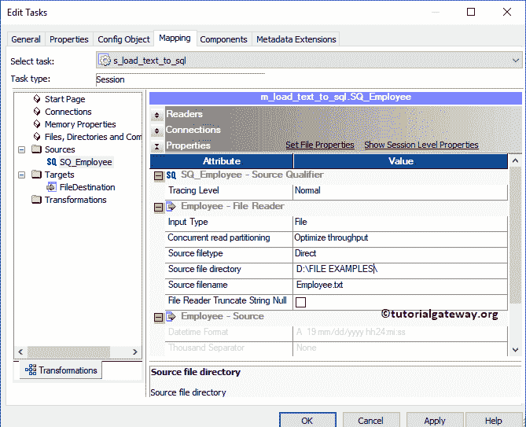

接下来，导航到工作流菜单并选择验证选项以验证工作流。现在，让我通过选择工作流菜单中的开始工作流选项来启动工作流。

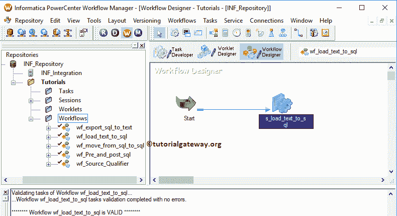

选择“启动工作流”选项后，将打开工作流监视器来监视工作流。从下面的截图，我们的信息从文本文件加载数据到 SQL Server 工作流没有任何错误地执行。

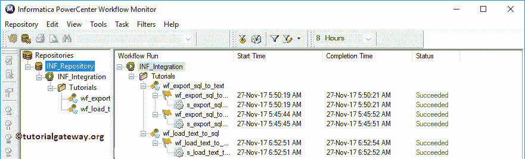

让我们打开 [SQL Server](https://www.tutorialgateway.org/sql/) 来检查我们是否成功地从一个源传输了数据。

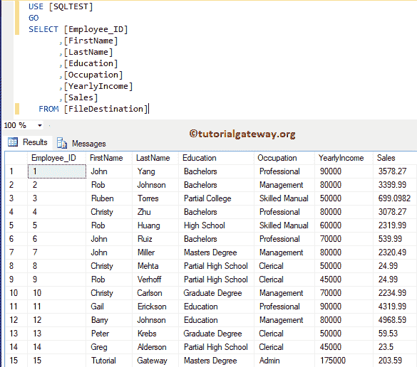