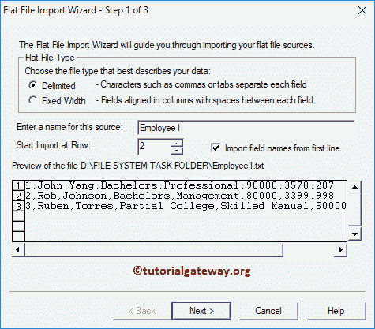
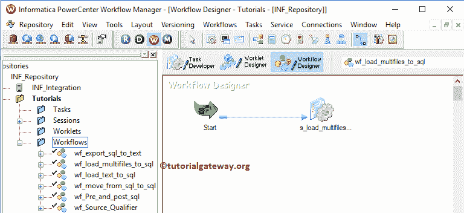

# 在 Informatica 中将多个文本文件加载到 SQL Server 中

> 原文：<https://www.tutorialgateway.org/load-multiple-text-files-into-sql-server-in-informatica/>

在本文中，我们将通过示例向您展示如何在 Informatica 中将多个文本文件加载到 SQL Server 中。在这个将多个文本文件加载到 SQL Server 的信息示例中，我们将使用本地文件系统中的四个文本文件，即 D:\ FILE SYSTEM TASK FOLDER \

数据出现在 Employee1.txt 文件

数据出现在 Employee2.txt 文件

下面截图会给大家展示 Employee3.txt 文件

中的数据

数据出现在 Employee4.txt 文件

员工档案

中的数据

目标表是多文件目标。如你所见，这是一张空桌子

## 在 Informatica 中将多个文本文件中的数据加载到 SQL Server

在我们开始配置 Informatica 将数据从多个文本文件(或平面文件)加载到 [SQL Server](https://www.tutorialgateway.org/sql/) 之前。首先，通过提供您在安装 Informatica 服务器时指定的 [Informatica 管理控制台](https://www.tutorialgateway.org/informatica-admin-console/)用户名和密码，连接到 [Informatica](https://www.tutorialgateway.org/informatica/) 存储库服务。

### 步骤 1:创建一个 Informatica 源定义，将多个文本文件加载到 SQL Server 中

连接成功后，请导航至[源分析器](https://www.tutorialgateway.org/informatica-source-analyzer/)以定义您的源。要从多个文件加载数据，我们必须提供所有文本文件通用的源定义。为此，我们使用了 Employee1，但是您可以尝试任何一个(Employee2、3 或 4)。

要加载本地文件系统中的数据，请导航到“源”菜单并选择“从文件导入”..选项

选择“从文件导入”后..选项，将打开一个名为“打开平面文件”的新窗口。请从本地文件系统中选择 Employee1.txt 文件。我建议您参考 Informatica 文章中的[平面文件源，了解以下步骤。](https://www.tutorialgateway.org/flat-file-source-in-informatica/)

单击“确定”按钮后，将会打开一个名为“平面文件导入向导”的新弹出窗口。这里，我们的文本由逗号分隔符分隔，因此我们选择了分隔选项。接下来，我们检查从第一行选项中标记的导入文件名。因为我们的文本文件包含列名作为第一行

在分隔符部分，我们选择逗号。在文本限定符部分，我们选择了无引号，因为我们的平面文件没有任何引号。

在这里，我们可以编辑列名、数据类型、长度或精度、比例和宽度。请根据您的要求改变长度、宽度或比例。

从下面的截图中，可以看到我们在 Informatica

新创建的平面文件源

### 步骤 2:创建一个信息目标定义，将多个文本文件加载到 SQL Server 中

请导航至[目标设计器](https://www.tutorialgateway.org/target-designer-in-informatica/)定义目标。在这个例子中，我们使用现有的 SQL 表作为我们的目标定义。因此，转到目标菜单，选择从数据库导入..选项。

请选择将连接信息卡和 SQL 测试数据库的 ODBC 连接。要新建一个，请参考 [Informatica ODBC 连接](https://www.tutorialgateway.org/informatica-odbc-connection/)一文。

从下面的截图中，我们从我们的 SQL 测试数据库中选择了多文件目标表。可以参考[使用源定义](https://www.tutorialgateway.org/create-informatica-target-table-using-source-definition/)创建目标表。

现在，您可以看到带有所需列名的目标表。

### 步骤 3:创建映射以将数据从多个文本文件加载到 SQL Server

要创建新映射，请导航到菜单栏中的映射菜单，并选择创建..选项。

它打开映射名称窗口，为这个[映射](https://www.tutorialgateway.org/informatica-mapping/)写一个唯一的名称。让我写 m_load_multifiles_to_sql，然后单击“确定”按钮。

将“员工 1”源定义从“源”文件夹拖放到映射设计器中。拖动源后，动力中心设计器会自动为您创建[源限定符转换](https://www.tutorialgateway.org/source-qualifier-transformation-in-informatica/)。

接下来，将目标定义(多文件目标)从“目标”文件夹拖放到映射设计器中。接下来，使用自动链接将源限定符与目标定义连接起来..选项。

在我们关闭映射之前，让我们保存映射，并通过转到映射菜单栏来验证映射，然后选择验证选项。

### 步骤 4:创建工作流，将数据从多个文本文件加载到 SQL Server

在我们完成创建信息加载多个文本文件到 SQL Server 映射后，我们必须为它创建工作流。Power Center 工作流管理器提供了两种创建工作流的方法。

*   [手动创建工作流](https://www.tutorialgateway.org/informatica-workflow/)
*   [使用向导创建工作流](https://www.tutorialgateway.org/informatica-workflow-using-wizard/)

在本例中，我们将手动创建工作流。为此，请导航至工作流菜单并选择创建选项。

它会打开“创建工作流”窗口。请提供唯一的名称(wf_load_multifiles_to_SQL)并保留默认设置。

一旦我们创建了工作流，下一步就是为我们的映射创建一个会话任务。

#### 步骤 4(a):创建会话将数据从多个文本文件加载到 SQL Server

informatica 中有两种类型的会话:

*   [信息中不可重用的会话](https://www.tutorialgateway.org/session-in-informatica/)
*   [Informatica 中的可重用会话](https://www.tutorialgateway.org/reusable-session-in-informatica/)

对于这个将多个文本文件加载到 SQL Server 中的信息示例，我们正在创建一个不可重用的会话。要创建不可重复使用的会话，请导航至任务菜单并选择创建选项

请为此会话提供一个唯一的名称(s_load_multifiles_to_sql)。

单击“创建”按钮后，将打开一个名为“映射”的新窗口。在这里，您必须选择要与此会话关联的映射(即 m_load_multifiles_to_sql)。

请链接开始任务和会话任务。

双击会话任务将打开编辑任务窗口。在属性选项卡中，我们配置了$Target 连接值。此属性将关系源信息存储在$Target 变量中。

因此，单击我们在上面标记的箭头，并选择 SQL 测试作为目标信息。

在映射选项卡中，我们必须配置源和目标连接。首先，让我们通过单击文件目标来设置目标连接。

在连接中，单击关系类型旁边的箭头按钮，并使用我们在上一步中创建的连接变量，即:$Target

您可以根据需要将目标装载类型从批量更改为普通。

现在，我们必须配置源连接。请单击来源文件夹中的 SQ_Employee1。请将源文件类型选项从直接更改为间接。

*   源文件目录:Informatica 将使用默认目录，但是您可以通过提供完整路径来更改目录。这里我们将文件目录更改为 D:\文件系统任务文件夹\
*   源文件名:请指定您放置文件名的文件名以及扩展名。

接下来，导航到工作流菜单并选择验证选项以验证工作流。现在，让我通过选择工作流菜单中的开始工作流选项来启动工作流。

让我们打开 [SQL Server](https://www.tutorialgateway.org/sql/) 管理工作室，检查是否成功传输了多个文本文件的数据。

让我修改员工文本文件。意思是，Informatica 要从 Employee1.txt 文件加载数据，Employee4.txt 文件

请勾选截断目标表选项，从目标表中删除现有记录，即多文件目标。建议大家参考 [SQL Truncate](https://www.tutorialgateway.org/sql-truncate-table/) 来理解概念。

让我们打开 [SQL Server](https://www.tutorialgateway.org/sql/) 管理工作室。从下面的截图中可以看到，Informatica 加载了员工 1 和员工 4 文本文件中的数据。

