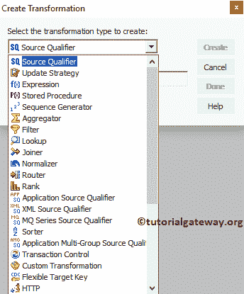
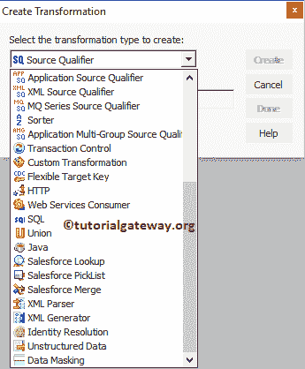
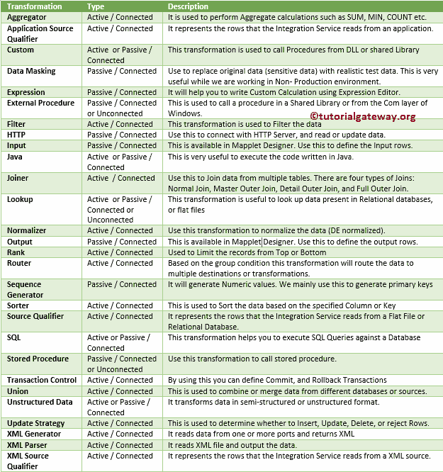

# Informatica 转换

> 原文：<https://www.tutorialgateway.org/informatica-transformations/>

Informatica 转换是存储库对象，用于执行聚合、排序、合并、修改、分发等。，同时通过它们传递数据。

电力中心设计器在 Informatica 中提供了一组执行特定功能的转换。例如，排序器转换将根据指定的字段对输入字段进行排序。

## Informatica 中的转换类型

转换是 Informatica 映射的一部分，它根据选定的转换来转换或修改数据。本节包含了可用转换的列表和实际示例。

Informatica 转换可以分为两种类型:主动转换和被动转换。我们可以根据映射中的连通性进一步划分它们:连通和不连通转换。

### Informatica 中的主动转换

Informatica 中的活动转换类型可以更改通过转换的行数。例如，如果输入行不符合指定的表达式，则这些行不会移动到目标。

### Informatica 中的被动转换

如果一个转换不改变通过它的行数，那么它被称为 Informatica 被动转换。

### Informatica 中的连通转换

在映射中，如果一个转换连接到其他转换，或者如果它直接连接到目标表，那么它被称为 Informatica Connected Transformation。

在 Informatica 中，所有的主动转换和被动转换都可以称为连通转换。连接的转换可以接收和/或提供多个输入端口

### Informatica 中的不连通转换

在映射中，如果一个转换不与其他转换相连，那么我们可以称之为 Informatica 中的不相连转换。这意味着它既没有连接到源，也没有连接到目标。

[未连接查找](https://www.tutorialgateway.org/unconnected-lookup-transformation-in-informatica/)是[信息港](https://www.tutorialgateway.org/informatica/)未连接的最好例子。

## Informatica 转换列表

在我们进入 Informatica 转换及其定义的列表之前，让我打开我的[电力中心设计器](https://www.tutorialgateway.org/informatica-powercenter-designer/)来显示映射中的转换:

又多了几个

以下是可用于转换数据的 Informatica 转换列表。我建议您点击网址(红色链接)导航到所需的转换，并找到带有详细解释的示例。

| 转换 | 类型 | 描述 |
| [聚合器](https://www.tutorialgateway.org/aggregator-transformation-in-informatica/) | 活动/已连接 | 它用于执行聚合计算，如总和、最小值、计数等。 |
| 应用源限定符 | 活动/已连接 | 它表示集成服务从应用中读取的行。 |
| 习俗 | 主动或被动/已连接 | 它用于从动态链接库或共享库中调用过程 |
| 数据屏蔽 | 被动/连接 | 用真实的测试数据替换原始数据(敏感数据)。当我们在非生产环境中工作时，这非常有用。 |
| [表达式](https://www.tutorialgateway.org/expression-transformation-in-informatica/) | 被动/连接 | 帮助您使用表达式编辑器编写自定义计算。 |
| 外部程序 | 无源/连接或未连接 | 这用于在共享库中或从窗口的 Com 层调用过程。 |
| [过滤](https://www.tutorialgateway.org/filter-transformation-in-informatica/) | 活动/已连接 | 用于过滤数据 |
| 超文本传送协议 | 被动/连接 | 使用此选项连接到 HTTP 服务器并读取或更新数据。 |
| 投入 | 被动/连接 | 这在地图管道设计器中可用。使用此转换来定义输入行。 |
| [Java](https://www.tutorialgateway.org/java-transformation-in-informatica/) | 主动或被动/已连接 | 这对于执行用 [Java](https://www.tutorialgateway.org/java-tutorial/) 编写的代码非常有用。 |
| [连接器](https://www.tutorialgateway.org/joiner-transformation-in-informatica/) | 活动/已连接 | 连接多个表中的数据。连接有四种类型:[普通连接](https://www.tutorialgateway.org/joiner-transformation-in-informatica/)、[主外连接](https://www.tutorialgateway.org/master-outer-join-in-informatica/)、[细节外连接](https://www.tutorialgateway.org/detail-outer-join-in-informatica/)和[全外连接](https://www.tutorialgateway.org/full-outer-join-in-informatica/)。 |
| [查找](https://www.tutorialgateway.org/lookup-transformation-in-informatica/) | 主动或被动/连接或不连接 | 这种 Informatica 转换对于查找关系数据库或平面文件中的数据非常有用 |
| [规格化器](https://www.tutorialgateway.org/normalizer-transformation-in-informatica/) | 活动/已连接 | 用它来标准化数据。 |
| 输出 | 被动/连接 | 这在地图管道设计器中可用。使用它来定义输出行。 |
| [排名](https://www.tutorialgateway.org/rank-transformation-in-informatica/) | 活动/已连接 | 用于从顶部或底部限制记录 |
| [路由](https://www.tutorialgateway.org/router-transformation-in-informatica/) | 活动/已连接 | 根据组条件，它将数据路由到多个目的地或转换。 |
| [序列生成器](https://www.tutorialgateway.org/sequence-generator-transformation-in-informatica/) | 被动/连接 | 该 Informatica 转换将生成数值。我们主要使用它来生成主键 |
| [分拣机](https://www.tutorialgateway.org/sorter-transformation-in-informatica/) | 活动/已连接 | 这用于根据指定的列或键对数据进行排序 |
| [源限定符](https://www.tutorialgateway.org/source-qualifier-transformation-in-informatica/) | 活动/已连接 | 它表示服务从平面文件或关系数据库中读取的行。 |
| SQL | 主动或被动/已连接 | 这个 Informatica 转换帮助您对数据库执行 [SQL](https://www.tutorialgateway.org/sql/) 查询 |
| [存储过程](https://www.tutorialgateway.org/stored-procedure-transformation-in-informatica/) | 无源/连接或未连接 | 用它来调用一个[存储过程](https://www.tutorialgateway.org/stored-procedures-in-sql/)。 |
| [交易控制](https://www.tutorialgateway.org/transaction-control-transformation-in-informatica/) | 活动/已连接 | 通过使用它，您可以定义提交和回滚事务 |
| [工会](https://www.tutorialgateway.org/union-transformation-in-informatica/) | 活动/已连接 | 这用于组合或合并来自不同数据库或来源的数据。 |
| 非结构化数据 | 主动或被动/已连接 | 它以半结构化或非结构化格式转换数据。 |
| [更新策略](https://www.tutorialgateway.org/update-strategy-transformation-in-informatica/) | 活动/已连接 | 用于确定是插入、更新、删除还是拒绝行。 |
| [XML 生成器](https://www.tutorialgateway.org/xml-generator-transformation-in-informatica/) | 活动/已连接 | 它从一个或多个端口读取数据并返回 XML |
| [XML 解析器](https://www.tutorialgateway.org/xml-parser-transformation-in-informatica/) | 活动/已连接 | 读取 XML 文件并输出数据。 |
| [XML 源限定符](https://www.tutorialgateway.org/xml-source-qualifier-informatica/) | 活动/已连接 | 它表示集成服务从 XML 源读取的记录。 |

如果您想在手机中保存上述指定的 Informatica 转换列表，请使用下图

