# Informatica 中的聚合器转换

> 原文：<https://www.tutorialgateway.org/aggregator-transformation-in-informatica/>

Informatica 中的聚合器转换是实时中最常用的转换之一。此转换执行类似于 SQL Server 聚合函数的功能。

Informatica 聚合器转换操作包括以下内容:

*   计数:它将计算此列中的值的数量。如果选择(*)作为输入列，则计数中将包含空值。否则，忽略空值。
*   总和:计算列值的总和。
*   AVG:计算列值的平均值。
*   最小值:查找最小列值。
*   最大值:查找最大列值。
*   中位数:计算列值的中位数。
*   Stddev:计算列值的标准偏差。
*   差异:计算列值的差异。

在本文中，我们解释了在 Informatica 中配置聚合器转换以执行一些操作所涉及的步骤，如上所述。

## 在 Informatica 中配置聚合器转换

在我们开始在 Informatica 中配置聚合器转换之前，首先连接到 Informatica 存储库服务。

要连接 [Informatica](https://www.tutorialgateway.org/informatica/) 存储库服务，我们必须提供您在[安装 Informatica](https://www.tutorialgateway.org/how-to-install-informatica/) 服务器时指定的[管理控制台](https://www.tutorialgateway.org/informatica-admin-console/)用户名和密码。

### 创建 Informatica 聚合器转换源定义

连接成功后，请导航至[源分析器](https://www.tutorialgateway.org/informatica-source-analyzer/)并定义您的源。在这个 Informatica 聚合器转换示例中，我们使用 SQL Server 数据库中的[模糊地理]和[事实经销商销售]作为我们的源定义。请访问【信息】中的[数据库源](https://www.tutorialgateway.org/database-source-in-informatica/)了解创建源定义

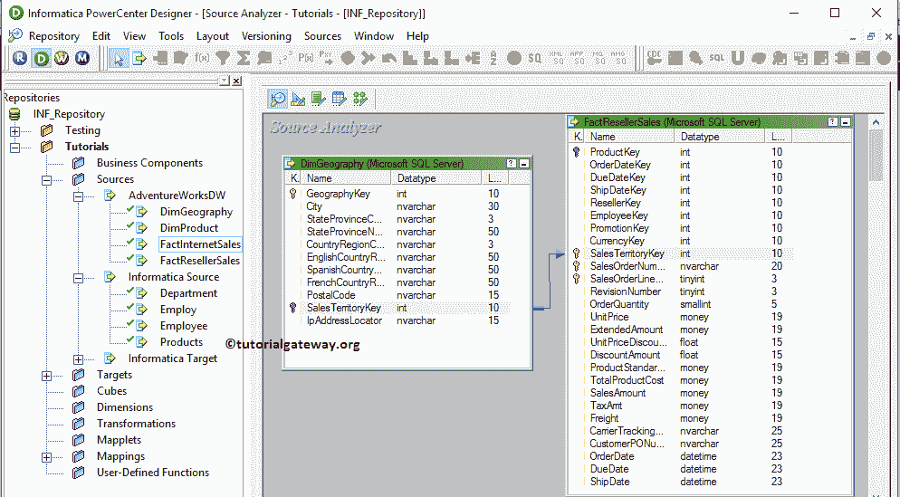

### 创建聚合器转换目标定义

请导航至[目标设计器](https://www.tutorialgateway.org/target-designer-in-informatica/)并定义 Informatica 聚合器转换目标。在这个例子中，我们使用已经创建的(聚合器转换)SQL 表作为我们的目标定义。请参考[使用源定义创建 Informatica 目标表](https://www.tutorialgateway.org/create-informatica-target-table-using-source-definition/)文章

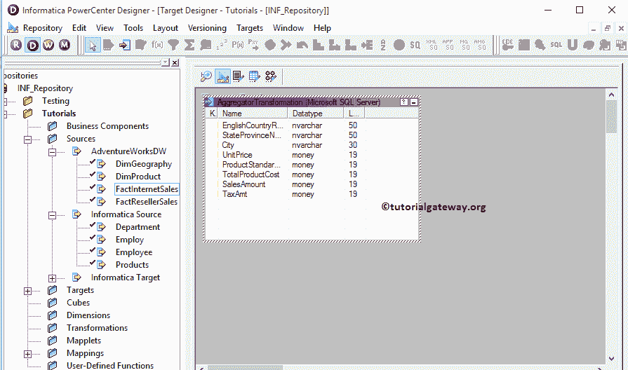

### 创建 Informatica 聚合器转换映射

要为 Informatica 聚合器转换创建新映射，请导航到映射菜单并选择创建..选项。它会打开“映射名称”窗口。

在这里，你必须为这个[映射](https://www.tutorialgateway.org/informatica-mapping/)(m _ Aggregator _ Transformation)写一个唯一的名称，然后点击确定按钮。

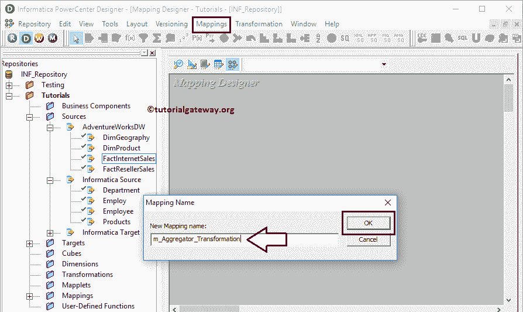

接下来，将[Dim Geography]和[事实经销商销售]来源定义从“来源”文件夹拖放到映射设计器中。拖动源后，PowerCenter 设计器会自动创建名为[源限定符](https://www.tutorialgateway.org/source-qualifier-transformation-in-informatica/)的默认转换。

众所周知，[模糊地理]和[事实经销商销售]表具有主键和外键关系。因此，我们删除了一个源限定符，并将两个表中的必需字段添加到单个源限定符中。

#### 在 Informatica 中创建聚合器转换

要在 Informatica 中创建聚合器转换，请导航到菜单栏中的转换菜单，并选择创建..选项，如下所示。

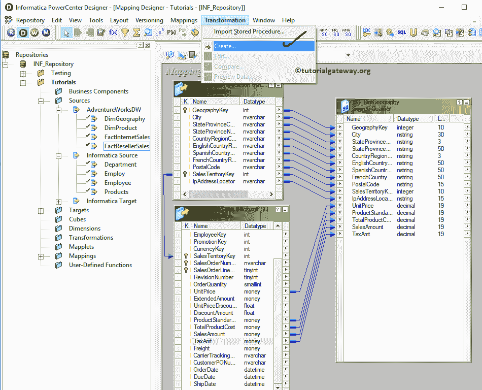

一旦你点击了创建..选项，将打开创建转换窗口，如下所示。请从下拉列表中选择 Informatica 聚合器转换，并为此转换指定唯一名称(agg_Geography_Sales)，然后单击创建按钮

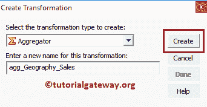

单击创建按钮后，聚合器转换将被添加到映射设计器中。请通过拖动必填字段将源定义与转换连接起来。

从下面的截图你可以看到，我们排除了不需要的列，如西班牙国家名称，密钥，IP 地址定位器等。

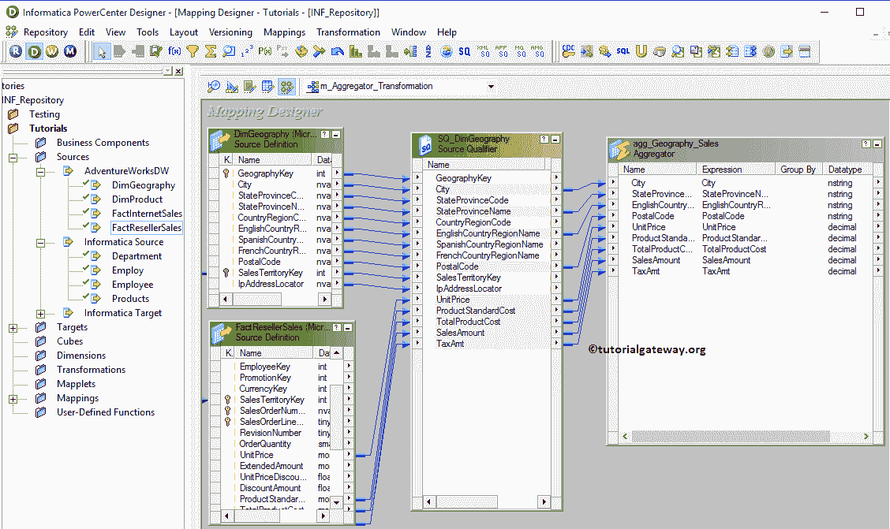

双击 Informatica 聚合器转换，对源执行聚合。从下面的截图中，您可以看到“转换”选项卡中的可用属性列表:

*   选择转换:默认情况下，它会选择一个。你点击了。
*   重命名:此按钮将帮助您将聚合器转换重命名为更有意义的名称。
*   使可重用:如果您选中了这个选项，那么它就变成了可重用的转换。
*   描述:请提供此 Informatica 聚合器转换的有效描述。

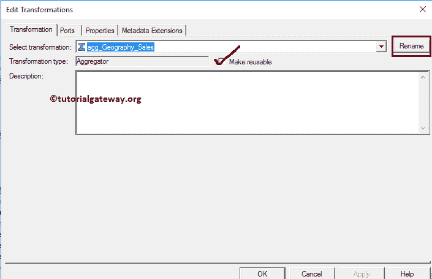

下面的截图将向您展示 Informatica 聚合器转换的端口选项卡中的可用选项列表:

*   端口名:可用列名列表。单击“新建列”按钮可以添加新列，单击“剪式”按钮可以删除不需要的列。
*   I:在这一部分下被选中的列是聚合器转换输入列。
*   o:在此部分下被选中的列是聚合器转换输出列。如果取消选中任何列，则该列将无法加载到目标表中。从下面的截图中，您可以看到我们取消了五列(单价、产品标准成本、产品总成本、销售额和税额)的端口，因为我们想要用新字段(保存聚合数据)恢复这些列
*   如果是可变的，请勾选此项
*   表达式:在这里，您可以为特定的列编写自定义表达式。
*   分组依据:请勾选您要用于分组依据的列，它就像 SQL SELECT 查询中的[分组依据子句](https://www.tutorialgateway.org/sql-group-by-clause/)一样。在本例中，我们希望按英语国家/地区名称、州/省名称和城市对数据进行分组。

我们使用“新建端口”按钮添加了 5 个新列。我们将使用这些新列来存储汇总信息，如总和、平均值、中位数、计数等..

提示:所有这些新列都只是输出端口，所以请勾选 O

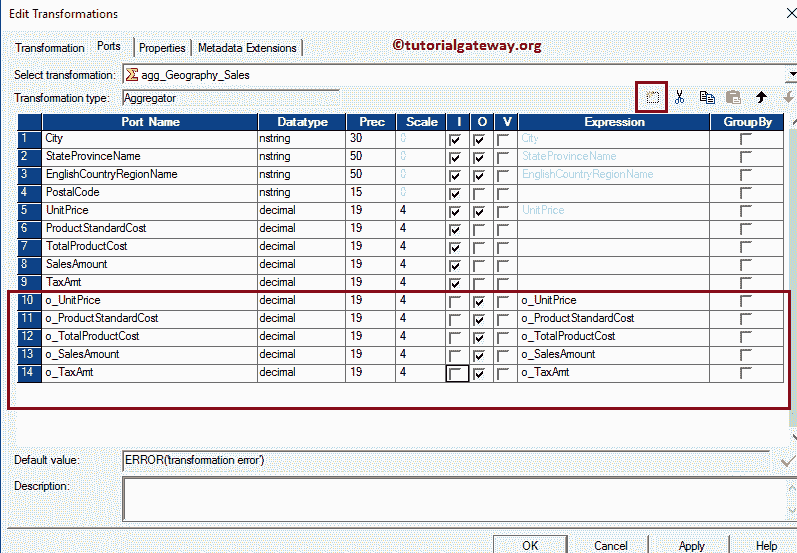

让我们编写自定义表达式来获取所需的信息。为此，请单击 o_UnitPrice 旁边的箭头按钮。这将打开表达式编辑器来编写自定义表达式。这里，我们想要找到联合价格的平均值，所以从聚合函数列表中选择 AVG()函数。

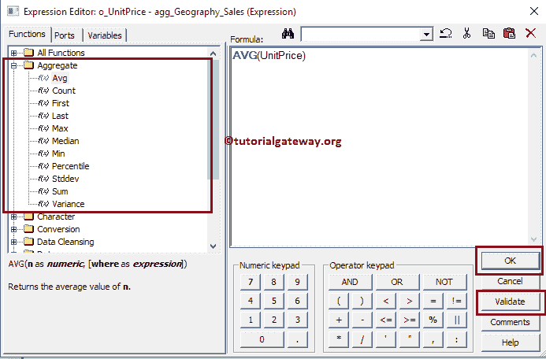

在这个 Informatica 聚合器转换示例中，我们按英语国家/地区，然后按州/省名称，然后按城市计算单价平均值、产品标准成本总和、产品总成本中位数、销售额标准偏差以及税额和组的差异。

提示:我们选择一些随机函数，我们建议您遵循您的业务逻辑来获得更有意义的结果。

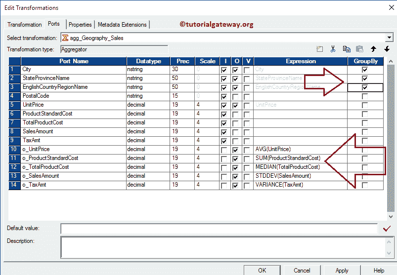

“Informatica 聚合器转换属性”选项卡中的可用选项列表。如果您的数据是预先排序的，请选择排序输入选项。

提示:选择排序输入选项将提高 Informatica 中聚合器转换的性能。

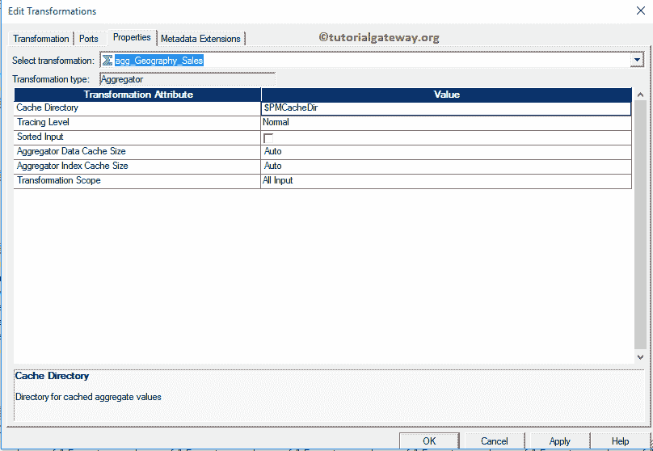

配置完聚合后，单击确定关闭窗口。接下来，将目标定义(聚合器转换)从“目标”文件夹拖放到映射设计器，并将聚合器转换与目标定义连接起来。

请使用自动链接..连接它们的选项。

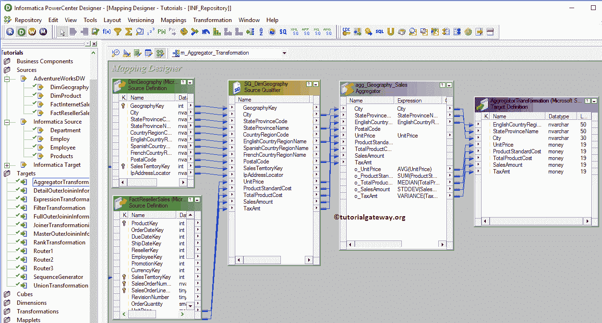

在我们关闭映射之前，让我们通过转到映射菜单栏并选择验证选项来验证 Informatica 聚合器转换映射。

### 创建 Informatica 聚合器转换的工作流

一旦我们完成创建映射，我们就必须为它创建工作流。PowerCenter 工作流管理器提供了两种创建工作流的方法。

*   [手动创建 Informatica 工作流](https://www.tutorialgateway.org/informatica-workflow/)
*   [使用向导创建 Informatica 工作流](https://www.tutorialgateway.org/informatica-workflow-using-wizard/)

在这个 Informatica 聚合器转换示例中，我们将使用我们在早期文章中创建的手动创建的工作流。一旦我们创建了工作流，下一步就是为我们的映射创建一个会话任务。

#### 在 Informatica 中为聚合器转换创建会话

Informatica 中有两种类型的会话:

*   [不可重用会话](https://www.tutorialgateway.org/session-in-informatica/)。
*   [可重用会话](https://www.tutorialgateway.org/reusable-session-in-informatica/)

对于这个 Informatica 聚合器转换示例，我们将创建不可重用的会话。请导航至任务菜单并选择创建选项以打开创建任务窗口。在这里，您必须选择会话作为任务类型(默认)，并为会话输入唯一的名称(聚合器转换)。

单击“创建”按钮后，将打开一个名为“映射”的新窗口。在这里，您必须选择要与此会话关联的映射。我们正在选择我们之前创建的映射(m_Aggregator_Transformation)(在步骤 3 中)。

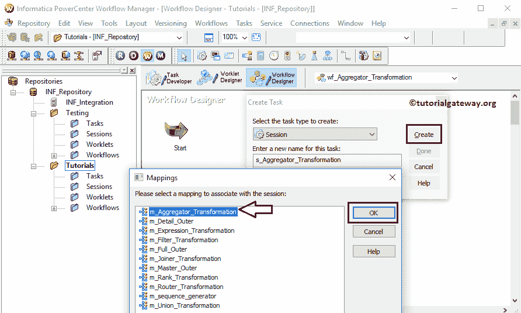

双击会话任务进行配置。虽然我们必须配置源、目标和一些常见属性，但我们已经在 Informatica 文章的[会话中对它们进行了解释。](https://www.tutorialgateway.org/session-in-informatica/)

Informatica 工作流中的聚合器转换是有效的。现在，让我们通过导航到“工作流”菜单并选择“启动工作流”选项来启动工作流。

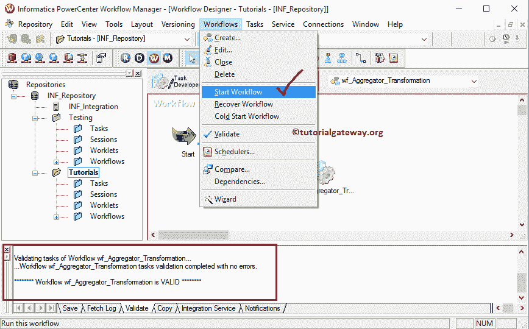

选择“启动 Informatica 聚合器转换工作流”选项后，将打开 Informatica 工作流监视器来监视工作流。从下面的截图中，您可以观察到我们的工作流没有任何错误地执行。

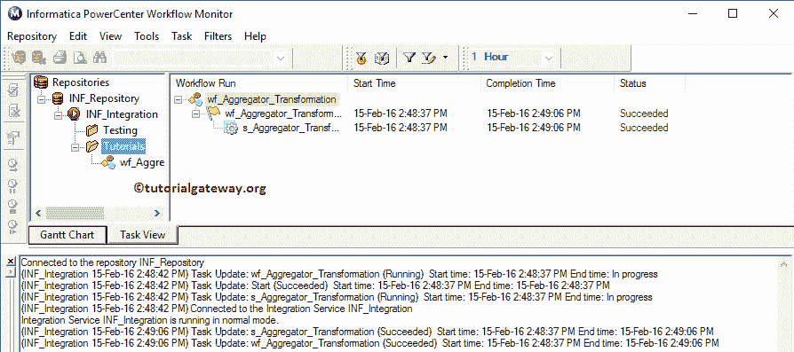

让我们打开 [SQL Server](https://www.tutorialgateway.org/sql/) 管理工作室，检查我们是否使用 Informatica 中的聚合器转换成功执行了聚合。

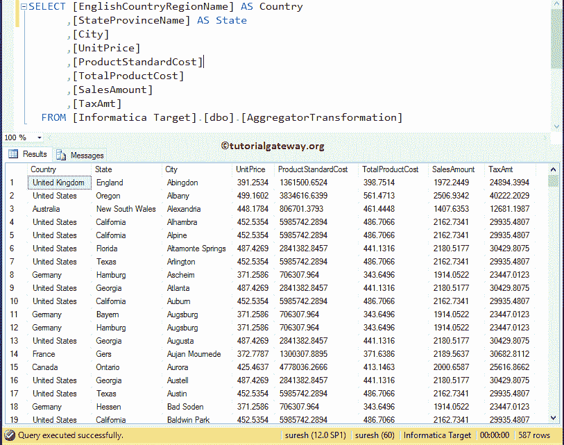