# Informatica中的表达式转换

> 原文：<https://www.tutorialgateway.org/expression-transformation-in-informatica/>

Informatica 中的表达式转换是一种被动转换，用于对源数据执行非聚合计算。这意味着您可以使用此 Informatica 表达式转换在单行上执行计算。例如，您正在修剪额外的空格、数据转换、字符串操作等。

以下是通过Informatica中的表达式转换实现的一些操作:

*   使用 Informatica 中的这个表达式转换，我们可以在使用条件语句 IIF 将数据传递到另一个转换或目标表之前测试它
*   数据操作:我们可以使用内置函数来操作数据。例如，字符串连接，使用 LTRIM 和 RTRIM 修剪额外的空格，取整值，等等。
*   数据转换:使用 TO_DATE、TO_DECIMAL 等将现有数据转换为所需的形式。
*   操作日期值:提取日期部分，计算日期差异等。
*   执行算术和逻辑运算。

此示例说明了在 Informatica 中配置表达式转换以存储审核信息的步骤。对于这个例子，我们将使用下面显示的数据

实时审核信息将非常有助于检查会话时间、映射名称、工作流名称、会话名称、集成服务名称、存储库服务名称、存储库用户名、源表名称、会话开始时间和系统日期。

## 在信息中配置表达式转换

在本例中，我们的任务是将上述来源的[名字]、[姓氏]和[年收入]与审计信息一起加载到目标表中。在我们开始在 Informatica 中配置表达式转换之前，首先连接到 Informatica 存储库服务。

要连接 [Informatica](https://www.tutorialgateway.org/informatica/) 存储库服务，我们必须提供您在[安装 Informatica](https://www.tutorialgateway.org/how-to-install-informatica/) 服务器时指定的[管理控制台](https://www.tutorialgateway.org/informatica-admin-console/)用户名和密码。接下来，单击连接按钮。

### 创建信息表达式转换源定义

连接后，请导航至[源分析器](https://www.tutorialgateway.org/informatica-source-analyzer/)并定义您的源。在这个 Informatica 表达式转换示例中，我们使用了来自 SQL Server 数据库的[Employ]表作为我们的源定义。来源定义

请参考[Informatica](https://www.tutorialgateway.org/database-source-in-informatica/)文章中的数据库来源

### 创建信息表达式转换目标定义

请导航至[目标设计器](https://www.tutorialgateway.org/target-designer-in-informatica/)并定义信息表达式转换目标。在这个例子中，我们使用已经创建的 SQL 表(表达式转换)作为我们的目标定义。请参考[使用源定义创建信息目标表](https://www.tutorialgateway.org/create-informatica-target-table-using-source-definition/)文章

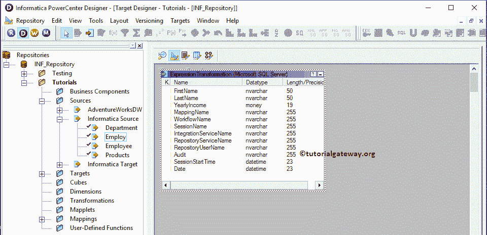

### 在信息映射中创建表达式转换

要创建新的信息表达式转换映射，请导航至[映射](https://www.tutorialgateway.org/informatica-mapping/)菜单并选择创建..选项。它会打开“映射名称”窗口来编写一个唯一的名称(m_Expression_Transformation)，然后单击“确定”按钮。

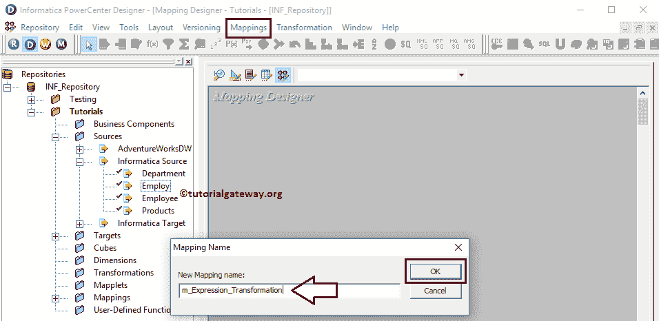

接下来，将[应用]源定义从“源”文件夹拖放到映射设计器。一旦拖动源，PowerCenter 设计器将自动创建名为[源限定符](https://www.tutorialgateway.org/source-qualifier-transformation-in-informatica/)的默认转换。

#### 在信息中创建表达式转换

要在信息中创建表达式转换，请导航到转换菜单并选择创建..选项。

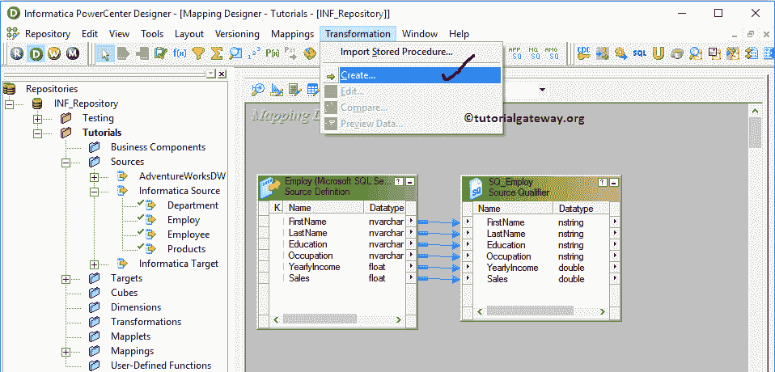

一旦你点击了创建..选项，将打开创建转换窗口。请选择信息表达式转换并指定唯一名称(exp_Audit_ Information)，然后单击创建按钮

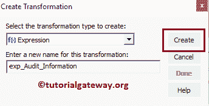

单击“创建”按钮后，表达式转换将添加到映射设计器中。请将源定义与转换连接起来。

从下面的截图可以观察到，我们在表达式转换

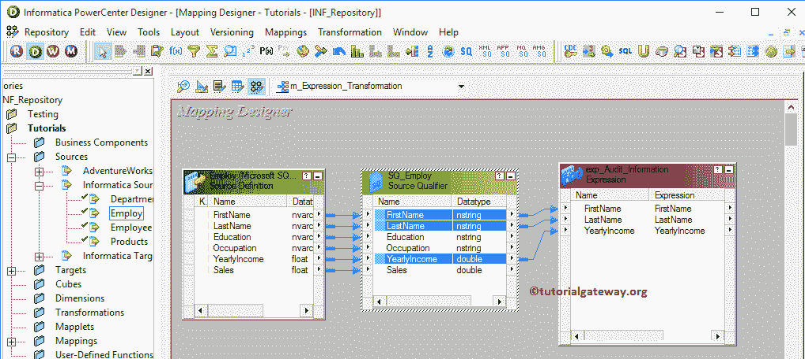

中增加了【名字】、【姓氏】和【年收入】

双击 Informatica 表达式转换来编写自定义表达式。从下面的截图中，您可以看到“转换”选项卡中的可用属性列表:

*   选择转换:默认情况下，它将选择您单击的转换。
*   重命名:此按钮将帮助您将表达式转换重命名为更有意义的名称。
*   使可重用:如果选中此选项，此转换将成为可重用的转换。
*   描述:请提供有效的描述。

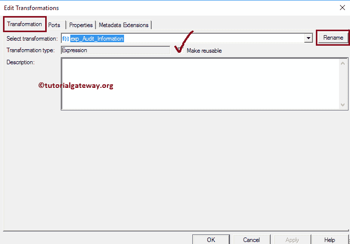

下面的截图将显示“信息表达式转换端口”选项卡中的可用选项列表:

*   端口名:可用列名列表。通过单击“新建列”按钮，可以添加新列，通过单击“剪式”按钮，可以删除不需要的列。
*   I:在这一部分下被选中的列是表达式转换输入列。
*   o:在此部分下被选中的列是表达式转换输出列。如果取消选中任何列，则该列将无法加载到目标表中。
*   如果是可变的，请勾选此项

从下面的截图中，您可以看到我们使用“新建端口”按钮添加了 9 个新列。

我们将使用这些新列来存储审核信息，如映射名称、工作流名称、会话名称、集成服务名称、存储库服务名称、存储库用户名、源表名称、会话开始时间和系统日期。

提示:所有这些新列都只是输出端口。所以，请勾号 O

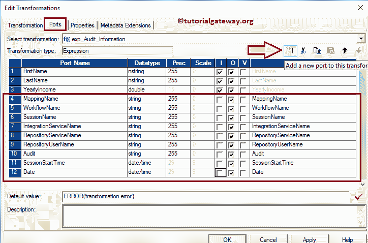

让我们编写自定义表达式来获取所需的信息。为此，点击映射名称

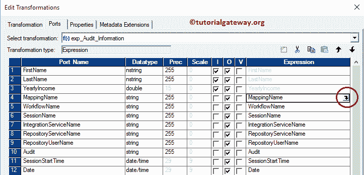

旁边的箭头按钮

它打开表达式编辑器来编写自定义表达式。这里，我们需要映射名称。因此，请转到变量选项卡，选择一个名为$PMMappingName 的内置变量。

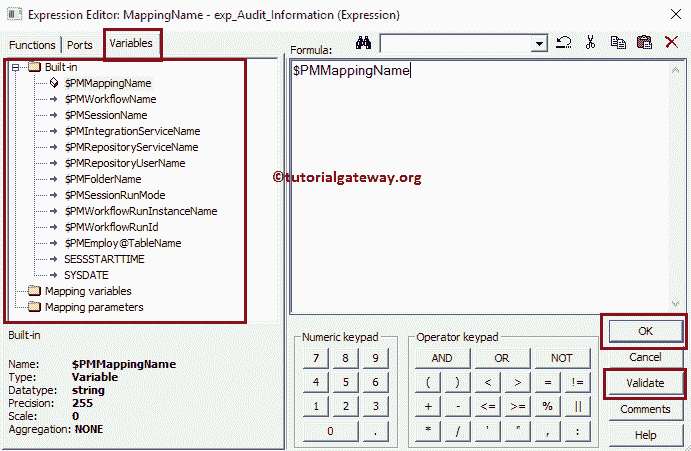

对于 Informatica 表达式转换中的其余字段，请添加适当的内置变量。

*   工作流名称:$PMWorkflowName
*   会话名称:$PMSessionName
*   集成服务名:$PMIntegrationServiceName
*   存储库服务名:$ PMRepositoryServiceName
*   存储库用户名:$ PMRepositoryUserName
*   来源表名:[【邮件保护】](/cdn-cgi/l/email-protection)
*   会话开始时间:SSSTARTTIME
*   系统日期:系统日期

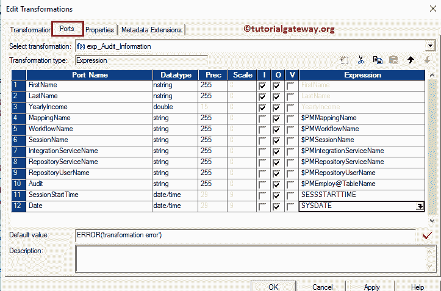

配置完 Informatica 表达式转换的表达式后。单击确定关闭转换窗口。接下来，将目标定义(表达式转换)从目标文件夹拖放到映射设计器中。接下来，使用自动链接将表达式转换与目标定义连接起来..选项。

让我们通过转到映射菜单栏并选择验证选项来验证映射。

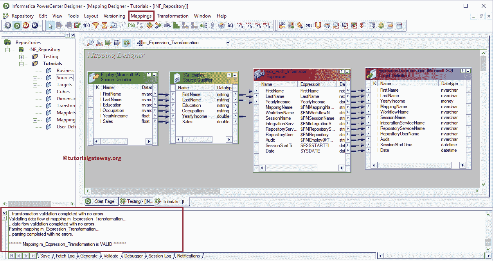

从上面的截图中，您可以观察到我们的映射是有效的。

### 创建用于信息中表达式转换的工作流

一旦我们完成了映射的创建，我们就必须为它创建工作流。PowerCenter 工作流管理器提供了两种创建工作流的方法。

*   [手动创建Informatica 工作流](https://www.tutorialgateway.org/informatica-workflow/)
*   [使用向导创建Informatica 工作流](https://www.tutorialgateway.org/informatica-workflow-using-wizard/)

在这个 Informatica 表达式转换示例中，我们将手动创建工作流。一旦我们创建了工作流，下一步就是为我们的映射创建一个会话任务。

#### 步骤 4(a):

Informatica 中有两种类型的会话:

*   [信息中不可重用的会话](https://www.tutorialgateway.org/session-in-informatica/)
*   [Informatica中的可重用会话](https://www.tutorialgateway.org/reusable-session-in-informatica/)

对于这个信息表达式转换的例子，我们将创建不可重用的会话。请导航至任务菜单并选择创建选项以打开创建任务窗口。在这里，您必须选择会话作为任务类型(默认)，并为会话输入唯一的名称(表达式转换)。

单击“创建”按钮后，将打开一个名为“映射”的新窗口。在这里，您必须选择要与此会话关联的映射。

从下面的截图中，您可以观察到我们正在选择之前创建的映射(m_Expression_Transformation)(在步骤 3 中)。

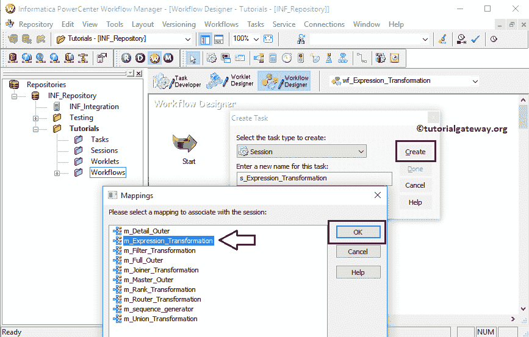

双击会话任务进行配置。虽然我们必须设置源、目标和一些公共属性，但我们不打算在这里解释它们。我们强烈建议访问 Informatica 文章中的[会话，了解其功能。](https://www.tutorialgateway.org/session-in-informatica/)

从下面的截图中，您可以观察到 Informatica 工作流中的表达式转换是有效的。现在，让我们通过选择“工作流”菜单中的“启动工作流”选项来启动工作流。

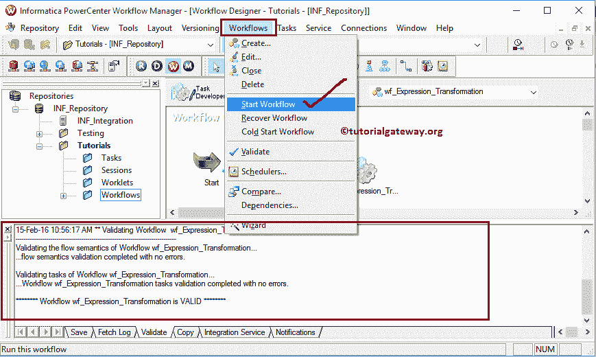

选择“启动工作流”选项后，将打开 Informatica PowerCenter 工作流监视器来监视工作流。从下面的截图，看到我们的 Informatica 表达式转换工作流执行没有任何错误。

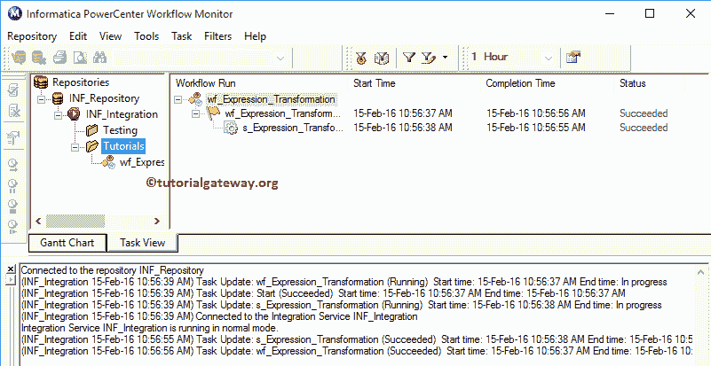

让我们打开 [SQL Server](https://www.tutorialgateway.org/sql/) 管理工作室，检查我们是否使用 Informatica 中的表达式转换成功存储了审计信息。

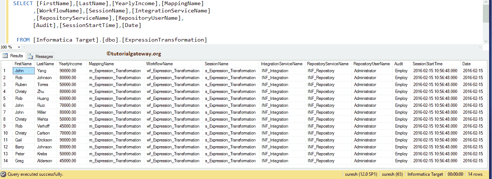