# Informatica 中的过滤器转换

> 原文：<https://www.tutorialgateway.org/filter-transformation-in-informatica/>

Informatica 中的过滤转换用于根据指定的表达式/条件过滤记录。过滤条件返回布尔值“真”或“假”，这意味着集成服务将根据指定条件检查每一行。如果条件为真，则 Informatica Filter 转换将传递该行，否则，它将跳过当前行并检查下一行。

Informatica 中的过滤器转换对实时性有很大帮助。例如，如果您想要加载销售值高于最低阈值的客户数据，等等。在本文中，我们将对两个 SQL 表执行过滤器转换。

对于此 Informatica Filter Transformation 示例，我们使用的是来自[Adventure Works DW 2014]数据库的[Dim Products]和[fact Internet Sales]表。

## Informatica示例中的过滤器转换

在我们开始做任何事情之前，首先用您的[Informatica管理控制台](https://www.tutorialgateway.org/informatica-admin-console/)凭证连接到[信息](https://www.tutorialgateway.org/informatica/)存储库服务。

### 创建Informatica过滤器转换源定义

连接成功后，请导航至[源分析器](https://www.tutorialgateway.org/informatica-source-analyzer/)并定义您的源。在这个Informatica过滤器转换的例子中，我们使用来自 SQL Server 数据库的[Dim 产品]和[事实互联网销售]作为我们的源定义。请参考【信息】中的[数据库源](https://www.tutorialgateway.org/database-source-in-informatica/)了解创建源定义

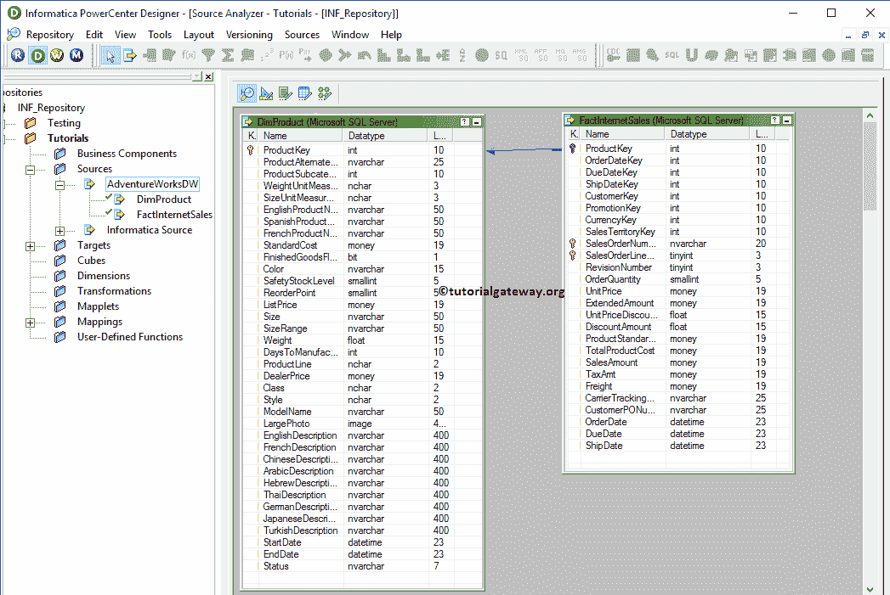

的步骤

### 创建Informatica中过滤器转换的目标定义

请导航至[目标设计器](https://www.tutorialgateway.org/target-designer-in-informatica/)并定义目标。在这个Informatica 过滤转换示例中，我们使用已经创建的 SQL 表(过滤转换)作为我们的目标定义。请参考[使用源定义](https://www.tutorialgateway.org/create-informatica-target-table-using-source-definition/)创建Informatica 目标表，了解创建目标定义

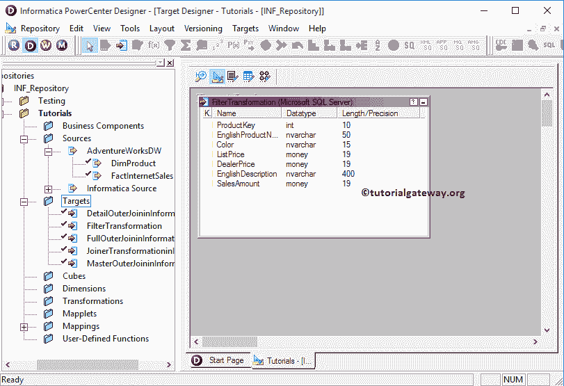

所涉及的步骤

### 在 Informatica 中创建过滤器转换的映射

要为Informatica过滤器转换创建新的映射，请导航到菜单栏中的映射菜单，并选择创建..选项。这将打开映射名称窗口，如下所示。在这里，您必须为此映射(m_Filter_Transformation)编写一个唯一的名称，然后单击“确定”按钮。

提示:请参考[Informatica 映射](https://www.tutorialgateway.org/informatica-mapping/)文章，了解创建映射所涉及的步骤。

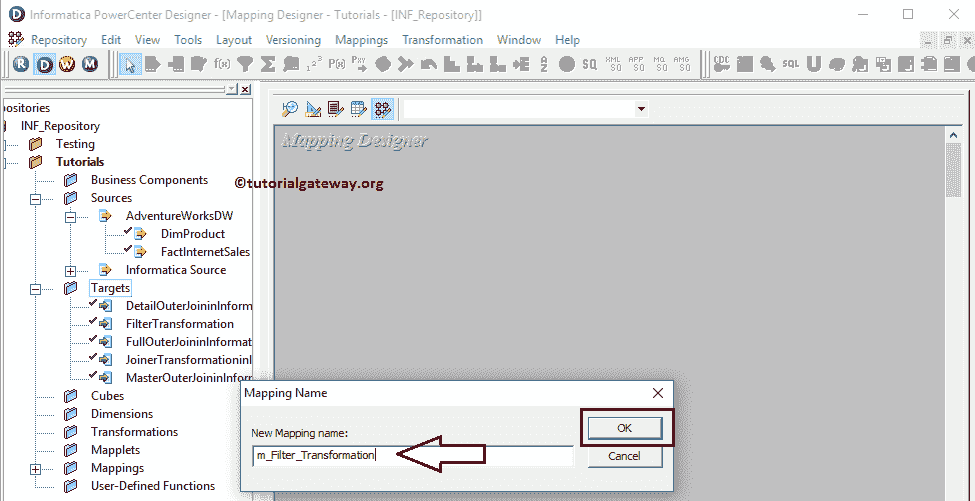

接下来，将[Dim 产品]和[事实互联网销售]源定义从“源”文件夹拖放到映射设计器中。拖动源代码后， [PowerCenter Designer](https://www.tutorialgateway.org/informatica-powercenter-designer/) 将自动创建名为源代码限定符的默认转换，如下所示。

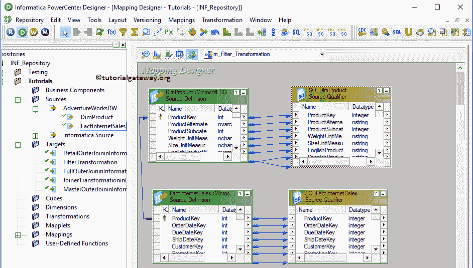

众所周知，【Dim 产品】和【事实互联网销售】表具有主键和外键关系。因此，我们删除了一个源限定符，并将两个表中的必需字段添加到单个源限定符中。

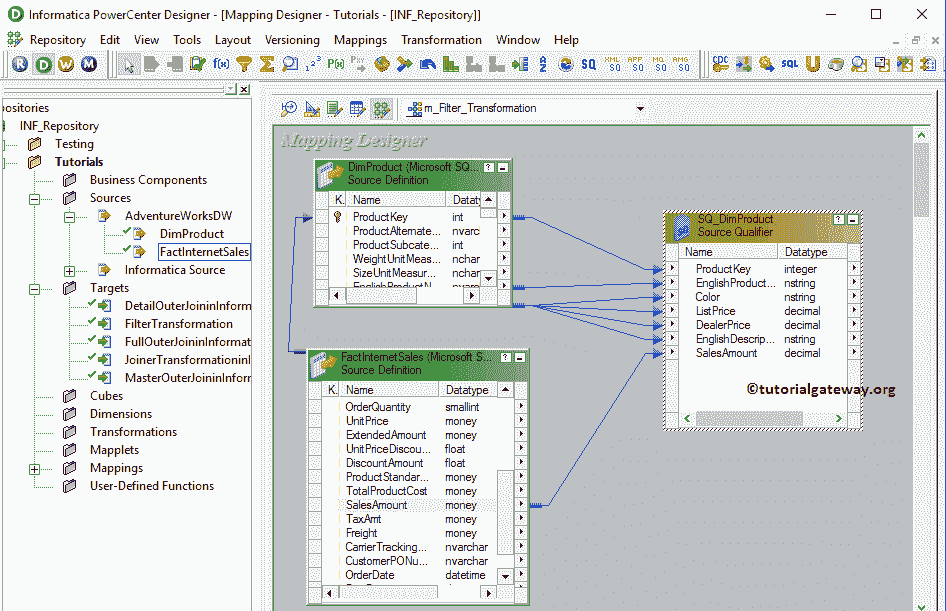

#### 在Informatica中创建过滤器转换

要在Informatica中创建过滤器转换，请导航到菜单栏中的转换菜单并选择创建..选项，如下所示。

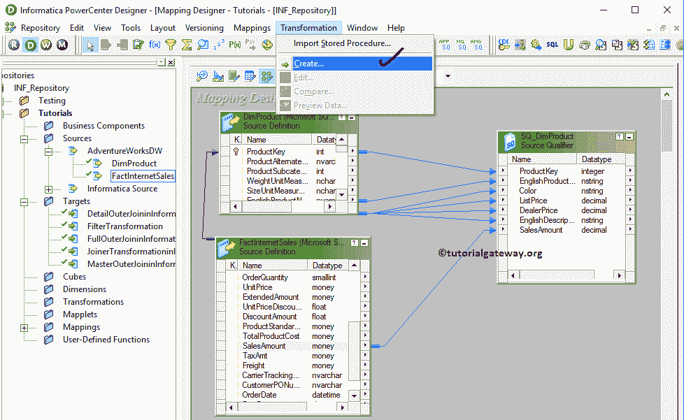

一旦你点击了创建..选项，将打开创建转换窗口，如下所示。请从下拉列表中选择Informatica过滤器转换，并为此转换指定唯一名称(fil_SalesAmount)，然后单击创建按钮

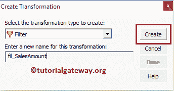

单击“创建”按钮后，过滤器转换将被添加到映射设计器中。为了通过表达式过滤记录，过滤转换需要一些数据。因此，我们必须使用 Autolink 将源定义与转换联系起来..选项(或选择并拖动必填字段)。

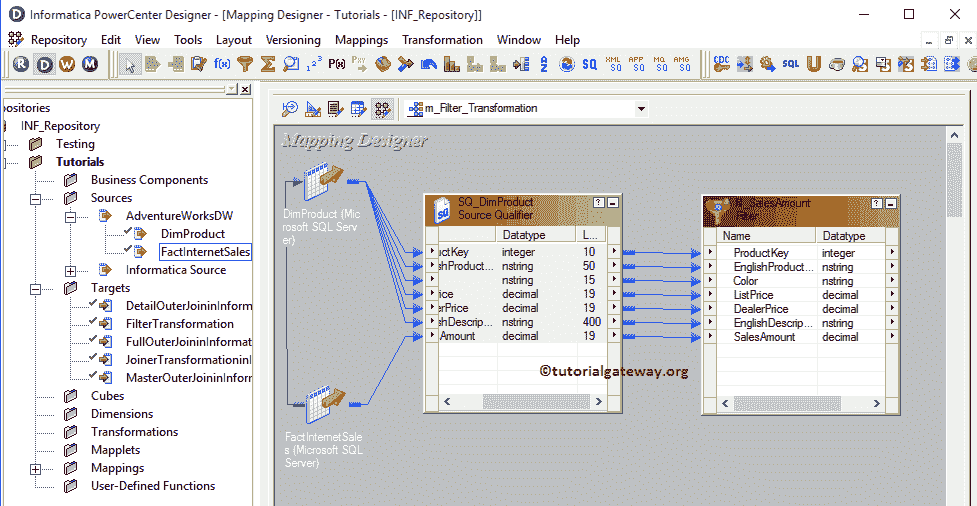

双击过滤器转换以提供过滤条件。从下面的截图中，您可以看到“转换”选项卡中的可用属性列表:

*   选择转换:默认情况下，它将选择您单击的转换。
*   重命名:此按钮将帮助您将过滤器转换重命名为更有意义的名称。
*   使可重用:如果您选中此选项，则此转换将成为可重用的转换。
*   描述:请提供此转换的有效描述。

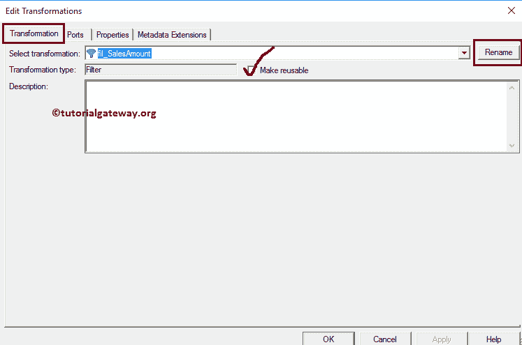

下面的截图将显示“Informatica过滤器转换端口”选项卡中的可用选项列表:

*   端口名:可用列名列表。单击“新建列”按钮可以添加新列，单击“剪式”按钮可以删除不需要的列。
*   I:在此部分下被选中的列是过滤器转换输入列。
*   o:在此部分下被选中的列是过滤器转换输出列。如果取消选中任何列，则该列将无法加载到目标表中。

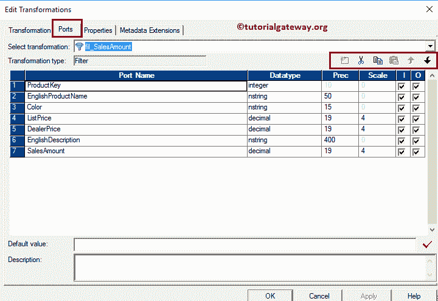

下面的屏幕截图将向您显示“属性”选项卡中的可用选项列表。默认情况下，过滤条件将设置为真，这里我们只需要提供条件。要指定条件，请单击箭头按钮，如下所示。

提示:如果您将过滤条件指定为假，则过滤条件不允许单个记录。

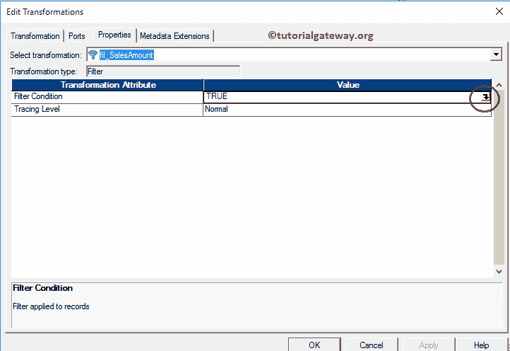

单击箭头按钮后，表达式编辑器窗口将打开，如下所示。在这里，您可以使用可用的函数、端口(列名)和变量编写自定义表达式。

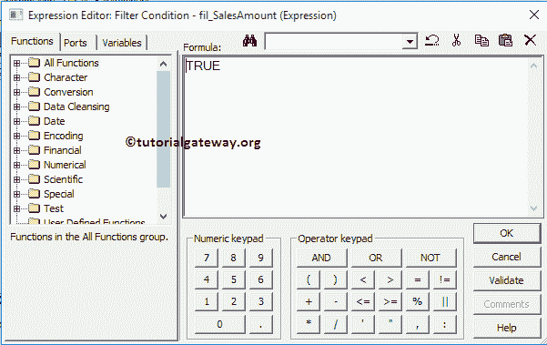

对于这个例子，我们使用简单的表达式，即 SalesAmount > 2000。意思是信息。过滤转换将返回销售额大于 2000

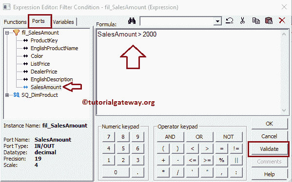

的记录

配置完属性后，单击确定关闭转换窗口。

接下来，将目标定义(Informatica 中的过滤器转换)从“目标”文件夹拖放到映射设计器中，并将转换与目标定义连接起来。请使用自动链接..连接它们的选项。

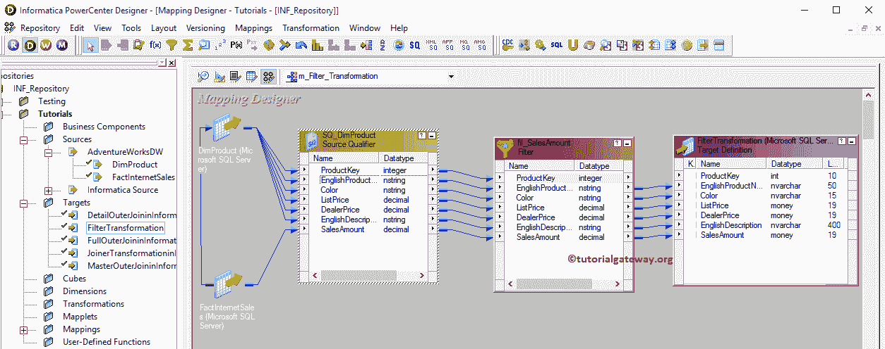

在我们关闭映射之前，让我们通过转到映射菜单栏并选择验证选项来验证映射。

### 创建Informatica过滤器转换工作流

一旦我们完成创建映射，我们就必须为它创建工作流。PowerCenter 工作流管理器提供了两种创建工作流的方法。

*   [手动创建 Informatica 工作流](https://www.tutorialgateway.org/informatica-workflow/)
*   [使用向导创建 Informatica 工作流](https://www.tutorialgateway.org/informatica-workflow-using-wizard/)

在这个Informatica过滤器转换示例中，我们将手动创建工作流。要创建新的 Informatica 工作流，请导航到工作流菜单并选择创建选项。这将打开创建工作流窗口，如下所示。请提供唯一的名称(wf_Filter_Transformation)并保留默认设置。

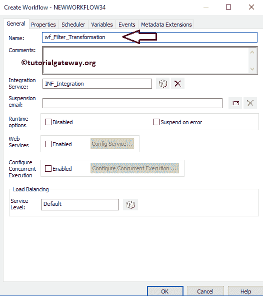

一旦我们创建了工作流，下一步就是为我们的映射创建一个会话任务。

注意:我们强烈建议参考 [Informatica Workflow](https://www.tutorialgateway.org/informatica-workflow/) 文章，了解手动创建 Workflow 所涉及的步骤。

#### 在Informatica中创建用于过滤器转换的会话

Informatica 中有两种类型的会话:

*   不可重用的会话任务:请参考 Informatica 中的[会话](https://www.tutorialgateway.org/session-in-informatica/)
*   可重用会话任务:请参考 Informatica 中的[可重用会话](https://www.tutorialgateway.org/reusable-session-in-informatica/)

对于这个Informatica过滤器转换示例，我们将创建不可重用的会话。请导航至任务菜单并选择创建选项以打开创建任务窗口。在这里，您必须选择会话作为任务类型(默认)，并为会话输入唯一的名称(过滤转换)。

单击“创建”按钮后，将打开一个名为“映射”的新窗口。在这里，您必须选择要与此会话关联的映射。从下面的截图中，您可以看到我们正在选择之前创建的映射(m_Filter_Transformation)(在步骤 3 中)。

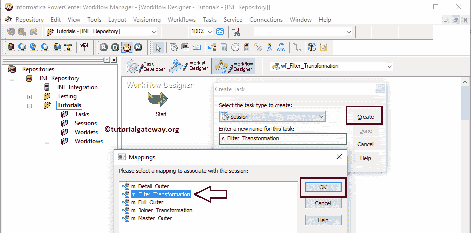

双击会话任务进行配置。虽然我们必须配置源、目标和一些常见属性，但我们只解释了几个属性。我们强烈建议访问 Informatica 文章中的[会话，了解剩余属性。](https://www.tutorialgateway.org/session-in-informatica/)

从下面的截图中，您可以看到我们将$目标变量分配给了连接值，我们将目标加载类型选项从批量模式更改为正常模式，并选中截断目标表选项以从目标表中截断现有数据。

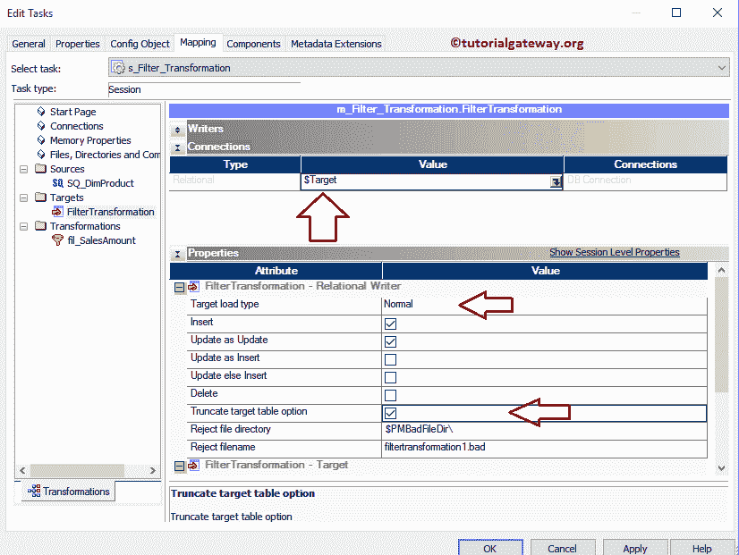

从下面的截图中，您可以观察到 Informatica 工作流中的过滤器转换是有效的。现在，让我们通过导航到“工作流”菜单并选择“启动工作流”选项来启动工作流。

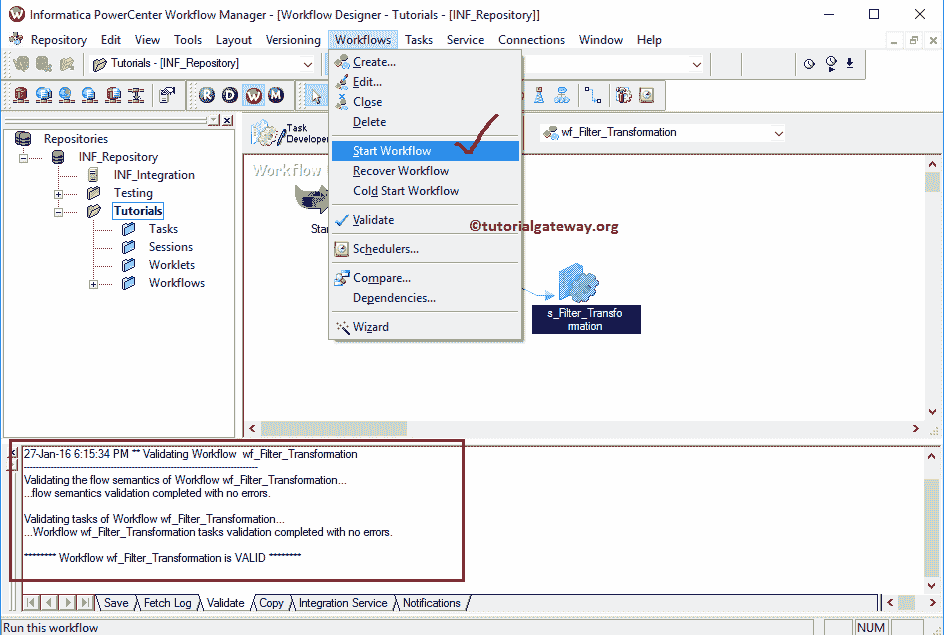

选择“启动工作流”选项后，将打开 Informatica PowerCenter 工作流监视器来监视工作流。从下面的截图中，您可以观察到我们的工作流没有任何错误地执行。

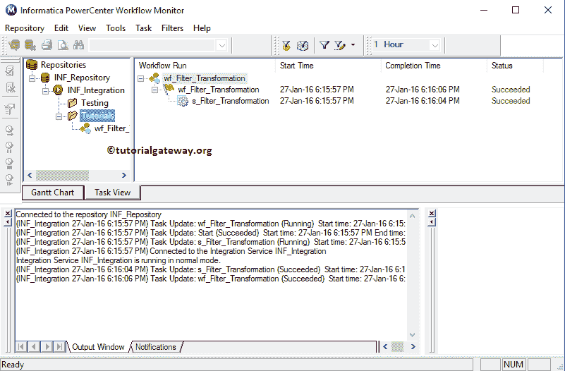

让我们打开 [SQL Server](https://www.tutorialgateway.org/sql/) 管理工作室，检查是否使用 Informatica Filter 转换成功限制了销售额小于 2000 的记录。

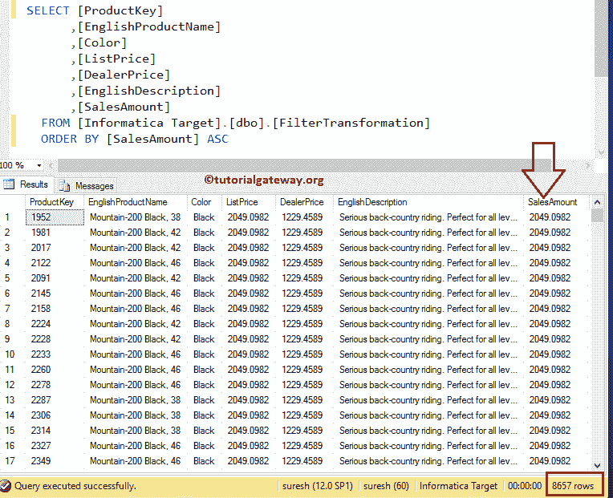