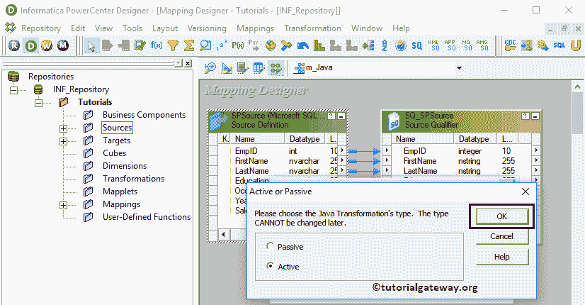
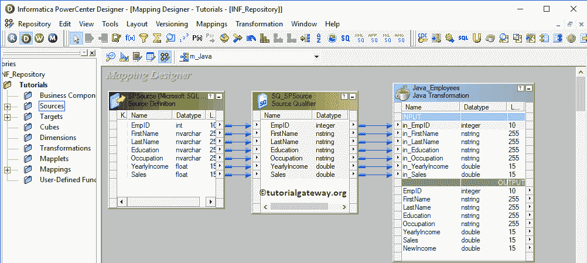
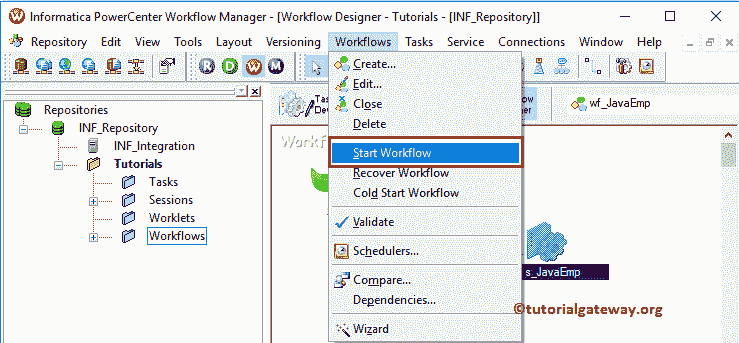

# Informatica 中的 Java 转换

> 原文：<https://www.tutorialgateway.org/java-transformation-in-informatica/>

Informatica 中的 Java 转换提供了在转换中编写自定义 Java 代码的机会。如果您熟悉 Java 编程，那么您可以在这个转换中编写复杂的代码。

对于这个 Informatica Java 转换示例，我们将使用 SP 源表和目标表。从下面的截图可以看到，Source 表有 15 条记录，Destination 表为空。


## Informatica 示例中的 Java 转换

在这个例子中，我们展示了如何在 Informatica 中创建和配置 Java Transformation。在我们开始配置之前，首先，让我连接 [Informatica](https://www.tutorialgateway.org/informatica/) 存储库服务。

为此，我们必须提供[Informatica 管理控制台](https://www.tutorialgateway.org/informatica-admin-console/)凭证。因此，请在[安装 Informatica](https://www.tutorialgateway.org/how-to-install-informatica/) 服务器时提供您指定的相应用户名和密码。

### 在 Informatica 中创建 Java 转换的源定义

连接成功后，请导航至[源分析器](https://www.tutorialgateway.org/informatica-source-analyzer/)并定义您的源。在这个 Informatica Java 转换示例中，我们使用来自 SQL Server 数据库的 SP 源表作为我们的源定义。请参考【Informatica】中的[数据库源](https://www.tutorialgateway.org/database-source-in-informatica/)了解创建源定义


的步骤

### 创建 Informatica Java 转换目标定义

请导航至[目标设计器](https://www.tutorialgateway.org/target-designer-in-informatica/)定义目标。在这个 Informatica Java 转换示例中，我们使用现有的 SQL 表(SP 目标)作为我们的目标定义。您可以参考[使用源定义](https://www.tutorialgateway.org/create-informatica-target-table-using-source-definition/)创建目标表，了解目标定义


的创建

### 创建 Informatica Java 转换映射

要为 Informatica Java 转换创建新的映射，请导航到菜单栏中的映射菜单。接下来，选择创建..选项。


选择“创建”后..选项，一个新的[映射](https://www.tutorialgateway.org/informatica-mapping/)名称窗口打开。让我提供 m_Java 作为映射名称，然后单击确定按钮。


将服务点源从源文件夹拖放到映射设计器中。拖动源后，[动力中心设计器](https://www.tutorialgateway.org/informatica-powercenter-designer/)会自动为您创建[源限定符转换](https://www.tutorialgateway.org/source-qualifier-transformation-in-informatica/)(默认转换)。


#### 创建 Informatica Java 转换

要在 Informatica 中创建 Java 转换，请导航到菜单栏中的转换菜单。接下来，选择创建..选项。


选择创建..选项打开“创建转换”窗口。请从下拉列表中选择 [Java](https://www.tutorialgateway.org/java-tutorial/) 转换，并提供此[转换的唯一名称(Java _ Employees)](https://www.tutorialgateway.org/informatica-transformations/)，然后点击【创建】按钮


单击创建按钮将弹出一个名为主动或被动的新窗口。请选择您要将此 Java 转换作为主动转换还是被动[转换](https://www.tutorialgateway.org/informatica-transformations/)。



单击“确定”将为您创建一个 Java 转换。让我将源代码定义中所有可用的字段拖到 Java 转换中。


双击 Informatica Java 转换来查看和更改属性。下面的屏幕截图显示了“转换”选项卡中的可用属性列表:

*   选择转换:默认情况下，它会选择您选择(或单击)的转换。
*   重命名:此按钮帮助您重命名转换名称。
*   描述:使用此处提供有效的描述。


下面的屏幕截图显示了端口选项卡中可用列的列表。可以看到，从源定义中拖动的所有列都在 OUTPUT 部分。

提示:此时很少有人不从源限定符中拖动字段。他们将自己创建输入和输出字段，然后将它们指向源限定符。


要在输入部分下创建新字段，请选择输入，然后单击新建字段按钮。


在我们的源代码定义中，我们有 7 列。所以让我在 INPUT 部分创建 7 个新字段。我们还需要为目标表


中的新收入字段增加一个输出列

让我根据源定义


重命名字段名称

Java 代码选项卡:这是用来编写自定义的 Java 代码。在这里，左侧窗口是一个导航窗口，它保存了 Java 转换中可用的所有输入、输出端口，以及一些常用的函数。


让我为这个 Informatica Java 转换


写一个简单的 [Java](https://www.tutorialgateway.org/java-tutorial/) 代码

在上述代码中，我们使用了 [`if-else`语句](https://www.tutorialgateway.org/java-if-else-statement/)和 [Equals](https://www.tutorialgateway.org/java-equals-method/) 方法来检查员工的职业是否为管理。如果是真的，那么我们在年收入中增加了 45750 英镑，否则我们增加了 25009 英镑。我们使用的代码是:

```
EmpID = in_EmpID;
FirstName = in_FirstName;
LastName = in_LastName;
Education = in_Education;
Occupation = in_Occupation;
YearlyIncome = in_YearlyIncome;
Sales = in_Sales;
if(in_Occupation.equals("Management"))
{
	NewIncome = in_YearlyIncome + 45750;
}
else
{
	NewIncome = in_YearlyIncome + 25009;
}
generateRow();
```

配置完 Java 转换后，您必须将源限定符与 Java 转换输入字段进行映射。



接下来，将目标定义(服务点目标)从目标文件夹拖放到映射设计器中。接下来，使用自动链接将 Java 转换的输出文件与目标定义连接起来..选项。


在我们关闭映射之前，让我们保存映射，并通过转到映射菜单栏来验证映射，然后选择验证选项。

### 创建 Informatica Java 转换工作流

创建完 Informatica Java 转换映射后，我们必须为它创建工作流。PowerCenter 工作流管理器提供了两种创建工作流的方法。

*   [手动创建工作流](https://www.tutorialgateway.org/informatica-workflow/)
*   [使用向导创建工作流](https://www.tutorialgateway.org/informatica-workflow-using-wizard/)

在这个 Informatica Java 转换示例中，我们将手动创建工作流。为此，请导航至工作流菜单并选择创建选项。


它会打开“创建工作流”窗口。请提供一个唯一的名称(wf_JavaEmp)并保留默认设置。


一旦我们创建了工作流，下一步就是为我们的映射创建一个会话任务。

#### 创建 Java 转换会话

Informatica 中有两种类型的会话:

*   [Informatica 中不可重用的会话](https://www.tutorialgateway.org/session-in-informatica/)
*   [Informatica 中的可重用会话](https://www.tutorialgateway.org/reusable-session-in-informatica/)

对于这个 Informatica Java 转换示例，我们创建了一个不可重用的会话。要创建不可重复使用的会话，请导航到任务菜单并选择创建选项，如下所示。


请为此会话提供一个唯一的名称(s_JavaEmp)。单击“创建”按钮后，将打开一个名为“映射”的新窗口。在这里，您必须选择要与此会话关联的映射，即 m_Java。


双击会话任务打开编辑任务窗口。在映射选项卡中，我们必须配置源、目标连接。

首先，让我们通过单击“源”文件夹中的 SQ_SPSource 源来配置源连接。在连接中，点击关系类型旁边的箭头按钮，选择数据库对象(数据库名称)，即【Informatica 源】


现在，我们必须为这个 Informatica Java 转换配置目标连接。因此，单击目标文件夹中的目标。在连接中，单击关系类型旁边的箭头按钮。接下来，选择数据库对象(目标数据库名称)，即


Informatica 目标

接下来，导航到工作流菜单并选择验证选项以验证工作流。


现在，让我启动 Informatica Java 转换工作流。为此，请导航到“工作流”菜单并选择“启动工作流”选项。



让我们打开 [SQL Server 管理工作室](https://www.tutorialgateway.org/sql-server-management-studio/)并编写以下 [SQL](https://www.tutorialgateway.org/sql/) 查询。

