# Informatica中的连接器转换

> 原文：<https://www.tutorialgateway.org/joiner-transformation-in-informatica/>

Informatica 中的连接器转换用于执行 [SQL 连接](https://www.tutorialgateway.org/sql-inner-join/)。Informatica 中有四种连接类型，分别是内部连接(普通连接)[主外连接](https://www.tutorialgateway.org/master-outer-join-in-informatica/)[细节外连接](https://www.tutorialgateway.org/detail-outer-join-in-informatica/)和[全外连接](https://www.tutorialgateway.org/full-outer-join-in-informatica/)。Informatica 中的连接器转换对于将数据加载到数据仓库中的维度表非常有用。

正常连接:Informatica中的正常连接与 [SQL 内部连接](https://www.tutorialgateway.org/sql-inner-join/)完全相似。如果列之间至少有一个匹配项，它将返回两个表中的记录(或行)。为了更好地理解，让我们来看看法线连接的视觉表示。

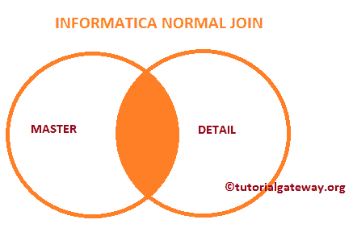

在本文中，我们将使用 Informatica 中的连接器转换对两个 SQL 表执行普通连接。在我们开始设计映射之前，让我们看一下我们的两个源表，我们将使用 Informatica连接器转换在这两个源表上执行正常连接。

【信息来源】数据库内的员工表为:

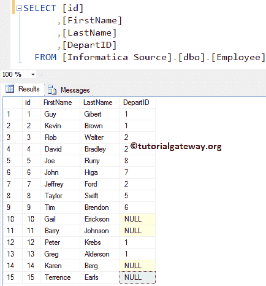

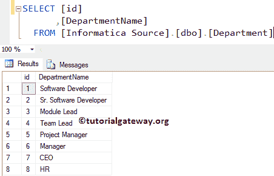

内的部门表

## 信息示例中的连接器转换

在我们开始做任何事情之前，首先连接到 [Informatica](https://www.tutorialgateway.org/informatica/) 存储库服务。为了连接到存储库服务，我们必须提供[管理控制台](https://www.tutorialgateway.org/informatica-admin-console/)凭证，因此，请提供适当的用户名和密码，并点击连接按钮，如下所示。

提示:这里你必须提供你在安装信息服务器时指定的管理员用户名和密码。

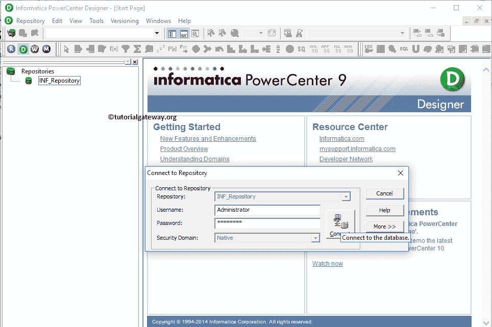

### 步骤 1:为Informatica中的连接器转换创建源定义

连接成功后，请导航至[源分析器](https://www.tutorialgateway.org/informatica-source-analyzer/)并定义您的源。在这个 Informatica连接器转换示例中，我们使用来自 SQL Server 数据库的部门和员工表作为我们的源定义。请参考【信息】中的[数据库源](https://www.tutorialgateway.org/database-source-in-informatica/)了解创建源定义

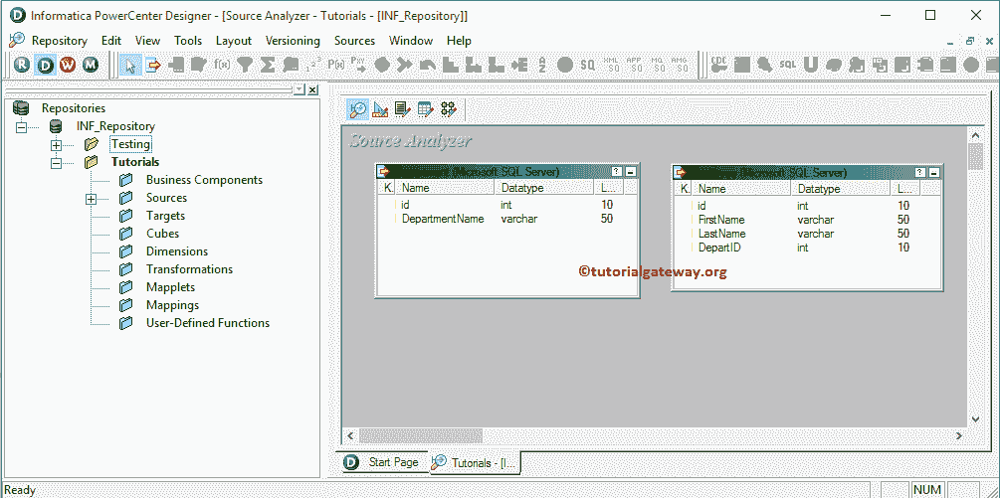

的步骤

### 步骤 2:为Informatica中的连接器转换创建目标定义

请导航至[目标设计器](https://www.tutorialgateway.org/target-designer-in-informatica/)并定义目标。在这个例子中，我们使用已经创建的 SQL 表(Informatica 中的连接器转换)作为我们的目标定义。请参考[使用源定义](https://www.tutorialgateway.org/create-informatica-target-table-using-source-definition/)创建目标表，了解创建目标定义

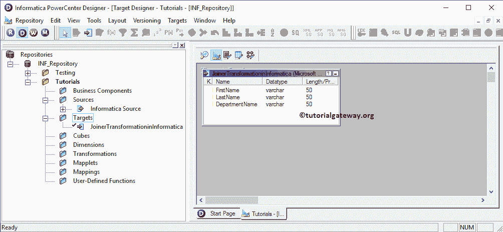

的步骤

### 步骤 3:在信息映射中创建连接器转换

要创建新映射，请导航至菜单栏中的映射菜单，并选择创建..选项。这将打开映射名称窗口，如下所示。在这里，您必须为这个映射(m_Joiner_transformation)编写一个唯一的名称，然后单击“确定”按钮。

提示:请参考[信息映射](https://www.tutorialgateway.org/informatica-mapping/)文章，了解创建映射所涉及的步骤。

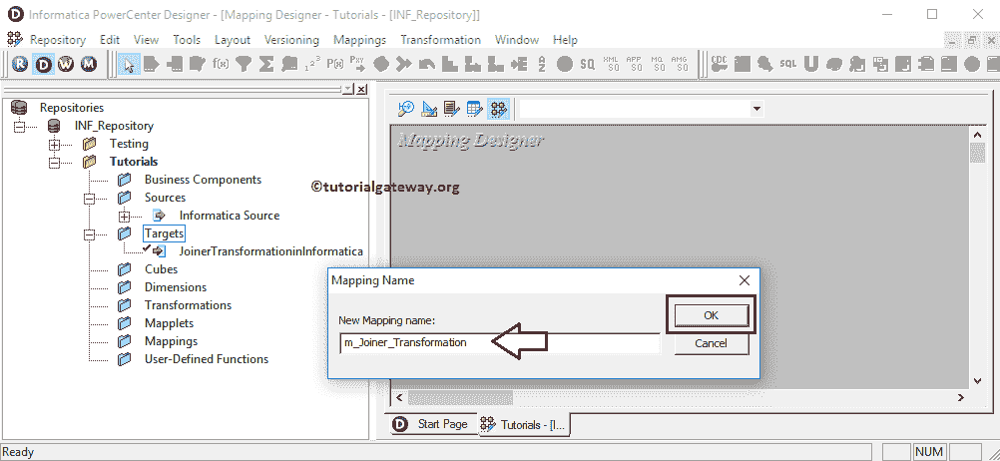

接下来，将员工和部门源定义从“源”文件夹拖放到映射设计器中。拖动源后， [PowerCenter Designer](https://www.tutorialgateway.org/informatica-powercenter-designer/) 将自动创建名为源限定符的默认转换。

#### 步骤 3(a):在信息中创建连接器转换

要在 Informatica 中创建连接器转换，请导航到菜单栏中的转换菜单，并选择创建..选项，如下所示。

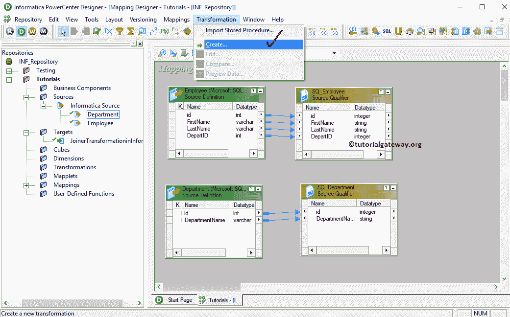

一旦你点击了创建..选项，将打开创建转换窗口，如下所示。请单击箭头从下拉列表中选择所需的选项。让我们选择 Informatica连接器转换

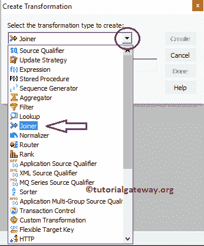

接下来，请为此信息连接转换指定唯一的名称，并点击创建按钮

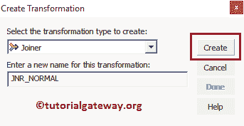

单击创建按钮后，Informatica连接器转换将被添加到映射设计器中。为了执行正常连接，Informatica连接器转换需要一些数据。因此，我们必须使用 Autolink 将源定义与转换联系起来..选项(或选择并拖动必填字段)。

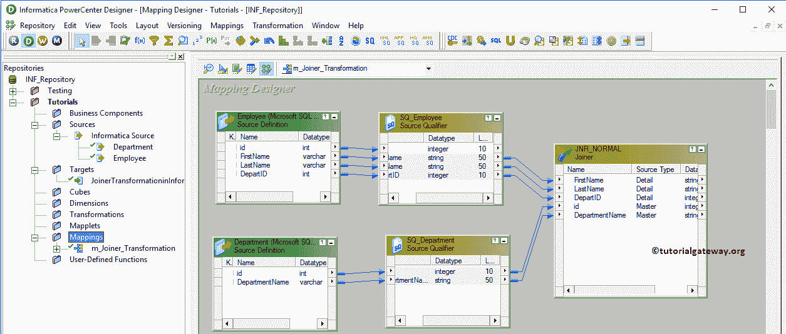

双击 Informatica连接器转换来配置连接条件。从下面的截图中，您可以看到“转换”选项卡中的可用属性列表:

*   选择转换:默认情况下，它将选择您单击的转换。
*   重命名:此按钮将帮助您将其重命名为更有意义的名称。
*   使可重用:如果你选中这个选项，那么它将成为可重用的转换。
*   描述:请提供有效的描述。

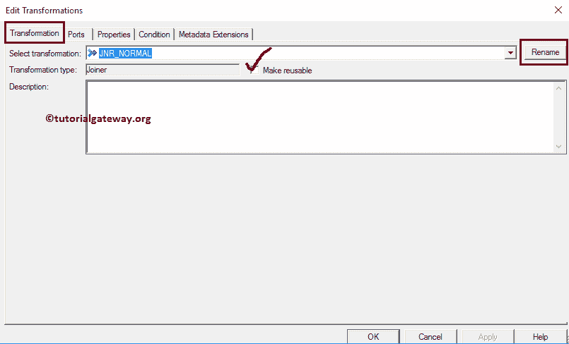

“信息连接器转换端口”选项卡中的可用选项列表:

*   端口名:可用列名列表。单击“新建列”按钮可以添加新列，单击“剪式”按钮可以删除不需要的列。
*   I:在此部分下勾选标记的列是输入列。
*   o:在这一部分下被选中的列是连接器转换输出列。如果取消选中任何列，则该列将无法加载到目标表中。
*   男:请选中要用作主表的列。选择记录最少的表作为主表始终是一种好的做法。这里，我们选择一个部门表作为我们的主表。

注意:您不必选择主表中的每一列。如果您从“员工”中选择“一列”，则 Informatica 将自动选择剩余的列。

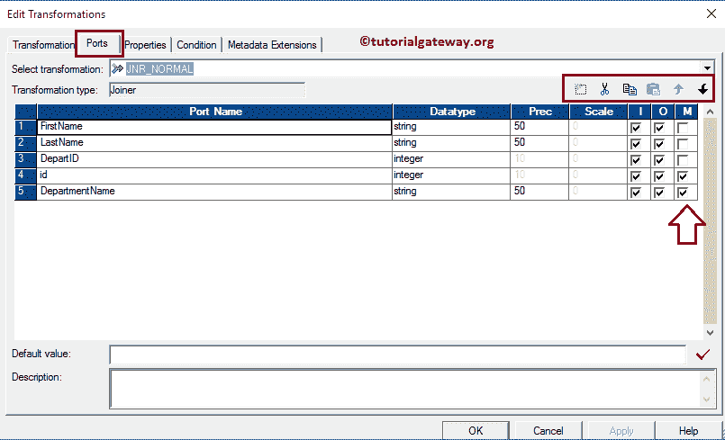

下面的截图将向您展示 Informatica连接器转换属性选项卡中的可用选项列表:

*   连接类型:在这个例子中，我们执行的是普通连接，所以我们从下拉列表中选择普通连接。
*   排序输入:如果我们使用排序的数据，那么勾选这个选项。

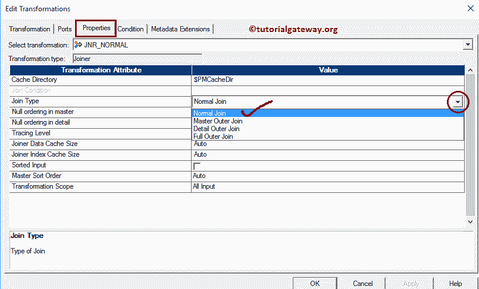

在条件选项卡中，我们必须指定条件。在本例中，我们将根据条件部门对部门和员工表执行正常连接。id =员工。出发身份证。因此，点击新建按钮(剪刀旁边)创建一个新的条件，并从主列表和明细列表

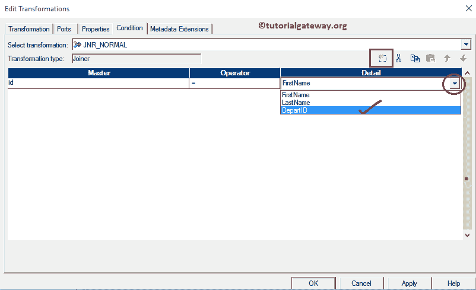

中选择列名

配置完 Informatica连接器转换属性后，单击确定关闭窗口。

接下来，将目标定义从目标文件夹拖放到映射设计器中，并将连接器转换与目标定义连接起来。请使用自动链接..连接它们的选项。

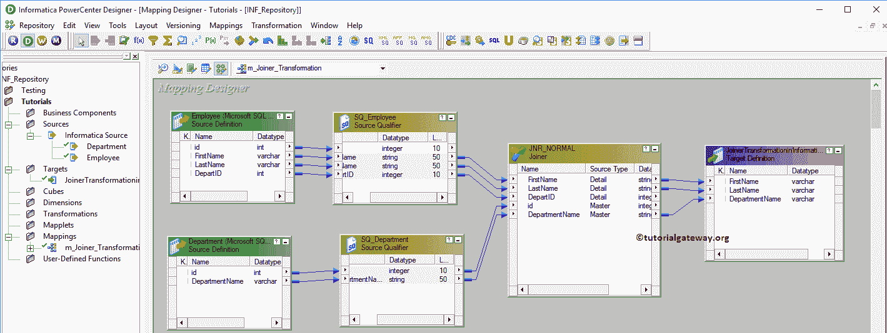

在我们关闭映射之前，让我们通过转到映射菜单栏并选择验证选项来验证 Informatica连接器转换映射。

### 步骤 4:为Informatica中的连接器转换创建工作流

一旦我们完成创建映射，我们就必须为它创建工作流。PowerCenter 工作流管理器提供了两种创建工作流的方法。

*   [手动创建工作流](https://www.tutorialgateway.org/informatica-workflow/)
*   [使用向导创建工作流](https://www.tutorialgateway.org/informatica-workflow-using-wizard/)

在这个 Informatica连接器转换示例中，我们将手动创建工作流。要创建新的Informatica 工作流，请导航到工作流菜单并选择创建选项。这将打开创建工作流窗口，如下所示。请提供唯一的名称(wf_joiner_transformation)并保留默认设置。

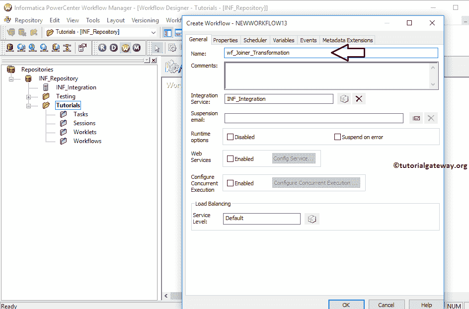

一旦我们创建了工作流，我们的下一步就是为 informatica 中的连接器转换创建一个会话。

注意:我们强烈建议参考 [Informatica Workflow](https://www.tutorialgateway.org/informatica-workflow/) 文章，了解手动创建 Workflow 所涉及的步骤。

#### 步骤 4(a):创建信息加入者转换会话

Informatica 中有两种类型的会话:

*   不可重用会话任务:请参考 Informatica 文章中的[会话，了解其中涉及的步骤。](https://www.tutorialgateway.org/session-in-informatica/)
*   可重用会话任务:请参考[可重用会话](https://www.tutorialgateway.org/reusable-session-in-informatica/)文章，了解其中涉及的步骤。

对于这个 Informatica连接器转换示例，我们将创建不可重用的会话。要在信息中创建不可重复使用的会话，请导航到任务菜单，并选择创建选项以打开创建任务窗口。在这里，您必须选择会话作为任务类型(默认)，并为会话输入唯一的名称。

单击“创建”按钮后，将打开一个名为“映射”的新窗口。在这里，您必须选择要与此会话关联的映射。从下面的截图中，您可以看到我们正在选择之前创建的映射(在步骤 3 中)。

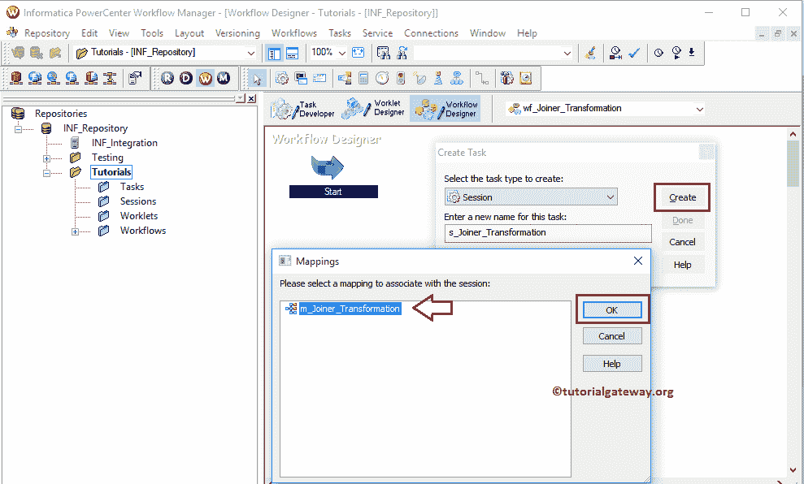

双击会话任务进行配置。虽然我们必须配置一些通用属性，但我们只解释了源、目标属性。我们强烈建议访问 Informatica 文章中的[会话，了解剩余属性。](https://www.tutorialgateway.org/session-in-informatica/)

##### Informatica连接器转换员工来源

在连接中，选择关系类型旁边的箭头按钮，打开关系连接浏览器，如下所示。这里，我们的员工表来自 Informatica Source，我们使用的是上一步创建的 Connection 变量，即:$Source

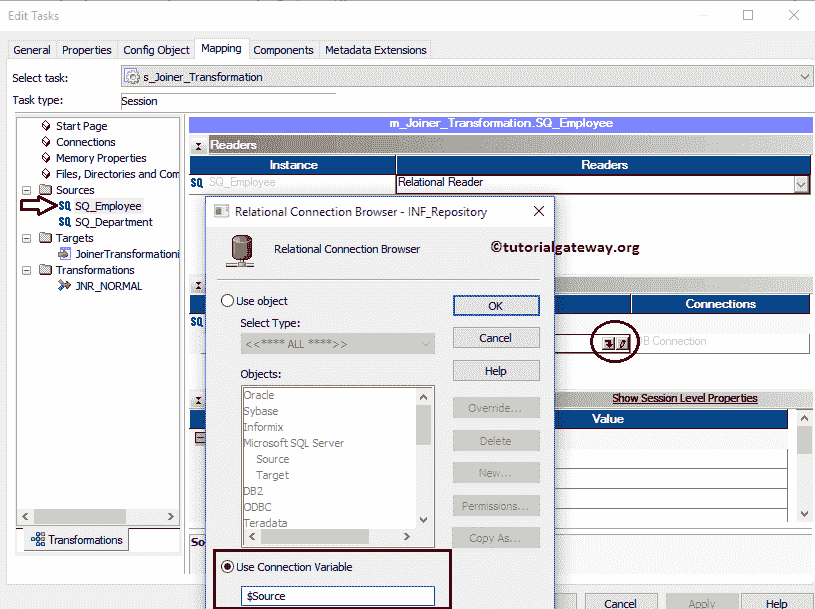

##### 信息员转换部门来源

在连接中，选择关系类型旁边的箭头按钮，打开关系连接浏览器，如下所示。在这里，我们的部门表也来自 Informatica Source，因此我们使用我们在上一步中创建的 Connection 变量，即$Source

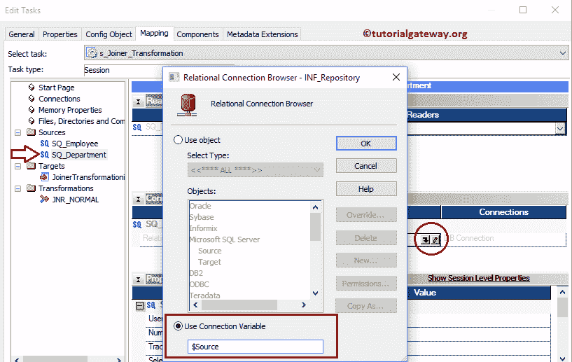

从下面的截图中，您可以看到我们将$目标变量分配给了连接值，我们将目标加载类型选项从批量模式更改为正常模式，并选中截断目标表选项以从目标表中截断现有数据。

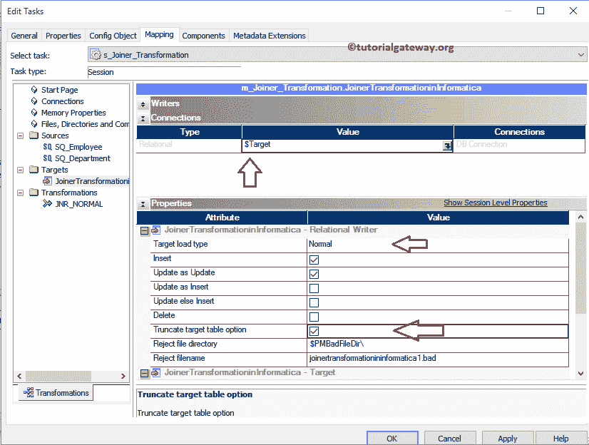

从下面的截图中，您可以观察到 Informatica连接器转换工作流是有效的。现在，让我们通过导航到“工作流”菜单并选择“启动工作流”选项来启动工作流。

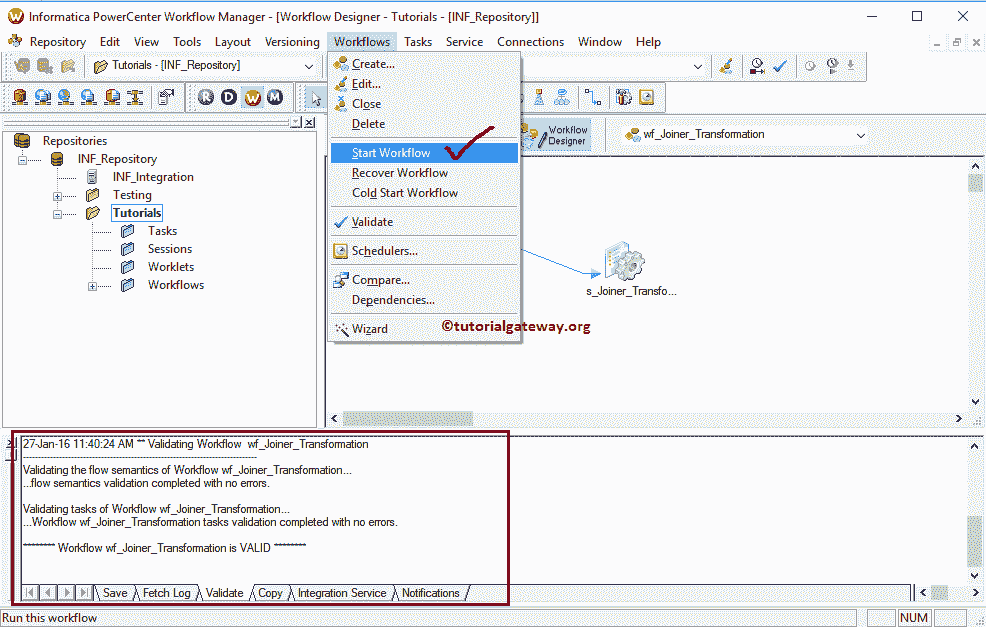

选择“启动工作流”选项后，将打开 Informatica PowerCenter 工作流监视器来监视工作流。从下面的截图中，您可以观察到我们的 Informatica连接器转换工作流没有任何错误地执行。

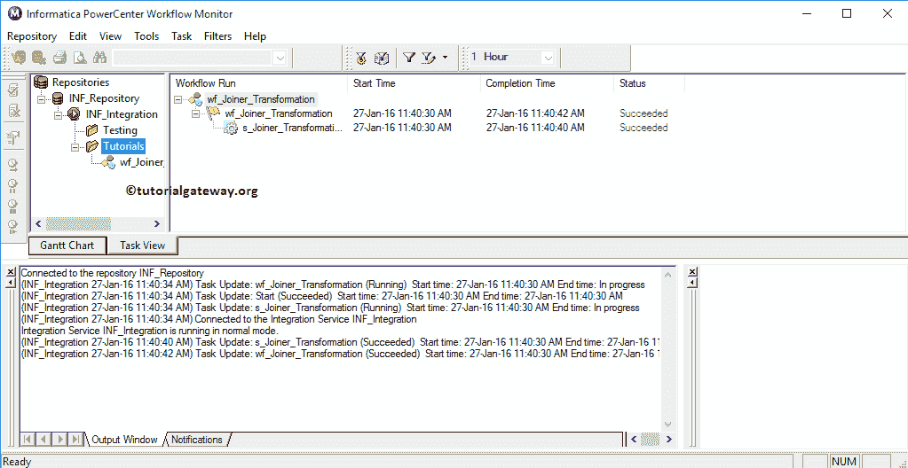

让我们打开 SQL Server 管理工作室，检查我们是否使用 Informatica 中的连接器转换成功执行了正常连接。

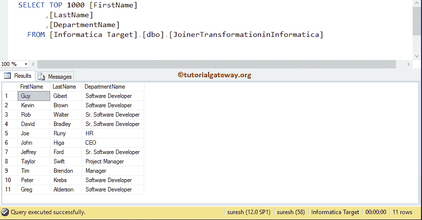