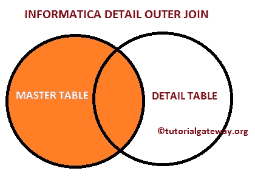

# 信息中的详细外部连接

> 原文：<https://www.tutorialgateway.org/detail-outer-join-in-informatica/>

Informatica 中的详细外部连接用于返回主表中的所有现有记录，并仅返回详细表中的匹配记录。

为了更好地理解，让我们看看 Informatica 中细节外部连接的视觉表示。

在本文中，我们将使用 Joiner 转换在两个 SQL 表上执行 Informatica Informatica Detail 外部连接。在我们开始设计映射之前，让我们看一下我们将要在 Informatica 中执行详细外部连接的两个源表。

【信息来源】数据库内的员工表为:

【信息来源】数据库内的部门表为:

## 信息示例中的详细外部连接

在我们开始做任何事情之前，首先用您的[信息管理控制台](https://www.tutorialgateway.org/informatica-admin-console/)凭证连接到[信息](https://www.tutorialgateway.org/informatica/)存储库服务。

提示:请参考[正常连接](https://www.tutorialgateway.org/joiner-transformation-in-informatica/)、[主外连接](https://www.tutorialgateway.org/master-outer-join-in-informatica/)、[全外连接](https://www.tutorialgateway.org/full-outer-join-in-informatica/)文章，了解 Informatica 中剩余的连接。

### 步骤 1:为信息中的详细外部连接创建源定义

连接成功后，请导航至[源分析器](https://www.tutorialgateway.org/informatica-source-analyzer/)并定义您的源。在这个 Informatica 详细外部连接示例中，我们使用来自 SQL Server 数据库的部门和员工表作为我们的源定义。请参考【信息】中的[数据库源](https://www.tutorialgateway.org/database-source-in-informatica/)了解创建源定义

的步骤

### 步骤 2:为信息详细信息外部连接创建目标定义

请导航至[目标设计器](https://www.tutorialgateway.org/target-designer-in-informatica/)并定义目标。在这个例子中，我们使用已经创建的 SQL 表(Informatica 中的详细外部连接)作为我们的目标定义。请参考[使用源定义](https://www.tutorialgateway.org/create-informatica-target-table-using-source-definition/)创建信息目标表，了解创建目标定义

所涉及的步骤

### 步骤 3:创建信息详细信息外部连接映射

对于这个 Informatica 细节外部连接示例，我们创建了 m_Detail_Outer 映射。请参考[信息映射](https://www.tutorialgateway.org/informatica-mapping/)一文了解创建映射。接下来，将员工和部门源定义从“源”文件夹拖放到映射设计器中。拖动源代码后， [PowerCenter Designer](https://www.tutorialgateway.org/informatica-powercenter-designer/) 将自动创建名为源代码限定符的默认转换。

#### 步骤 3(a):在信息中创建 Joiner 转换

要在 Informatica 中创建[连接变换，请导航至菜单栏中的变换菜单，并选择创建..选项，如下所示。](https://www.tutorialgateway.org/joiner-transformation-in-informatica/)

一旦你点击了创建..选项，将打开创建转换窗口，如下所示。请从下拉列表中选择 [Joiner 变换](https://www.tutorialgateway.org/joiner-transformation-in-informatica/)，并为此变换指定唯一名称(JNR_DETAIL)，然后单击【创建】按钮

单击“创建”按钮后，Joiner 转换将被添加到映射设计器中。为了执行细节外部连接，Joiner 转换需要一些数据，所以我们必须使用 Autolink 将源定义与转换连接起来..选项(或选择并拖动必填字段)。

双击 Joiner 转换来配置连接条件。从下面的截图中，您可以看到端口选项卡中可用选项的列表:

*   男:请选中要用作主表的列。选择记录最少的表作为主表始终是一种好的做法。这里，我们选择一个部门表作为我们的主表。

注意:您不必选择主表中的每一列。如果从员工中选择一列，则[信息](https://www.tutorialgateway.org/informatica/)将自动显示剩余的列。

下面的截图将向您显示属性选项卡中可用选项的列表:

*   连接类型:在这个例子中，我们正在执行信息细节外部连接。因此，我们从下拉列表中选择详细外部连接。
*   排序输入:如果我们使用排序的数据，那么勾选这个选项。

在条件选项卡中，我们必须指定条件。在本例中，我们将根据条件“部门”对“部门”和“员工”表执行“信息详细信息外部连接”。id =员工。出发身份证。因此，点击新建按钮(剪刀旁边)创建一个新的条件，并从主列表和明细列表

中选择列名

完成配置[连接变换](https://www.tutorialgateway.org/joiner-transformation-in-informatica/)属性后，单击确定关闭变换窗口。

接下来，将目标定义(Informatica 中的详细外部连接)从“目标”文件夹拖放到映射设计器中，并将 Joiner 转换与目标定义连接起来。请使用自动链接..连接它们的选项。

在我们关闭映射之前，让我们通过转到映射菜单栏并选择验证选项来验证映射。

### 步骤 4:在 Informatica 中为详细外部连接创建工作流

一旦我们完成创建映射，我们就必须为它创建工作流。PowerCenter 工作流管理器提供了两种创建工作流的方法。

*   [手动创建信息工作流](https://www.tutorialgateway.org/informatica-workflow/)
*   [使用向导创建信息工作流](https://www.tutorialgateway.org/informatica-workflow-using-wizard/)

在此信息详细信息外部连接示例中，我们将手动创建工作流。要创建新的信息工作流，请导航到工作流菜单并选择创建选项。这将打开创建工作流窗口，如下所示。请提供唯一的名称(wf_Detail_Outer)并保留默认设置。

一旦我们创建了工作流，下一步就是为我们的映射创建一个会话任务。

注意:我们强烈建议参考 [Informatica Workflow](https://www.tutorialgateway.org/informatica-workflow/) 文章，了解手动创建 Workflow 所涉及的步骤。

#### 步骤 4(a):为信息详细信息外部连接创建会话

Informatica 中有两种类型的会话:

*   [不可重用会话](https://www.tutorialgateway.org/session-in-informatica/)
*   [可重用会话](https://www.tutorialgateway.org/reusable-session-in-informatica/)

对于这个信息细节外部连接示例，我们将创建不可重用的会话。请导航至任务菜单并选择创建选项以打开创建任务窗口。在这里，您必须选择会话作为任务类型(默认)，并为会话输入唯一的名称(S_Detail_Outer)。

单击“创建”按钮后，将打开一个名为“映射”的新窗口。在这里，您必须选择要与此会话关联的映射。从下面的截图中，您可以看到我们正在选择之前创建的映射(m_Detail_Outer)(在步骤 3 中)。

双击会话任务进行配置。虽然我们必须配置源、目标和一些常见属性，但我们只解释了几个属性。我们强烈建议访问 Informatica 文章中的[会话，了解剩余属性。](https://www.tutorialgateway.org/session-in-informatica/)

从下面的截图中，您可以看到我们将$目标变量分配给了连接值，我们将目标加载类型选项从批量模式更改为正常模式，并选中截断目标表选项以从目标表中截断现有数据。

从下面的截图中，您可以看到信息详细信息外部连接工作流是有效的。现在，让我们通过导航到“工作流”菜单并选择“启动工作流”选项来启动工作流。

选择“启动工作流”选项后，将打开 Informatica PowerCenter 工作流监视器来监视工作流。从下面的截图中，您可以观察到我们的 Informatica Detail 外部连接工作流执行时没有任何错误。

让我们打开 [SQL Server](https://www.tutorialgateway.org/sql/) 管理工作室，检查我们是否使用 Joiner 转换成功执行了 Informatica 中的详细外部连接。

