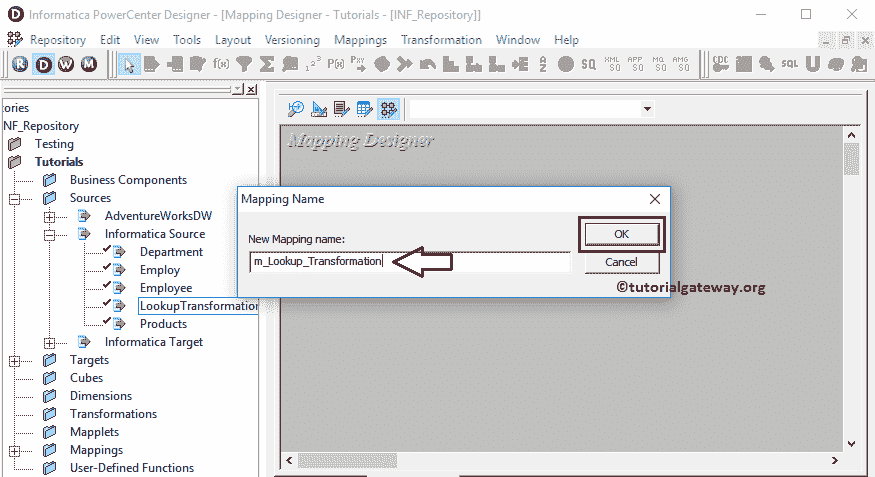
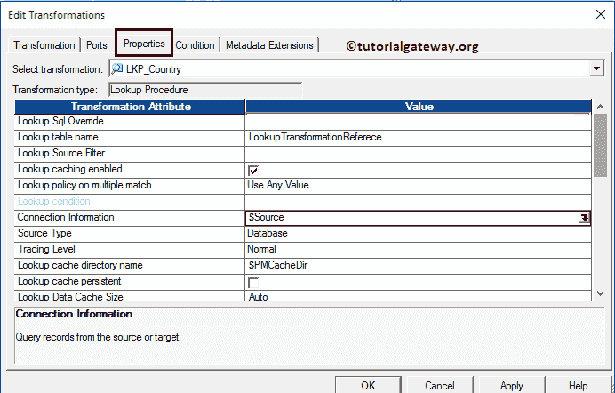
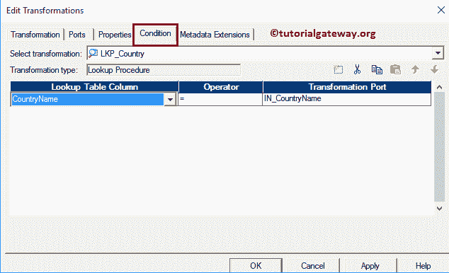

# Informatica中的查找转换

> 原文：<https://www.tutorialgateway.org/lookup-transformation-in-informatica/>

Informatica 中的查找转换对于查找平面文件、关系表和视图中的数据非常有用。在本文中，我们将通过一个示例向您展示如何使用 Informatica 中的查找转换对 SQL server 数据库表执行查找操作。

在我们开始设计映射之前，让我们看看我们将要在其上执行 Informatica 查找操作的源表和查找表

我们的查找表将是[信息来源]数据库中的[查找转换参考]表，即:

我们的源表将是[信息来源]数据库中的[LookupTransformationSource]表，即:

在这个信息查找转换示例中，我们的任务是将源表中的国家名称与查找表进行比较

*   如果它们匹配，我们将把它们和查找表中的国家代码一起载入[查找匹配行]目标表
*   如果它们不匹配，我们会将它们加载到[查找不匹配的行]目标表中

提示:您可以通过对不匹配的记录执行一些操作来扩展此功能，并使用[联合转换](https://www.tutorialgateway.org/union-transformation-in-informatica/)将它们存储在匹配的表中。

## 信息示例中的查找转换

在我们开始在 Informatica 中配置查找转换之前，首先连接到 [Informatica](https://www.tutorialgateway.org/informatica/) 存储库服务。为了连接到存储库服务，我们必须提供[信息管理控制台](https://www.tutorialgateway.org/informatica-admin-console/)凭证，因此，请提供适当的用户名和密码，并点击连接按钮，如下所示。

提示:这里你必须提供你在[安装 Informatica](https://www.tutorialgateway.org/how-to-install-informatica/) 服务器时指定的管理员用户名和密码。

### 步骤 1:创建信息查找转换源定义

连接成功后，请导航至[源分析器](https://www.tutorialgateway.org/informatica-source-analyzer/)并定义您的源。

在这个 Informatica 查找转换示例中，我们使用来自 [SQL server](https://www.tutorialgateway.org/sql/) 数据库的[LookupTransformationSource]表作为我们的源定义。请参考【信息】中的[数据库源](https://www.tutorialgateway.org/database-source-in-informatica/)了解创建源定义

的步骤

### 步骤 2:为信息查找转换创建目标定义

请导航至[目标设计器](https://www.tutorialgateway.org/target-designer-in-informatica/)并定义目标。在这个 Informatica 查找转换示例中，我们使用已经创建的 SQL 表([查找匹配行]和[查找不匹配行])作为目标定义。请参考[使用源定义](https://www.tutorialgateway.org/create-informatica-target-table-using-source-definition/)创建信息目标表，了解创建目标定义

所涉及的步骤

### 步骤 3:创建信息查找转换映射

要为信息查找转换创建新映射，请导航到菜单栏中的映射菜单，然后选择创建..选项。这将打开映射名称窗口，如下所示。

在这里，您必须为此映射(m_Lookup_Transformation)编写一个唯一的名称，然后单击“确定”按钮。

提示:请参考[信息制图](https://www.tutorialgateway.org/informatica-mapping/)文章，了解创建制图

的步骤

接下来，将[LookupTransformationSource]源定义从“源”文件夹拖放到映射设计器中。拖动源后，PowerCenter 设计器将自动创建名为源限定符的默认转换。

#### 步骤 3(a):在信息中创建查找转换

要在信息中创建查找转换，请导航到菜单栏中的转换菜单，并选择创建..选项。

一旦你点击了创建..选项，将打开创建转换窗口，如下所示。请从下拉列表中选择信息查找转换，并为此转换指定唯一名称(LKP _ 国家)，然后单击创建按钮

一旦你点击了创建..按钮，将打开如下所示的“选择查找转换的查找表”窗口。这里，我们想从 SQL 数据库导入一个关系表，所以，点击导入并选择从关系表..选择权

提示:如果您的查找表存在于“源”或“目标”中，请选择它。

一旦选择了“从关系表”..选项，将打开“导入表”窗口。这里，我们选择名为[LookupTransformationSource]的查找表。请参考[从关系数据库](https://www.tutorialgateway.org/database-source-in-informatica/)导入数据一文，了解其中涉及的步骤。

单击创建按钮后，信息查找转换将被添加到映射设计器中。双击它以配置其设置。

“端口”选项卡中的可用选项列表。我们在这个信息查找转换中添加了一个新的输入端口。

在属性部分，我们更改了连接信息，并为其分配了$Source 变量。

在条件选项卡中，我们添加了一个条件 CountryName = IN_CountryName。下面的条件表示它将检查查找输入源(即国家/地区名称)是否等于现有的国家/地区名称，如果条件为真，则它将返回相应的国家/地区代码。

配置完 Informatica 查找转换后，请将国家/地区名称字段从源限定符拖到查找表中的 IN_CountryName 字段

#### 步骤 3(b):在 Informatica 中创建路由转换

请参考[路由转换](https://www.tutorialgateway.org/router-transformation-in-informatica/)文章，了解创建它所涉及的步骤。创建后，请通过拖动必填字段将源限定符与路由转换连接起来。

从下面的 Informatica 查找转换截图中，您可以看到我们正在从查找表中添加来源限定符和 Cid、国家/地区名称中的所有列。

双击路由转换添加组。从下面的截图中，您可以看到我们为不匹配的记录创建了一个组和一个默认组。

让我们通过单击箭头按钮为第一组(不匹配)提供表达式或条件，如下所示。这将打开表达式编辑器来编写自定义表达式。

在这里，我们希望查找表中不存在国家/地区名称的记录。因此，我们正在编写如下所示的表达式。这意味着所有空值将被放入非匹配组，非空值将传递到默认组。

配置完属性后，单击确定关闭转换窗口。

接下来，将目标定义([查找匹配行]和[查找不匹配行])从“目标”文件夹拖放到映射设计器中，如下所示。

接下来，请将 Informatica 查找转换(输出组 1)与[查找不匹配的行]表和默认组与路由[查找匹配的行]连接起来。

提示:您可以使用自动链接..链接这些字段的选项。

在我们关闭映射之前，让我们通过转到映射菜单栏并选择验证选项来验证映射。

### 步骤 4:为信息查找转换创建工作流

一旦我们为信息查找转换创建完映射，我们就必须为它创建工作流。PowerCenter 工作流管理器提供了两种创建工作流的方法。

*   [手动创建工作流](https://www.tutorialgateway.org/informatica-workflow/)
*   [使用向导创建工作流](https://www.tutorialgateway.org/informatica-workflow-using-wizard/)

在这个信息查找转换示例中，我们将手动创建工作流。一旦我们创建了工作流，下一步就是为我们的映射创建一个会话任务。

#### 步骤 4(a):为Informatica中的查找转换创建会话

Informatica 中有两种类型的会话:

*   不可重用的会话任务:请参考 Informatica 文章中的[会话](https://www.tutorialgateway.org/session-in-informatica/)
*   可重用会话任务:请参考 Informatica 文章中的[可重用会话](https://www.tutorialgateway.org/reusable-session-in-informatica/)

对于这个信息查找转换示例，我们将创建不可重用的会话。请导航至任务菜单并选择创建选项以打开创建任务窗口。在这里，您必须选择会话作为任务类型(默认)，并为会话输入唯一的名称(查找转换)。

单击“创建”按钮后，将打开一个名为“映射”的新窗口。在这里，您必须选择要与此会话关联的映射。

在这个 Informatica 查找转换示例中，我们选择了之前(在步骤 3 中)创建的映射(m_Lookup_Transformation)。

双击会话任务进行配置。虽然我们必须配置源、目标和一些常见属性，但我们不打算在这里解释它们。我们强烈建议访问 Informatica 文章中的[会话来了解属性。](https://www.tutorialgateway.org/session-in-informatica/)

从下面的截图中，您可以观察到 Informatica 工作流中的查找转换是有效的。现在，让我们通过导航到“工作流”菜单并选择“启动工作流”选项来启动工作流。

选择“启动工作流”选项后，将打开 Informatica PowerCenter 工作流监视器来监视工作流。我们的信息查找转换工作流执行起来没有任何错误。

让我们打开 [SQL Server](https://www.tutorialgateway.org/sql/) 管理工作室，检查我们是否成功存储了不匹配的记录。

让我们打开 [SQL Server](https://www.tutorialgateway.org/sql/) 管理工作室，检查是否使用 Informatica 中的查找转换成功存储了匹配的记录。

