# Informatica中的不连通查找转换

> 原文：<https://www.tutorialgateway.org/unconnected-lookup-transformation-in-informatica/>

Informatica 中的未连接查找转换只不过是一个带参数的编程函数，为了调用这种未连接查找，我们必须使用表达式转换。

在本文中，我们将通过一个例子向您展示如何在 Informatica 中执行未连接的查找转换。在开始设计映射之前，让我们看一下将要对其执行查找操作的源表和查找表

【信息来源】数据库内的员工表为:

我们的查找表将是【信息来源】数据库中的部门表:

在这个 Informatica 未连接查找转换示例中，我们的任务是将源(员工表)表中的[名字]和[姓氏]加载到目标表中，以及从部门表中加载[部门名称]。我们也可以使用[全外连接](https://www.tutorialgateway.org/full-outer-join-in-informatica/)来实现同样的目的，但是我们将向您展示另一种选择，即 Informatica 中的非连接查找转换。

## 信息示例中的非连接查找转换

在我们开始在 Informatica 中配置未连接的查找转换之前，首先连接到 [Informatica](https://www.tutorialgateway.org/informatica/) 存储库服务。

为了连接存储库服务，我们必须提供[信息管理控制台](https://www.tutorialgateway.org/informatica-admin-console/)凭证。因此，请提供适当的用户名和密码，并点击连接按钮，如下所示。

提示:这里你必须提供你在[安装 Informatica](https://www.tutorialgateway.org/how-to-install-informatica/) 服务器时指定的管理员用户名和密码。

### 步骤 1:在 Informatica 中为未连接的查找转换创建源定义

连接成功后，请导航至[源分析器](https://www.tutorialgateway.org/informatica-source-analyzer/)并定义您的源。在这个 Informatica 中的未连接查找示例中，我们使用来自 SQL Server 数据库的 Employee 表作为我们的源定义。

请参考 Informatica 中的[数据库源，了解创建源定义](https://www.tutorialgateway.org/database-source-in-informatica/)

[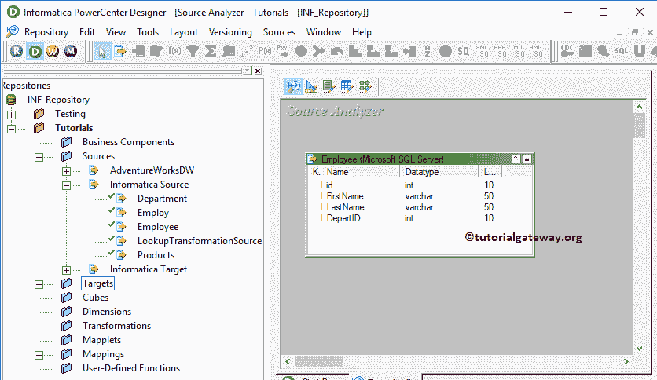](https://www.tutorialgateway.org/database-source-in-informatica/)

[的步骤](https://www.tutorialgateway.org/database-source-in-informatica/)

### 步骤 2:为信息未连接查找转换创建目标定义

请导航至[目标设计器](https://www.tutorialgateway.org/target-designer-in-informatica/)并定义目标。在这个例子中，我们使用已经创建的 SQL 表(未连接查找)作为我们的目标定义。请参考[使用源定义](https://www.tutorialgateway.org/create-informatica-target-table-using-source-definition/)创建目标表，了解创建目标定义

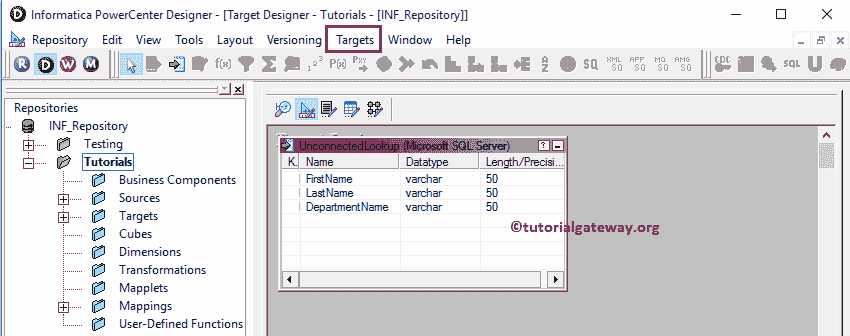

的步骤

### 步骤 3:创建信息不相连的查找转换映射

要创建新映射，请导航至菜单栏中的映射菜单，并选择创建..选项。这将打开映射名称窗口，如下所示。在这里，您必须为此映射写一个唯一的名称(m_Unconnected_Lookup)，然后单击“确定”按钮。

提示:请参考[Informatica 映射](https://www.tutorialgateway.org/informatica-mapping/)文章，了解创建映射所涉及的步骤。

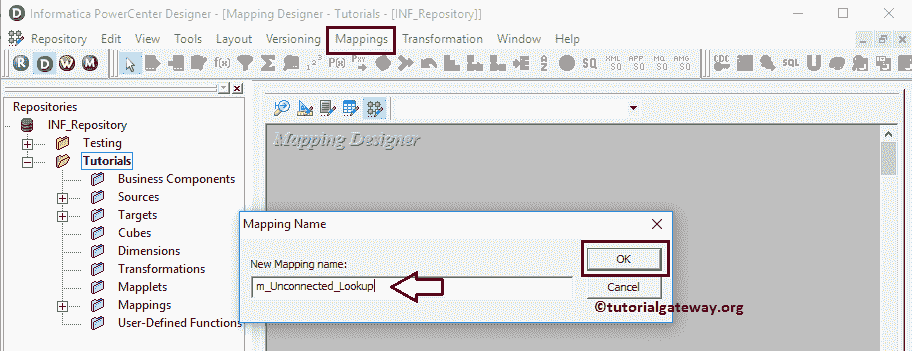

接下来，将[员工]源定义从“源”文件夹拖放到映射设计器中。拖动源后，PowerCenter 设计器将自动创建名为源限定符的默认转换。

#### 步骤 3(a):在信息中创建查找转换

要在信息中创建查找转换，请导航到菜单栏中的转换菜单，并选择创建..选项，如下所示。

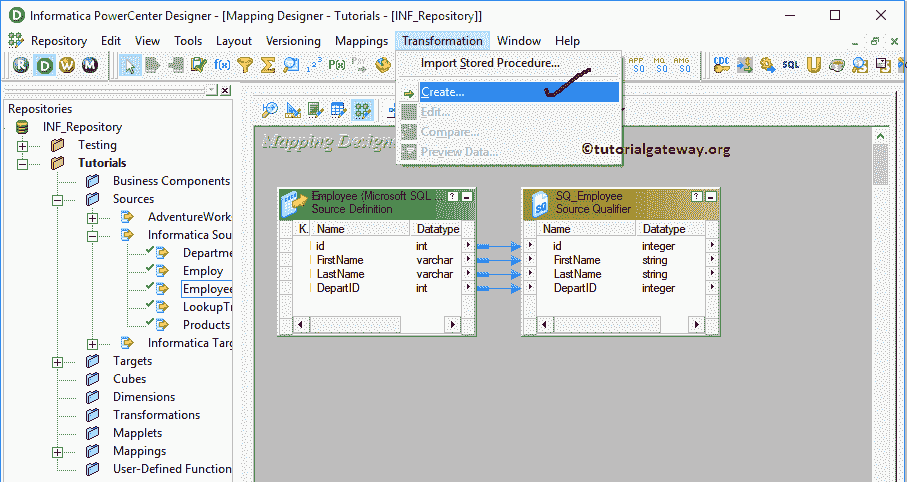

一旦你点击了创建..选项，将打开创建转换窗口，如下所示。请从下拉列表中选择查找转换，并为此转换指定唯一的名称(LKP _ 部门)，然后单击创建按钮

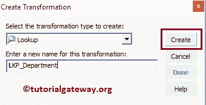

一旦你点击了创建..按钮，将打开如下所示的“选择查找转换的查找表”窗口。这里，我们选择的是【来源】

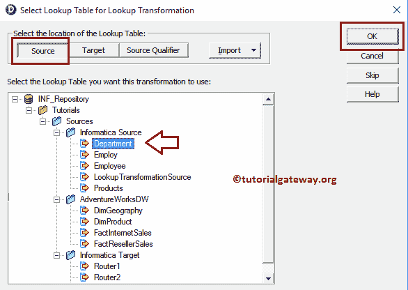

中的部门表

单击“创建”按钮后，查找转换将被添加到映射设计器中。因为我们正在解释未连接的查找转换，所以没有必要将转换与源限定符连接起来。

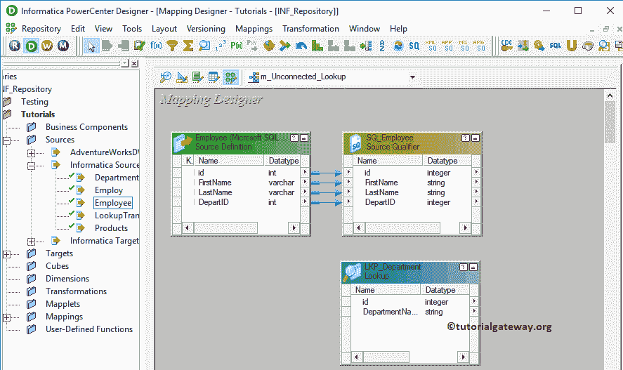

Informatica 未连接查找转换端口选项卡中的可用选项列表。在这里，我们添加了一个新的输入端口(IN_DeptID)，并从输出端口移除了 ID。

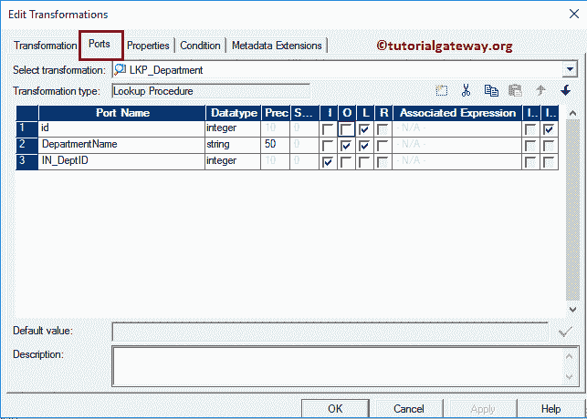

在条件选项卡中，我们添加了一个条件 id = IN_DeptID。下面的条件指出，每当调用此查找转换时，它们都必须提供整数数据类型的参数值。

一旦他们传递该值，查找转换将检查该值是否等于 id，如果条件为真，则它将返回相应的部门名称，否则将返回空值。

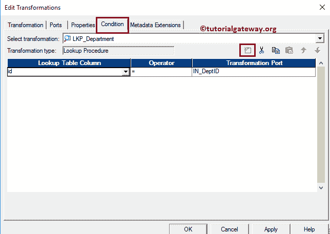

#### 步骤 3(b):创建表达式转换

请参考 Informatica 文章中的[表达式转换，了解创建它所涉及的步骤。创建后，请通过拖动必需字段将源限定符与表达式转换连接起来。](https://www.tutorialgateway.org/expression-transformation-in-informatica/)

我们正在表达式转换中添加[名字]、[姓氏]和[部门]。双击表达式转换来编写自定义表达式。

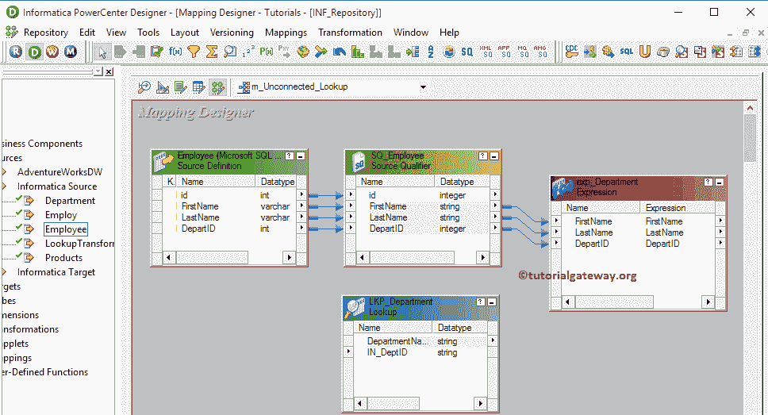

从下面的截图中，您可以看到我们创建了名为部门名称的新输出列。我们将使用此列存储从 Informatica 未连接查找转换中获得的部门名称。

点击映射名称旁边的箭头按钮，如下图所示，编写自定义表达式

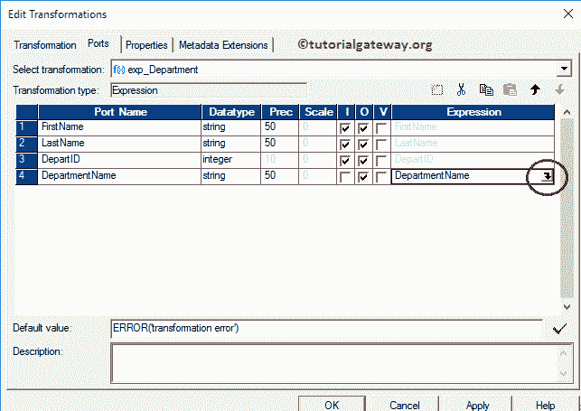

这将打开表达式编辑器来编写自定义表达式。在这里，我们希望从查找转换中获得部门名称。

为此，请转到“函数”选项卡并搜索“查找”文件夹，然后选择我们之前创建的查找。众所周知，我们在查找转换中指定了条件。这意味着我们必须提供整型的参数值。

提示:查找转换将检查条件 id = DepartID，如果条件为真，则返回相应的部门名称，否则返回空值。

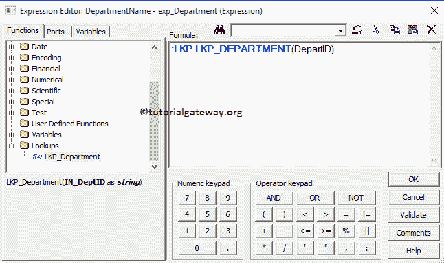

完成表达式编写后，单击“确定”关闭转换窗口。接下来，将目标定义(未连接的查找)从“目标”文件夹拖放到映射设计器，并将表达式转换与目标定义连接起来。请使用自动链接..连接它们的选项。

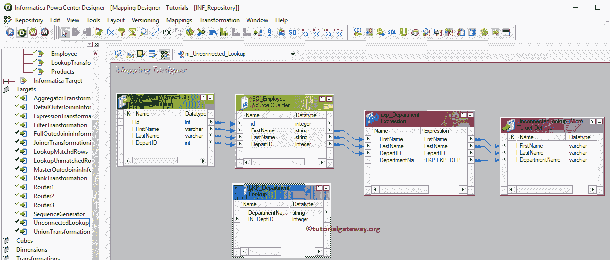

在我们关闭映射之前，让我们通过转到映射菜单栏并选择验证选项来验证 Informatica 未连接的查找映射。

### 步骤 4:在 Informatica 中为未连接的查找创建工作流

一旦我们完成创建映射，我们就必须为它创建工作流。PowerCenter 工作流管理器提供了两种创建工作流的方法。

*   [手动创建Informatica 工作流](https://www.tutorialgateway.org/informatica-workflow/)
*   [使用向导创建Informatica 工作流](https://www.tutorialgateway.org/informatica-workflow-using-wizard/)

在此 Informatica 未连接查找转换示例中，我们将手动创建工作流。一旦我们创建了工作流，下一步就是为我们的映射创建一个会话任务。

#### 步骤 4(a):在 Informatica 中为未连接的查找转换创建会话

Informatica 中有两种类型的会话:

*   [信息中不可重用的会话](https://www.tutorialgateway.org/session-in-informatica/)
*   [Informatica中的可重用会话](https://www.tutorialgateway.org/reusable-session-in-informatica/)

对于 Informatica 中的这个未连接查找示例，我们将创建不可重用的会话。请导航至任务菜单并选择创建选项以打开创建任务窗口。在这里，您必须选择会话作为任务类型(默认)，并为会话输入唯一的名称(未连接查找)。

单击“创建”按钮后，将打开一个名为“映射”的新窗口。在这里，您必须选择要与此会话关联的映射。在这个 Informatica 未连接查找转换中，我们选择了之前创建的映射(m _ Unconnected _ Lookup)(在步骤 3 中)。

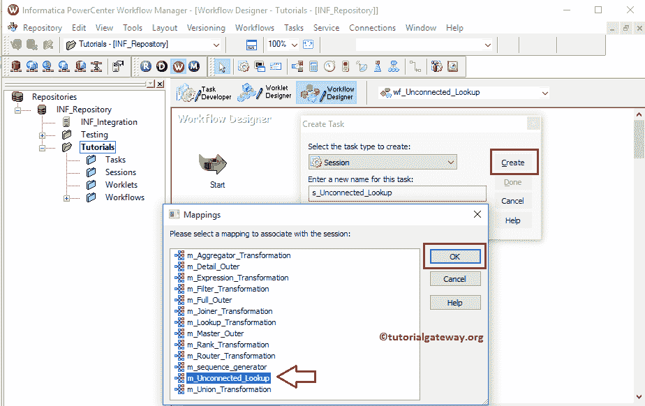

双击会话任务进行配置。虽然我们必须配置源、目标和一些常见属性，但我们不打算在这里解释它们。我们强烈建议访问 Informatica 文章中的[会话，了解属性。](https://www.tutorialgateway.org/session-in-informatica/)

informatica 工作流中的未连接查找转换是有效的。现在，让我们通过导航到“工作流”菜单并选择“启动工作流”选项来启动工作流。

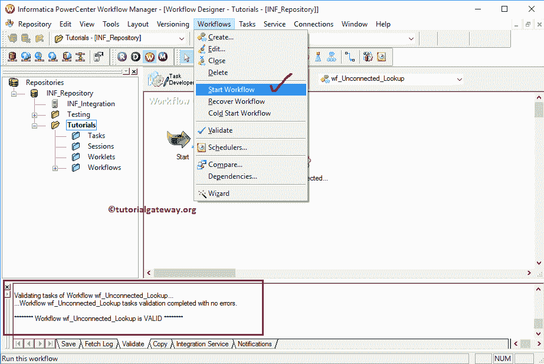

选择“启动工作流”选项后，将打开 Informatica PowerCenter 工作流监视器来监视工作流。我们的 Informatica 未连接查找工作流执行时没有任何错误。

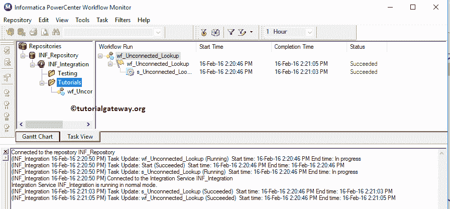

让我们打开 [SQL Server](https://www.tutorialgateway.org/sql/) 管理工作室，检查我们是否使用 informatica 中的未连接查找转换成功存储了来自源和查找表的存储信息。

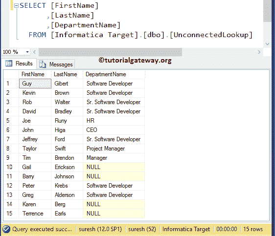