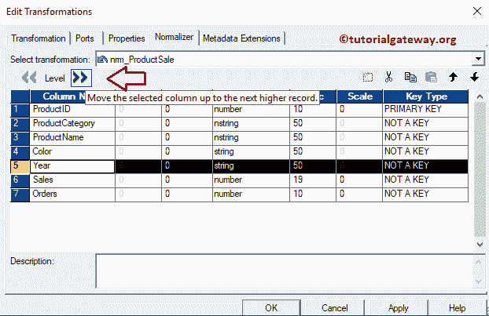
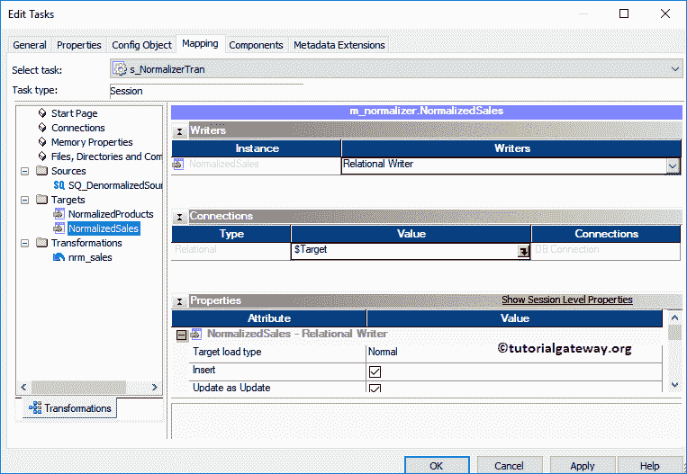

# 信息论中的归一化变换

> 原文：<https://www.tutorialgateway.org/normalizer-transformation-in-informatica/>

信息论中的规格化变换是一种活跃的连通变换。这个 Informatica 规格化器转换用于规格化非规格化数据。或者你可以简单地说，将一个表中的单个划分为多行。

对于这个 Informatica 规格化器转换示例，我们将使用下面的 show data(反规格化源表)

而目的地表是:

## 信息示例中的规格化变换

在我们开始配置 Informatica 规范器转换之前，首先让我连接 [Informatica 存储库](https://www.tutorialgateway.org/informatica/)服务。为此，请输入您在[安装 Informatica](https://www.tutorialgateway.org/how-to-install-informatica/) 服务器时指定的[管理控制台](https://www.tutorialgateway.org/informatica-admin-console/)用户名和密码。

### 创建规格化器转换源定义

连接成功后，请导航至[源分析器](https://www.tutorialgateway.org/informatica-source-analyzer/)并定义您的源。在本例中，我们使用来自 SQL Server 数据库的非规范化源表作为我们的源定义。请参考[数据库来源于 Informatica](https://www.tutorialgateway.org/database-source-in-informatica/) 文章

### 创建信息标准化器转换目标定义

请导航至[目标设计器](https://www.tutorialgateway.org/target-designer-in-informatica/)并定义目标。在这个 Informatica 规范化器转换的例子中，我们使用已经创建的 SQL 表(规范化的检察官和销售)作为我们的目标定义。请参考[目标表使用来源定义](https://www.tutorialgateway.org/create-informatica-target-table-using-source-definition/)了解目标定义

### 创建规格化器转换映射

要为信息规范器转换创建新映射，请导航到菜单栏中的映射菜单，并选择创建..选项。

它打开[映射](https://www.tutorialgateway.org/informatica-mapping/)名称窗口，为这个映射写一个唯一的名称(m_normalizer)。接下来，单击确定按钮。

将反规范化数据源定义从“数据源”文件夹拖放到映射设计器中。拖动源后，动力中心设计师会自动为您创建[源限定符](https://www.tutorialgateway.org/source-qualifier-transformation-in-informatica/)。

接下来，让我在 Informatica 中创建一个规格化器转换。为此，请导航到转换菜单并选择创建..选项

它会打开“创建转换”窗口。请选择规格化器转换并提供唯一名称(nrm _ ProductSale)，然后点击【创建】按钮

现在，您可以在您的映射区域中看到 Informatica 规格化器转换。请记住，您不能简单地将字段从源限定符拖放到规格化器。因此，我们必须明确地在其中创建字段。

双击信息规范器转换来编辑转换。接下来，转到“规格化器”选项卡，并使用“新字段”选项添加新字段。

从下面的截图中，您可以看到我们使用“新建端口”按钮添加了 7 个新列。请记住，数据类型和精度都应该与输入和输出字段匹配。

接下来，我们选择年份列，并单击级别旁边的右移按钮。

它会创建一个“级别”字段，并将“年份”列移到“级别 2”。

同样，我们将“销售”和“订单”列添加到第 2 级。在我们的源表中，年份、订单和销售重复了 4 次(2014 年、2015 年、2016 年和 2017 年)。这就是为什么我们给 Occurs 分配了 4。如果不是这样，请使用适当的号码。

现在，您可以看到由 Informatica 中的规格化器转换自动创建的输入和输出端口的数量。

您可以看到信息规范器转换将所有必需的文件名。现在我们必须将输入和输出连接到这个。

首先，我们将源限定符与信息规范器转换

连接起来

接下来，将目标定义从目标文件夹拖放到映射设计器

使用自动链接将规格化器转换的输出字段连接到目标定义..选项。在我们关闭 Informatica 规格化器转换映射之前，让我们通过转到映射并选择验证选项来验证映射。

### 在信息工作流中创建规范化器转换

创建完映射后，我们必须为它创建一个工作流。电源中心工作流管理器提供了两种创建工作流的方法。

*   [手动创建工作流](https://www.tutorialgateway.org/informatica-workflow/)
*   [使用向导创建工作流](https://www.tutorialgateway.org/informatica-workflow-using-wizard/)

在这个 Informatica Normalizer 转换示例中，我们将手动创建工作流。为此，请导航至工作流菜单并选择创建选项。

它打开“创建工作流”窗口，提供唯一的名称(wf_NormalizerTrans)并保留默认设置。

一旦我们为 Informatica Normalizer 转换创建了工作流，我们的下一步就是为我们的映射创建一个会话任务。

#### 创建规格化器转换会话

有两种类型的会话:

*   [信息中不可重用的会话](https://www.tutorialgateway.org/session-in-informatica/)
*   [信息中的可重用会话](https://www.tutorialgateway.org/reusable-session-in-informatica/)

对于这个 Informatica Normalizer 转换示例，我们将创建一个不可重用的会话。要创建，请导航至任务菜单并选择创建选项。

请为此信息规范器转换会话提供唯一的名称。在这里，我们将其命名为 s_NormalizerTran。单击“创建”按钮后，将打开一个名为“映射”的新窗口。这里，我们选择了 m_normalizer

请链接开始任务和会话任务。

双击会话任务将打开编辑任务窗口。在属性选项卡中

$Source 连接值:该属性将关系源信息存储在$Source 变量中。因此，单击我们在下面标记的箭头，并选择 SQL 教程作为源信息。

$Target 连接值:该属性将关系目标信息存储在$Target 变量中。因此，单击我们在下面标记的箭头，并选择 SQL 测试目标作为目标信息。

在映射选项卡中，我们必须配置源、目标连接。首先，让我们通过单击“源”文件夹中的 SQ_DenormalizedSource 源来配置源连接。

在连接中，点击关系类型旁边的箭头按钮，使用我们之前创建的连接变量，即:$Source

现在，我们必须配置目标连接。因此，单击目标文件夹中的标准化产品。

在连接中，点击关系类型旁边的箭头按钮，并使用连接变量$Target

对正常化销售目标

做同样的事情

接下来，导航到工作流菜单并选择验证选项以验证工作流。

现在，让我开始信息规范转换工作流。为此，请导航到“工作流”菜单并选择“启动工作流”选项。

选择“启动工作流”选项后，将打开 Informatica PowerCenter 工作流监视器来监视工作流。

让我们打开 [SQL Server](https://www.tutorialgateway.org/sql/) 管理工作室，检查我们是否成功地对数据进行了规范化。一、看产品表:

让我给你看看销售情况。

