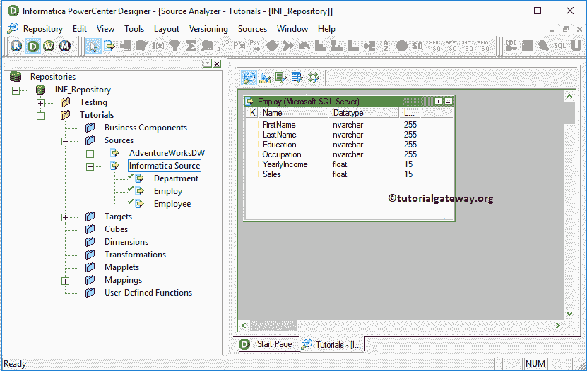

# Informatica中的排名转换

> 原文：<https://www.tutorialgateway.org/rank-transformation-in-informatica/>

Informatica 中的 Rank 转换类似于 SQL RANK 函数，用于选择数据的顶秩或底秩。在实时中，这种转换将非常有帮助。

例如，您可以使用此 Informatica 排名转换来选择销售额最高和最低的前 10 个地区或业绩最差的前 20 个产品或地区等。

对于这个 Informatica 排名转换的例子，我们将使用下面显示的数据


## 在信息中配置排名转换

在我们开始配置 Informatica 中的排名转换之前，首先连接到 Informatica 存储库服务。

为了连接 [Informatica](https://www.tutorialgateway.org/informatica/) 存储库服务，我们必须提供您在[安装 Informatica](https://www.tutorialgateway.org/how-to-install-informatica/) 服务器时指定的[管理控制台](https://www.tutorialgateway.org/informatica-admin-console/)用户名和密码。接下来，点击连接按钮。


### 在Informatica 源定义中创建排名转换

连接成功后，请导航至[源分析器](https://www.tutorialgateway.org/informatica-source-analyzer/)并定义您的源。在这个 Informatica 排名转换示例中，我们使用来自 SQL Server 数据库的[Employ]表作为我们的源定义。请参考【信息】中的[数据库源](https://www.tutorialgateway.org/database-source-in-informatica/)了解创建源定义



的步骤

### 创建信息排名转换目标定义

请导航至[目标设计器](https://www.tutorialgateway.org/target-designer-in-informatica/)并定义目标。在这个例子中，我们使用已经创建的 SQL 表作为我们的目标定义。请参考[使用源定义](https://www.tutorialgateway.org/create-informatica-target-table-using-source-definition/)创建目标表，了解创建目标定义


### 在信息映射中创建排名转换

要为Informatica中的排名转换创建新的映射，请导航至菜单栏中的[映射](https://www.tutorialgateway.org/informatica-mapping/)菜单，并选择创建..选项。这将打开映射名称窗口，如下所示。在这里，您必须为此映射(m_Rank_Transformation)编写一个唯一的名称，然后单击“确定”按钮。


接下来，将[应用]源定义从“源”文件夹拖放到映射设计器。拖动源后，PowerCenter 设计器将自动创建名为源限定符的默认转换。

#### 在信息中创建排名转换

要在信息中创建排名转换，请导航到转换菜单并选择创建..选项，如下所示。


一旦你点击了创建..选项，将打开创建转换窗口，如下所示。请从下拉列表中选择信息排名转换，并为此转换指定唯一名称(rnk_Income)，然后单击创建按钮


单击创建按钮后，Informatica 排名转换将被添加到映射设计器中。

要对数据进行排名，需要一些数据。因此，我们必须通过拖动必需的字段来连接源定义和转换。


从上面的截图中，您可以观察到名为 RANKINDEX 的新项目，这是 Informatica 排名转换创建的默认端口。这个输出端口将保存排名号，所以我们必须将这个输出端口分配给目标表的排名列。

双击 Informatica Rank 转换以提供排名因子(基于您想要排名的列)。从下面的截图中，您可以看到“转换”选项卡中的可用属性列表:

*   选择转换:默认情况下，它将选择您单击的转换。
*   重命名:此按钮将帮助您重命名为更有意义的名称。
*   使可重用:如果您选中此选项，则此转换将成为可重用的转换。
*   描述:请提供有效的描述。


下面的截图将显示“信息排名转换端口”选项卡中的可用选项列表:

*   端口名:可用列名列表。单击“新建列”按钮可以添加新列，单击“剪式”按钮可以删除不需要的列。
*   I:在此部分下勾选标记的列是输入列。
*   o:在此部分下勾选标记的列是输出列。如果取消选中任何列，则该列将无法加载到目标表中。
*   请勾选您想要用作排名因子的列(基于您想要排名的列)。例如，如果您想按年收入对数据进行排名，那么您必须勾选它，如下所示。


下面的截图显示了信息排名转换属性选项卡中的可用选项列表。

*   缓存目录:集成服务将在此位置存储缓存文件。
*   顶部/底部:这将为用户提供两个选项，即顶部和底部。如果您想从上到下(从 Z 到 A)排列数据，请使用顶部选项，或者，对于从下到上(从 A 到 Z)，请使用底部选项。
*   排名数:请输入您想要排名的行数。默认情况下，该值为 1，这意味着 Informatica 排名转换将只选择 1 条记录。
*   区分大小写的字符串比较:如果选中此选项，则在对数据进行排序时，转换将执行区分大小写的字符串比较

在本例中，我们希望根据年收入(按降序)对“雇用”表中的每条记录进行排名，这就是为什么我们选择“顶部/底部”属性值作为“顶部”以及“排名数量”属性值作为“20”(我们的最大记录为 14)


配置完属性后，单击确定关闭转换窗口。

接下来，将目标定义(排名转换)从目标文件夹拖放到映射设计器中，并将转换与目标定义连接起来。请使用自动链接..连接它们的选项。


在我们关闭映射之前，让我们通过转到映射菜单栏并选择验证选项来验证映射。

### 创建信息化中的排名转换工作流

一旦我们完成创建映射，我们就必须为它创建工作流。PowerCenter 工作流管理器提供了两种创建工作流的方法。

*   [手动创建Informatica 工作流](https://www.tutorialgateway.org/informatica-workflow/)
*   [使用向导创建Informatica 工作流](https://www.tutorialgateway.org/informatica-workflow-using-wizard/)

在这个信息排名转换示例中，我们将手动创建工作流。要创建新的Informatica 工作流，请导航到工作流菜单并选择创建选项。这将打开“创建工作流”窗口。请提供唯一的名称(wf_Rank_Transformation)并保留默认设置。


一旦我们创建了[工作流](https://www.tutorialgateway.org/informatica-workflow/)，我们的下一步就是为我们的 Informatica 排名转换映射创建一个会话任务。

#### 创建信息排名转换会话

Informatica 中有两种类型的会话:

*   [Informatica中的非结果会话](https://www.tutorialgateway.org/session-in-informatica/)
*   [Informatica中的可重用会话](https://www.tutorialgateway.org/reusable-session-in-informatica/)

对于这个信息排名转换的例子，我们将创建不可重用的会话。请导航至任务菜单并选择创建选项以打开创建任务窗口。在这里，您必须选择会话作为任务类型(默认)，并为会话输入唯一的名称(排名转换)。

单击“创建”按钮后，将打开一个名为“映射”的新窗口。在这里，您必须选择要与此会话关联的映射。

从下面的截图中，您可以看到我们正在选择之前创建的映射(m_Rank_Transformation)(在步骤 3 中)。


双击会话任务进行配置。虽然我们必须配置源、目标和一些常见属性，但我们只解释了几个属性。我们强烈建议访问 Informatica 文章中的[会话，了解剩余属性。](https://www.tutorialgateway.org/session-in-informatica/)

从下面的截图中，您可以看到我们将$目标变量分配给了连接值，我们将目标加载类型选项从批量模式更改为正常模式，并选中截断目标表选项以从目标表中截断现有数据。


从下面的截图中，您可以观察到 Informatica 工作流中的排名转换是有效的。现在，让我们通过导航到“工作流”菜单并选择“启动工作流”选项来启动工作流。


选择“启动工作流”选项后，将打开 Informatica PowerCenter 工作流监视器来监视工作流。从下面的截图中，您可以观察到我们的 Informatica 排名转换工作流没有任何错误地执行。


让我们打开 [SQL Server](https://www.tutorialgateway.org/sql/) 管理工作室，检查我们是否使用 Informatica 排名转换成功地使用年收入对记录进行了排名。


我们可以使用下面的 SQL 查询实现上面的输出:

```
SELECT [FirstName]
      ,[LastName]
      ,[Education]
      ,[Occupation]
      ,[YearlyIncome]
      ,[Sales]
      ,RANK() OVER (
                     ORDER BY [YearlyIncome] DESC
          	   ) AS RANK
  FROM [Customers]
```

让我们将顶部/底部属性更改为底部，并刷新映射。这意味着 Informatica 排名转换工作流将根据年收入按升序对雇佣表进行排序(0 表示 1，1 表示 2。)


让我们打开 [SQL Server](https://www.tutorialgateway.org/sql/) 来检查我们是否成功地使用年收入(按升序)对记录进行了排名。请参考 [SQL Server 函数](https://www.tutorialgateway.org/ranking-functions-in-sql-server/)一文。

