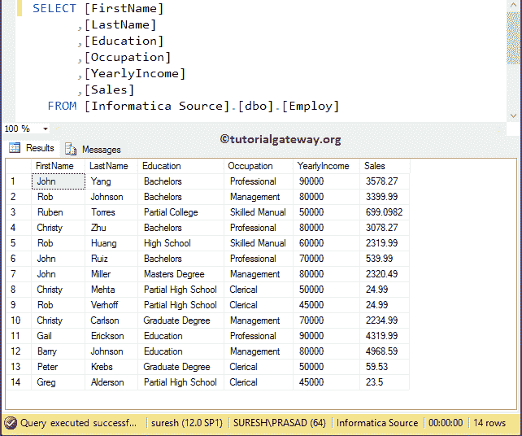
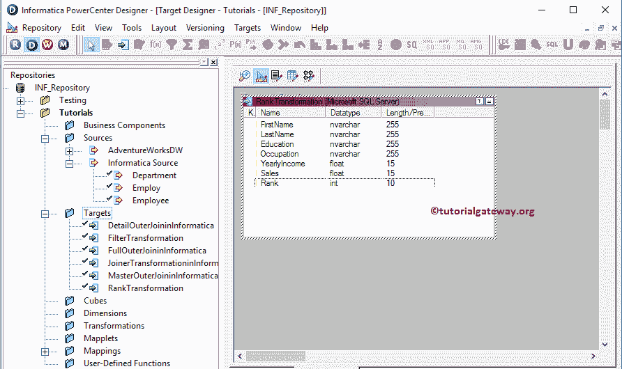
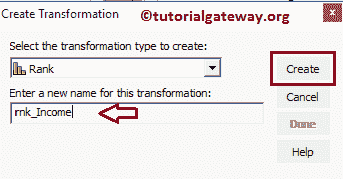
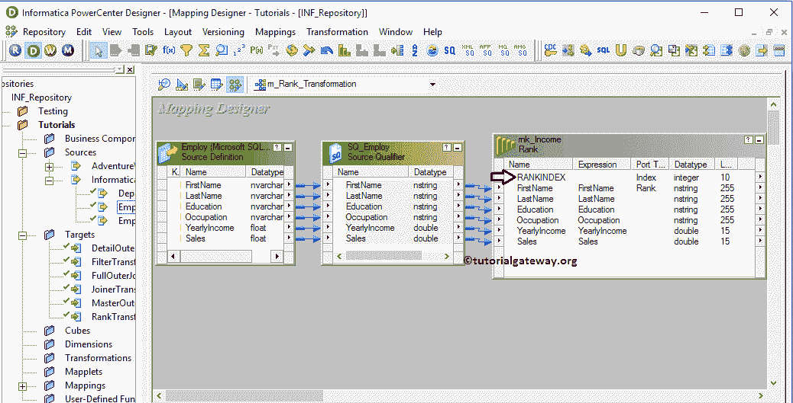
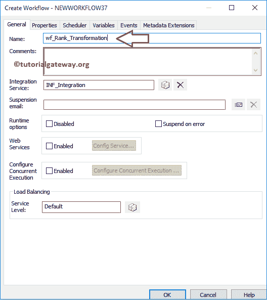

# 分组依据的信息等级转换

> 原文：<https://www.tutorialgateway.org/informatica-rank-transformation-with-group-by/>

Informatica Rank 转换类似于 SQL RANK 函数，用于选择数据的顶部或底部排名。在本文中，我们将通过一个示例来解释使用 Group By 配置 Informatica 等级转换所涉及的步骤。

对于这个例子，我们将使用下面的显示数据。



## 使用分组依据配置信息等级转换

在我们开始配置 Informatica 等级转换之前，首先连接到 [Informatica](https://www.tutorialgateway.org/informatica/) 存储库服务。为了连接存储库服务，我们必须提供[信息管理控制台](https://www.tutorialgateway.org/informatica-admin-console/)凭证。因此，请提供您在[安装 Informatica](https://www.tutorialgateway.org/how-to-install-informatica/) 服务器时指定的相应用户名和密码，并点击如下所示的连接按钮。


提示:请参考 Informatica 文章中的[秩转换，了解无分组的转换](https://www.tutorialgateway.org/rank-transformation-in-informatica/)

### 步骤 1:创建源定义

连接成功后，请导航至[源分析器](https://www.tutorialgateway.org/informatica-source-analyzer/)并定义您的源。在本例中，我们使用来自 SQL Server 数据库的[Employ]表作为我们的源定义。请参考【信息】中的[数据库源](https://www.tutorialgateway.org/database-source-in-informatica/)了解创建源定义


的步骤

### 步骤 2:创建目标定义

请导航至[目标设计器](https://www.tutorialgateway.org/target-designer-in-informatica/)并定义目标。在这个例子中，我们使用已经创建的 SQL 表(等级转换)作为我们的目标定义。请参考[使用源定义](https://www.tutorialgateway.org/create-informatica-target-table-using-source-definition/)创建目标表，了解创建目标定义所涉及的步骤



### 步骤 3:创建映射

要创建新映射，请导航至菜单栏中的映射菜单，并选择创建..选项。这将打开映射名称窗口，如下所示。在这里，您必须为此映射(m_Rank_Transformation)编写一个唯一的名称，然后单击“确定”按钮。

提示:请参考[信息映射](https://www.tutorialgateway.org/informatica-mapping/)文章，了解创建映射所涉及的步骤。


接下来，将[应用]源定义从“源”文件夹拖放到映射设计器。拖动源后，PowerCenter 设计器将自动创建名为源限定符的默认转换。

#### 步骤 3(a):在信息中创建等级转换

要在信息中创建等级转换，请导航至菜单栏中的转换菜单，并选择创建..选项，如下所示。


一旦你点击了创建..选项，将打开创建转换窗口，如下所示。请从下拉列表中选择等级转换，并为此转换指定唯一名称(rnk_Income)，然后单击创建按钮



单击“创建”按钮后，等级转换将被添加到映射设计器中。为了对数据进行排名，排名转换需要一些数据，因此，我们必须通过拖动必需的字段来连接源定义和转换。



从上面的截图中，您可以观察到名为 RANKINDEX 的新项目，这是由[等级转换](https://www.tutorialgateway.org/rank-transformation-in-informatica/)创建的默认端口。这个输出端口将保存排名号，所以我们必须将这个输出端口分配给目标表的排名列。

双击[排名转换](https://www.tutorialgateway.org/rank-transformation-in-informatica/)提供排名因子(根据你要排名的列)。下面的截图将向您显示端口选项卡中可用选项的列表:

*   请勾选您想要用作排名因子的列(基于您想要排名的列)。例如，如果您想按年收入对数据进行排名，那么您必须勾选它，如下所示。
*   分组依据:请选中要用于分组依据的列。在本例中，我们希望使用“职业”对“雇用”表进行分组，然后对单个组中的员工进行排名。


下面的截图将显示属性选项卡中可用选项的列表。

*   顶部/底部:这将为用户提供两个选项，即顶部和底部。如果您想从上到下(从 Z 到 A)排列数据，请使用“顶部”选项；或者，如果从下到上(从 A 到 Z)排列数据，请使用“底部”选项。
*   排名数:请输入您想要排名的行数。默认情况下，该值为 1，这意味着等级转换将只选择 1 条记录。

在本例中，我们希望根据雇员的年收入(降序)对雇员表中的每条记录进行排名。这就是为什么我们选择了 Top/Bottom 属性值作为 Top as，Ranks Number 属性值作为 20(我们的最大记录是 14)


配置完属性后，单击确定关闭转换窗口。

接下来，将目标定义(等级转换)从目标文件夹拖放到映射设计器中，并将转换与目标定义连接起来。请使用自动链接..连接它们的选项。


在我们关闭映射之前，让我们通过转到映射菜单栏并选择验证选项来验证映射。

### 步骤 4:创建工作流

一旦我们完成创建映射，我们就必须为它创建工作流。PowerCenter 工作流管理器提供了两种创建工作流的方法。

*   [手动创建Informatica 工作流](https://www.tutorialgateway.org/informatica-workflow/)
*   [使用向导创建Informatica 工作流](https://www.tutorialgateway.org/informatica-workflow-using-wizard/)

在本例中，我们将手动创建工作流。要创建新的Informatica 工作流，请导航到工作流菜单并选择创建选项。这将打开创建工作流窗口，如下所示。请提供唯一的名称(wf_Rank_Transformation)并保留默认设置。



一旦我们创建了工作流，下一步就是为我们的映射创建一个会话任务。

注意:我们强烈建议参考 [Informatica Workflow](https://www.tutorialgateway.org/informatica-workflow/) 文章，了解手动创建 Workflow 所涉及的步骤。

#### 步骤 4(a):创建会话

informatica 中有两种类型的会话:

*   不可重用的会话任务:请参考 Informatica 文章中的[会话，了解初始化所涉及的步骤。](https://www.tutorialgateway.org/session-in-informatica/)
*   可重用会话任务:请参考 Informatica 文章中的[可重用会话，了解其中涉及的步骤。](https://www.tutorialgateway.org/reusable-session-in-informatica/)

对于本例，我们将创建不可重用的会话。请导航至任务菜单并选择创建选项以打开创建任务窗口。在这里，您必须选择会话作为任务类型(默认)，并为会话输入唯一的名称(等级转换)。

单击“创建”按钮后，将打开一个名为“映射”的新窗口。在这里，您必须选择要与此会话关联的映射。从下面的截图中，您可以看到，我们正在选择我们之前创建的映射(m_Rank_Transformation)(在步骤 3 中)。


双击会话任务进行配置。虽然我们必须配置源、目标和一些常见属性，但我们只解释了几个属性。我们强烈建议访问 Informatica 文章中的[会话，了解剩余属性。](https://www.tutorialgateway.org/session-in-informatica/)

从下面的截图中，您可以看到，我们将$目标变量分配给了连接值，我们将目标加载类型选项从批量模式更改为正常模式，并选中截断目标表选项以从目标表中截断现有数据。


从下面的截图中，您可以观察到 Informatica 等级转换工作流是有效的。现在，让我们通过导航到“工作流”菜单并选择“启动工作流”选项来启动工作流。


选择“启动工作流”选项后，将打开 Informatica PowerCenter 工作流监视器来监视工作流。从下面的截图中，您可以看到，我们的工作流没有任何错误地执行。


让我们打开 [SQL Server](https://www.tutorialgateway.org/sql/) 管理工作室，检查我们是否使用 Informatica 等级转换成功地使用年收入对记录进行了排名。


我们可以使用下面的 [SQL RANK 函数](https://www.tutorialgateway.org/sql-rank-function/)查询来实现上面的输出:

```
SELECT [FirstName]
      ,[LastName]
      ,[Education]
      ,[Occupation]
      ,[YearlyIncome]
      ,[Sales]
      ,RANK() OVER (
                     PARTITION BY Occupation 
                     ORDER BY [YearlyIncome] DESC
          	   ) AS RANK
  FROM [Customers]
```