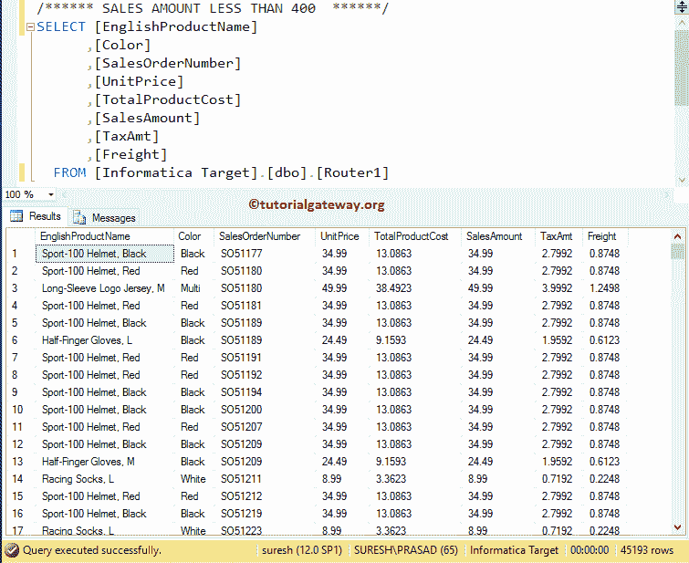
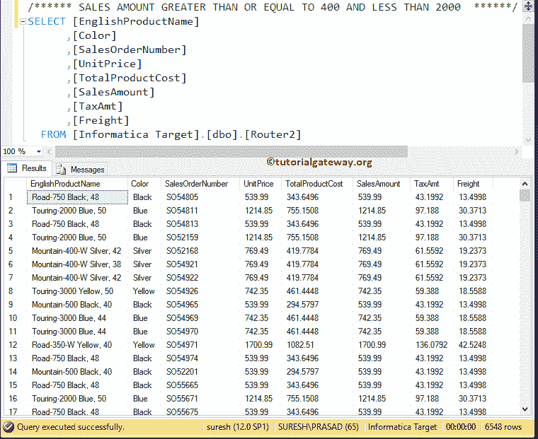
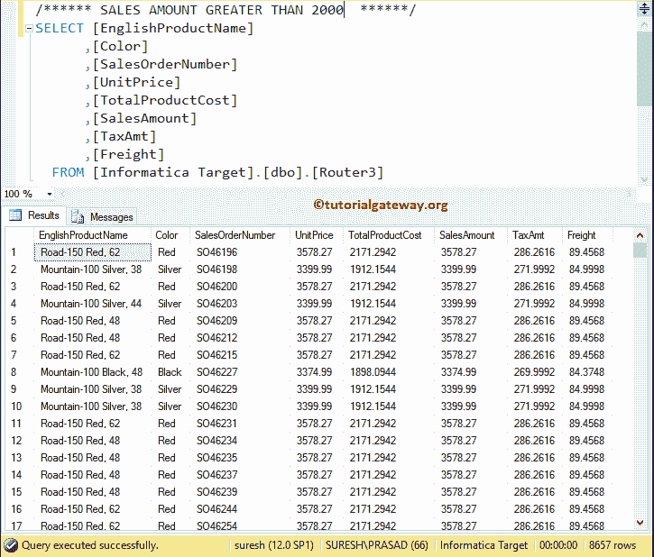

# 信息时代的路由器变革

> 原文：<https://www.tutorialgateway.org/router-transformation-in-informatica/>

信息中的路由器转换就像 IF 条件或 CASE 语句。它将检查给定的条件，并根据条件结果，将输出发送到适当的目标路径。这类似于过滤器转换，当我们必须测试多个条件时，我们可以使用 Informatica 路由器转换。

信息系统中的路由器转换在实时性方面非常有用。例如，如果我们希望将工资大于 40000 的员工记录存储在一个表中，而将工资小于 40000 的员工记录存储到另一个表中，那么我们可以使用 Informatica 中的 Informatica Router Transformation 根据指定的表达式拆分数据。

在这个信息路由器转换的例子中，我们将使用下面显示的数据。这里，我们的任务是有条件地拆分下面显示的数据，并将它们存储在多个数据库表中。

## 在信息中配置路由器转换

在我们开始在 Informatica 中配置路由器转换之前，首先连接到 [Informatica](https://www.tutorialgateway.org/informatica/) 存储库服务。为了连接到存储库服务，我们必须提供[信息管理控制台](https://www.tutorialgateway.org/informatica-admin-console/)凭证，因此，请提供适当的用户名和密码，并点击连接按钮，如下所示。

提示:这里你必须提供你在[安装 Informatica](https://www.tutorialgateway.org/how-to-install-informatica/) 服务器时指定的管理员用户名和密码。

### 在信息源定义中创建路由器转换

连接成功后，请导航至[源分析器](https://www.tutorialgateway.org/informatica-source-analyzer/)并定义您的源。在这个 Informatica 路由器转换示例中，我们使用来自 SQL Server 数据库的[产品]表作为我们的源定义。请参考【信息】中的[数据库源](https://www.tutorialgateway.org/database-source-in-informatica/)了解创建源定义

的步骤

### 创建信息路由器转换目标定义

请导航至[目标设计器](https://www.tutorialgateway.org/target-designer-in-informatica/)并定义目标。在这个 Informatica 路由器转换示例中，我们使用已经创建的 SQL 表(Router1、Router2 和 Router3)作为目标定义。请参考[使用源定义](https://www.tutorialgateway.org/create-informatica-target-table-using-source-definition/)创建信息目标表，了解创建目标定义

所涉及的步骤

### 在信息映射中创建路由器转换

要创建新映射，请导航至菜单栏中的[映射](https://www.tutorialgateway.org/informatica-mapping/)菜单，并选择创建..选项。在这里，您必须为此映射(m_Router_Transformation)编写一个唯一的名称，然后单击“确定”按钮。

接下来，将[产品]源定义从“源”文件夹拖放到映射设计器。拖动源后，PowerCenter 设计器将自动创建名为源限定符的默认转换。

#### 在信息化中创建路由器转换

要在 Informatica 中创建路由器转换，请导航至菜单栏中的转换菜单，并选择创建..选项，如下所示。

一旦你点击创建..选项，将打开创建转换窗口，如下所示。请从下拉列表中选择 Informatica 路由器转换，并为此转换指定唯一名称(rtr_Sales)，然后单击创建按钮

单击创建按钮后，路由器转换将被添加到映射设计器中。为了路由数据，路由器转换需要一些数据，因此，请通过拖动所需字段将源定义与转换连接起来。

从上面的截图中，您可以观察到我们有输入数据。让我们定义输出组，双击 Informatica Router 转换以提供路由条件。从下面的截图中，您可以看到“转换”选项卡中的可用属性列表:

*   选择转换:默认情况下，它将选择您单击的转换。
*   重命名:此按钮将帮助您将路由器转换重命名为更有意义的名称。
*   使可重用:如果您选中此选项，则此转换将成为可重用的转换。
*   描述:请提供此转换的有效描述。

下面的截图将向您展示 Informatica 路由器转换端口选项卡中的可用选项列表:

*   端口名:可用列名列表。单击“新建列”按钮可以添加新列，单击“剪式”按钮可以删除不需要的列。
*   I:在此部分下勾选标记的列是输入列。
*   o:在此部分下勾选标记的列是路由器转换输出列。如果取消选中任何列，则该列将无法加载到目标表中。

在“组”选项卡中，我们必须定义要使用的组名和条件。从下面的截图中，您可以看到我们创建了两个组(最小销售额组和中等销售额组)。

提示:Informatica 中的路由器转换将自动创建默认组(即 DEFAULT 1)。不属于上述组的记录将存储在该组中。

让我们通过单击箭头按钮为第一组(最少销售额)提供表达式或条件，如下所示。这将打开表达式编辑器来编写自定义表达式。

这里，我们想要销售金额小于 400 的记录，所以，我们正在编写下面显示的表达式(销售金额< 400).

接下来，通过单击箭头按钮提供第二组(中等销售额)的表达式或条件，并写入条件(销售额> = 400，销售额< 2000).

所有剩余行将作为默认输出，并存储在默认 1 组(销售额> 2000)

完成属性配置后，单击确定关闭信息路由器转换窗口。

接下来，将目标定义(路由器 1、路由器 2 和路由器 3)从目标文件夹拖放到映射设计器中，如下所示。

接下来，请将最小(输出组 1)与第一个目标定义(路由器 1)连接，将中型销售(输出组 2)与路由器 2 连接，将默认 1(默认组)与路由器 3 连接

在我们关闭映射之前，让我们通过转到映射菜单栏并选择验证选项来验证映射。

### 创建信息路由器转换工作流

一旦我们完成创建映射，我们就必须为它创建工作流。PowerCenter 工作流管理器提供了两种创建工作流的方法。

*   [手动创建工作流](https://www.tutorialgateway.org/informatica-workflow/)
*   [使用向导创建工作流](https://www.tutorialgateway.org/informatica-workflow-using-wizard/)

在这个信息路由器转换示例中，我们将手动创建工作流。要创建新的信息工作流，请导航到工作流菜单并选择创建选项。

这将打开创建工作流窗口，如下所示。请提供唯一的名称(wf_Router_Transformation)并保留默认设置。

一旦我们创建了工作流，下一步就是为我们的映射创建一个会话任务。

注意:我们强烈建议参考 [Informatica Workflow](https://www.tutorialgateway.org/informatica-workflow/) 文章，了解手动创建 Workflow 所涉及的步骤。

#### 在信息中为路由器转换创建会话

Informatica 中有两种类型的会话:

*   不可重用会话任务:请参考 Informatica 文章中的[会话，了解其中涉及的步骤。](https://www.tutorialgateway.org/session-in-informatica/)
*   可重用会话任务:请参考[可重用会话](https://www.tutorialgateway.org/reusable-session-in-informatica/)文章，了解其中涉及的步骤。

对于这个信息路由器转换示例，我们将创建不可重用的会话。请导航至任务菜单并选择创建选项以打开创建任务窗口。在这里，您必须选择会话作为任务类型(默认)，并为会话输入唯一的名称(路由器转换)。

单击“创建”按钮后，将打开一个名为“映射”的新窗口。在这里，您必须选择要与此会话关联的映射。从下面的截图中，您可以看到我们正在选择之前创建的映射(m_Router_Transformation)(在步骤 3 中)。

双击会话任务进行配置。虽然我们必须配置源、目标和一些常见属性，但我们不会解释它们。我们强烈建议访问 Informatica 文章中的[会话来了解属性。](https://www.tutorialgateway.org/session-in-informatica/)

从下面的截图中，您可以观察到 Informatica 工作流中的路由器转换是有效的。现在，让我们通过导航到“工作流”菜单并选择“启动工作流”选项来启动工作流。

选择“启动工作流”选项后，将打开 Informatica PowerCenter 工作流监视器来监视工作流。从下面的截图中，您可以观察到我们的工作流没有任何错误地执行。

让我们打开 [SQL Server](https://www.tutorialgateway.org/sql/) 管理工作室，向您展示【路由器 1】(即最少销售组的一个输出)

的结果

让我们看看 SQL Server 中[路由器 2]表的结果。以下截图将向您展示中型销售组

的输出

让我们看看 SQL Server 中[路由器 3]表的结果。下面的截图将显示默认组的输出。请参考[信息过滤](https://www.tutorialgateway.org/filter-transformation-in-informatica/)一文。

