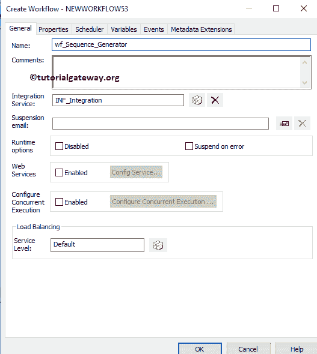

# Informatica 中的序列生成器转换

> 原文：<https://www.tutorialgateway.org/sequence-generator-transformation-in-informatica/>

Informatica 中的序列生成器转换是一个生成数值的连接转换。我们可以主要使用这种转换来生成主键、外键，或者用唯一的主键来填充或替换缺失的主键。

Informatica 中的序列生成器转换只有两个输出端口 NEXTVAL 和 CURRVAL，它不允许用户创建新的端口或更改、删除现有的端口。

在本文中，我们将通过一个例子来解释在 Informatica 中配置序列生成器转换所涉及的步骤。对于这个例子，我们将使用下面显示的数据

## 在信息中配置序列生成器转换

在我们开始在 Informatica 中配置序列生成器转换之前，首先连接到 Informatica 存储库服务。为了连接存储库服务，我们必须提供[信息管理控制台](https://www.tutorialgateway.org/informatica-admin-console/)凭证。因此，请提供适当的用户名和密码，并点击连接按钮。

提示:这里你必须提供你在[安装信息卡](https://www.tutorialgateway.org/how-to-install-informatica/)服务器时指定的[信息卡](https://www.tutorialgateway.org/informatica/)管理员用户名和密码。

### 步骤 1:在 Informatica 中为序列生成器转换创建源定义

连接成功后，请导航至[源分析器](https://www.tutorialgateway.org/informatica-source-analyzer/)并定义您的源。在这个 Informatica 序列生成器转换示例中，我们使用来自 SQL Server 数据库的[Employ]表作为我们的源定义。请参考【信息】中的[数据库源](https://www.tutorialgateway.org/database-source-in-informatica/)了解创建源定义

的步骤

### 步骤 2:创建信息序列生成器转换目标定义

请导航至[目标设计器](https://www.tutorialgateway.org/target-designer-in-informatica/)并定义目标。在这个 Informatica 序列生成器转换示例中，我们使用已经创建的 SQL 表(序列生成器)作为我们的目标定义。请参考[使用源定义](https://www.tutorialgateway.org/create-informatica-target-table-using-source-definition/)创建信息目标表，了解创建目标定义

所涉及的步骤

### 为 Informatica 中的序列生成器转换创建映射

要创建新映射，请导航至菜单栏中的映射菜单，并选择创建..选项。这将打开映射名称窗口。在这里，您必须为此映射(m_Sequence_Generator)编写一个唯一的名称，然后单击“确定”按钮。

提示:请参考[Informatica 映射](https://www.tutorialgateway.org/informatica-mapping/)文章，了解创建映射所涉及的步骤。

接下来，将[应用]源定义从“源”文件夹拖放到映射设计器。拖动源后，PowerCenter 设计器将自动创建名为源限定符的默认转换。

#### 在信息中创建序列生成器转换

要在 Informatica 中创建序列生成器转换，请导航到菜单栏中的转换菜单，并选择创建..选项，如下所示。

一旦你点击了创建..选项，将打开创建转换窗口。请从下拉列表中选择 Informatica 序列生成器转换，并为此转换指定唯一名称(seq_Employee)，然后单击创建按钮

单击“创建”按钮后，序列生成器转换将被添加到映射设计器中。接下来，将目标定义(序列生成器)从“目标”文件夹拖放到映射设计器，并将源限定符“转换”与目标定义连接起来。请使用自动链接..连接它们的选项。

从上面的截图中，可以观察到 Informatica Sequence Generator 转换生成了两个默认项 NEXTVAL 和 CURRVAL。NEXTVAL 端口是我们必须为 Employee_ID 分配的端口，我们必须在转换编辑器中分配 CURRVAL。

双击“信息序列生成器”转换来生成序列号。从下面的截图中，您可以看到“转换”选项卡中的可用属性列表:

*   选择转换:默认情况下，它将选择您单击的转换。
*   重命名:此按钮将帮助您将序列生成器转换重命名为更有意义的名称。
*   使可重用:如果您选中此选项，则此转换将成为可重用的转换。
*   描述:请提供此转换的有效描述。

下面的截图将向您展示 Informatica 序列生成器转换端口选项卡中的可用选项列表:

*   端口名:可用列名列表。单击“新建列”按钮可以添加新列，单击“剪式”按钮可以删除不需要的列。
*   I:序列生成器转换将不允许输入列。
*   o:在此部分下被选中的列是序列生成器转换输出列。如果取消选中任何列，则该列将无法加载到目标表中。

下面的截图将显示信息序列生成器转换属性选项卡中的可用选项列表。

*   起始值:请指定要开始的值。例如，1 表示起始值或最大值的标识或主键值加 1。
*   递增者:请指定序列递增时要使用的值。例如，1 表示值将增加 1 (1，2，3，…..)或者如果指定 2，则值将是 2、4、6、8…
*   结束值:请在此指定结束值。例如，如果您将 10 指定为结束值，则序列将在达到 10 时停止。
*   当前值:请在此指定当前值。例如，如果将 3 指定为当前值，则序列将从 3 开始，并使用“递增方式”选项递增该值，直到它达到结束值。一旦达到结束值，它将从开始值开始重复循环
*   周期:请指定是否要重复周期。例如，如果您的最终值小于现有行，则最好选择“循环”选项，或者如果您想重复相同的数字序列，则选择该选项。
*   重置:请指定是否要为每个会话重置序列。

从下面的截图中，您可以观察到我们指定的属性。这里，序列生成器将以值 1 开始序列，并递增 2，直到它达到 6。达到结束值后，序列生成器将以值 0(开始值)

开始序列

配置完属性后，单击确定关闭转换窗口。

在我们关闭映射之前，让我们通过转到映射菜单栏并选择验证选项来验证映射。

### 步骤 4:在 Informatica 中为序列生成器转换创建工作流

一旦我们完成创建映射，我们就必须为它创建工作流。PowerCenter 工作流管理器提供了两种创建工作流的方法。

*   [手动创建 Informatica 工作流](https://www.tutorialgateway.org/informatica-workflow/)
*   [使用向导创建 Informatica 工作流](https://www.tutorialgateway.org/informatica-workflow-using-wizard/)

在这个 Informatica 序列生成器转换示例中，我们将手动创建工作流。要创建新的 Informatica 工作流，请导航到工作流菜单并选择创建选项。这将打开创建工作流窗口，如下所示。请提供唯一的名称(wf_Rank_Transformation)并保留默认设置。

一旦我们创建了工作流，下一步就是为我们的映射创建一个会话任务。

注意:我们强烈建议参考 [Informatica Workflow](https://www.tutorialgateway.org/informatica-workflow/) 文章，了解手动创建 Workflow 所涉及的步骤。

#### 步骤 4(a):为信息序列生成器转换创建会话

Informatica 中有两种类型的会话:

*   不可重用会话任务:请参考 Informatica 文章中的[会话，了解其中涉及的步骤。](https://www.tutorialgateway.org/session-in-informatica/)
*   可重用会话任务:请参考 Informatica 文章中的[可重用会话，了解其中涉及的步骤。](https://www.tutorialgateway.org/reusable-session-in-informatica/)

对于这个 Informatica 序列生成器转换示例，我们将创建不可重用的会话。请导航至任务菜单并选择创建选项以打开创建任务窗口。在这里，您必须选择会话作为任务类型(默认)，并为会话输入唯一的名称(排名转换)。

单击“创建”按钮后，将打开一个名为“映射”的新窗口。在这里，您必须选择要与此会话关联的映射。从下面的截图中，您可以看到我们正在选择之前创建的映射(m_Rank_Transformation)(在步骤 3 中)。

双击会话任务进行配置。虽然我们必须配置源、目标和一些常见属性，但我们只解释了几个属性。我们强烈建议访问 Informatica 文章中的[会话，了解剩余属性。](https://www.tutorialgateway.org/session-in-informatica/)

从下面的截图中，您可以观察到 Informatica 工作流中的排名转换是有效的。现在，让我们通过导航到“工作流”菜单并选择“启动工作流”选项来启动工作流。

选择“启动工作流”选项后，将打开 Informatica PowerCenter 工作流监视器来监视工作流。从下面的截图中，您可以观察到我们的工作流没有任何错误地执行。

让我们打开 [SQL Server](https://www.tutorialgateway.org/sql/) 管理工作室，检查是否使用 Informatica

中的序列生成器转换成功生成了 Employee_Id

让我们更改如下所示的开始值、结束值和增量值的属性。接下来，刷新映射并启动工作流。

让我们打开 [SQL Server](https://www.tutorialgateway.org/sql/) 管理工作室，检查是否使用 Informatica

中的序列生成器转换成功生成了序列 Employee_Id