# 信息分类中的分类器转换

> 原文：<https://www.tutorialgateway.org/sorter-transformation-in-informatica/>

Informatica 中的排序器转换用于以升序或降序对源数据进行排序，类似于 SQL 命令 ORDER BY 语句。

在本节中，我们将通过一个示例来演示配置 Informatica Sorter 转换所涉及的步骤。对于这个例子，我们将使用下面显示的数据

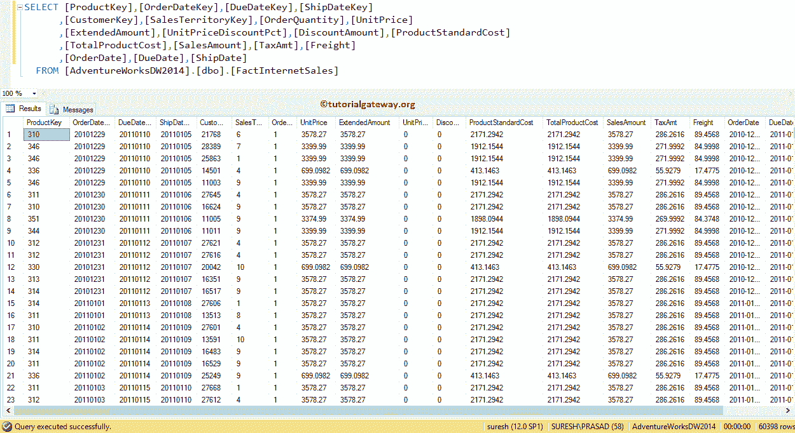

## 在信息中配置分类器转换

在我们开始 Informatica 分类器转换演示之前，首先，连接到 [Informatica](https://www.tutorialgateway.org/informatica/) 存储库服务。为此，请提供[信息管理控制台](https://www.tutorialgateway.org/informatica-admin-console/)凭据(用户名和密码)，然后单击连接按钮

### 步骤 1:在 Informatica 中为分类器转换创建源定义

一旦您成功连接，请导航到源分析器来设置我们的源。在这个信息分类器转换示例中，我们使用已经创建的 SQL 表(事实互联网销售)作为我们的源定义。请参考 Informatica 中的[数据库源，了解创建源定义](https://www.tutorialgateway.org/database-source-in-informatica/)

[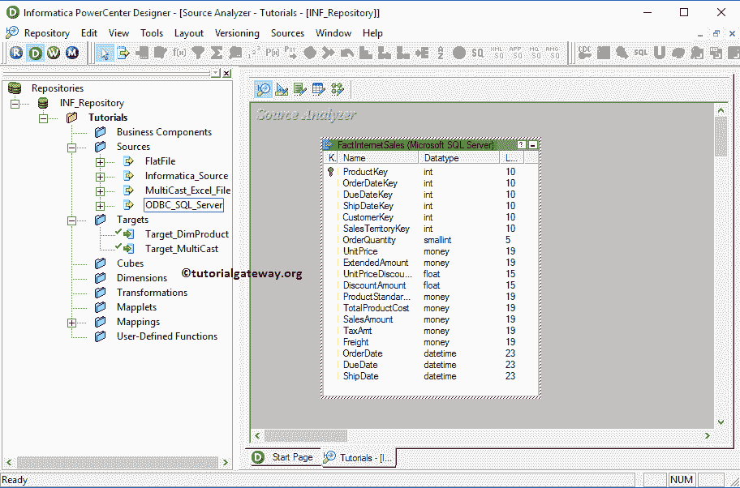](https://www.tutorialgateway.org/database-source-in-informatica/)

[的步骤](https://www.tutorialgateway.org/database-source-in-informatica/)

### 步骤 2:在 Informatica 中为分类器转换创建映射

要为信息分类器转换创建新映射，请导航到菜单栏中的映射菜单，并选择创建..选项。在这里，您必须为此映射编写一个唯一的名称，然后单击“确定”按钮。

提示:请参考[映射](https://www.tutorialgateway.org/informatica-mapping/)文章，了解创建映射所涉及的步骤。

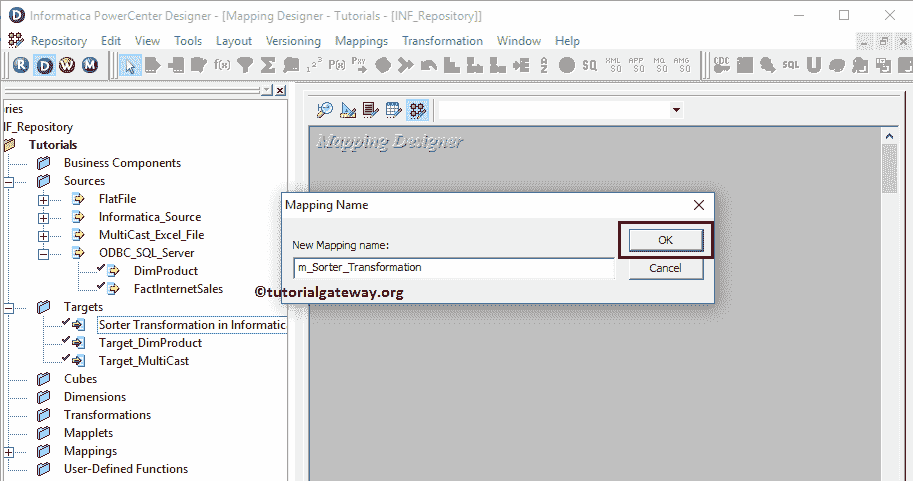

接下来，将[事实互联网销售]源定义从“源”文件夹拖放到映射设计器中。拖动源后，PowerCenter 设计器将自动创建名为源限定符的默认转换。

#### 步骤 2(a):在信息中创建分类器转换

要在 Informatica 中创建分类器转换，请导航到菜单栏中的转换菜单，并选择创建..选项。

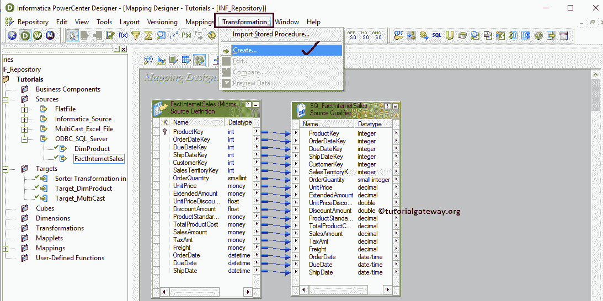

它会打开一个创建转换窗口，如下所示。

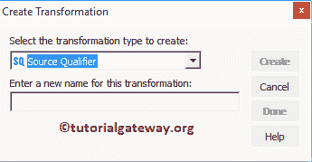

请单击箭头从下拉列表中选择所需的转换。让我们选择信息分类器转换

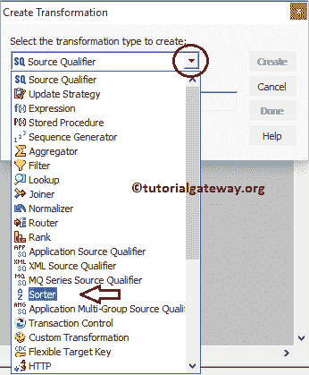

接下来，请为该信息分类器转换指定唯一的名称，并点击创建按钮

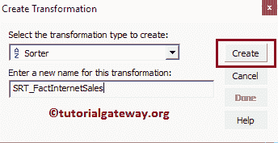

单击创建按钮后，Informatica Sorter 转换将被添加到映射设计器中。为了执行排序，转换需要一些数据，因此我们必须将其与源定义连接起来。

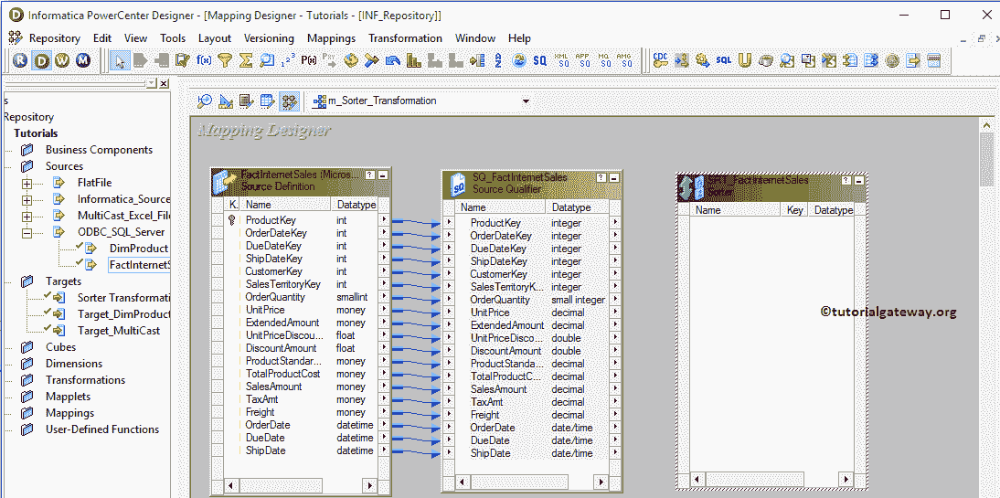Informatica power center Designer 提供了多种方式将源限定符与 Informatica 中新创建的 Sorter 转换连接起来。在本例中，我们右键单击空白区域并选择自动链接..上下文菜单中选项。

注意:Informatica 映射设计器允许我们通过选择链接并删除它来删除错误的映射。

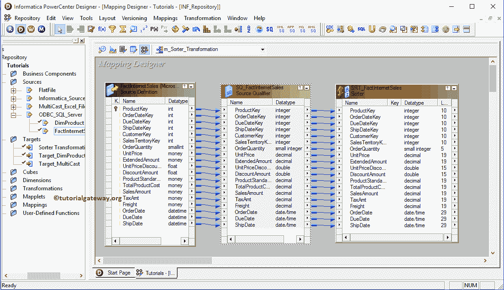

从上面的截图中，您可以观察到，我们成功地将源限定符连接到 Informatica 排序器转换。

双击信息分类器转换来配置分类属性。窗口下方将显示“转换”选项卡中可用属性的列表:

*   选择转换:默认情况下，它将选择您单击的转换。
*   重命名:此按钮将帮助您将分类器转换重命名为更有意义的名称。
*   使可重用:如果您选中此选项，则此转换将成为可重用的转换。
*   描述:请提供关于此转换的有效描述。

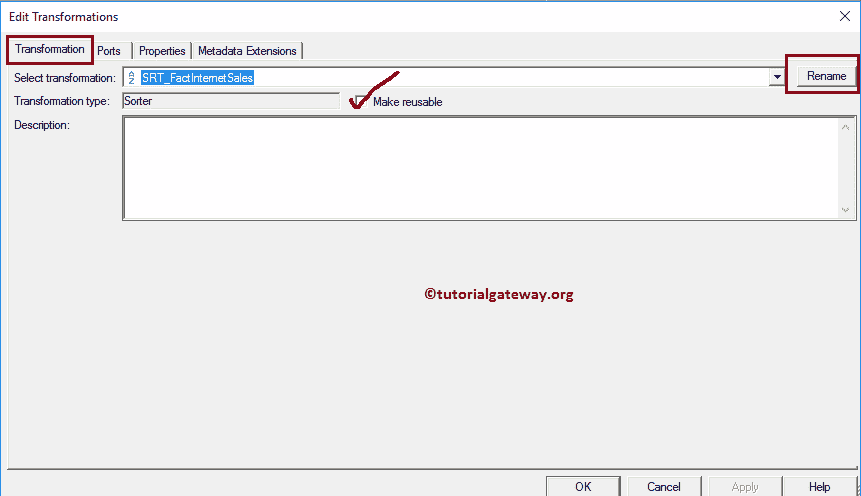

下面的截图将向您展示信息分类器转换的端口标签中的可用选项列表:。

*   端口名:可用列名列表。单击“新建列”按钮可以添加新列，单击“剪式”按钮可以删除不需要的列。
*   I:在该部分下勾选标记的列是分类器转换输入列。
*   o:在该部分下勾选标记的列是分类器转换输出列。如果取消选中任何列，则该列将无法加载到目标表中。
*   键:请选中要用作排序列的列。例如，如果您想按单价和订单数量对数据进行排序，那么您必须选中这两项。
*   方向:这里我们必须选择排序方向。这个信息分类器转换提供了两个选项:升序(从 A 到 Z)和降序(从 Z 到 A)

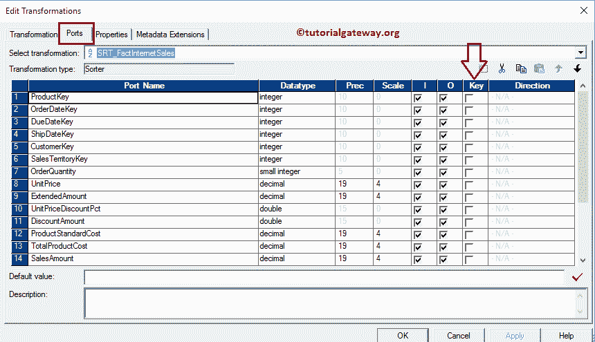

为了理解信息中的排序器转换，我们用升序对一列进行排序，用降序对另一列进行排序。从下面的截图可以观察到，我们是按照

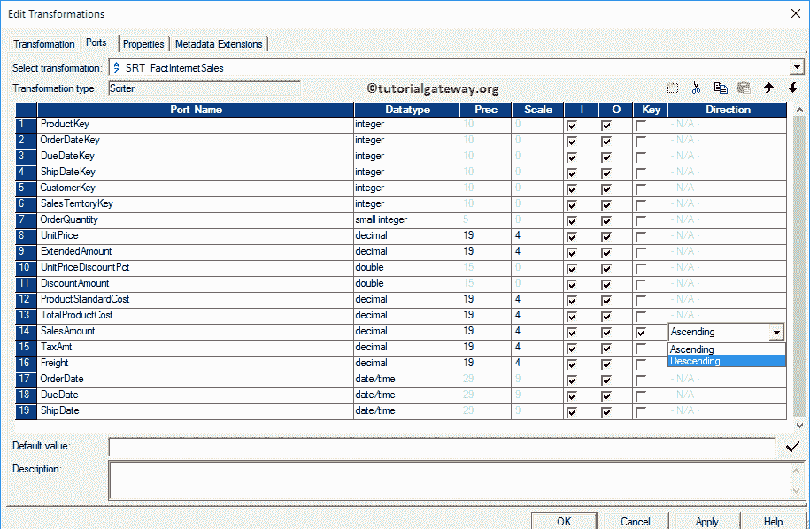

降序排列【销售金额】

接下来，我们按照升序对[运费]进行排序。意思是，

*   首先数据按[销售额]降序排序，然后
*   其次，数据将按[运费]升序排序。

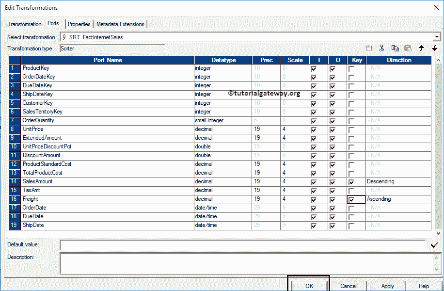

单击“确定”完成在信息中配置分类器转换。

#### 步骤 2(b):信息分类转换的目标定义

首先，将[信息中的分类器转换]目标定义从目标文件夹拖放到映射设计器中。接下来，我们必须将其与目标定义联系起来。请使用自动链接..连接它们的选项。

提示:请参考[创建目标表](https://www.tutorialgateway.org/create-target-table-in-informatica/)一文，了解从 SQL 数据库导入目标定义。

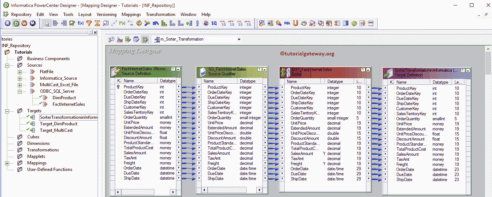

在我们关闭映射之前，让我们通过转到映射菜单栏并选择验证选项来验证信息分类器转换映射。

### 第 3 步:在 Informatica 中为分类器转换创建工作流

一旦我们完成创建映射，我们就必须为它创建工作流。Informatica PowerCenter 工作流管理器提供了两种创建工作流的方法。

*   [手动创建工作流](https://www.tutorialgateway.org/informatica-workflow/)
*   [使用向导创建工作流](https://www.tutorialgateway.org/informatica-workflow-using-wizard/)

在这个信息分类器转换示例中，我们手动创建了工作流。我们强烈建议参考 [Informatica Workflow](https://www.tutorialgateway.org/informatica-workflow/) 文章，了解手动创建 Workflow 所涉及的步骤。一旦我们创建了工作流，下一步就是创建一个会话。

#### 步骤 3(a):创建信息分类器转换会话

informatica 中有两种类型的会话:

*   不可重用的会话任务:请参考 Informatica 文章中的[会话，了解初始化所涉及的步骤。](https://www.tutorialgateway.org/session-in-informatica/)
*   可重用会话任务:请参考[可重用会话](https://www.tutorialgateway.org/reusable-session-in-informatica/)文章，了解初始化涉及的步骤。

对于 Informatica 示例中的排序转换，我们将创建不可重用的会话。要在信息中创建不可重复使用的会话，请导航到任务菜单并选择创建选项以打开创建任务窗口。在这里，您必须选择会话作为任务类型(默认)，并为会话输入唯一的名称。

单击“创建”按钮后，将打开一个名为“映射”的新窗口。在这里，我们必须选择您想要与此会话关联的映射。从下面的截图中，您可以看到，我们正在选择之前创建的映射(在步骤 2 中)。

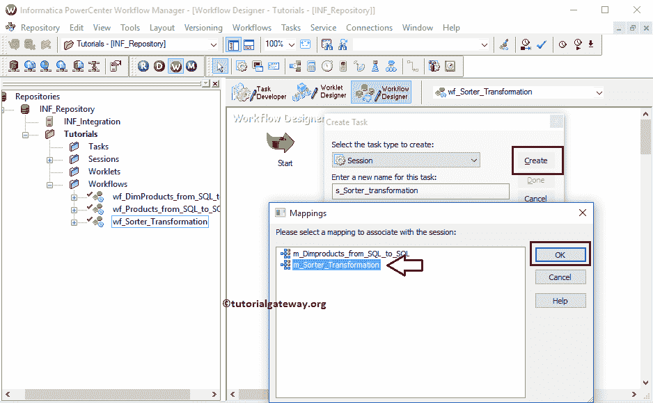

虽然我们必须配置源、目标和一些常见属性，但我们只解释两个属性。我们强烈建议访问 Informatica 文章中的[会话，了解剩余属性。](https://www.tutorialgateway.org/session-in-informatica/)

从下面的截图中，您可以看到，我们将目标加载类型选项从批量模式更改为正常模式，并选中截断目标表选项以从目标表中截断现有数据。

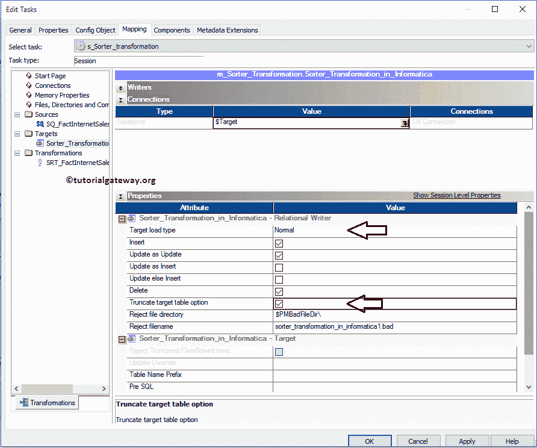

从下面的截图可以看出，我们的信息工作流程是有效的。现在，让我们通过导航到工作流菜单并选择开始工作流选项来启动信息分类器转换工作流。

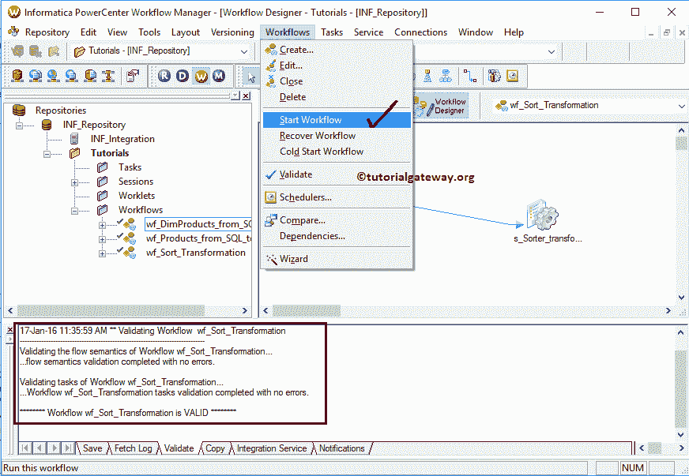

选择“启动工作流”选项后，将打开 Informatica PowerCenter 工作流监视器来监视工作流。从下面的截图中，您可以看到，我们的工作流没有任何错误地执行。

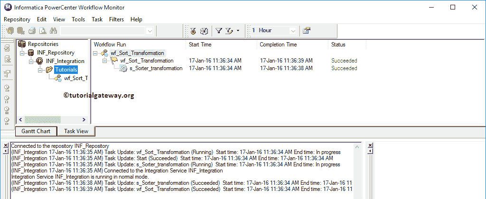

让我们打开 [SQL Server 管理工作室](https://www.tutorialgateway.org/sql/)来检查我们是否成功地将排序数据从 Adventure Works DW 传输到 Informatica 目标数据库。请参考 [SQL Server](https://www.tutorialgateway.org/sql/) 教程中 [SQL ORDER BY 语句](https://www.tutorialgateway.org/sql-order-by-clause/)一文。

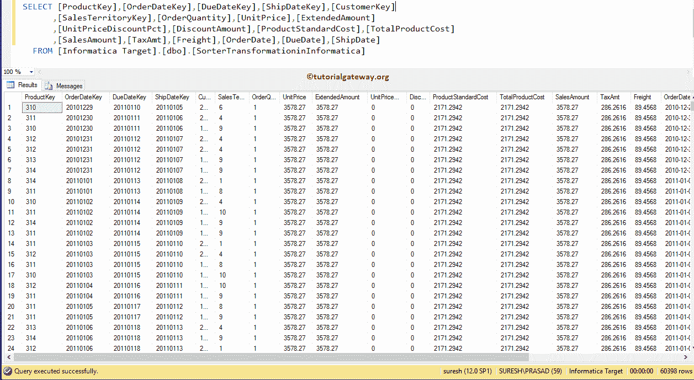