# 使用 Informatica 中的排序器转换删除重复项

> 原文：<https://www.tutorialgateway.org/remove-duplicates-using-sorter-transformation-in-informatica/>

在本文中，我们将通过一个例子来解释如何使用 Informatica 中的排序器转换来移除重复项。对于这个例子，我们将使用下面显示的数据

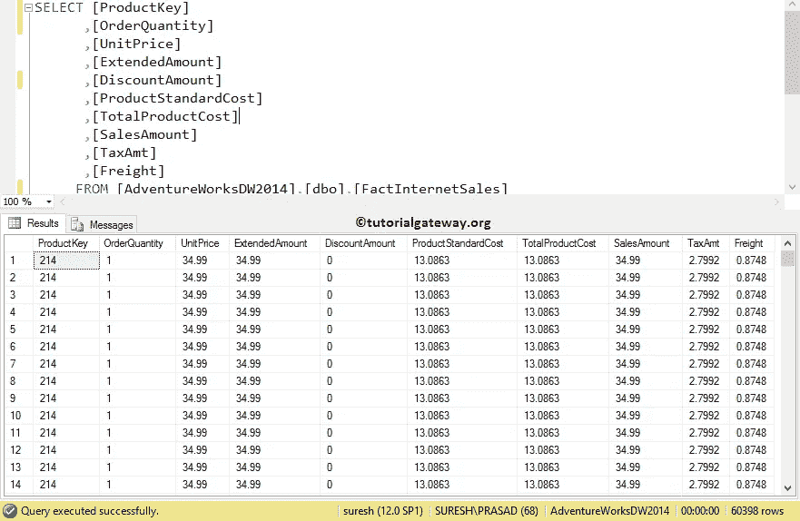

从上面的截图可以观察到，我们有 60398 条记录，有很多重复。我们的任务是使用 Informatica 中的排序器转换来选择不同的记录或删除重复记录。

## 使用 Informatica 中的排序器转换删除重复项

在我们开始使用排序器删除重复项之前，请连接到 [Informatica](https://www.tutorialgateway.org/informatica/) 存储库服务。为此，我们必须提供[信息管理控制台](https://www.tutorialgateway.org/informatica-admin-console/)凭证。因此，请提供适当的用户名和密码，并点击连接按钮。

提示:在这里，提供您在安装信息服务器时指定的管理员用户名和密码。

### 步骤 1:创建源定义

成功连接后，请导航至源分析器并定义我们的源。在这个例子中，我们使用已经创建的 SQL 表(互联网销售)作为我们的源定义。请参考 Informatica 中的[数据库源，了解创建源定义](https://www.tutorialgateway.org/database-source-in-informatica/)

[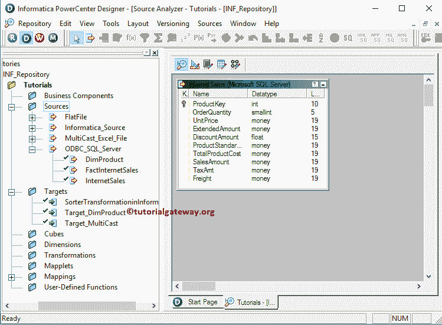](https://www.tutorialgateway.org/database-source-in-informatica/)

[的步骤](https://www.tutorialgateway.org/database-source-in-informatica/)

### 步骤 2:创建目标定义

请导航到目标设计器并定义目标。在这个例子中，我们使用已经创建的 SQL 表(事实互联网销售)作为我们的目标定义。请参考[使用源定义](https://www.tutorialgateway.org/create-informatica-target-table-using-source-definition/)创建信息目标表，了解创建目标定义

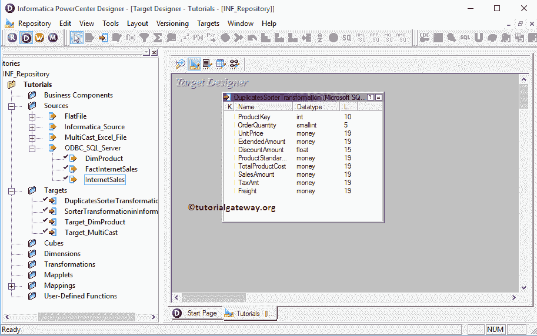

的步骤

### 步骤 3:在 Informatica 映射中使用排序器转换删除重复项

要创建新映射，请导航到菜单栏中的映射菜单，并选择创建..选项。它将打开映射名称窗口。在这里，您必须为此映射编写一个唯一的名称，然后单击“确定”按钮。

提示:请参考[Informatica 映射](https://www.tutorialgateway.org/informatica-mapping/)文章，了解创建映射所涉及的步骤。

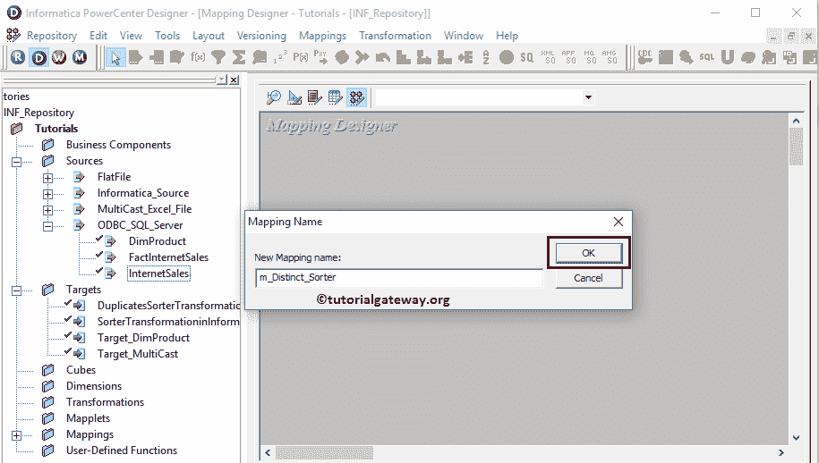

接下来，将[互联网销售]源定义从“源”文件夹拖放到映射设计器中，并创建一个排序器转换。排序器转换需要一些数据来删除重复项。因此，我们必须使用自动链接将源定义与转换联系起来..选项。

提示:请参考 Informatica 文章中的[排序器转换，了解配置排序器转换所涉及的步骤。](https://www.tutorialgateway.org/sorter-transformation-in-informatica/)

[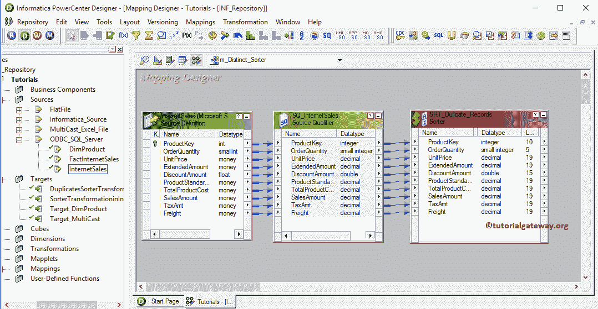](https://www.tutorialgateway.org/sorter-transformation-in-informatica/)

双击排序器转换来配置属性。从下面的截图中，您可以看到属性选项卡中的可用属性列表。在本例中，我们希望删除重复的记录，因此，选中 Distinct 属性。

提示:这将作为 [SQL SELECT DISTINCT 语句](https://www.tutorialgateway.org/sql-select-distinct-statement/)

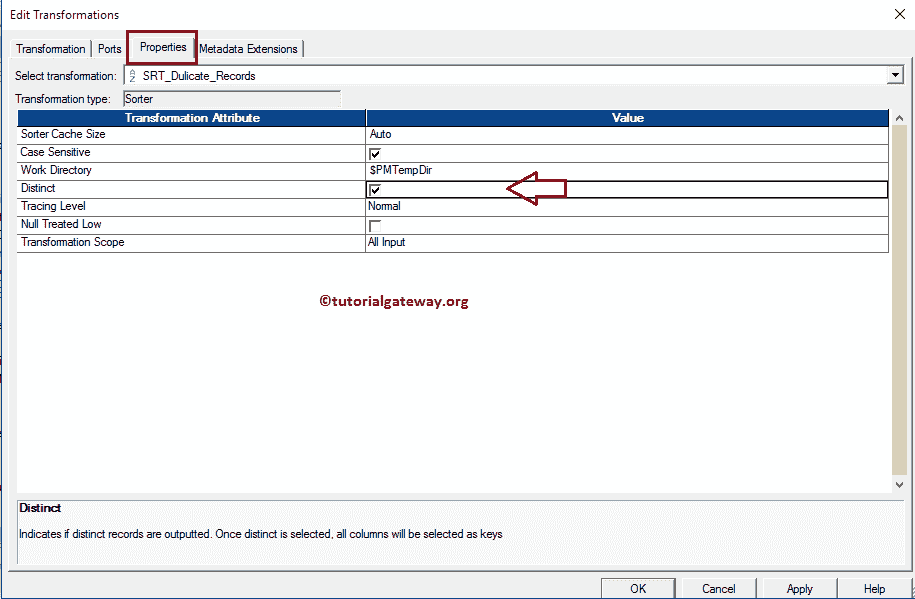

接下来，如果您观察“端口”选项卡，排序器转换将以升序对所有输入列进行排序。记住，你不必在这里做任何事情。

单击确定按钮完成属性配置。

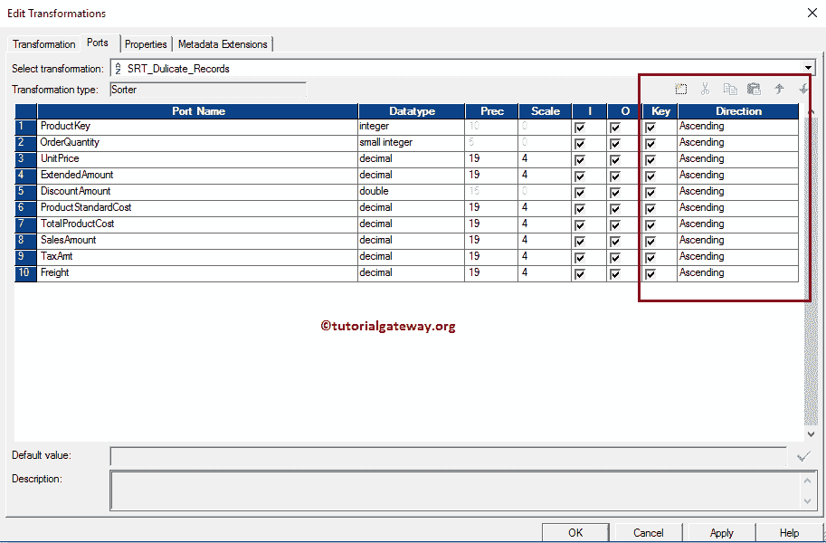

接下来，将[在 Informatica 中复制排序器转换]目标定义从目标文件夹拖放到映射设计器中，并将排序器转换与目标定义连接起来。请使用自动链接..连接它们的选项。

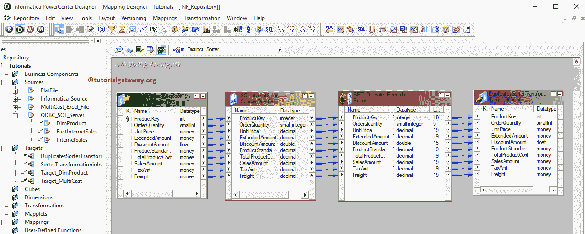

在我们关闭映射之前，让我们通过转到映射菜单栏并选择验证选项来验证映射。

### 步骤 4:创建工作流

一旦我们完成创建映射，我们就必须创建工作流，使用 Informatica 中的排序器转换来删除重复项。PowerCenter 工作流管理器提供了两种创建工作流的方法。

*   [手动创建 Informatica 工作流](https://www.tutorialgateway.org/informatica-workflow/)
*   [使用向导创建 Informatica 工作流](https://www.tutorialgateway.org/informatica-workflow-using-wizard/)

在本例中，我们手动创建了工作流。一旦我们创建了工作流，下一步就是创建一个会话。

我们强烈建议参考 [Informatica Workflow](https://www.tutorialgateway.org/informatica-workflow/) 文章，了解手动创建 Workflow 所涉及的步骤。

#### 步骤 4(a):创建会话

Informatica 中有两种类型的会话:

*   不可重用的会话任务:请参考 Informatica 文章中的[会话](https://www.tutorialgateway.org/session-in-informatica/)
*   可重用会话任务:请参考 Informatica 文章中的[可重用会话](https://www.tutorialgateway.org/reusable-session-in-informatica/)

对于本例，我们将创建不可重用的会话。要在信息中创建不可重复使用的会话，请导航到任务菜单，并选择创建选项以打开创建任务窗口。在这里，您必须选择“会话”作为任务类型(默认)，并为会话输入唯一的名称。

单击“创建”按钮后，将打开一个名为“映射”的新窗口。在这里，我们必须选择要与此会话关联的映射。从下面的截图中，您可以看到我们正在选择之前创建的映射(在步骤 3 中)。

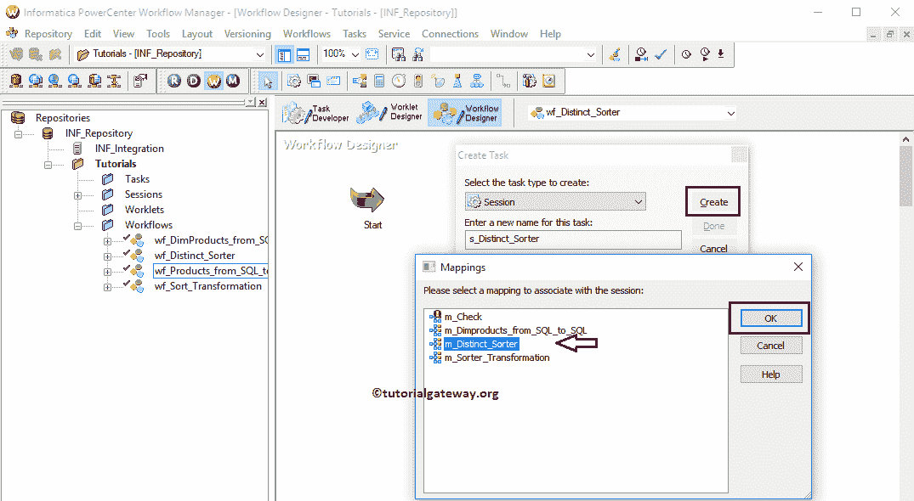

虽然我们必须配置源、目标和一些常见属性，但我们不打算在这里解释它们。请参考文章中的[会话了解属性。](https://www.tutorialgateway.org/session-in-informatica/)

从下面的截图中，您可以看到在 Informatica 工作流中使用排序器转换移除重复项是有效的。现在，让我们通过导航到“工作流”菜单并选择“启动工作流”选项来启动工作流。

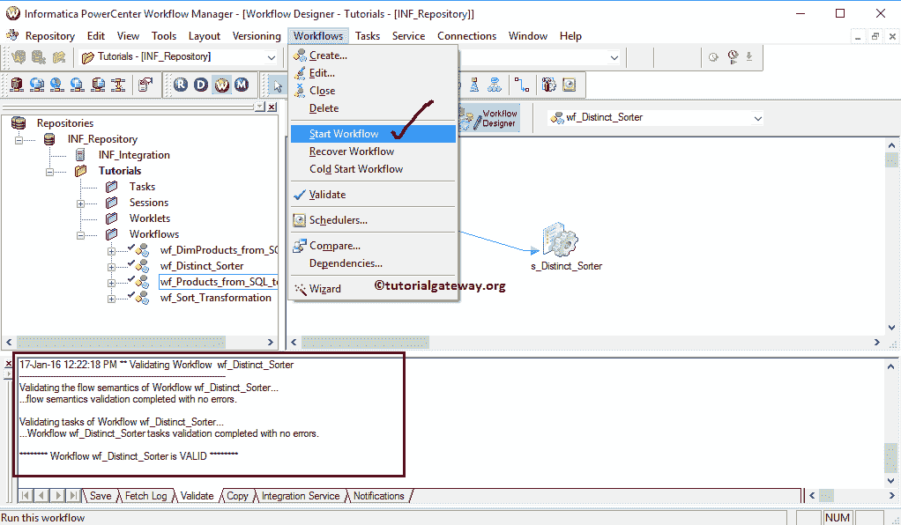

选择“启动工作流”选项后，将打开 Informatica PowerCenter 工作流监视器来监视工作流。从下面的截图中，您可以观察到我们的工作流执行时没有任何错误。

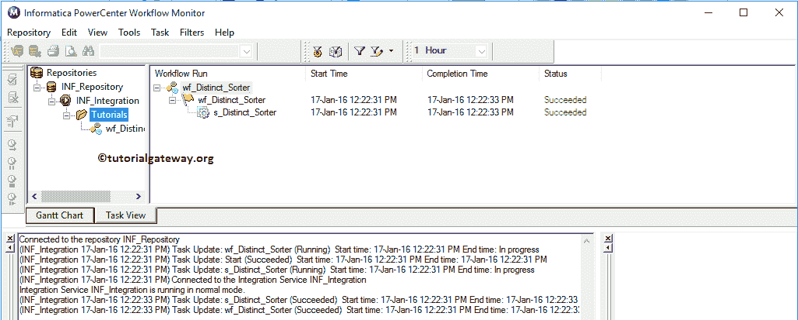

让我们打开 SQL Server 管理工作室，检查我们是否成功地从 Adventure Works DW 中删除了重复的记录/将不同的记录转移到 Informatica 目标数据库中。

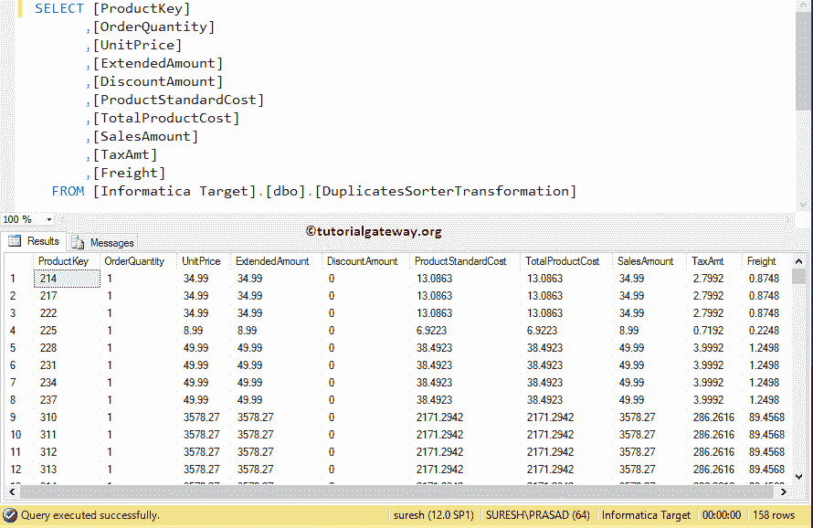

从上面的截图中，您可以观察到 60398 条记录中只有 158 条不同的记录。让我们通过在 [SQL](https://www.tutorialgateway.org/sql/)

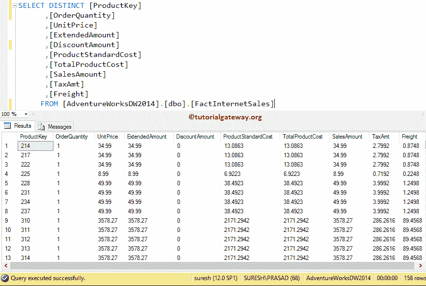

中编写 Distinct 查询来查看相同的内容