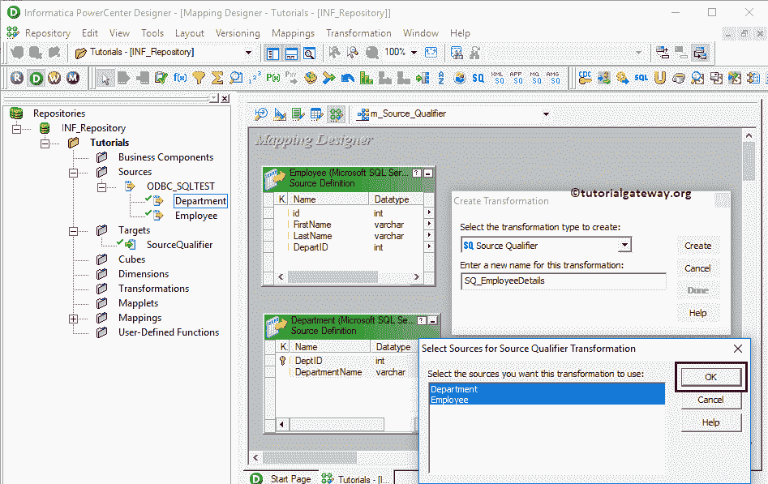

# Informatica中的源限定符转换

> 原文：<https://www.tutorialgateway.org/source-qualifier-transformation-in-informatica/>

Informatica 中的源限定符转换是一种主动的、连接的转换。创建映射时，这是电源中心设计器生成的默认转换。

此 Informatica 源限定符转换将源数据类型转换为本机(Informatica)数据类型。实时地，您可以使用此信息来源限定符转换来连接多个来源、编写自定义查询、筛选行或选择唯一记录

对于这个 Informatica 源限定符转换示例，我们将使用下面的显示数据(雇员表)

和【部门表】

目标表是源限定符。如你所见，这是一张空桌子

## 在 Informatica 中配置源限定符转换

在我们开始配置 Informatica 源限定符转换之前，首先通过提供 Informatica 管理控制台凭据连接到 Informatica 存储库服务。

提示:这里你必须提供你在[安装 Informatica](https://www.tutorialgateway.org/how-to-install-informatica/) 服务器时指定的[管理控制台](https://www.tutorialgateway.org/informatica-admin-console/)用户名和密码。

### 创建源限定符转换源定义

导航至[分析仪](https://www.tutorialgateway.org/informatica-source-analyzer/)并定义您的来源。如前所述，我们使用 SQL Server 数据库中的员工表和部门表作为我们的 [Informatica](https://www.tutorialgateway.org/informatica/) 源定义。请参考【信息】中的[数据库](https://www.tutorialgateway.org/database-source-in-informatica/)了解源定义

的创建

### 创建Informatica 源限定符目标定义

请导航至[目标设计器](https://www.tutorialgateway.org/target-designer-in-informatica/)定义目标。在这个例子中，我们使用现有的 SQL 表(SourceQualifier)作为我们的目标定义。您可以参考[使用定义](https://www.tutorialgateway.org/create-informatica-target-table-using-source-definition/)创建信息目标表，了解创建目标定义

的过程

### 在Informatica 映射中创建源限定符转换

要创建新映射，请导航至菜单栏中的[映射](https://www.tutorialgateway.org/informatica-mapping/)菜单，并选择创建..选项。这将打开映射名称窗口，如下所示。在这里，您必须为此映射编写一个唯一的名称(m_Source_Qualifier)，然后单击“确定”按钮。

#### 在信息中创建源限定符转换

将“员工”和“部门”从“来源”文件夹拖放到映射设计器中。拖动源代码后，Power Center 设计器将自动为您创建源代码限定符转换(默认转换)。

让我删除部门表来源限定符

接下来，我们将部门列添加到员工源限定符中。这是添加两个表

的一种方式

让我删除 SQ_Employee(员工来源限定词)。

#### 创建Informatica 源限定符转换

要在 Informatica 中显式创建源限定符转换，请导航到菜单栏中的转换菜单。接下来，选择创建..选项将打开创建转换窗口，如下所示。

请从下拉列表中选择源限定符转换，并为此转换提供唯一的名称(SQ_EmployeeDetails)，然后单击创建按钮

这将打开如下所示的窗口，如下所示。单击确定选择部门表和员工表。

现在你可以看到和你之前看到的

一样的图像

双击源限定符转换来查看和更改属性。下面的屏幕截图显示了“转换”选项卡中的可用属性列表:

*   选择转换:默认情况下，它将选择您选择(或点击)的转换。
*   重命名:此按钮帮助您重命名源限定符转换名称。
*   描述:使用此位置提供此转换的有效描述。

下面的截图显示了端口选项卡中的可用选项:

*   端口名:可用列名列表。使用新建列按钮添加新列，剪刀按钮删除不需要的列。这里，我们删除 DeptID 列，因为它是一个重复的列
*   一:输入栏。
*   o:这里，复选标记的列是源限定符转换输出列。如果取消选中任何列，则该列将无法加载到目标表中。

在属性下，我们有:

*   SQL 查询:使用此属性编写自定义 SQL 查询。此查询将替换由其生成的默认 SQL 查询。
*   用户定义的连接:使用此属性连接多个数据源。
*   筛选:此属性用于筛选选定的行。它等于 SQL 或任何数据库中的 [Where 子句](https://www.tutorialgateway.org/sql-where-clause/)。
*   已排序端口的数量:这用于对数据进行排序。类似于[订单条款](https://www.tutorialgateway.org/sql-order-by-clause/)
*   跟踪级别:指定跟踪方式(详细)
*   选择不同:此属性用于选择不同(唯一)记录。类似于 [SQL DISTINCT](https://www.tutorialgateway.org/sql-select-distinct-statement/)
*   预 SQL:在集成服务启动之前，使用此属性对源运行 SQL 命令。
*   发布 SQL:在集成服务结束后，使用此属性对源运行 SQL 命令。

让我使用用户定义的连接属性来连接员工表和部门表

如您所见，我们使用以下条件。可以参考 [SQL Joins](https://www.tutorialgateway.org/sql-joins/) 文章了解情况，或者 [Joiner Transformation](https://www.tutorialgateway.org/joiner-transformation-in-informatica/) 了解 Joining 概念。

接下来，将目标定义(源限定符)从目标文件夹拖放到映射设计器中。接下来，将源限定符转换与目标定义连接起来。请使用自动链接..连接它们的选项。

在我们关闭映射之前，让我们保存映射，并通过转到映射菜单栏来验证映射，然后选择验证选项。

### 在Informatica 工作流中创建源限定符转换

创建完映射后，我们必须为它创建工作流。电源中心工作流管理器提供了两种创建工作流的方法。

*   [手动创建工作流](https://www.tutorialgateway.org/informatica-workflow/)
*   [使用向导创建工作流](https://www.tutorialgateway.org/informatica-workflow-using-wizard/)

在本例中，我们将手动创建工作流。为此，请导航至工作流菜单并选择创建选项。这将打开创建工作流窗口，如下所示。请提供唯一的名称(wf_Source_Qualifier)并保留默认设置。

一旦我们创建了工作流，下一步就是为我们的映射创建会话任务。

#### 创建源限定符会话

informatica 中有两种类型的会话:

*   [信息中不可恢复的会话](https://www.tutorialgateway.org/session-in-informatica/)
*   [Informatica中的可重用会话](https://www.tutorialgateway.org/reusable-session-in-informatica/)

在这个例子中，我们创建了一个可重用的会话，并将其命名为会话的 s_EmployeeDept_fromSQL_ToSQL。请链接开始任务和会话任务。接下来，导航到工作流菜单并选择验证选项以验证工作流。

从上面的截图中，您可以观察到 Informatica 工作流中的源限定符转换是有效的。

现在，让我启动工作流。为此，请导航到“工作流”菜单，并选择“启动工作流”选项。

让我们打开 [SQL Server](https://www.tutorialgateway.org/sql/) 来检查我们是否使用 Informatica

中的源限定符转换成功执行了连接