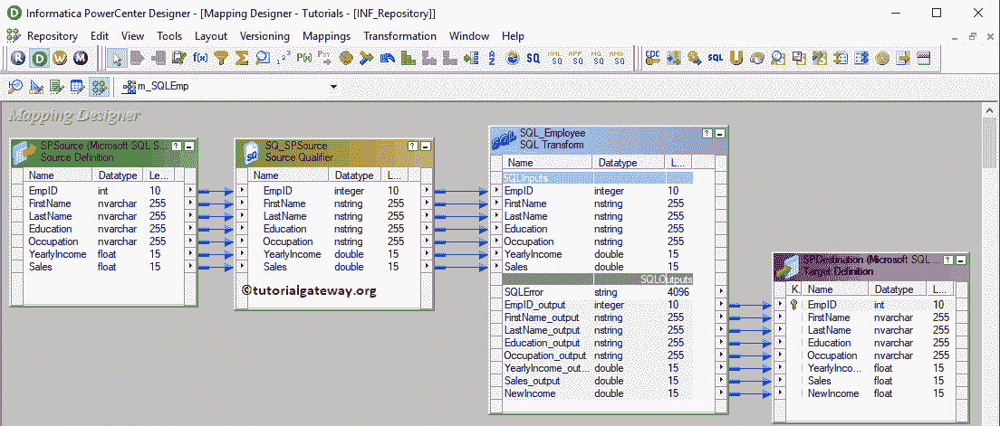

# Informatica 中的 SQL 转换

> 原文：<https://www.tutorialgateway.org/sql-transformation-in-informatica/>

Informatica 中的 SQL 转换用于在转换过程中编写或使用 SQL 查询。使用此 SQL 转换，您可以在数据库中插入、删除或更新行。如果您熟悉 SQL，那么您可以使用这个转换。

在这里，我们通过一个例子向您展示如何使用 Informatica SQL 转换在转换中编写 SQL 查询。对于这个 Informatica SQL 转换示例，我们将使用 SP 源表和目标表。


## 信息示例中的 SQL 转换

这个例子展示了如何在 Informatica 中使用 SQL 转换对数据库运行 SQL 脚本或查询。在我们开始配置之前，首先，连接到 Informatica 存储库服务。

为此，请输入您在[安装 Informatica](https://www.tutorialgateway.org/how-to-install-informatica/) 服务器时指定的[管理控制台](https://www.tutorialgateway.org/informatica-admin-console/)用户名和密码。

### 在Informatica 源定义中创建 SQL 转换

连接成功后，请导航至[源分析器](https://www.tutorialgateway.org/informatica-source-analyzer/)并定义您的[信息](https://www.tutorialgateway.org/informatica/)源。在本例中，我们使用来自 SQL Server 数据库的源表作为源定义。请参考文章中的[数据库来源。](https://www.tutorialgateway.org/database-source-in-informatica/)

[](https://www.tutorialgateway.org/database-source-in-informatica/)

### 在信息目标定义中创建 SQL 转换

请导航至[目标设计器](https://www.tutorialgateway.org/target-designer-in-informatica/)定义目标。在这个 SQL 转换示例中，我们使用现有的 SQL 表(服务点目标)作为我们的目标定义。您可以参考[使用源定义](https://www.tutorialgateway.org/create-informatica-target-table-using-source-definition/)创建目标表一文。


### 创建信息 SQL 转换映射

要为信息 SQL 转换创建新映射，请导航到映射菜单并选择创建..选项。


选择“创建”后..选项，一个新的[映射](https://www.tutorialgateway.org/informatica-mapping/)名称窗口打开。让我提供 m_SQLEmp 作为映射名称，然后单击“确定”按钮。


将服务点源从源文件夹拖放到映射设计器中。拖动源后，[动力中心设计器](https://www.tutorialgateway.org/informatica-powercenter-designer/)会自动为您创建[源限定符转换](https://www.tutorialgateway.org/source-qualifier-transformation-in-informatica/)(默认转换)。


#### 在信息中创建 SQL 转换

要在 Informatica 中创建 SQL 转换，请导航至[转换](https://www.tutorialgateway.org/informatica-transformations/)菜单并选择创建..选择权


选择创建..选项将打开“创建转换”窗口。请选择 SQL 转换并提供唯一名称(SQL_Employee)，然后点击【创建】按钮


单击创建按钮将弹出一个名为信息 SQL 转换的新窗口。

*   查询模式:使用此选项直接在转换中编写查询。您可以在[数据库](https://www.tutorialgateway.org/how-to-create-database-in-sql-server/)中插入、[删除](https://www.tutorialgateway.org/sql-delete-statement/)或[更新](https://www.tutorialgateway.org/sql-update-statement/)行
*   脚本模式:如果你的 [SQL Server](https://www.tutorialgateway.org/sql/) 查询保存在一个脚本文件中，那么你可以使用这个选项。如果选择此选项，则必须传递脚本文件名。
*   数据库类型:请选择数据库类型。例如，SQL、Oracle 等。
*   静态连接:如果希望连接是静态的，请选择此选项。
*   动态连接:为动态连接选择此选项。
*   被动模式下的 SQL 转换:默认情况下，Informatica SQL 转换处于主动模式。通过选中此选项，您可以将其转换为被动模式。


对于这个演示，我们将编写一个选择查询。因此，让我将数据库类型更改为[微软 SQL Server](https://www.tutorialgateway.org/sql/) 并选择查询模式


单击“确定”将为您创建一个Informatica中的活动 SQL 转换。


让我将源代码定义中所有可用的字段拖到 Informatica 中的 SQL Transformation 中。它会自动创建一组输入和输出字段。


双击信息映射编辑器中的 SQL 转换来编辑或配置转换。在端口选项卡下，您可以从源定义输入中看到自动生成的输出端口。


SQL 端口:这是这个转换中最关键的选项卡。这是我们要编写查询或选择脚本的地方。在我们开始编写脚本之前，让我添加一个额外的字段，因为我们的目标表有一个新收入列。为此，点击新建字段按钮


它向输出部分添加了一个额外的列


请将该列重命名为“新收入”，并更改其本机类型。接下来，更改每个输入和输出字段的本机类型，以匹配源和目标定义。完成后，单击 SQL 查询旁边的箭头。


它会打开一个带有可用参数的 SQL 编辑器。如您所见，我们正在使用[选择报表](https://www.tutorialgateway.org/sql-select-statement/)从 SP 来源表中选择年收入，并为每个员工记录添加 45999。查询是:

```
SELECT YearlyIncome + 45999 FROM SPSource
WHERE EmpID = ?EmpID?
```


检查一切是否正常。请记住，无论我们从选择语句中获得什么数据，都保存为输出，并且我们的输出字段是新收入。因此，新收入=年收入+ 45999，其中 Emp ID = 1，2，3，..15


接下来，将目标定义(服务点目标)从目标文件夹拖放到映射设计器中。接下来，使用自动链接将 SQL 转换输出字段与目标定义连接起来..选项。



在我们关闭映射之前，让我们保存并验证 Informatica SQL 转换映射，方法是转到映射菜单栏，并选择验证选项。

### 在Informatica 工作流中创建一个 SQL 转换

创建完映射后，我们必须为它创建工作流。PowerCenter 工作流管理器提供了两种创建工作流的方法。

*   [手动创建工作流](https://www.tutorialgateway.org/informatica-workflow/)
*   [使用向导创建工作流](https://www.tutorialgateway.org/informatica-workflow-using-wizard/)

在这个 Informatica SQL 转换示例中，我们将手动创建工作流。为此，请导航至工作流菜单并选择创建选项。


它打开创建工作流窗口以提供唯一的名称(wf_SQLEmployee)并保留默认设置


一旦我们创建了工作流，下一步就是为我们的映射创建一个会话任务。

#### 步骤 4(a):在 Informatica 中为 SQL 转换创建会话

Informatica 中有两种类型的会话:

*   [不可重用会话](https://www.tutorialgateway.org/session-in-informatica/)
*   [可重用会话](https://www.tutorialgateway.org/reusable-session-in-informatica/)

对于这个 Informatica SQL 转换示例，我们创建了一个不可重用的会话。要创建不可重复使用的会话，请导航到任务菜单并选择创建选项。


请为此会话提供唯一的名称。在这里，我们将其命名为 s_SQLEmployee。单击“创建”按钮后，将打开一个名为“映射”的新窗口。在这里，您必须选择要与此会话关联的映射，即 m_SQLEmp。


双击会话任务将打开编辑任务窗口。在属性选项卡中

$Source 连接值:该属性将关系源信息存储在$Source 变量中。因此，点击我们在下面标记的箭头，选择Informatica 源作为源信息。


$Target 连接值:该属性将关系目标信息存储在$Target 变量中。因此，单击我们在下面标记的箭头，并选择信息目标作为目标信息。


在映射选项卡中，我们必须配置源和目标连接。首先，让我们通过单击“源”文件夹中的 SQ_SPSource 源来配置源连接。

在连接中，单击关系类型旁边的箭头按钮，并使用我们在上一步中创建的连接变量，即:$Source


现在，我们必须配置目标连接。因此，单击目标文件夹中的目标。在连接中，单击关系类型旁边的箭头按钮，并使用连接变量$Target


最后，我们必须配置信息 SQL 转换。因此，点击[转换](https://www.tutorialgateway.org/informatica-transformations/)文件夹中的 SQL_Employee。

在连接中，单击关系类型旁边的箭头按钮，并使用连接变量$Source。因为我们使用[选择语句](https://www.tutorialgateway.org/sql-select-statement/)从Informatica 源中选择记录。


完成会话配置后，导航到工作流菜单，并选择验证选项来验证工作流。


现在，让我开始Informatica 工作流中的 SQL 转换。为此，请导航到“工作流”菜单并选择“启动工作流”选项。


打开 [SQL Server 管理工作室](https://www.tutorialgateway.org/sql-server-management-studio/)，编写如下 [SQL](https://www.tutorialgateway.org/sql/) 查询。

