# Informatica 中的存储过程转换

> 原文：<https://www.tutorialgateway.org/stored-procedure-transformation-in-informatica/>

Informatica 中的存储过程转换可帮助您在 Informatica 工作流中使用或调用存储过程。使用此转换，您可以操作删除或重新创建索引、检查数据库中的空间、执行复杂计算。

本文通过一个例子展示了如何使用 Informatica 存储过程转换来回滚传递的记录。对于这个 Informatica 存储过程转换示例，我们将使用 SP 源表和目标表。

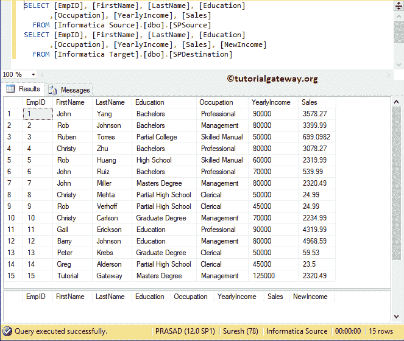

我们要使用的存储过程是:

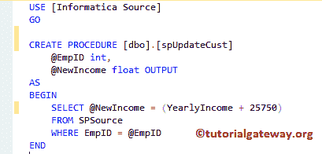

从上面的截图可以看到，存储过程有一个[输入参数](https://www.tutorialgateway.org/input-parameters-in-sql-stored-procedure/)和一个[输出参数](https://www.tutorialgateway.org/output-parameters-in-sql-stored-procedure/)

提示:我们在 SQL Server 教程中解释了关于存储过程及其功能的一切。我建议你参考[存储过程](https://www.tutorialgateway.org/stored-procedures-in-sql/)文章来理解这个话题。

## Informatica示例中的存储过程转换

让我们看看如何在 Informatica 中使用存储过程转换来调用 Informatica 工作流中的存储过程。在我们开始配置之前，首先，让我连接 [Informatica](https://www.tutorialgateway.org/informatica/) 存储库服务。

为此，我们必须提供[管理控制台](https://www.tutorialgateway.org/informatica-admin-console/)凭证。因此，请在[安装 Informatica](https://www.tutorialgateway.org/how-to-install-informatica/) 服务器时提供您指定的相应用户名和密码。

### Informatica 中存储过程转换的源定义

连接成功后，请导航至[源分析器](https://www.tutorialgateway.org/informatica-source-analyzer/)并定义您的源。这里，我们使用来自 SQL 数据库的源表作为我们的源定义。请参考【信息】中的[数据库源](https://www.tutorialgateway.org/database-source-in-informatica/)了解创建源定义

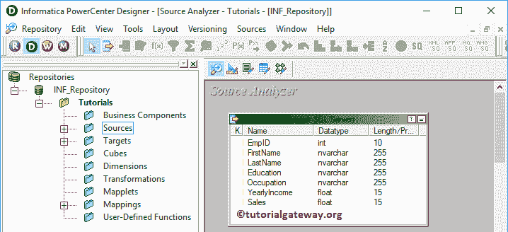

的步骤

### 为存储过程转换创建目标定义

请导航到[目标设计器](https://www.tutorialgateway.org/target-designer-in-informatica/)来定义 Informatica 存储过程转换目标。在本例中，我们使用现有的 SQL 表(服务点目标)作为目标定义。可以参考[创建目标表](https://www.tutorialgateway.org/create-informatica-target-table-using-source-definition/)了解创建目标定义

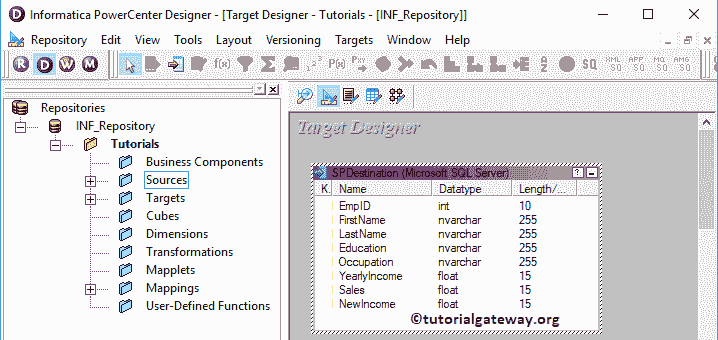

的过程

### 为Informatica 存储过程转换创建映射

要创建新映射，请导航到菜单栏中的映射菜单，并选择创建..选项。

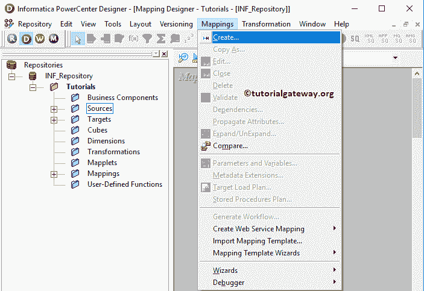

选择“创建”后..选项，将会打开一个新的映射名称窗口。让我提供 m_StoreProc 作为映射名称，然后单击“确定”按钮。

提示:请参考[Informatica 映射](https://www.tutorialgateway.org/informatica-mapping/)文章，了解创建制图

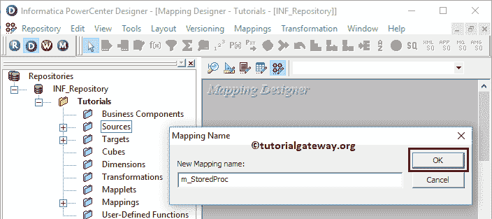

的程序

将服务点源从源文件夹拖放到映射设计器中。拖动源后，[动力中心设计器](https://www.tutorialgateway.org/informatica-powercenter-designer/)会自动为您创建[源限定符转换](https://www.tutorialgateway.org/source-qualifier-transformation-in-informatica/)(默认转换)。

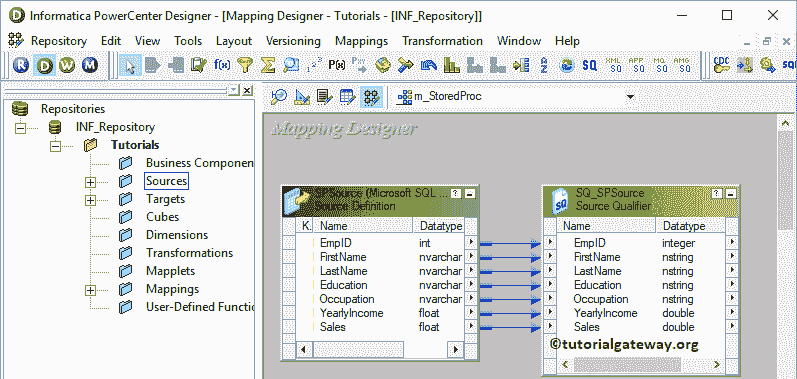

#### 创建Informatica 存储过程转换

要在 Informatica 中创建存储过程转换，请导航到菜单栏中的转换菜单。接下来，选择创建..选项

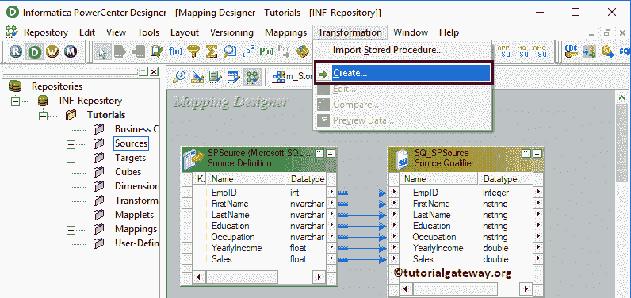

选择创建..选项将打开“创建转换”窗口。请从下拉列表中选择存储过程转换，并提供唯一的名称(sp_Testing)，然后单击创建按钮

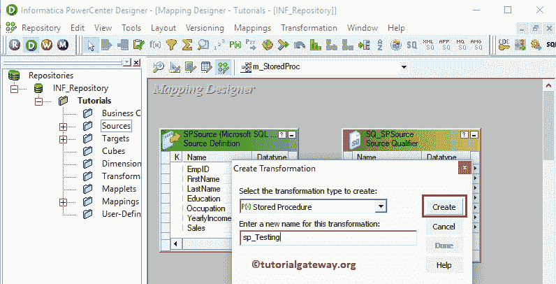

单击创建按钮将弹出一个名为导入存储过程的新窗口。请选择将与 Informatica 源连接的 ODBC 连接。这是我们的存储过程创建的地方。要创建新的 ODBC 连接，请参考 [Informatica ODBC 连接](https://www.tutorialgateway.org/informatica-odbc-connection/)一文。

从下面的截图中，可以看到我们选择了 spUpdateCust 存储过程。

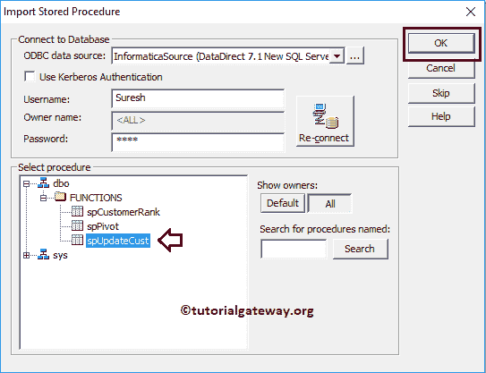

单击“确定”将为您创建一个 Informatica 存储过程转换。从下面的截图可以看到，它有三个端口:Return_value、EmpId 和 New Income

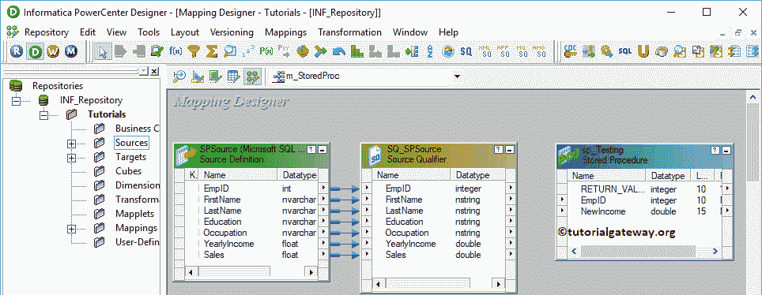

接下来，将目标定义(SPDestination)从“目标”文件夹拖放到映射设计器。

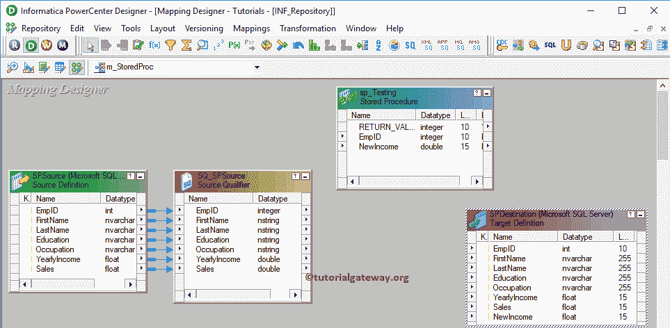

接下来，我们将把 EmpId 从源限定符连接到存储过程转换。因为 spUpdateCust 接受一个输入参数(EmpId)来返回新收入输出。

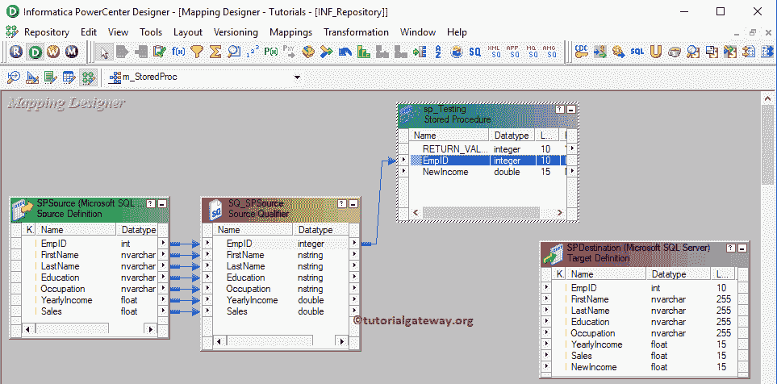

双击 Informatica 存储过程转换来查看和更改属性。下面的屏幕截图显示了“转换”选项卡中的可用属性列表:

*   选择转换:默认情况下，它将选择您选择(或点击)的转换。
*   重命名:此按钮帮助您重命名存储过程转换名称。
*   描述:使用此位置提供此转换的有效描述。

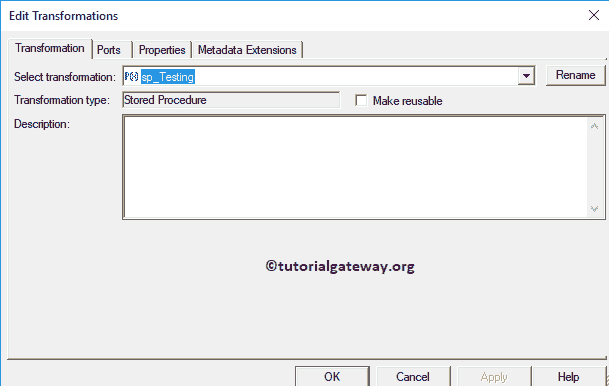

下面的屏幕截图显示了 Informatica 存储过程转换端口选项卡中的可用选项:

*   端口名:可用列名列表。使用新建列按钮添加新列，剪刀按钮删除不需要的列。
*   I:存储过程转换输入列。
*   o:这里，复选标记的列是存储过程转换输出列。

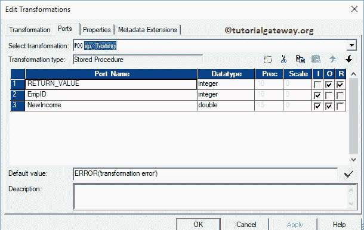

在属性选项卡中，单击连接信息类型旁边的箭头按钮，并使用连接变量$Source，因为我们使用了存在于 Informatica 源中的存储过程。

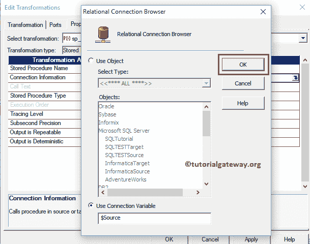

将源限定符转换中存在的所有字段拖放到目标定义。请使用自动链接..连接它们的选项。接下来，将存储过程转换中的新收入字段与目标定义连接起来。

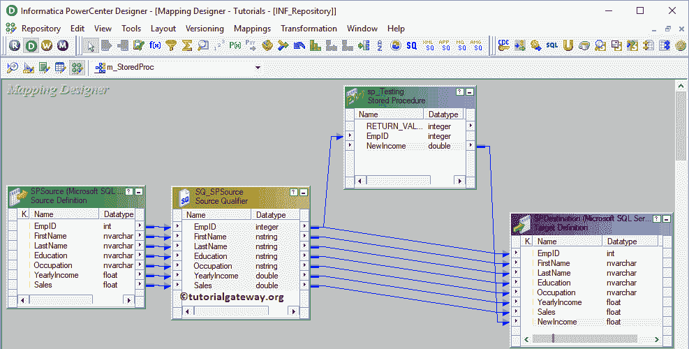

在我们关闭映射之前，让我们保存映射，并通过转到映射菜单栏来验证映射，然后选择验证选项。

### 在 Informatica 中创建存储过程转换的工作流

创建完 Informatica 存储过程转换映射后，我们必须为它创建工作流。PowerCenter 工作流管理器提供了两种创建工作流的方法。

*   [手动创建工作流](https://www.tutorialgateway.org/informatica-workflow/)
*   [使用向导创建工作流](https://www.tutorialgateway.org/informatica-workflow-using-wizard/)

在这个 Informatica 存储过程转换示例中，我们将手动创建工作流。为此，请导航至工作流菜单并选择创建选项。

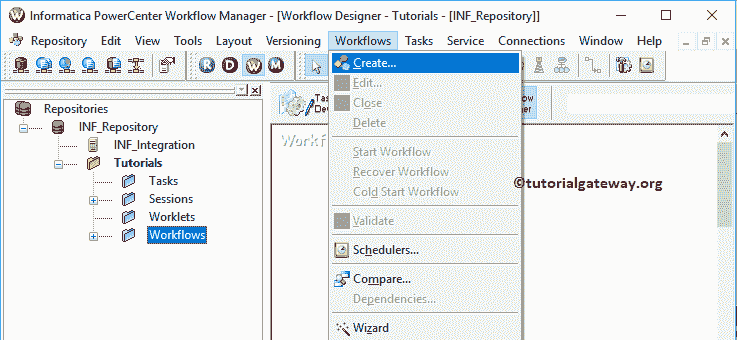

它会打开“创建工作流”窗口。请提供唯一的名称(wf_StoredProc)并保留默认设置。

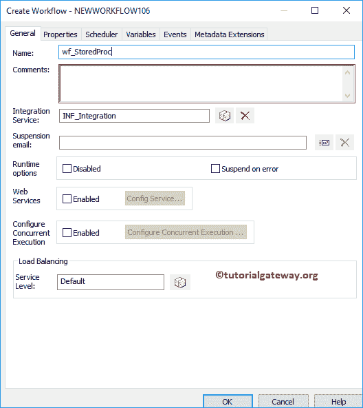

一旦我们创建了工作流，下一步就是为我们的映射创建一个会话任务。

#### 在 Informatica 中为存储过程转换创建会话

Informatica 中有两种类型的会话:

*   [Informatica中不可重用的会话](https://www.tutorialgateway.org/session-in-informatica/)
*   [Informatica 中的可重用会话](https://www.tutorialgateway.org/reusable-session-in-informatica/)

对于这个 Informatica 存储过程转换示例，我们创建了一个不可重用的会话。要创建不可重复使用的会话，请导航到任务菜单并选择创建选项。

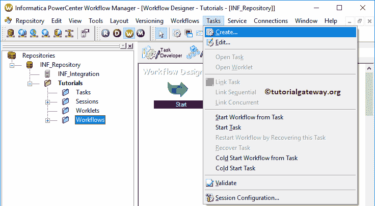

请为此会话提供唯一的名称。在这里，我们将其命名为 s_StoredProc。单击“创建”按钮后，将打开一个名为“映射”的新窗口。在这里，您必须选择要与此会话关联的映射，即 m_Storedproc。

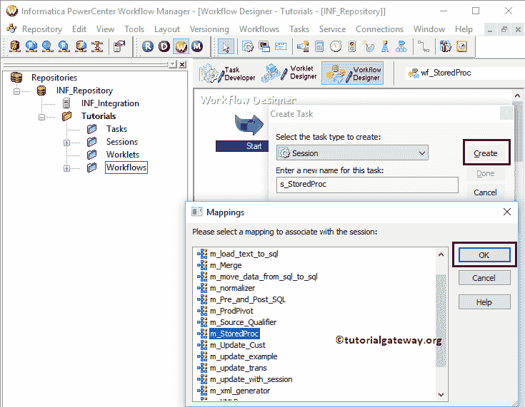

双击会话任务将打开编辑任务窗口。在属性选项卡中

$Source 连接值:该属性将关系源Informatica 存储在$Source 变量中。因此，点击我们在下面标记的箭头，选择 Informatica 源作为源信息。

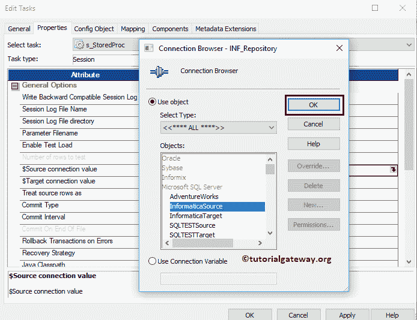

$Target 连接值:该属性将关系目标Informatica 存储在$Target 变量中。因此，单击我们在下面标记的箭头，并选择Informatica 目标作为目标信息。

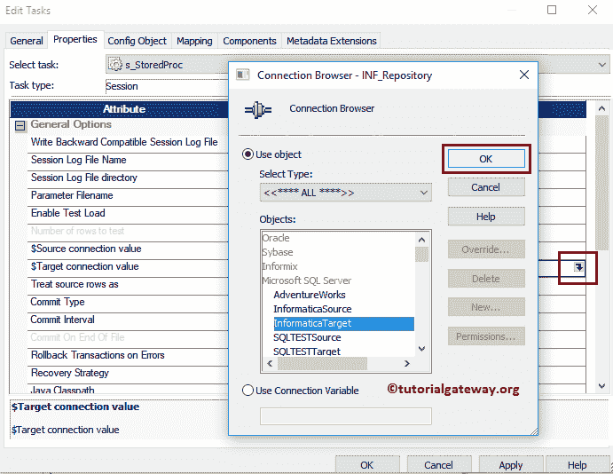

在映射选项卡中，我们必须配置源和目标连接。首先，让我们通过单击“源”文件夹中的 SQ_SPSource 源来配置源连接。

在连接中，单击关系类型旁边的箭头按钮。并使用我们在上一步中创建的连接变量，即$Source

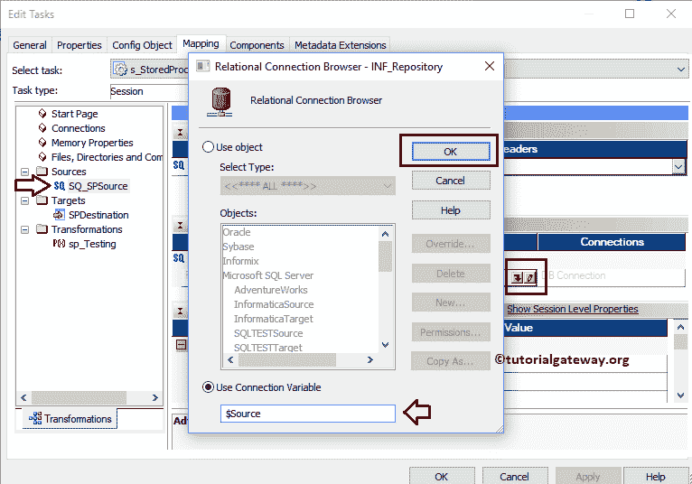

现在，我们必须配置目标连接。因此，单击目标文件夹中的目标。在连接中，点击关系类型旁边的箭头按钮，并使用连接变量$Target

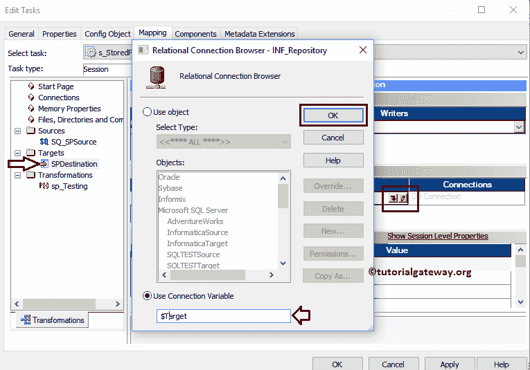

在这里，我们还可以配置存储过程转换的连接信息。为此，点击[转换](https://www.tutorialgateway.org/informatica-transformations/)文件夹中的 SP_Testing。

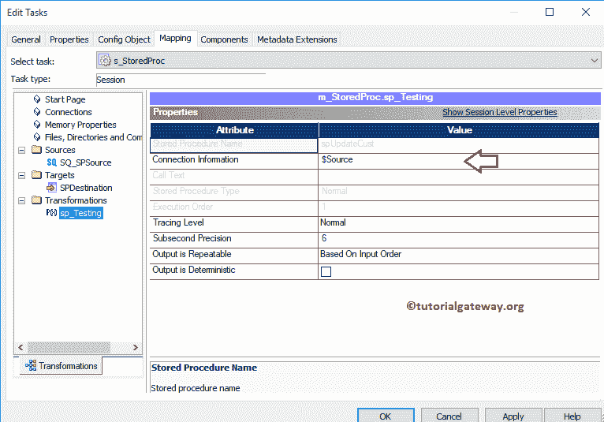

接下来，导航到工作流菜单并选择验证选项以验证工作流。

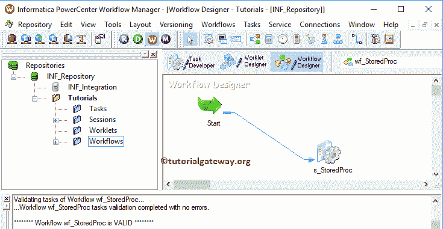

现在，让我启动 Informatica 存储过程转换工作流。为此，请导航到“工作流”菜单并选择“启动工作流”选项。

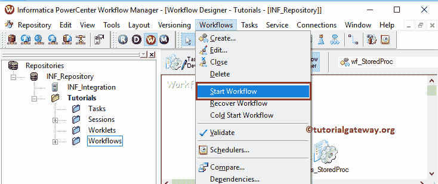

让我们打开 [SQL Server 管理工作室](https://www.tutorialgateway.org/sql-server-management-studio/)，编写如下 [SQL](https://www.tutorialgateway.org/sql/) 查询。

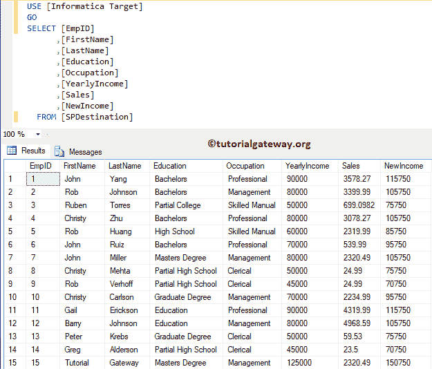