# Informatica 中的事务控制转换

> 原文：<https://www.tutorialgateway.org/transaction-control-transformation-in-informatica/>

Informatica 中的事务控制转换允许您控制转换中的事务。使用这个事务控制转换，您可以提交或回滚通过它的记录(或行)。

对于这个信息事务控制转换示例，我们将使用服务点源和目标表。

## 信息示例中的事务控制转换

在本例中，我们将向您展示如何在 Informatica 中使用事务控制转换来执行回滚事务。在我们开始配置之前，首先，让我连接到 Informatica 存储库服务。

为此，我们必须提供[信息管理控制台](https://www.tutorialgateway.org/informatica-admin-console/)凭证。因此，请在[安装 Informatica](https://www.tutorialgateway.org/how-to-install-informatica/) 服务器时提供您指定的相应用户名和密码。

提示:我们在 [SQL 事务](https://www.tutorialgateway.org/sql-transaction/)文章中解释了关于事务及其功能的一切。

### Informatica 中事务控制转换的源定义

连接成功后，请导航至[源分析器](https://www.tutorialgateway.org/informatica-source-analyzer/)并定义您的源。在这个 Informatica 事务控制转换示例中，我们使用来自 SQL Server 数据库的 Sp 源表作为我们的源定义。请参考[Informatica](https://www.tutorialgateway.org/database-source-in-informatica/)中的数据库来源，了解创建 [Informatica](https://www.tutorialgateway.org/informatica/) 来源定义

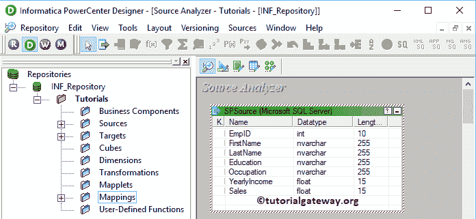

的步骤

### 为信息事务控制转换创建目标定义

请导航至[目标设计器](https://www.tutorialgateway.org/target-designer-in-informatica/)定义目标。在本例中，我们使用现有的 SQL 表(服务点目标)作为目标定义。可以参考[创建信息目标表](https://www.tutorialgateway.org/create-informatica-target-table-using-source-definition/)了解创建目标定义

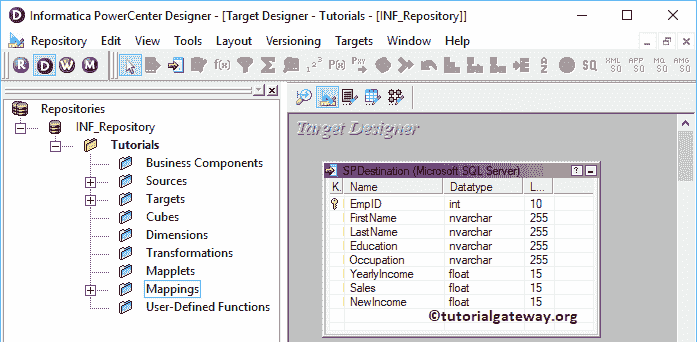

的过程

### 在 Informatica 中为事务控制转换创建映射

要创建新映射，请导航到菜单栏中的映射菜单，并选择创建..选项。

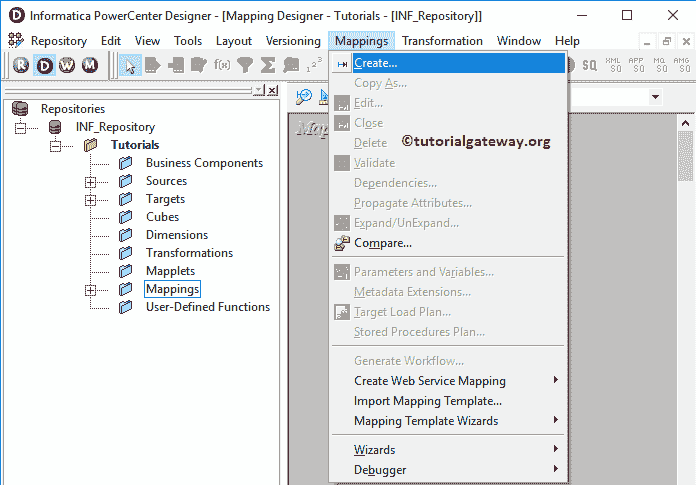

选择“创建”后..选项，将打开一个新的[映射](https://www.tutorialgateway.org/informatica-mapping/)名称窗口。让我提供 m_Transaction 作为映射名称，然后单击“确定”按钮。

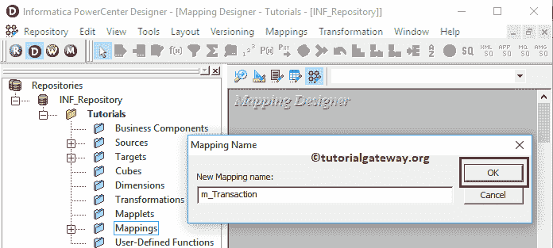

将服务点源从源文件夹拖放到映射设计器中。拖动源后，[动力中心设计器](https://www.tutorialgateway.org/informatica-powercenter-designer/)会自动为您创建[源限定符转换](https://www.tutorialgateway.org/source-qualifier-transformation-in-informatica/)(默认转换)。

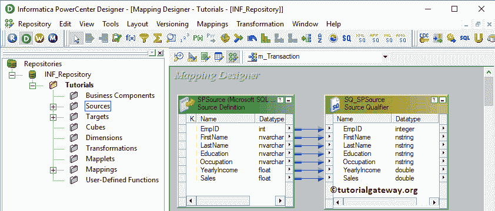

#### 创建信息事务控制转换

要在 Informatica 中创建事务控制转换，请导航到菜单栏中的转换菜单。接下来，选择创建..选项

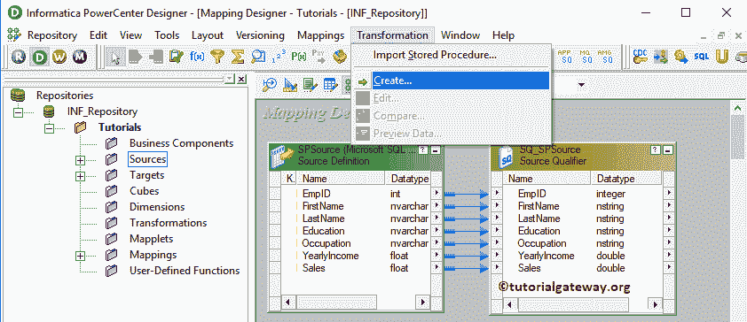

选择创建..选项将打开“创建转换”窗口。请从下拉列表中选择事务控制转换，并提供唯一名称(Tran_Employee)，点击【创建】按钮

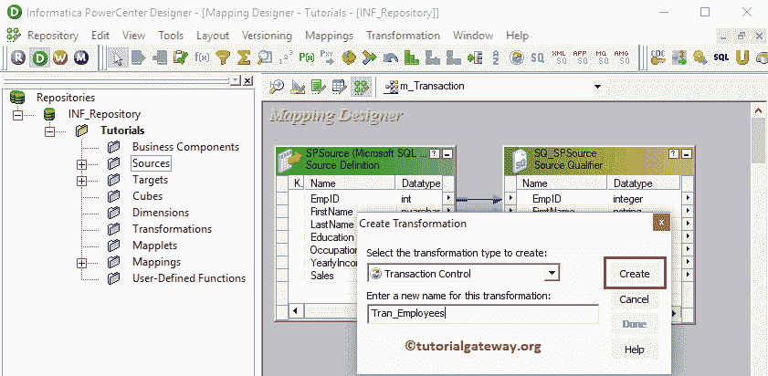

单击“确定”将为您创建一个事务控制转换。

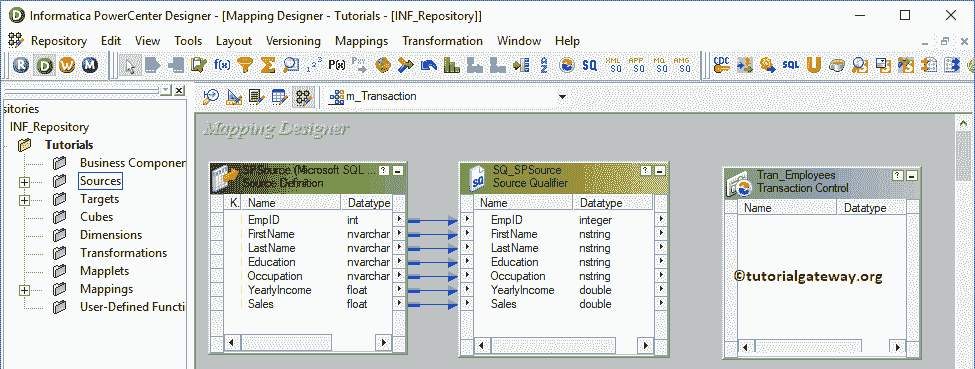

让我将源代码定义中所有可用的字段拖到事务控制转换中。接下来，将目标定义(服务点目标)从目标文件夹拖放到映射设计器中。最后，使用自动链接将事务处理控制转换字段与目标定义连接起来..选项。

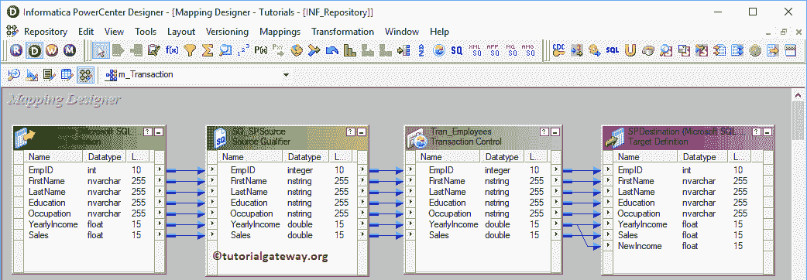

双击信息事务控制转换来编辑或配置转换。请转到属性选项卡，并单击事务控制条件旁边的箭头，以在映射级别应用事务。

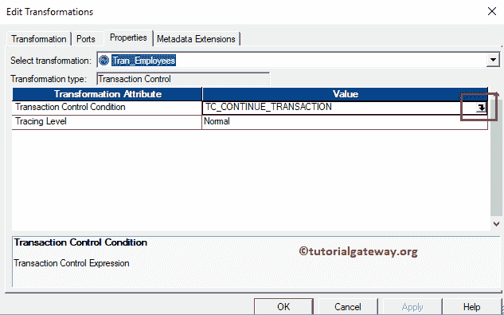

单击箭头后，将打开一个表达式窗口。事务控制转换中的表达式窗口使用 [IIF 函数](https://www.tutorialgateway.org/sql-iif-function/)根据条件测试每一行。

Informatica 事务控制转换提供了以下应用事务的内置变量。出于演示目的，让我们采用上面指定的 SP Source 表，条件是 EmpID = 5。

*   TC_CONTINUE_TRANSACTION:这是此选项的默认值。它不会对此行执行任何更改。
*   TC_COMMIT_BEFORE:这只不过是任何关系数据库中的一个 Commit [事务](https://www.tutorialgateway.org/sql-transaction/)。如果条件为真，那么它将首先提交事务。接下来，它将开始新的事务并写入当前行。示例:它将提交直到 EmpID 4 的记录，并启动一个新的事务来提交从 5 开始的记录
*   如果条件为真，那么它将首先写入当前行并提交事务。接下来，它将开始一项新的事务。示例:它将在 EmpID 5 之前写入和提交记录，并从 6 开始新的事务来提交记录
*   这在任何关系数据库中都不是回滚事务。如果条件为真，它将首先回滚事务。接下来，它将开始新的事务并写入当前行。示例:它将回滚记录到 EmpID 4，并开始一个新的事务来提交来自 5 的记录
*   TC_ROLLBACK_AFTER:如果条件为真，将首先写入当前行，然后回滚事务。接下来，它将开始一项新的事务。示例:它将回滚记录到 EmpID 5，并开始一个新的事务来提交 6 中的记录

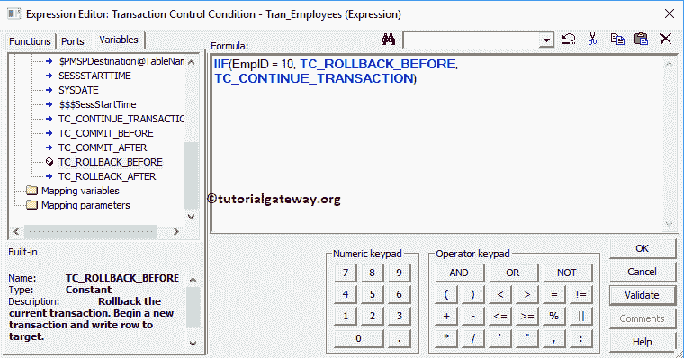

单击应用，然后单击确定关闭信息事务控制转换窗口。

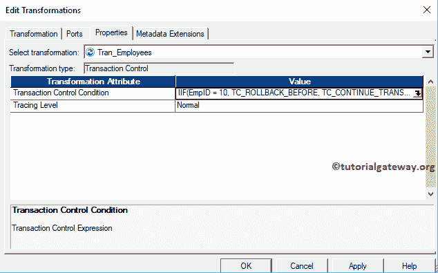

在我们关闭映射之前，让我们保存映射，并通过转到映射菜单栏来验证映射，然后选择验证选项。

### 创建用于信息事务控制转换的工作流

创建完信息事务控制转换映射后，我们必须为其创建工作流。PowerCenter 工作流管理器提供了两种创建工作流的方法。

*   [手动创建工作流](https://www.tutorialgateway.org/informatica-workflow/)
*   [使用向导创建工作流](https://www.tutorialgateway.org/informatica-workflow-using-wizard/)

在这个信息事务控制转换示例中，我们将手动创建工作流。为此，请导航至工作流菜单并选择创建选项。

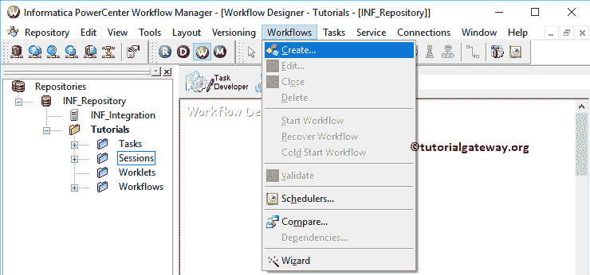

它将打开“创建工作流”窗口。请提供唯一的名称(wf_Transaction)并保留默认设置。

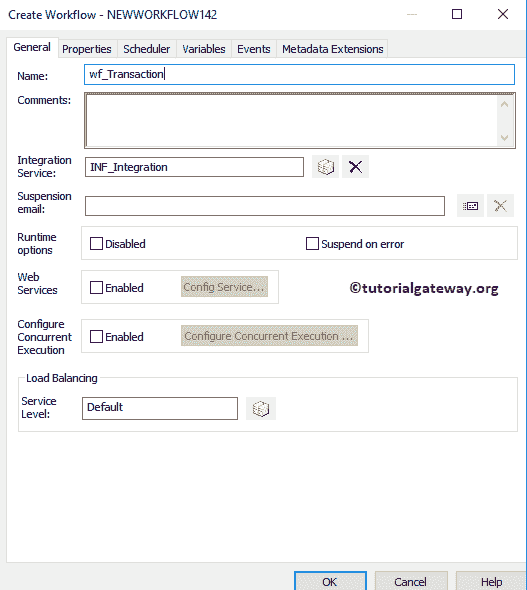

一旦我们创建了工作流，下一步就是为我们的映射创建一个会话任务。

#### 在 Informatica 中为事务控制转换创建会话

Informatica 中有两种类型的会话:

*   [信息中不可重用的会话](https://www.tutorialgateway.org/session-in-informatica/)
*   [Informatica 中的可重用会话](https://www.tutorialgateway.org/reusable-session-in-informatica/)

对于这个信息事务控制转换的例子，我们创建了一个不可重用的会话。要创建不可重复使用的会话，请导航到任务菜单并选择创建选项，如下所示。

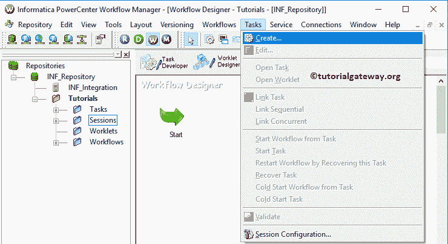

在这里，我们将这个会话命名为 s_Transaction。单击“创建”按钮后，将打开一个名为“映射”的新窗口。在此，选择要与此会话关联的映射(m_Transaction)。

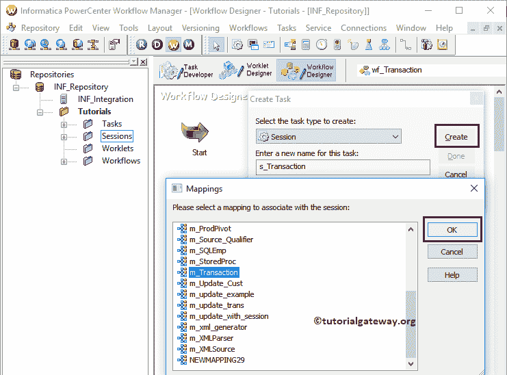

双击会话任务将打开编辑任务窗口。在映射选项卡中，我们必须配置源、目标连接。

首先，让我们通过单击“源”文件夹中的 SQ_SPSource 源来配置源连接。在连接中，点击关系类型旁边的箭头按钮，选择数据库对象(数据库名称)，即【信息来源】

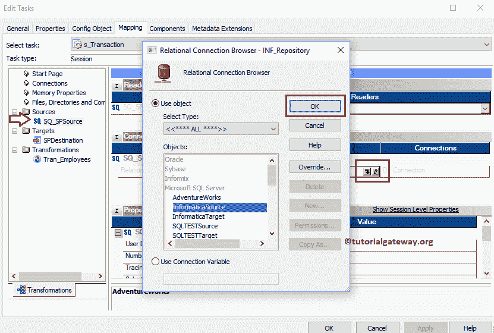

现在，我们必须配置目标连接。因此，单击目标文件夹中的目标。在连接中，点击关系类型旁边的箭头按钮，选择数据库对象(目标数据库名称)，即【信息目标】

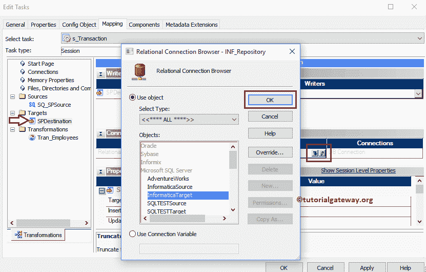

请根据您的要求将目标装载类型更改为“正常”或“批量”。让我勾选截断目标表选项。

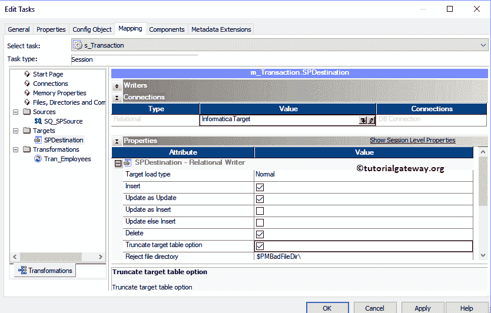

接下来，导航到工作流菜单并选择验证选项以验证工作流。

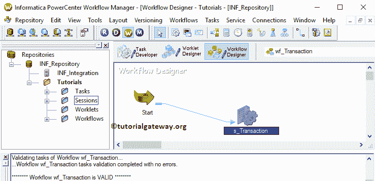

现在，让我开始信息事务控制转换工作流。为此，请导航到“工作流”菜单并选择“启动工作流”选项。

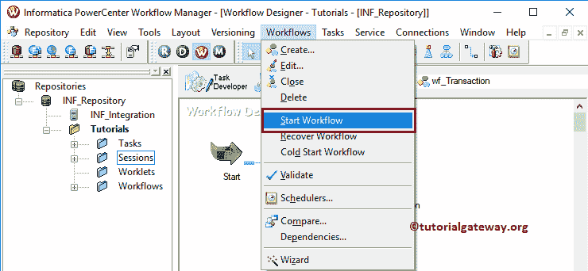

让我们打开 [SQL Server 管理工作室](https://www.tutorialgateway.org/sql-server-management-studio/)并编写下面的 [SQL](https://www.tutorialgateway.org/sql/) 查询来检查我们是否成功地从一个源传输了数据。如您所见，我们的目标表显示的是 EmpID = 10 的记录。因为回滚将在处理 EmpID 为 10

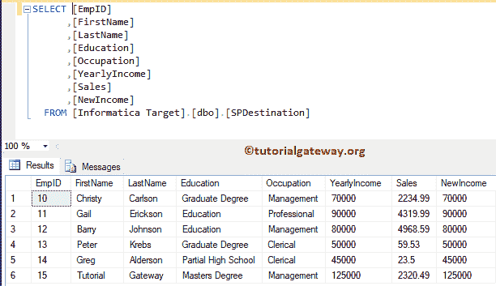

的记录之前开始

这次我们将使用 TC_ROLLBACK_AFTER 作为 IIF 的第二个参数。这意味着回滚选项将在传递 EmpID 10 后执行。

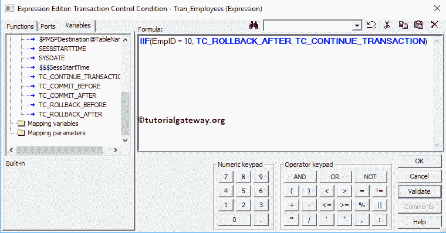

如您所见，我们的目标表正在显示 EmpID 大于 10

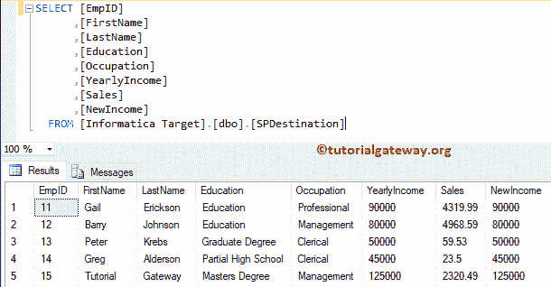

的记录