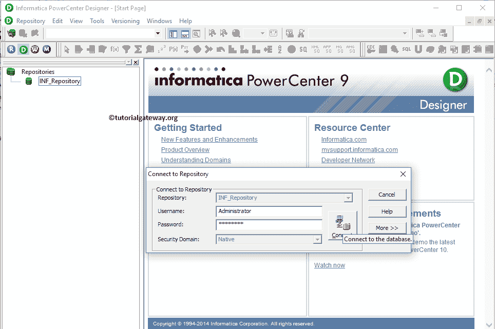
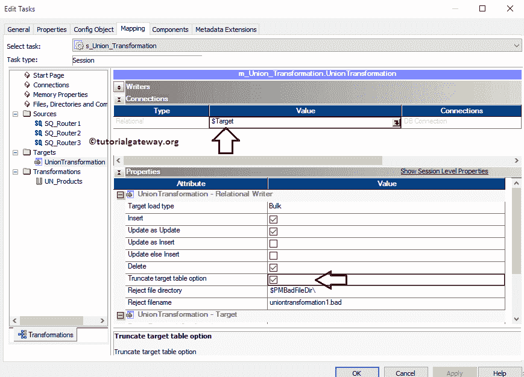

# Informatica中的联合转换

> 原文：<https://www.tutorialgateway.org/union-transformation-in-informatica/>

Informatica 中的 Union Transformation 用于组合来自多个源(excel 文件、平面文件等)或多个 SQL 表的数据，并生成一个输出以存储在目标表中。它是一个主动转换，类似于 SQL Union All。

Informatica中的联合转换在实时中非常有用。例如，如果公司有 100 家商店，每个商店都维护自己的销售数据。一天结束时，它们都属于一家公司，你的工作是找出任何单一产品的一个月或一年的销售额。访问 100 家商店或交叉检查 100 个 excel 或平面文件并计算销售额是不切实际的。

在这种情况下，你所要做的就是，使用 Informatica 中的 Union Transformation，将来自 100 家商店的 100 个 excel 文件全部合并，存储在数据仓库中，然后，从数据库中计算产品销售额。

## 信息指南中的联合转换

当您使用信息联盟转换时，请记住以下准则:

*   信息联合转换允许多个输入组，但产生一个输出。
*   它不会从输入源中删除重复的记录。
*   它不会产生交易。
*   您不能使用序列生成器转换来生成序列

对于这个信息联盟转换示例，我们将使用我们使用[路由转换](https://www.tutorialgateway.org/router-transformation-in-informatica/)创建的 SQL 表。下面的截图将显示[路由 1]表中的数据。

[路由 2]表中的数据。

[路由 3]表中的数据。

这里，我们的任务是使用 Informatica Union 转换组合这三个表，并将其保存在目标表中。

## 在信息中配置联合转换

在我们开始在 Informatica 中配置联合转换之前，首先连接到 [Informatica](https://www.tutorialgateway.org/informatica/) 存储库服务。为了连接存储库服务，我们必须提供[信息管理控制台](https://www.tutorialgateway.org/informatica-admin-console/)凭证。因此，请提供适当的用户名和密码，并点击连接按钮，如下所示。

提示:这里你必须提供你在[安装 Informatica](https://www.tutorialgateway.org/how-to-install-informatica/) 服务器时指定的管理员用户名和密码。

### 在Informatica 源定义中创建联合转换

连接成功后，请导航至[源分析器](https://www.tutorialgateway.org/informatica-source-analyzer/)并定义您的源。在这个 Informatica 联合转换示例中，我们使用 SQL Server 数据库中的[路由 1]、[路由 2]和[路由 3]表作为源定义。请参考【信息】中的[数据库源](https://www.tutorialgateway.org/database-source-in-informatica/)了解创建源定义

的步骤

### 在信息目标定义中创建联合转换

请导航至[目标设计器](https://www.tutorialgateway.org/target-designer-in-informatica/)并定义目标。在这个例子中，我们使用已经创建的 SQL 表(联合转换)作为我们的目标定义。请参考[使用源定义](https://www.tutorialgateway.org/create-informatica-target-table-using-source-definition/)创建信息目标表，了解创建目标定义

所涉及的步骤

### 在信息映射中创建联合转换

要创建新映射，请导航至菜单栏中的[映射](https://www.tutorialgateway.org/informatica-mapping/)菜单，并选择创建..选项。这将打开映射名称窗口，如下所示。在这里，您必须为此映射(m_Union_Transformation)编写一个唯一的名称，然后单击“确定”按钮。

接下来，将[路由 1]、[路由 2]和[路由 3]源定义从“源”文件夹拖放到映射设计器中。拖动源后，PowerCenter 设计器将自动为它们创建名为源限定符的默认转换。

#### 在信息中创建联合转换

要在 Informatica 中创建联合转换，请导航到菜单栏中的转换菜单，并选择创建..选项，如下所示。

一旦你点击了创建..选项，将打开创建转换窗口，如下所示。请从下拉列表中选择信息联盟转换，并为此指定唯一名称(UN_Products)，然后单击创建按钮

单击“创建”按钮将向映射设计器添加联合转换。为了执行联合所有，联合转换需要一些数据，因此，请通过拖动所需字段将路由 1 源限定符与转换连接起来。

拖动字段后，Informatica 联合转换将创建输出组和新组。

为了合并多个表，我们需要多个组，如 NEWGROUP。因此，双击 Informatica Union 转换来创建新组。从下面的截图中，您可以看到“转换”选项卡中的可用属性列表:

*   选择转换:默认情况下，它将选择您单击的转换。
*   重命名:此按钮将帮助您将联合转换重命名为更有意义的名称。
*   使可重用:如果您选中此选项，则此转换将成为可重用的转换。
*   描述:请提供此转换的有效描述。

在“组”选项卡中，我们必须定义组名。请单击“新建组”按钮(在“关闭”按钮旁边)添加一个新组，并根据您的要求更改名称。

通过单击关闭按钮，您可以删除不需要的组。从下面的截图中，您可以看到我们创建了三个组最少销售、中等销售和最高销售。

创建完组后，单击确定关闭转换窗口。

接下来，我们必须将源限定符分配给我们之前创建的新组。因此，请将路由 2 源限定符与中等销售额连接起来，将路由 3 源限定符与最高销售额连接起来

接下来，将目标定义(联合转换)从目标文件夹拖放到映射设计器中，并将转换与目标定义连接起来。请使用自动链接..连接它们的选项。

在我们关闭映射之前，让我们通过转到映射菜单栏并选择验证选项来验证映射。

### 在Informatica 工作流中创建联合转换

一旦我们完成创建映射，我们就必须为它创建工作流。PowerCenter 工作流管理器提供了两种创建工作流的方法。

*   [手动创建Informatica 工作流](https://www.tutorialgateway.org/informatica-workflow/)
*   [使用向导创建Informatica 工作流](https://www.tutorialgateway.org/informatica-workflow-using-wizard/)

在这个信息联盟转换示例中，我们将手动创建工作流。要创建新的Informatica 工作流，请导航到工作流菜单并选择创建选项。这将打开“创建工作流”窗口。请提供唯一的名称(wf_Union_Transformation)并保留默认设置。

一旦我们创建了[工作流](https://www.tutorialgateway.org/informatica-workflow/)，我们的下一步就是为我们的映射创建一个会话任务。

#### 创建联合转换会话

Informatica 中有两种类型的会话:

*   [信息中不可重用的会话](https://www.tutorialgateway.org/session-in-informatica/)
*   [Informatica中的可重用会话](https://www.tutorialgateway.org/reusable-session-in-informatica/)

对于这个信息联盟转换示例，我们将创建不可重用的会话。请导航至任务菜单并选择创建选项以打开创建任务窗口。在这里，您必须选择会话作为任务类型(默认)，并为会话输入唯一的名称(联合转换)。

单击“创建”按钮后，将打开一个名为“映射”的新窗口。在这里，您必须选择要与此会话关联的映射。从下面的截图中，您可以观察到我们正在选择之前创建的映射(m_Union_Transformation)(在步骤 3 中)。

双击会话任务进行配置。虽然我们必须配置源、目标和一些常见属性，但我们只解释了几个属性。我们强烈建议访问 Informatica 文章中的[会话，了解剩余属性。](https://www.tutorialgateway.org/session-in-informatica/)

从下面的截图中，您可以看到我们将$target 变量分配给了 Connection Value，我们选中了 Truncate 目标表选项以从目标表中截断现有数据。

从下面的截图中，您可以看到信息联盟转换工作流是有效的。现在，让我们通过导航到“工作流”菜单并选择“启动工作流”选项来启动工作流。

选择“启动工作流”选项后，将打开 Informatica PowerCenter 工作流监视器来监视工作流。从下面的截图中，您可以观察到我们的工作流没有任何错误地执行。

让我们打开 [SQL Server](https://www.tutorialgateway.org/sql/) 管理工作室，检查我们是否成功合并了路由 1、路由 2 和路由 3 表中的记录

请参考 [SQL Union All](https://www.tutorialgateway.org/sql-union-all/) 文章。