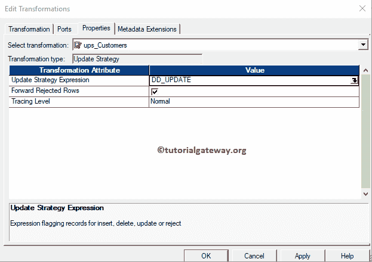

# 信息化中的更新策略转换

> 原文：<https://www.tutorialgateway.org/update-strategy-transformation-in-informatica/>

Informatica中的更新策略转换是一种主动的、关联的转换。基于源表数据更新、插入或删除目标中的记录非常有用。这种转换的好处是:您可以限制记录不到达目标表。

本文介绍了如何配置 Informatica 更新策略转换。或者，配置更新策略以更新目标表中的记录所涉及的步骤。

对于此 Informatica 更新策略转换示例，我们将使用以下显示数据(客户记录表)

而目的地表是:

## 信息示例中的更新策略转换

如果将源表与目标表进行比较，电子邮件地址和专业列会有多处更改。在本例中，我们的任务是使用 Informatica 更新策略转换来更新目标表中的更改。

在我们开始配置 Informatica 更新策略转换之前，首先让我连接 [Informatica 存储库](https://www.tutorialgateway.org/informatica/)服务。为此，请输入您在[安装 Informatica](https://www.tutorialgateway.org/how-to-install-informatica/) 服务器时指定的[管理控制台](https://www.tutorialgateway.org/informatica-admin-console/)用户名和密码。

### 创建信息更新策略转换源定义

连接成功后，请导航至[源分析器](https://www.tutorialgateway.org/informatica-source-analyzer/)并定义您的源。在本例中，我们使用来自 SQL Server 数据库的[客户记录]表作为我们的源定义。请参考[数据库来源于 Informatica](https://www.tutorialgateway.org/database-source-in-informatica/) 文章

### 创建信息更新策略转换目标定义

请导航至[目标设计器](https://www.tutorialgateway.org/target-designer-in-informatica/)并定义信息更新策略转换目标。在这个例子中，我们使用已经创建的 SQL 表(DupCust)作为我们的目标定义。请参考[使用源定义](https://www.tutorialgateway.org/create-informatica-target-table-using-source-definition/)创建信息目标表，了解创建目标定义

所涉及的步骤

### 在信息映射中创建更新策略

要创建新映射，请导航到菜单栏中的映射菜单，并选择创建..选项。

它打开[映射](https://www.tutorialgateway.org/informatica-mapping/)名称窗口，为这个映射写一个唯一的名称。让我写 m_update_trans，然后单击“确定”按钮。

将客户记录源定义从“源”文件夹拖放到映射设计器中。拖动源后，动力中心设计器会自动为您创建[源限定符转换](https://www.tutorialgateway.org/source-qualifier-transformation-in-informatica/)。

#### 在信息化中创建更新策略转换

要在 Informatica 中创建更新策略转换，请导航到转换菜单并选择创建..选项。

一旦你点击了创建..选项，将打开创建转换窗口。请从下拉列表中选择更新策略转换。接下来，指定唯一名称(ups_Customers)，然后点击【创建】按钮

单击创建按钮后，更新策略转换将添加到映射设计器中。

接下来，将目标定义从目标文件夹拖放到映射设计器

在本例中，我们希望更新电子邮件地址和专业栏中发生的更改。因此，将这两个字段与“关键”列一起拖到 Informatica

中的“更新策略转换”中

双击信息更新策略转换进行配置。从下面的截图中，您可以看到“更新策略转换”选项卡中的可用属性列表:

*   选择转换:默认情况下，它将选择您单击的转换。
*   重命名:此按钮将帮助您将更新策略转换重命名为更有意义的名称。
*   使可重用:如果选中此选项，此转换将成为可重用的转换。
*   描述:请提供有效的描述。

下面的截图显示了“信息更新策略转换端口”选项卡中的可用选项列表:

*   端口名:此信息更新策略中可用列名的列表。通过单击“新建列”按钮，可以添加新列，通过单击“剪式”按钮，可以删除不需要的列。
*   I:在此部分下勾选标记的列是输入列。
*   o:在此部分下勾选标记的列是输出列。如果取消选中任何列，该列将无法在目标表中加载。

在信息更新策略转换属性选项卡下，我们有:

*   更新策略表达式:在这里，您必须指定是要执行插入、删除还是更新
    *   数值为 0。用于插入记录。
    *   DD_UPDATE:用于更新行，数值为 1。
    *   DD_DELETE:数值为 2。用于删除行。
    *   拒绝:数值为 3。用于拒绝行。
*   转发被拒绝的行:如果要将被拒绝的行转发到下一个转换，则必须选中此选项。
*   跟踪级别:保持默认为正常。

它将打开表达式编辑器来编写自定义表达式。这里，我们使用的是

的 DD_UPDATE 表达式

单击应用，然后单击确定关闭窗口。

接下来，使用自动链接将信息更新策略转换与目标定义连接起来..选项。

在我们关闭映射之前，让我们通过转到映射并选择验证选项来验证信息更新策略转换映射。

### 创建更新策略转换工作流

创建完映射后，我们必须为它创建一个工作流。Informatica 提供了两种创建工作流的方法。

*   [手动创建工作流](https://www.tutorialgateway.org/informatica-workflow/)
*   [使用向导创建工作流](https://www.tutorialgateway.org/informatica-workflow-using-wizard/)

在这个信息更新策略转换示例中，我们将手动创建工作流。因此，导航到工作流菜单并选择创建选项。

它会打开“创建工作流”窗口。请提供唯一的名称(wf_update_tran)并保留默认设置。

一旦我们创建了 Informatica 更新策略工作流，下一步就是为我们的映射创建一个会话任务。

#### 为更新策略转换创建会话

Informatica 中有两种类型的会话:

*   [信息中不可重用的会话](https://www.tutorialgateway.org/session-in-informatica/)
*   [Informatica中的可重用会话](https://www.tutorialgateway.org/reusable-session-in-informatica/)

对于这个信息更新策略转换示例，我们将创建一个不可重用的会话。为此，请转到任务菜单并选择创建选项。

请为此会话提供一个唯一的名称(s_update_tran)。单击“创建”按钮后，将打开一个名为“映射”的新窗口。这里，我们选择的是

请将开始任务与新创建的会话任务

链接起来

双击会话任务将打开编辑任务窗口。在属性选项卡中

将源行视为:默认情况下，在这种情况下选择数据驱动。如果没有，请将其更改为数据驱动。请记住，数据驱动选项意味着，它将使用更新策略转换选项来加载目标表，而不是执行 Informatica 默认插入。

$Source 连接值:该属性将关系源信息存储在$Source 变量中。因此，单击我们在下面标记的箭头，并选择 SQL 教程作为源信息。

$Target 连接值:该属性将关系目标信息存储在$Target 变量中。因此，单击我们在下面标记的箭头，并选择 SQL 测试目标作为目标信息。

在映射选项卡中，我们必须配置源、目标连接。首先，让我们通过单击“源”文件夹中的 SQ _ CustomerRecord 源来配置源连接。

在连接中，单击关系类型旁边的箭头按钮，并使用我们在上一步中创建的连接变量，即:$Source

现在，我们必须配置目标连接。因此，单击目标文件夹中的副本。在连接中，点击关系类型旁边的箭头按钮，并使用连接变量$Target

接下来，让我开始信息更新策略转换工作流。为此，请导航到“工作流”菜单并选择“启动工作流”选项。

让我们打开 [SQL Server](https://www.tutorialgateway.org/sql/) 管理工作室，检查我们是否成功执行了 Informatica 更新策略。

