# 使用会话属性的 Informatica 更新策略

> 原文：<https://www.tutorialgateway.org/informatica-update-strategy-using-session-properties/>

在本文中，我们将解释如何使用会话属性实现 Informatica 更新策略。或者，配置会话属性以实现更新策略而不使用任何更新策略转换所涉及的步骤(示例)。

在 Informatica 中，您可以使用会话属性来实现更新策略。但是，这种方法是最糟糕的实时方法之一。因为，代替查找，这将盲目地更新现有记录(即使没有变化)，或者插入每一条记录。这种方法适合小桌子。

对于本例，我们将使用以下显示数据(员工重复表)

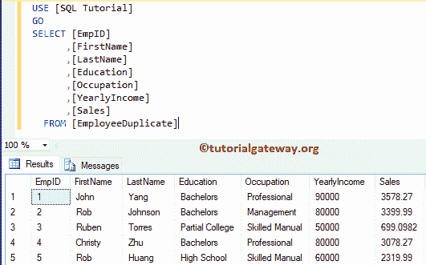

而目标表是:

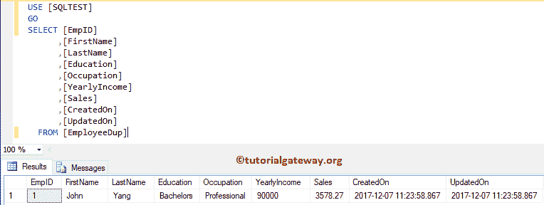

可以看到，目标表有 1 条记录和两个额外的列。这些额外的专栏将帮助您理解在这种方法中可能面临的问题。

## 使用会话属性的 Informatica 更新策略

在我们开始配置会话属性之前，首先让我连接 [Informatica](https://www.tutorialgateway.org/informatica/) 存储库服务。为此，我们必须提供[Informatica 管理控制台](https://www.tutorialgateway.org/informatica-admin-console/)凭证。因此，请提供适当的用户名和密码，并单击连接按钮。

提示:这里你必须提供你在[安装 Informatica](https://www.tutorialgateway.org/how-to-install-informatica/) 服务器时指定的管理员用户名和密码。

### 步骤 1:创建源定义

连接成功后，请导航至[源分析器](https://www.tutorialgateway.org/informatica-source-analyzer/)并定义您的源。在本例中，我们使用来自 SQL Server 数据库的[员工重复]表作为我们的源定义。请参考【信息】中的[数据库源](https://www.tutorialgateway.org/database-source-in-informatica/)了解创建源定义

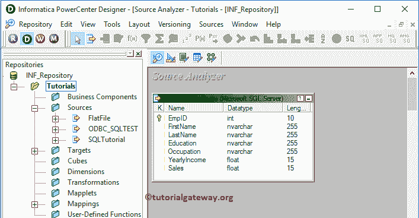

的步骤

### 步骤 2:创建目标定义

请导航至[目标设计器](https://www.tutorialgateway.org/target-designer-in-informatica/)并定义目标。在这个例子中，我们使用已经创建的 SQL 表(Employee Dup)作为我们的目标定义。请参考[使用源定义](https://www.tutorialgateway.org/create-informatica-target-table-using-source-definition/)创建 Informatica 目标表，了解创建目标定义

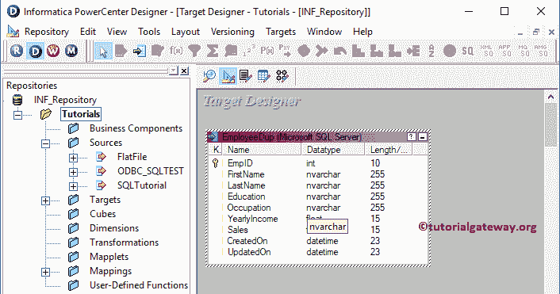

所涉及的步骤

### 步骤 3:创建映射

要创建新映射，请导航到菜单栏中的映射菜单，并选择创建..选项。

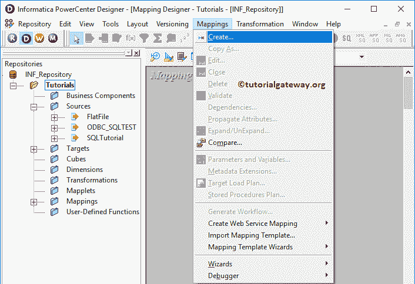

这将打开“映射名称”窗口，为该映射写一个唯一的名称。让我编写 m_update_with_session，然后单击“确定”按钮。

提示:请参考[Informatica 映射](https://www.tutorialgateway.org/informatica-mapping/)文章，了解创建制图

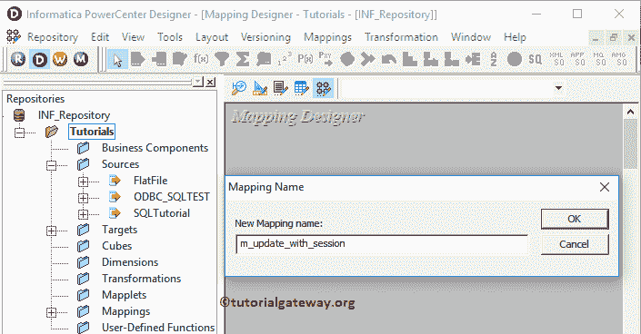

的程序

将“员工重复源定义”从“源”文件夹拖放到映射设计器中。拖动源代码后，Power Center 设计器将自动为您创建源代码限定符。建议大家参考[源码限定符转换](https://www.tutorialgateway.org/source-qualifier-transformation-in-informatica/)一文。

接下来，创建表达式转换，并将所有字段从源限定符拖动到表达式转换。建议大家参考[表情转换](https://www.tutorialgateway.org/expression-transformation-in-informatica/)文章，以便更好的理解。

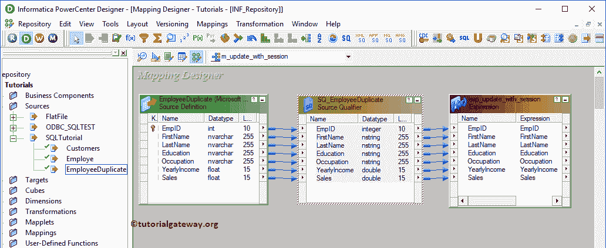

双击表达式转换以添加新字段，或写入自定义表达式。从下面的截图中，您可以看到我们使用“新建端口”按钮添加了 2 个新列。我们将使用这些新列来存储创建日期和修改日期

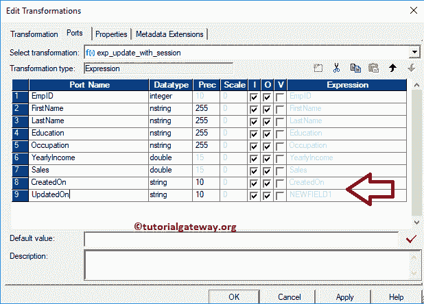

让我们编写自定义表达式。为此，单击创建按钮旁边的箭头按钮。

提示:所有这些新列都是输出端口。所以，请勾选 O

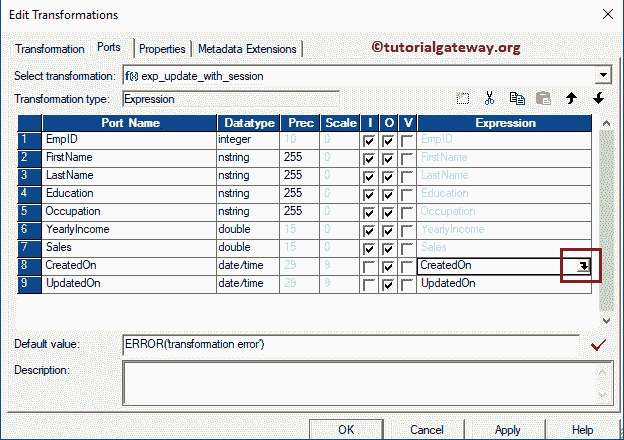

这将打开表达式编辑器来编写自定义表达式。这里，我们想要系统日期，所以，写 SYSDATE。

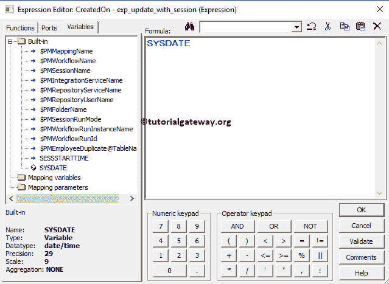

从下面的截图中你可以观察到我们对更新登栏

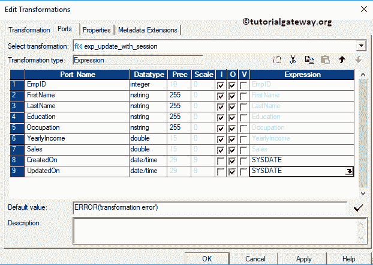

做了同样的操作

接下来，将目标定义从“目标”文件夹拖放到映射设计器中，并将表达式转换与目标定义连接起来。请使用自动链接..连接它们的选项。

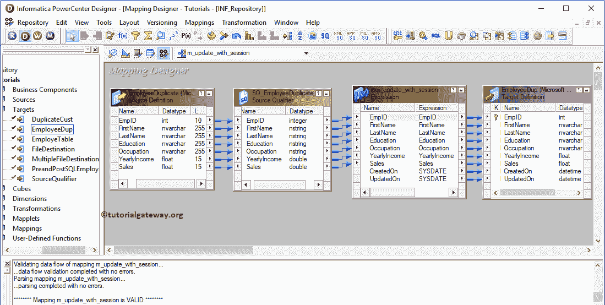

在我们关闭映射之前，让我们通过转到映射菜单栏并选择验证选项来验证映射。

### 步骤 4:创建工作流

创建完映射后，我们必须为它创建一个工作流。电源中心工作流管理器提供了两种创建工作流的方法。

*   [手动创建工作流](https://www.tutorialgateway.org/informatica-workflow/)
*   [使用向导创建工作流](https://www.tutorialgateway.org/informatica-workflow-using-wizard/)

在本例中，我们将手动创建工作流。为此，请导航至工作流菜单并选择创建选项。

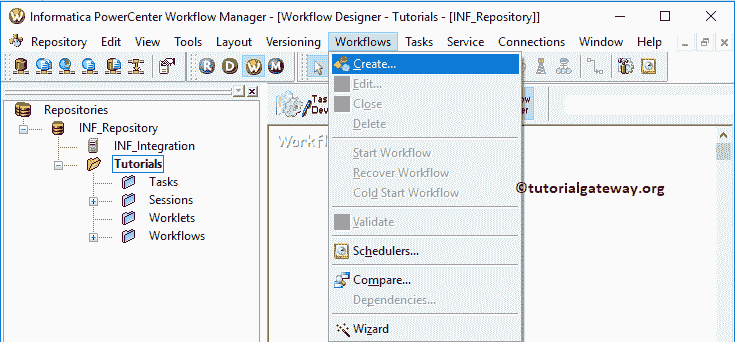

这将打开创建工作流窗口，如下所示。请提供唯一的名称(wf_update_using_session)并保留默认设置。

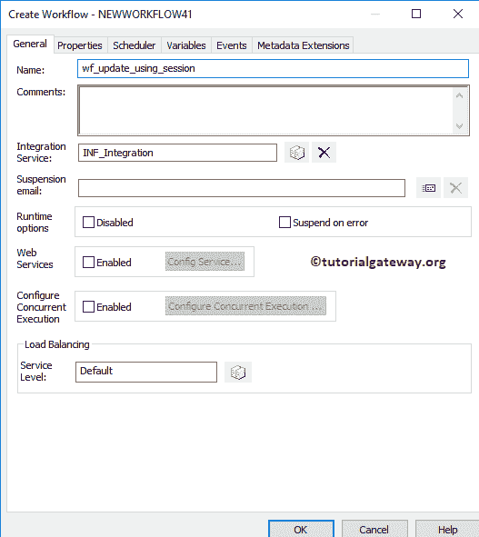

一旦我们创建了工作流，下一步就是为我们的映射创建一个会话任务。

#### 步骤 4(a):创建会话

Informatica 中有两种类型的会话:

*   [Informatica 中不可重用的会话](https://www.tutorialgateway.org/session-in-informatica/)
*   [Informatica 中的可重用会话](https://www.tutorialgateway.org/reusable-session-in-informatica/)

对于这个例子，我们将创建一个不可重用的会话。为了创建相同的，请导航到任务菜单并选择如下所示的创建选项。

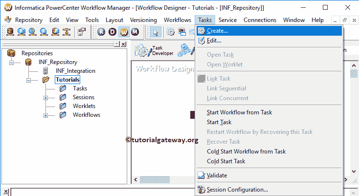

请为此会话提供唯一的名称。在这里，我们将其命名为 s_update_using_session。单击“创建”按钮后，将打开一个名为“映射”的新窗口。这里，我们选择的是

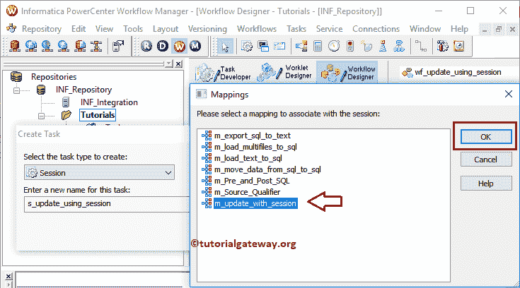

的 m_update_with_session

双击会话任务将打开编辑任务窗口。在属性选项卡中

$Source 连接值:该属性将关系源 Informatica 存储在$Source 变量中。因此，单击我们在下面标记的箭头，并选择 SQL 教程作为源信息。

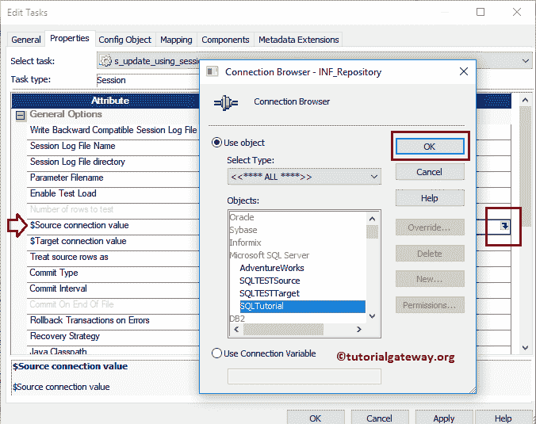

$Target 连接值:该属性将关系目标 Informatica 存储在$Target 变量中。因此，单击我们在下面标记的箭头，并选择 SQL 测试目标作为目标信息。

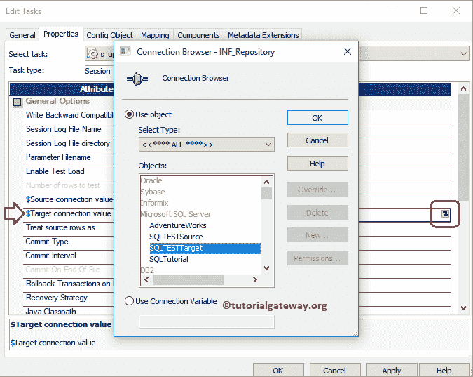

将源行视为:将默认插入更改为更新。这意味着，它将执行更新，而不是只执行插入。

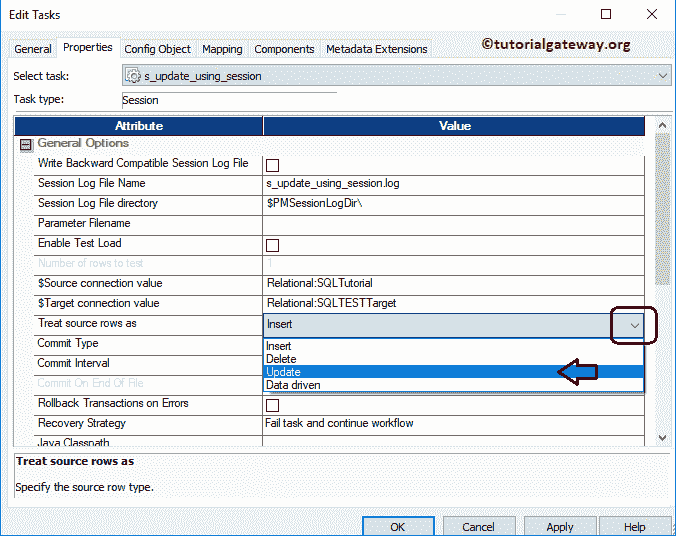

在映射选项卡中，我们必须配置源、目标连接。首先，让我们通过单击“源”文件夹中的 SQ _ EmployeeDuplicate 源来配置源连接。

在连接中，单击关系类型旁边的箭头按钮，并使用我们在上一步中创建的连接变量，即:$Source

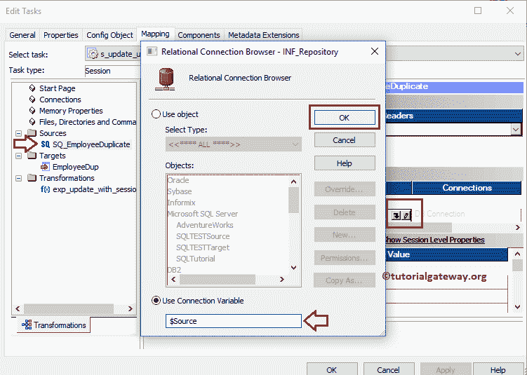

现在，我们必须配置目标连接。因此，单击“目标”文件夹中的“员工”。在连接中，点击关系类型旁边的箭头按钮，并使用连接变量$Target

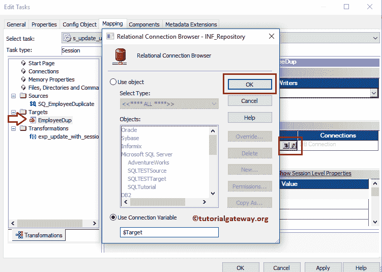

接下来，勾选更新其他插入。

更新其他插入:如果记录已经存在，它将对该记录执行[更新](https://www.tutorialgateway.org/sql-update-statement/)。并且，如果记录不存在，那么它将执行[插入](https://www.tutorialgateway.org/sql-insert-statement/)

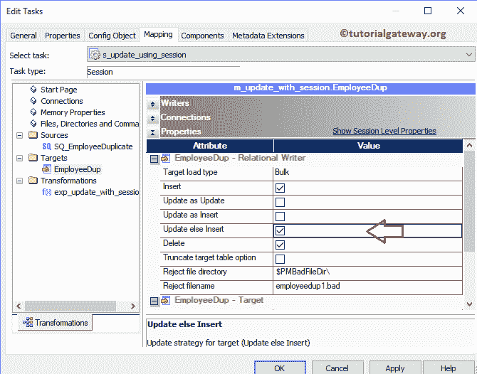

请链接开始任务和会话任务。

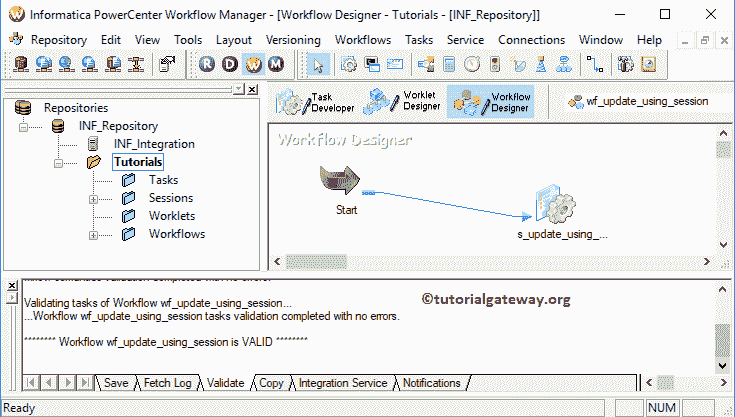

接下来，导航到工作流菜单并选择验证选项以验证工作流。现在，让我启动工作流。为此，请导航到“工作流”菜单，并选择“启动工作流”选项。

选择“启动工作流”选项后，将打开 Informatica PowerCenter 工作流监视器来监视工作流。从下面的截图中，您可以观察到我们的工作流没有任何错误地执行。

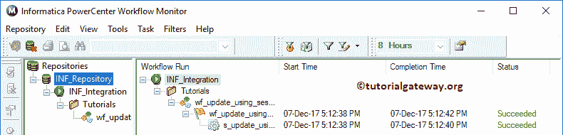

让我们打开 [SQL Server](https://www.tutorialgateway.org/sql/) 管理工作室，检查我们是否成功执行了更新策略。如果您查看第一条记录，该记录会随着插入而更新。用一种简单的语言，我们可以说，这种方法只是用源表记录替换所有现有的目标表记录。

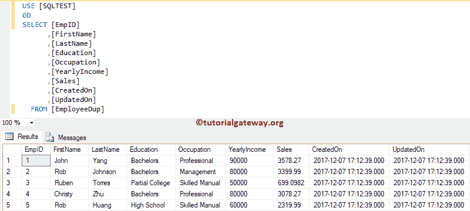

让我更新 EmpID 3 的年收入并再添加一条记录。

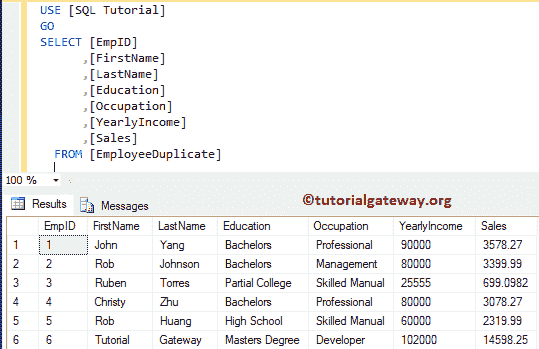

从下面的截图中，您可以观察到我们的工作流没有任何错误地执行。

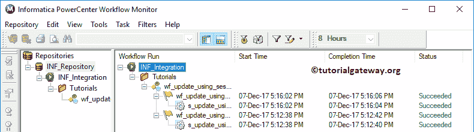

如您所见，所有记录都是新插入的。

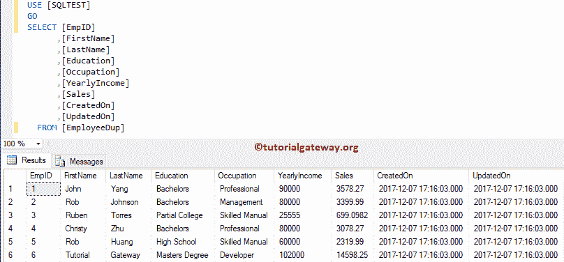