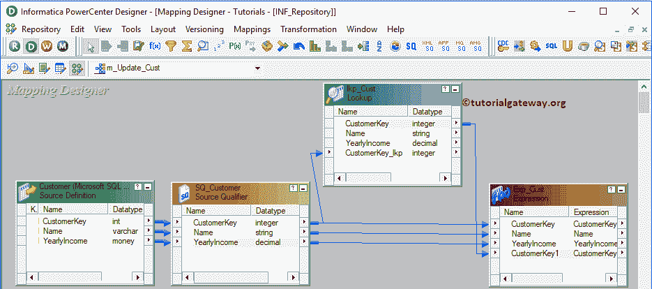
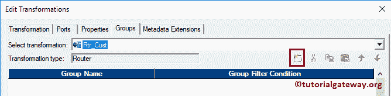
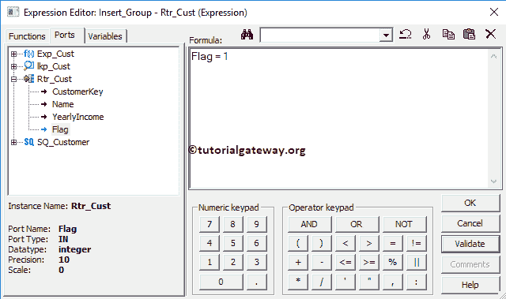
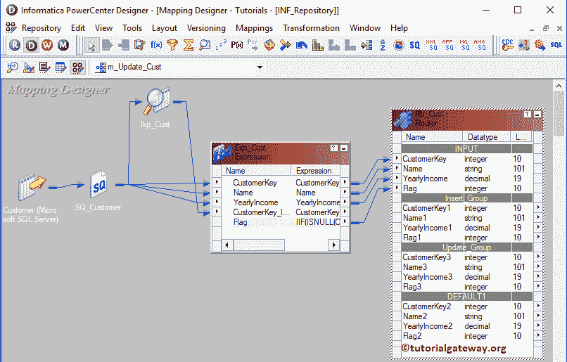
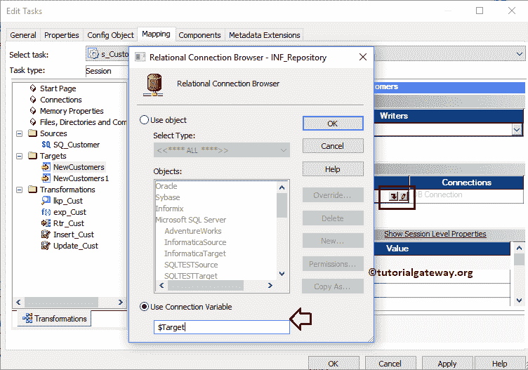

# 信息时代的更新策略

> 原文：<https://www.tutorialgateway.org/update-strategy-in-informatica/>

在本文中，我们将通过一个例子来解释如何在 Informatica 中配置更新策略。对于此 Informatica 更新策略示例，我们将使用以下显示数据(客户表)

而目的地表是:

## 信息示例中的更新策略

在我们之前的文章中，我们已经解释了[更新策略转换](https://www.tutorialgateway.org/update-strategy-transformation-in-informatica/)。在本例中，我们将向您展示使用这种信息更新策略转换的另一种方式。

首先，让我连接 [Informatica 资源库](https://www.tutorialgateway.org/informatica/)服务。为此，请输入您在[安装 Informatica](https://www.tutorialgateway.org/how-to-install-informatica/) 服务器时指定的[管理控制台](https://www.tutorialgateway.org/informatica-admin-console/)用户名和密码。

### 为信息中的更新策略创建源定义

连接成功后，请导航至[源分析器](https://www.tutorialgateway.org/informatica-source-analyzer/)并定义您的源。在这个信息更新策略示例中，我们使用来自 SQL Server 数据库的客户表作为我们的源定义。请参考文章中的[数据库来源。](https://www.tutorialgateway.org/database-source-in-informatica/)

### 为信息更新策略创建目标定义

请导航至[目标设计器](https://www.tutorialgateway.org/target-designer-in-informatica/)并定义信息更新策略目标。在这个例子中，我们使用已经创建的 SQL 表(新客户)作为我们的目标定义。请参考[使用源定义](https://www.tutorialgateway.org/create-informatica-target-table-using-source-definition/)创建信息目标表，了解目标定义

### 步骤 3:在 Informatica 中为更新策略创建映射

要创建新的信息更新策略映射，请导航到映射菜单并选择创建..选项。

打开[映射](https://www.tutorialgateway.org/informatica-mapping/)名称窗口，为该映射写一个唯一的名称(m_update_Cust)，点击确定按钮。

将客户记录源定义从“源”文件夹拖放到映射设计器中。拖动信号源后，电源中心设计师会自动为您创建[信号源限定符](https://www.tutorialgateway.org/source-qualifier-transformation-in-informatica/)。

#### 步骤 3(a):创建查找转换

要创建[查找转换](https://www.tutorialgateway.org/lookup-transformation-in-informatica/)，请导航至转换菜单并选择创建..选项。

一旦你点击了创建..选项，将打开创建转换窗口。请从下拉列表中选择查找转换并指定唯一名称(lkp_Cust)，然后单击创建按钮

一旦你点击了创建..按钮，将打开“选择查找转换的查找表”窗口。这里，我们希望使用目标表作为查找源。

提示:如果查找表出现在“来源”中，则选择“来源”。在这里，您也可以从外部来源导入。

单击创建按钮将查找转换添加到映射设计器中。接下来，从源限定符中拖放客户密钥。

双击查找转换以配置其设置。下面的截图将显示端口选项卡中可用选项的列表。从下面的截图中，您可以看到我们更改了输入端口名称(CustomerKey_lkp)。

在属性部分，我们将多重匹配的查找策略更改为使用第一个值。

在条件选项卡中，我们添加了一个条件 CustmerKey = CustmerKey_lkp。以下条件说明查找转换将检查查找输入源(即客户密钥)是否等于现有客户密钥。

#### 步骤 3(b):创建表达式转换

要创建[表达式转换](https://www.tutorialgateway.org/expression-transformation-in-informatica/)，请选择创建..选项。如您所见，我们将名称指定为 Exp_Cust

现在让我添加从源限定符到表达式转换的所有字段以及从[查找转换](https://www.tutorialgateway.org/lookup-transformation-in-informatica/)的键列。

如您所见，我们更改了列名(从查找中添加的列)。接下来，我们想使用

按钮添加一个标志字段

对于这个标志字段，让我通过单击箭头来编写一个表达式。请记住，如果您想根据某些条件执行删除或其他操作，请使用多个标记。

这里，Informatica ISNULL 是检查它是否为 NULL

在指定的表达式下面，检查来自查找字段的客户键列是否为空。如果为空，则返回 0。表达式是 IIF(ISNULL(CustomerKey_lkp)，1，0)。请参考 [IIF](https://www.tutorialgateway.org/sql-iif-function/) 了解 IIF 信息的语法。

点击【确定】应用设置

#### 步骤 3(c):创建路由器转换

请参考 Informatica 文章中的[路由器转换，了解创建它所涉及的步骤。](https://www.tutorialgateway.org/router-transformation-in-informatica/)

创建后，请通过拖动必填字段将[表达式转换](https://www.tutorialgateway.org/expression-transformation-in-informatica/)与路由器转换连接起来。从下面的截图中，您可以看到我们正在添加除查找列字段之外的所有字段。

双击路由器转换添加组。使用添加新组按钮添加所需组

从下面的截图中，您可以看到我们创建了一个用于插入新记录的组和一个用于更新现有记录的组。

让我们通过单击箭头按钮为第一组提供表达式或条件。它打开表达式编辑器来编写自定义表达式。这里，我们需要客户关键字为空的客户，这意味着不存在的记录

对于更新组，我们将表达式写成 Flag = 0，这意味着所有现有记录

完成属性配置后，单击确定关闭转换窗口。

#### 步骤 3(d):创建信息更新策略转换

请参考中的[更新策略转换，了解创建策略转换的步骤。让我添加两个更新策略:](https://www.tutorialgateway.org/update-strategy-transformation-in-informatica/)

*   这是为了在目标表中插入新记录。
*   Update_Cust:这是为了更新目标表中的现有记录。

将字段从插入组(标志= 1)拖动到插入客户，将字段从更新组(标志= 0)拖动到更新客户

双击插入客户更新策略进行配置。让我将更新策略表达式更改为 0 或 DD_INSERT

双击更新客户更新策略进行配置。让我将更新策略表达式更改为 1 或 DD_UPDATE 进行更新

接下来，将目标定义从“目标”文件夹拖放到映射设计器中。对“自动链接”和“自动链接”字段重复上述步骤。

在我们关闭映射之前，让我们通过转到映射菜单栏并选择验证选项来验证映射。

### 步骤 4:在 Informatica 中创建更新策略的工作流

在我们完成创建信息更新策略映射后，我们必须为它创建一个工作流。电源中心工作流管理器提供了两种创建工作流的方法。

*   [手动创建工作流](https://www.tutorialgateway.org/informatica-workflow/)
*   [使用向导创建工作流](https://www.tutorialgateway.org/informatica-workflow-using-wizard/)

在本例中，我们将手动创建工作流。为此，请导航至工作流菜单并选择创建选项。

它会打开“创建工作流”窗口。提供唯一的名称(wf_Customers)并保留默认设置。

一旦我们创建了工作流，下一步就是为我们的映射创建一个会话任务。

#### 步骤 4(a):在 Informatica 中创建更新策略的会话

Informatica 中有两种类型的会话:

*   [信息中不可重用的会话](https://www.tutorialgateway.org/session-in-informatica/)
*   [信息中的可重用会话](https://www.tutorialgateway.org/reusable-session-in-informatica/)

对于这个信息更新策略示例，我们将创建一个不可重用的会话。从任务菜单

中选择创建选项

请为此会话提供一个唯一的名称(s_Customers)。单击“创建”按钮后，将打开一个名为“映射”的新窗口。这里，我们选择的是

双击会话任务将打开编辑任务窗口。在属性选项卡中

$Source 连接值:该属性将关系源信息存储在$Source 变量中。因此，点击我们在下面标记的箭头，选择信息源作为源信息。

$Target 连接值:该属性将关系目标信息存储在$Target 变量中。因此，单击我们在下面标记的箭头，并选择信息目标作为目标信息。

在映射选项卡中，我们必须为信息更新策略配置源和目标连接。首先，让我们通过单击“源”文件夹中的 SQ_Customer 源来配置源连接。

在连接中，点击关系类型旁边的箭头按钮，使用我们之前创建的连接变量，即:$Source

现在，我们必须配置目标连接。因此，单击目标文件夹中的新客户。在连接中，单击关系类型旁边的箭头按钮，并使用连接变量$Target。对新客户 1

重复同样的步骤

接下来，让我开始信息更新策略工作流。为此，请导航到“工作流”菜单并选择“启动工作流”选项。

让我们打开 [SQL Server](https://www.tutorialgateway.org/sql/) 管理工作室，验证我们是否成功执行了更新策略。

