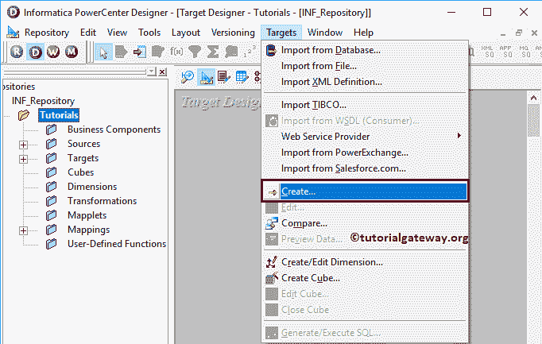
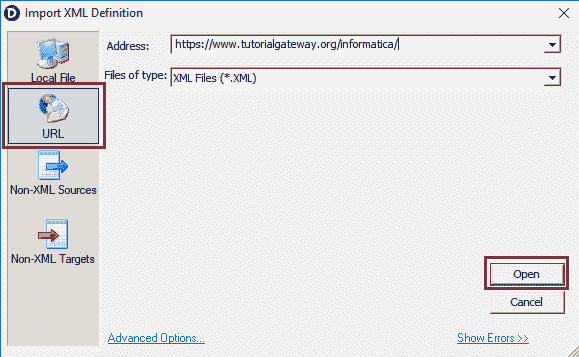
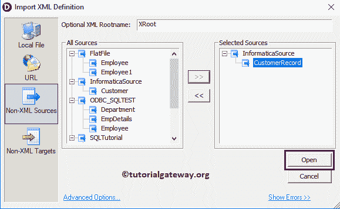
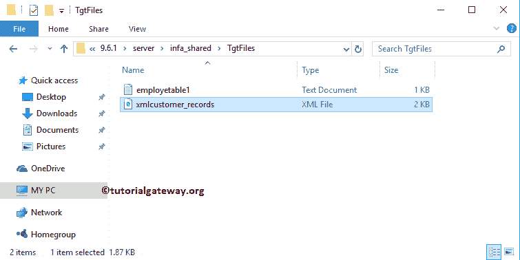
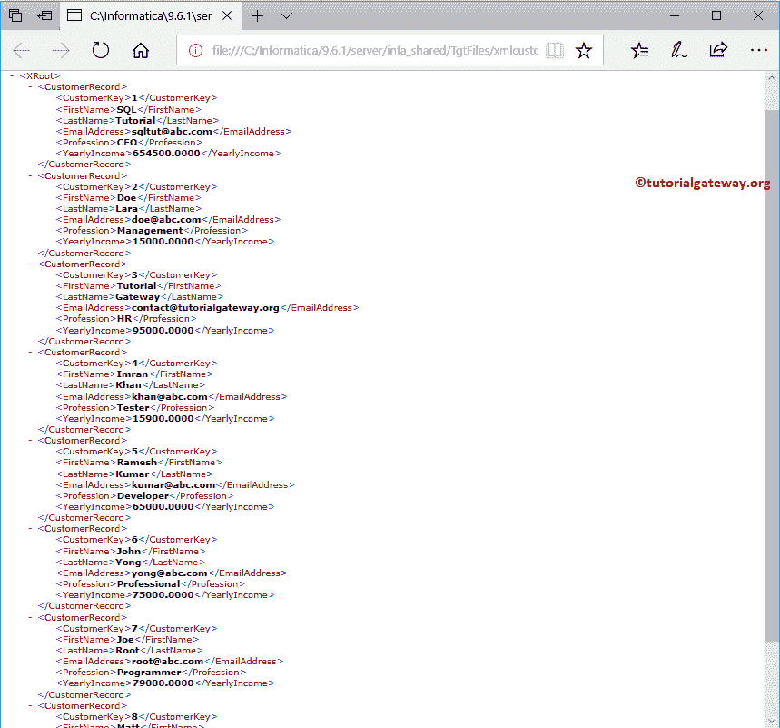

# 信息系统中的 XML 生成器转换

> 原文：<https://www.tutorialgateway.org/xml-generator-transformation-in-informatica/>

Informatica中的 XML 生成器转换是一种主动的、连接的转换。这种转换在管道内生成 XML 文件时非常有用。

在本文中，我们将通过一个例子向您展示如何在 Informatica 中使用 XML 生成器转换从数据库表中生成一个 XML 文件。

对于这个 Informatica XML 生成器转换示例，我们将使用下面的显示数据(客户记录表)

## 信息示例中的 XML 生成器转换

让我们看看如何在 Informatica 中使用这个 XML 生成器转换来使用 SQL 数据库表生成一个 XML 文件。在我们开始配置之前，首先，让我连接到 Informatica 存储库服务。

为此，我们必须提供[信息管理控制台](https://www.tutorialgateway.org/informatica-admin-console/)凭证。因此，请提供适当的用户名和密码，并单击连接按钮。

提示:在这里，您必须提供您在[安装 Informatica](https://www.tutorialgateway.org/how-to-install-informatica/) 服务器时指定的 [Informatica](https://www.tutorialgateway.org/informatica/) 管理员用户名和密码。

### 步骤 1:信息中 XML 生成器转换的源定义

连接成功后，请导航至[源分析器](https://www.tutorialgateway.org/informatica-source-analyzer/)并定义您的源。在本例中，我们使用来自 SQL Server 数据库的客户表作为我们的源定义。请参考【信息】中的[数据库源](https://www.tutorialgateway.org/database-source-in-informatica/)了解创建源定义

的步骤

### 步骤 2:在 Informatica 中创建 XML 生成器转换的目标定义

第一种方法–请导航至[目标设计器](https://www.tutorialgateway.org/target-designer-in-informatica/)以定义 Informatica XML 生成器转换目标。在这个例子中，我们的任务是创建一个 XML 文件。因此，转到目标菜单并选择导入 XML 定义选项。这样，您可以在目标定义中定义 XML 定义。

理想方法–转到目标菜单并选择创建选项。

选择创建选项后，将显示一个名为创建目标表的新窗口，如下所示。请为目标提供唯一的名称，并将数据库类型选择为平面文件。

完成后，请单击“创建”按钮，在我们的 PowerCenter 目标设计器中创建新的空表。

双击新创建的目标表。接下来，转到“列”选项卡添加新列。请选择第一个按钮(剪刀符号之前)。它打开空行添加列名、数据类型

从下面的截图中，您可以看到我们添加了一个字符串数据类型的 XML_Output 列。

现在，您可以看到具有一个列名的目标表。它是处理 XML 文件的列。

### 步骤 3:在 Informatica 中为 XML 生成器转换创建映射

要为信息 XML 生成器转换创建新映射，请导航到菜单栏中的映射菜单，并选择创建..选项。

它将打开“映射名称”窗口，为该映射写一个唯一的名称。让我编写 m_xml_generator，然后单击“确定”按钮。

提示:请参考[信息制图](https://www.tutorialgateway.org/informatica-mapping/)文章，了解创建制图

的程序

将客户记录源定义从“源”文件夹拖放到映射设计器中。拖动源代码后，Power Center 设计器将自动为您创建源代码限定符。建议大家参考[源限定词转换](https://www.tutorialgateway.org/source-qualifier-transformation-in-informatica/)文章。

#### 步骤 3(a):在 Informatica 中创建一个 XML 生成器转换

要创建 XML 生成器转换，请导航到菜单栏中的转换菜单，并选择创建..选项。

一旦你点击了创建..选项，创建[转换](https://www.tutorialgateway.org/informatica-transformations/)窗口打开。请从下拉列表中选择 XML 生成器转换，并指定唯一名称(XML_GenCustomer)，然后单击创建按钮

一旦你点击了创建..按钮，将打开一个名为“导入 XML 定义”的新窗口，如下所示。在这里，您必须为这个 XML 文件指定 XSD 或 XML 定义。

本地文件:如果 XSD 文件在本地文件系统中，则选择此选项。

网址:选择特定网址

的 XML 定义文件

非 XML 目标:如果源是非 XML 文件，并且存在于信息目标定义

中

非 XML 源:如果您没有 XSD 文件，并且想要使用Informatica 源定义中的 SQL 表，则选择此选项。在本例中，我们将使用源定义中的客户记录表。

点击打开

点击否

它将打开一个 XML 向导。点击【下一步】按钮

每个 XML 文件都必须使用有效的 XML 定义(或 XSD)进行处理。请在第二页定义 XML 定义。在这个例子中，我们希望使用实体关系保存我们的 XML 文件。所以，我们选择第一个选项。

单击“完成”按钮后，XML 生成器转换被添加到映射设计器中。

现在让我添加从源限定符到 XML 生成器转换

的所有字段

接下来，将目标定义从“目标”文件夹拖放到映射设计器中。接下来，将 XML 生成器转换数据输出连接到目标表中的 XML_Output 字段。

在我们关闭映射之前，让我们保存映射，并通过转到映射菜单栏来验证映射，然后选择验证选项。

### 步骤 4:在 Informatica 中为 XML 生成器转换创建工作流

创建完映射后，我们必须为它创建工作流。电源中心工作流管理器提供了两种创建工作流的方法。

*   [手动创建工作流](https://www.tutorialgateway.org/informatica-workflow/)
*   [使用向导创建工作流](https://www.tutorialgateway.org/informatica-workflow-using-wizard/)

在这个信息 XML 生成器转换示例中，我们将手动创建工作流。为此，请导航至工作流菜单并选择创建选项。

它将打开“创建工作流”窗口。请提供唯一的名称(wf _ XMLGenerator)并保留默认的

一旦我们创建了工作流，下一步就是为我们的映射创建一个会话任务。

#### 步骤 4(a):在 Informatica 中为 XML 生成器转换创建会话

Informatica 中有两种类型的会话:

*   [信息中不可重用的会话](https://www.tutorialgateway.org/session-in-informatica/)
*   [Informatica中的可重用会话](https://www.tutorialgateway.org/reusable-session-in-informatica/)

对于这个信息 XML 生成器转换示例，我们创建了一个不可重用的会话。要创建不可重复使用的会话，请导航到任务菜单并选择创建选项。

请为此会话提供唯一的名称。在这里，我们将它命名为 s_XMLGenerator。单击“创建”按钮后，将打开一个名为“映射”的新窗口。

在这里，您必须选择要与此会话关联的映射，即 m_xml_generator。

双击会话任务将打开编辑任务窗口。在映射选项卡中，我们必须配置源和目标连接。首先，让我们通过单击“源”文件夹中的 SQ _ CustomerRecord 源来配置源连接。

在连接中，点击关系类型旁边的箭头按钮，选择源表数据库(Informatica Source)

现在你可以看到Informatica 源作为关系连接

现在，我们必须配置目标连接。因此，让我们通过单击目标文件夹中的 XMLCustomer _ Records 来配置目标连接。

*   直接输出文件:Informatica 将使用默认目录，但是您可以通过提供完整路径来更改目录。
*   输出文件名:请将扩展名更改为 xml

您可以使用转换属性来验证或格式化输出(生成的 XML)文件

接下来，导航到工作流菜单并选择验证选项以验证工作流。

现在，让我通过选择工作流菜单中的开始工作流选项来启动信息 XML 生成器转换工作流。

让我们打开 Informatica 的默认目标位置，检查我们是否成功地从源表创建了一个 XML 文件。

您可以看到 xmlcustomer_records xml 文件中的数据。

