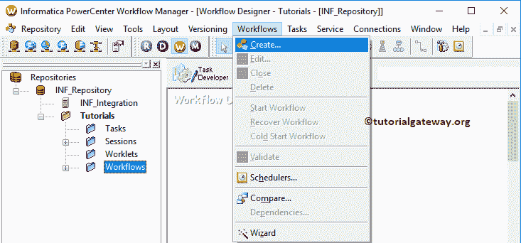

# 信息系统中的 XML 解析器转换

> 原文：<https://www.tutorialgateway.org/xml-parser-transformation-in-informatica/>

信息分析中的 XML 解析器转换是一种主动的、连接的转换。这种转换对于从管道内的文件中提取 XML 数据非常有用。

在本文中，我们将通过一个例子向您展示如何在 Informatica 中使用 XML Parser Transformation 从 XML 文件中提取数据并将其加载到 Database 表中。

对于这个 Informatica XML 解析器转换的例子，我们将使用下面显示的 XML 文件

我们要用的 XSD 是:

目的地表是客户记录。如你所见，这是一张空桌子

## 信息示例中的 XML 解析器转换

在本文中，我们将向您展示如何在 Informatica 中使用这个 XML 解析器转换来将 XML 数据从 CSV 文件读取到 SQL 数据库表中。

在我们开始配置之前，首先，让我连接 [Informatica](https://www.tutorialgateway.org/informatica/) 存储库服务。为此，我们必须提供[信息管理控制台](https://www.tutorialgateway.org/informatica-admin-console/)凭证。因此，请提供适当的用户名和密码，并单击连接按钮。

提示:这里你必须提供你在[安装 Informatica](https://www.tutorialgateway.org/how-to-install-informatica/) 服务器时指定的管理员用户名和密码。

### 步骤 1:信息中 XML 解析器转换的源定义

连接成功后，请导航至[源分析器](https://www.tutorialgateway.org/informatica-source-analyzer/)以定义您的源。如前所述，我们使用本地文件系统中的 XML 文件作为源定义。因此，请导航到“源”菜单，并选择“从文件导入”..

选项T4】

选择“从文件导入”后..选项，将会打开一个名为“打开平面文件”的新窗口。请从本地文件系统中选择 XMLCustomers.csv 文件，然后单击“打开”按钮。我建议您在下面的步骤中参考 Informatica 文章中的[平面文件源。](https://www.tutorialgateway.org/flat-file-source-in-informatica/)

单击“打开”按钮后，将会打开一个名为“平面文件导入向导”的新弹出窗口。

第二步:在分隔符部分，请选择分隔符

在这里，我们可以编辑列名、数据类型、长度或精度、比例和宽度。一般来说，我们不这样做，但如果你愿意，你可以这样做。

从下面的截图你可以观察到，你可以在 Informatica 中看到我们新创建的平面文件源。

### 步骤 2:在 Informatica 中创建 XML 解析器转换的目标定义

请导航到 Informatica [目标设计器](https://www.tutorialgateway.org/target-designer-in-informatica/)来定义 XML 解析器转换的目标。在这个例子中，我们使用现有的 SQL 表(客户记录)作为我们的目标定义。您可以参考[使用源定义](https://www.tutorialgateway.org/create-informatica-target-table-using-source-definition/)创建信息目标表，了解创建目标定义

的过程

### 步骤 3:在 Informatica 中为 XML 解析器转换创建映射

要创建新映射，请导航到菜单栏中的映射菜单，并选择创建..选项。

它将打开“映射名称”窗口，为该映射写一个唯一的名称。让我写 m_XMLParser，然后点击确定按钮。

提示:请参考[信息制图](https://www.tutorialgateway.org/informatica-mapping/)文章，了解创建制图

的程序

将 XML 客户平面文件从“源”文件夹拖放到映射设计器中。拖动源代码后，Power Center 设计器将自动为您创建源代码限定符。建议大家参考[源限定词转换](https://www.tutorialgateway.org/source-qualifier-transformation-in-informatica/)文章。

#### 步骤 3(a):在 Informatica 中创建一个 XML 解析器转换

要创建 XML 解析器转换，请导航至菜单栏中的[转换](https://www.tutorialgateway.org/informatica-transformations/)菜单，并选择创建..选项。

一旦你点击创建..选项，将打开创建转换窗口。请从下拉列表中选择 XML 解析器转换，并指定唯一名称(XML_ParseCustomer)，然后单击创建按钮

一旦你点击创建..按钮，将打开一个名为“导入 XML 定义”的新窗口，如下所示。在这里，您必须为这个 XML 文件指定 XSD 或 XML 定义。

*   本地文件:如果文件是本地文件系统，则选择此选项。
*   网址:选择特定网址的文件
*   非 XML 源:如果源是非 XML 文件(SQL 表)，并且它存在于信息源定义中。
*   非 XML 目标:如果源是非 XML 文件，并且它存在于信息目标定义中

请从本地文件系统中选择 CustomerXSD.xml 文件，然后单击“打开”按钮。

根据您的要求点击是或否

如果您从上面的屏幕截图中选择“是”，则会打开以下窗口。将显示“更改 XML 视图创建和命名选项”。请根据您的要求更改选项。

它将打开一个 XML 向导。点击【下一步】按钮

每个 XML 文件都必须使用有效的 XML 定义(或 XSD)进行处理。请在第二页定义 XML 定义。

在这个例子中，我们使用的是实体关系 XSD。所以，我们选择第一个选项。

单击“完成”按钮后，Informatica 工作区中的 XML 解析器转换被添加到映射设计器中。

首先，让我将 XML 字段从源限定符添加到 XML 解析器转换中。接下来，将目标定义从“目标”文件夹拖放到映射设计器中。

接下来，将 XML 解析器转换字段连接到客户记录目标表。

### 步骤 4:在 Informatica 中为 XML 解析器转换创建工作流

创建完映射后，我们必须为它创建工作流。电源中心工作流管理器提供了两种创建工作流的方法。

*   [手动创建工作流](https://www.tutorialgateway.org/informatica-workflow/)
*   [使用向导创建工作流](https://www.tutorialgateway.org/informatica-workflow-using-wizard/)

在这个 Informatica XML 解析器转换示例中，我们将手动创建工作流。为此，请导航至工作流菜单并选择创建选项。

它将打开“创建工作流”窗口。请提供唯一的名称()，并保留默认设置。

一旦我们创建了工作流，下一步就是为我们的映射创建一个会话任务。

#### 步骤 4(a):在 Informatica 中为 XML 解析器转换创建会话

Informatica 中有两种类型的会话:

*   [信息中不可重用的会话](https://www.tutorialgateway.org/session-in-informatica/)
*   [信息中的可重用会话](https://www.tutorialgateway.org/reusable-session-in-informatica/)

对于这个 Informatica XML 解析器转换示例，我们创建了一个不可重用的会话。要创建不可重复使用的会话，请导航到任务菜单并选择创建选项。

请为此会话提供唯一的名称。在这里，我们将其命名为 s_XMLParseCustomer。单击“创建”按钮后，将打开一个名为“映射”的新窗口。在这里，您必须选择要与此会话关联的映射，即 m_XMLParser。

双击会话任务将打开编辑任务窗口。在映射选项卡中，我们必须配置源和目标连接。首先，让我们通过单击源文件夹中的 SQ _ XMLCustomers 来设置源连接。

*   源文件目录:Informatica 将使用默认目录，但是您可以通过提供完整路径来更改目录。例如，D:\文件示例\
*   来源文件名:它会自动检测。如果没有，请指定文件名和扩展名。

接下来，我们必须配置目标连接。因此，选择目标文件夹下的客户记录。

在连接中，点击关系类型旁边的箭头按钮，选择目标表数据库(Informatica Target)

根据您的要求更改目标负载类型

接下来，导航到工作流菜单并选择验证选项以验证工作流。

现在，让我启动 Informatica XML 解析器转换工作流。为此，请导航到“工作流”菜单并选择“启动工作流”选项。

让我们打开 [SQL Server 管理工作室](https://www.tutorialgateway.org/sql-server-management-studio/)并编写以下 [SQL](https://www.tutorialgateway.org/sql/) 查询来检查我们是否成功地将 XML 数据传输到表中。

