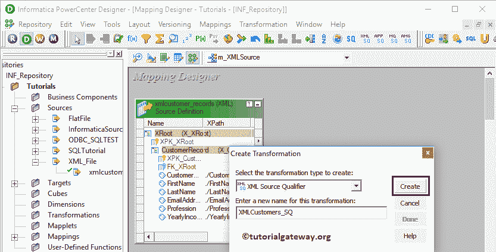

# Informatica 中的 XML 源限定符

> 原文：<https://www.tutorialgateway.org/xml-source-qualifier-informatica/>

Informatica 中的 XML 源限定符是一个活动的和连接的转换。在读取 XML 源定义时，这是由电源中心设计器生成的默认转换。

Informatica XML 源限定符转换决定了电力中心如何读取源数据。请记住，XML 源限定符总是有一个输入端口或一个输出端口。

对于这个信息 XML 源限定符转换示例，我们使用下面的 XML 并将数据加载到 SQL Server。

## 信息示例中的 XML 源限定符

在我们开始配置 Informatica XML 源限定符之前，首先，让我连接 [Informatica](https://www.tutorialgateway.org/informatica/) 存储库服务。

为此，我们必须提供[信息管理控制台](https://www.tutorialgateway.org/informatica-admin-console/)凭证。因此，请提供在[安装 Informatica](https://www.tutorialgateway.org/how-to-install-informatica/) 时指定的适当用户名和密码，并单击连接按钮。

### 步骤 1:在 Informatica 中为 XML 源限定符创建源定义

请导航至[来源分析器](https://www.tutorialgateway.org/informatica-source-analyzer/)以定义您的来源。如前所述，我们使用本地文件系统中的 XML 文件作为源定义。因此，请导航到“源”菜单并选择“导入 XML 定义”..选项如下所示

选择导入 XML 定义后..选项，将打开一个名为“导入 XML 定义”的新窗口。我们已经在 [XML 解析器转换](https://www.tutorialgateway.org/xml-parser-transformation-in-informatica/)中解释了这些选项。

请从本地文件系统中选择 xmlcustomer_records.xml 文件。

点击否

它会打开一个 XML 向导。点击【下一步】按钮

每个 XML 文件都必须使用有效的 XML 定义(或 XSD)进行处理。请在第二页定义 XML 定义。

在这个例子中，我们使用带有实体关系的 XML 文件，所以我们选择第一个选项。如果您使用的是 XML 文件层次结构，则选择第二个选项，等等。

从下面的截图可以观察到，可以在 Informatica

看到我们新创建的 XML Source 定义

### 步骤 2:在 Informatica 中为 XML 源限定符创建目标定义

请导航至[目标设计器](https://www.tutorialgateway.org/target-designer-in-informatica/)定义目标。在这个例子中，我们使用现有的 SQL 表(XMLCustomers)作为我们的目标定义。可以参考[使用源定义](https://www.tutorialgateway.org/create-informatica-target-table-using-source-definition/)创建目标表，了解创建目标定义

的过程

### 步骤 3:在 Informatica 中为 XML 源限定符创建映射

要在 Informatica 中为 XML 源限定符转换创建新映射，请导航到菜单栏中的映射菜单，然后选择创建..选项。

选择“创建”后..选项，将会打开一个新的映射名称窗口。让我提供 m _ XMLSource 作为映射名称，然后单击“确定”按钮。

提示:请参考[信息制图](https://www.tutorialgateway.org/informatica-mapping/)文章，了解创建制图

的程序

#### 步骤 3(a):在 Informatica 中创建 XML 源限定符转换

将 XML 源定义(xmlcustomer_records)从“源”文件夹拖放到映射设计器中。拖动源后，Power Center 设计器会自动为您创建 XML 源限定符转换。

让我删除 XML 源限定符

#### 步骤 3(b):手动创建信息 XML 源限定符转换

要在 Informatica 中显式创建 XML 源限定符，请导航至菜单栏中的[转换](https://www.tutorialgateway.org/informatica-transformations/)菜单。接下来，选择创建..

选项T4】

选择创建..选项将打开“创建转换”窗口。请从下拉列表中选择 XML 源限定符转换，并为此转换提供唯一的名称(XMLCustomers _ SQ)，然后单击创建按钮

这将打开“为源限定符转换选择源”窗口。单击“确定”选择 xmlcustomer _ records 作为源。

现在你可以看到和你之前看到的

一样的图像

双击 XML 源限定符转换来见证和更改属性。下面的屏幕截图显示了“转换”选项卡中的可用属性列表:

*   选择转换:默认情况下，它将选择您选择(或点击)的转换。
*   重命名:此按钮帮助您重命名 XML 源限定符转换名称。
*   描述:使用此空间提供此转换的有效描述。

下面的截图显示了端口标签中可用的选项:

接下来，将目标定义(XMLCustomers)从目标文件夹拖放到映射设计器中。接下来，将 XML 源限定符转换与目标定义连接起来。请使用自动链接..连接它们的选项。

在我们关闭映射之前，让我们保存映射，并通过转到映射菜单栏来验证映射，然后选择验证选项。

### 步骤 4:在 Informatica 中为 XML 源限定符创建工作流

创建完映射后，我们必须为它创建工作流。电源中心工作流管理器提供了两种创建工作流的方法。

*   [手动创建工作流](https://www.tutorialgateway.org/informatica-workflow/)
*   [使用向导创建工作流](https://www.tutorialgateway.org/informatica-workflow-using-wizard/)

在本例中，我们将手动创建工作流。为此，请导航至工作流菜单并选择创建选项。

它将打开“创建工作流”窗口，如下所示。请提供唯一的名称(wf_XMLSource)并保留默认设置。

一旦我们创建了工作流，下一步就是为我们的映射创建一个会话任务。

#### 步骤 4(a):在 Informatica 中为 XML 源限定符创建会话

Informatica 中有两种类型的会话:

*   [信息中不可重用的会话](https://www.tutorialgateway.org/session-in-informatica/)
*   [Informatica 中的可重用会话](https://www.tutorialgateway.org/reusable-session-in-informatica/)

对于这个例子，我们创建了一个不可重用的会话。要创建不可重复使用的会话，请导航到任务菜单并选择创建选项，如下所示。

请为此会话提供唯一的名称。在这里，我们将其命名为 s _ XMLSource。单击“创建”按钮后，将打开一个名为“映射”的新窗口。在这里，您必须选择要与此会话关联的映射，即 m _ XMLSource。

双击会话任务将打开编辑任务窗口。在映射选项卡中，我们必须配置源和目标连接。首先，让我们通过单击源文件夹中的 XMLSQ _ xmlcustomer _ records 来配置源连接。

*   源文件目录:Informatica 将使用默认目录，但是您可以通过提供完整路径来更改目录。例如，D:\文件示例
*   来源文件名:它会自动检测。如果没有，请指定文件名和扩展名。

接下来，我们必须配置目标连接。因此，选择目标文件夹下的 XMLCustomers。在连接中，点击关系类型旁边的箭头按钮，选择目标表数据库(Informatica Target)

接下来，导航到工作流菜单并选择验证选项以验证工作流。

现在，让我通过选择工作流菜单中的开始工作流选项来启动 XML 源限定符转换工作流。

让我们打开 [SQL Server 管理工作室](https://www.tutorialgateway.org/sql-server-management-studio/)并编写以下 [SQL](https://www.tutorialgateway.org/sql/) 查询来检查我们是否成功地将数据从 XML 源传输到数据库表中。

