# Informatica 中的前 SQL 和后 SQL

> 原文：<https://www.tutorialgateway.org/pre-sql-and-post-sql-in-informatica/>

在本文中，我们将解释如何在 Informatica 中使用前 SQL 和后 SQL。或者，用一个例子来说明在源限定符转换中配置前 SQL 和后 SQL 所涉及的步骤。

对于这个 Informatica Pre SQL 和 Post SQL 示例，我们将使用下面的显示数据(EmpDetails 表)

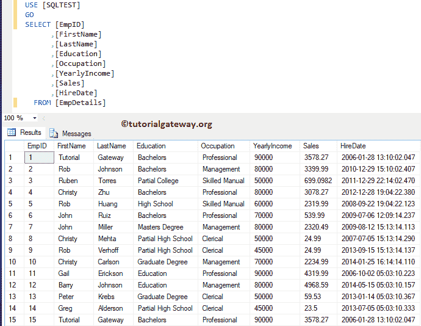

目标表是前和后 SQL 员工。如你所见，这是一张空桌子

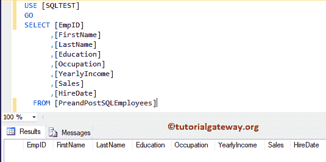

## 信息示例中的前 SQL 和后 SQL

在我们开始在 Informatica 中配置 Pre SQL 和 Post SQL 之前，首先通过提供您在[安装 Informatica](https://www.tutorialgateway.org/how-to-install-informatica/) 服务器时指定的[管理控制台](https://www.tutorialgateway.org/informatica-admin-console/)用户名和密码来连接到 [Informatica](https://www.tutorialgateway.org/informatica/) 存储库服务。

### 在Informatica 源定义中创建前 SQL 和后 SQL

导航至[源分析器](https://www.tutorialgateway.org/informatica-source-analyzer/)并定义您的源。这里，我们使用来自 [SQL Server](https://www.tutorialgateway.org/sql/) 数据库的 EmpDetails 表作为我们的源定义。我建议您参考 Informatica 中的[数据库源，了解源定义](https://www.tutorialgateway.org/database-source-in-informatica/)

[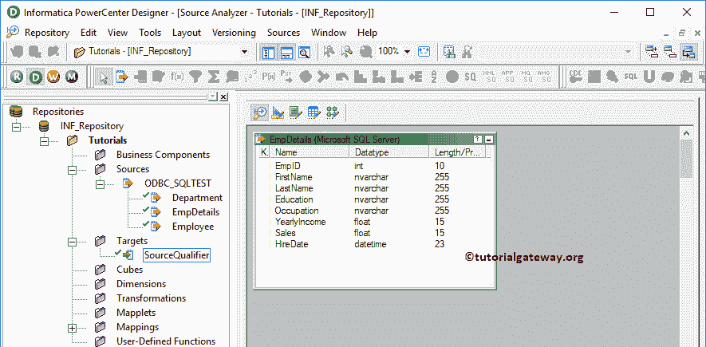](https://www.tutorialgateway.org/database-source-in-informatica/)

[的创建](https://www.tutorialgateway.org/database-source-in-informatica/)

### 在信息目标定义中创建前 SQL 和后 SQL

请导航至[目标设计器](https://www.tutorialgateway.org/target-designer-in-informatica/)定义目标。在这个例子中，我们使用现有的 SQL 表作为我们的目标定义。可以参考[使用源定义](https://www.tutorialgateway.org/create-informatica-target-table-using-source-definition/)创建目标表，了解创建目标定义

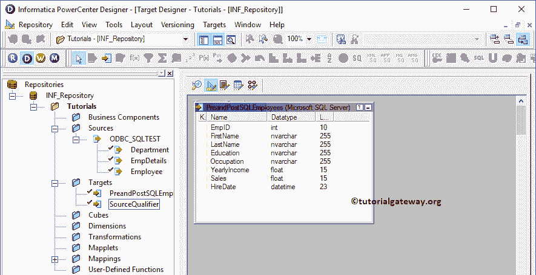

的过程

### 创建信息预 SQL 和后 SQL 映射

要创建新映射，请导航至[映射](https://www.tutorialgateway.org/informatica-mapping/)菜单并选择创建..选项。它会打开“映射名称”窗口来编写一个唯一的名称(m _ Pre _ 和 _Post_SQL)，然后单击“确定”按钮。

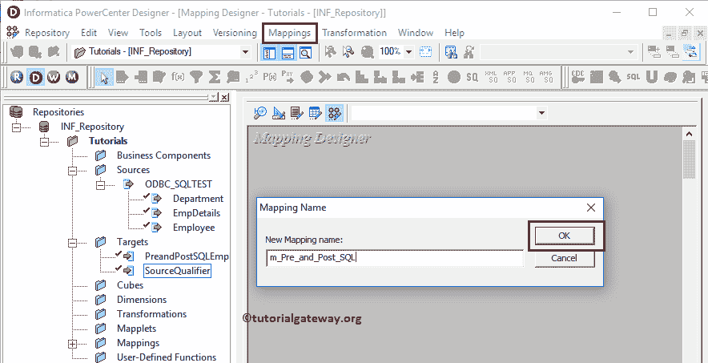

将 EmpDetails 源定义从“源”文件夹拖放到映射设计器中。拖动信号源后，电源中心设计器会自动为您创建[信号源限定符](https://www.tutorialgateway.org/source-qualifier-transformation-in-informatica/)。

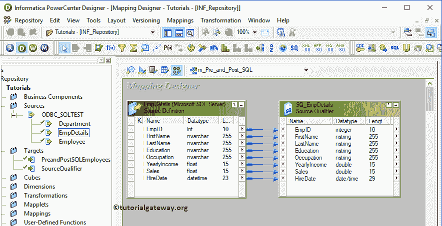

双击源限定符转换，并转到属性选项卡以配置信息前 SQL 和后 SQL

预 SQL:此属性用于在集成服务启动之前对源运行 SQL 命令。点击箭头

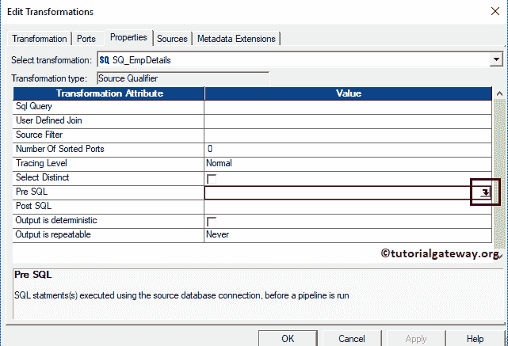

这里我们正在编写一个 Insert 语句，以便在集成服务启动之前将新记录插入到 Emp Details 表中。

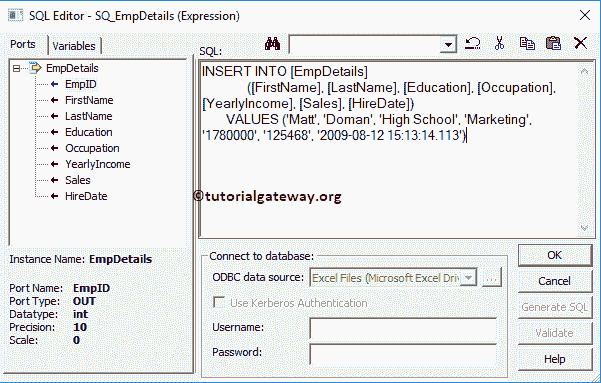

发布 SQL:在集成服务结束后，使用此属性对源运行 SQL 命令。在这里，我们正在编写删除语句，以删除员工标识等于 9

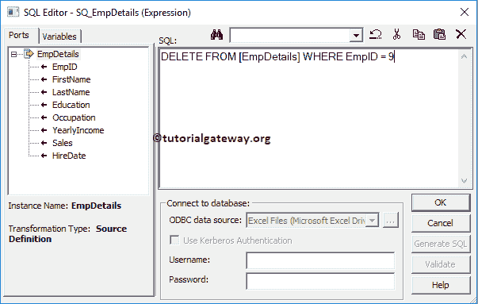

的记录

您也可以更改其余的属性。但是现在，我们正在点击确定按钮关闭属性窗口

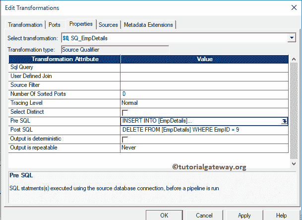

接下来，将目标定义(PreandPostSQLEmployees)从“目标”文件夹拖放到映射设计器中。接下来，使用自动链接将源限定符转换与目标定义连接起来..选项。

在我们关闭映射之前，让我们保存映射，并通过转到映射菜单栏来验证映射，然后选择验证选项。

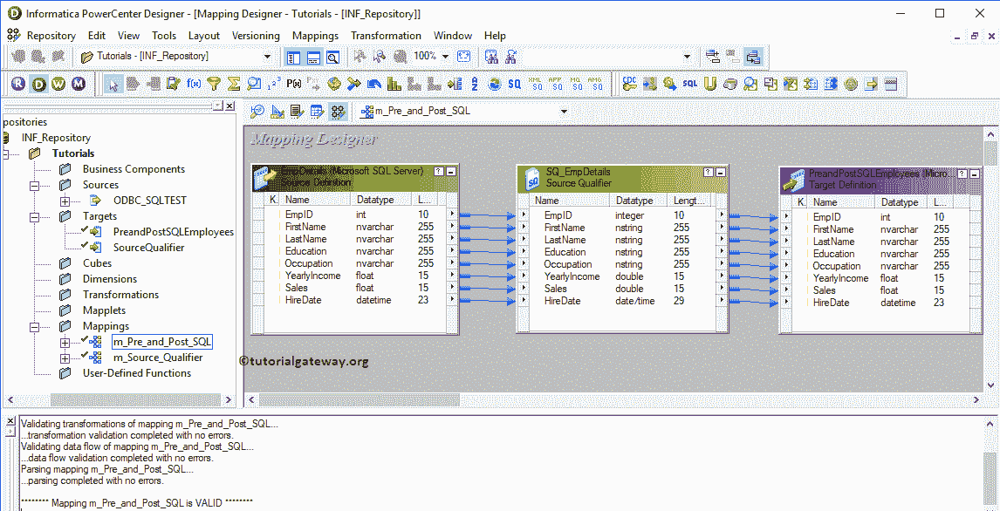

### 创建信息预 SQL 和后 SQL 工作流

在我们完成创建信息预 SQL 和后 SQL 映射后，我们必须为其创建工作流。电源中心工作流管理器提供了两种创建工作流的方法。

*   [手动创建工作流](https://www.tutorialgateway.org/informatica-workflow/)
*   [使用向导创建工作流](https://www.tutorialgateway.org/informatica-workflow-using-wizard/)

在本例中，我们将手动创建工作流。首先，导航到工作流菜单并选择创建选项将打开创建工作流窗口。请提供唯一的名称(wf _ Pre _ 和 _Post_SQL)并保留默认设置。

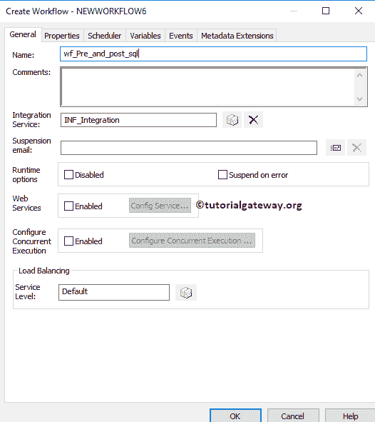

一旦我们创建了工作流，下一步就是为我们的映射创建一个会话任务。

#### 为前 SQL 和后 SQL 创建会话

Informatica 中有两种类型的会话:

*   [不可重用会话](https://www.tutorialgateway.org/session-in-informatica/)
*   [可重用会话](https://www.tutorialgateway.org/reusable-session-in-informatica/)

对于这个 Informatica 前 SQL 和后 SQL 示例，我们创建了一个不可重用的会话，并将其命名为会话的 s _ Pre _ 和 _Post_SQL。

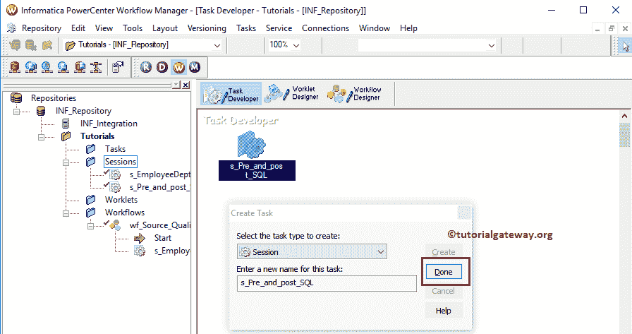

请链接开始任务和会话任务。接下来，导航到工作流菜单并选择验证选项以验证工作流。从下面的截图中，您可以观察到该工作流是有效的。

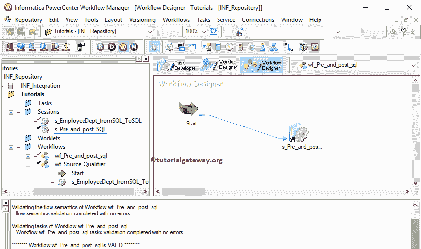

现在，让我开始信息预 SQL 和后 SQL 工作流。为此，请导航到“工作流”菜单并选择“启动工作流”选项。

让我们打开 [SQL Server](https://www.tutorialgateway.org/sql/) 管理工作室。可以看到，它有 16 条记录:15 条来自 EmpDetails 表，1 条来自[在 Pre SQL](https://www.tutorialgateway.org/sql-insert-statement/)

[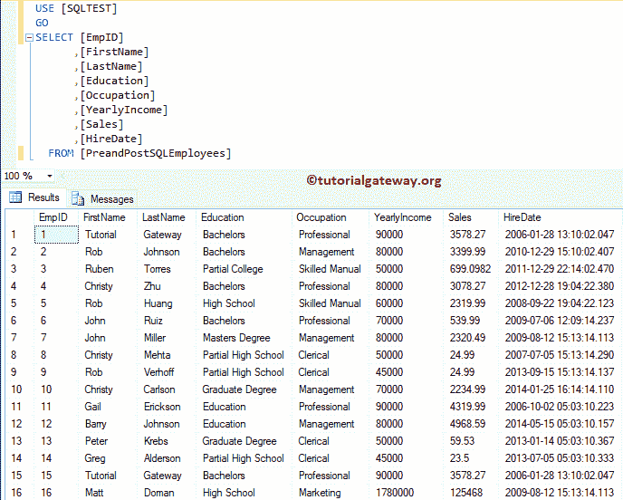](https://www.tutorialgateway.org/sql-insert-statement/)

[中插入语句](https://www.tutorialgateway.org/sql-insert-statement/)

如果您在集成过程后观察原始表。有 15 条记录

后 SQL 中的[删除语句](https://www.tutorialgateway.org/sql-delete-statement/)删除了 EmpID 为 9 的记录，前 SQL 中的插入语句插入了新记录。

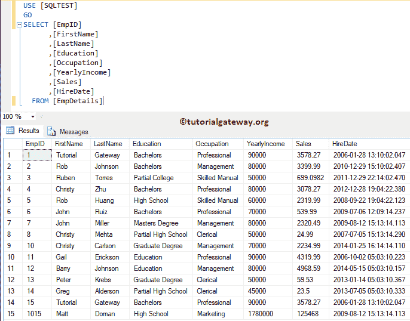