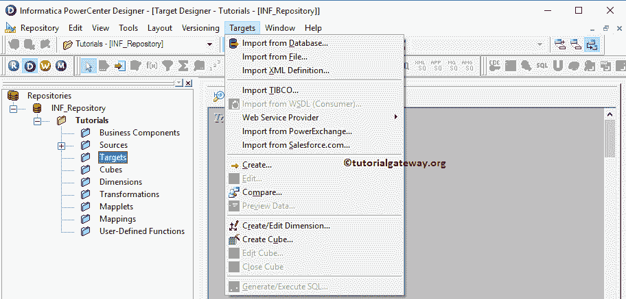

# Informatica 中的目标设计器

> 原文：<https://www.tutorialgateway.org/target-designer-in-informatica/>

为了执行提取、转换和加载(ETL)操作，我们需要源数据、目标表和转换(如果需要的话)。Informatica 中的目标设计器允许我们创建目标表，修改已经存在的目标定义。

Informatica 目标设计器还允许我们从各种来源导入目标定义，包括平面文件、关系数据库、XML 定义、Excel 工作表等。

## Informatica 中的目标设计器

在我们开始做任何事情之前，首先连接到 Informatica 存储库服务。要连接到存储库服务，我们必须提供 Informatica 管理控制台凭据。因此，请输入用户名和密码，然后单击连接按钮。

提示:在这里，您必须提供您在安装 [Informatica](https://www.tutorialgateway.org/informatica/) 服务器时指定的 [Informatica 管理控制台](https://www.tutorialgateway.org/informatica-admin-console/)用户名和密码。

连接成功后，请导航至菜单栏中的工具菜单。下面的截图将显示 PowerCenter 设计器中可用工具的列表。在本文中，我们将介绍 Informatica 中的目标设计器。因此，请选择目标设计器选项。

选择目标设计器选项后，我们将进入目标设计器屏幕。菜单栏中的目标菜单只有在您位于信息目标设计器部分时才可用。否则，它不会显示。

接下来，请导航到菜单栏中的目标菜单。从下面的截图中，您可以观察到 Informatica PowerCenter 设计器中的可用目标列表。他们是

*   从数据库导入:此选项允许我们从关系数据库导入目标表。Informatica Target 设计器支持各种关系数据库，如微软 [SQL Server](https://www.tutorialgateway.org/sql/) 、Oracle、SAP HANA、Sybase、Teradata 等。
*   从文件导入:该选项允许我们从由分隔符或固定宽度分隔的平面文件导入目标文件。
*   从 COBOL 文件导入:允许我们将源数据导出到 COBOL 文件。
*   导入 XML 定义:该选项允许我们将 XML 定义作为目标或目标导入
*   从仁科导入:该选项将使我们能够使用仁科作为目标或目标。
*   网络服务:信息中心帮助我们使用网络服务作为目标或目标
*   从 Salesforce.com 导入:该选项允许我们将 Salesforce.com 作为目标或目标
*   创建:该选项将使我们能够从头开始创建数据目标表。
*   创建多维数据集:该选项允许我们创建多维数据集。

