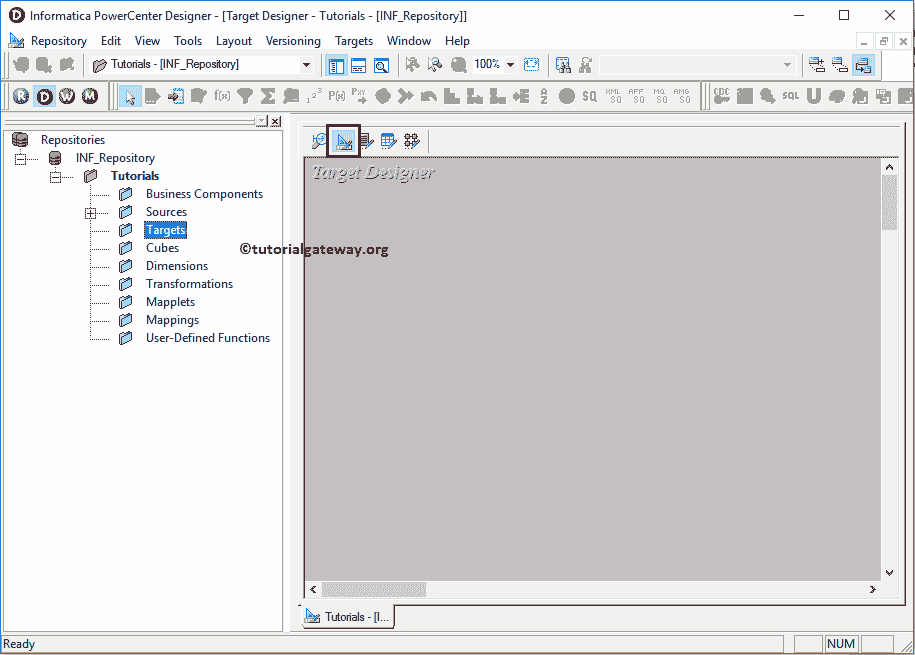
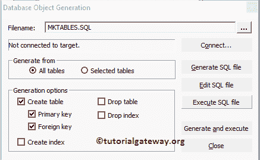

# 使用源定义创建Informatica目标表

> 原文：<https://www.tutorialgateway.org/create-informatica-target-table-using-source-definition/>

在本文中，我们将向您展示如何使用“源”文件夹中的源定义创建 Informatica 目标表。以及如何使用它作为转换数据的目的/目标表，并举例说明。

例如，如果我们想要复制或使用源定义作为您的目标定义，这将是您的最佳选择。

## 使用源定义创建信息目标表

在我们开始做任何事情之前，首先使用您的管理员凭据连接到 Informatica 存储库服务，然后导航到目标设计器。请参考 Informatica 文章中的[目标设计器，了解目标设计器画面。从下面](https://www.tutorialgateway.org/target-designer-in-informatica/) [Informatica](https://www.tutorialgateway.org/informatica/) 截图，可以观察到我们在目标设计器中。

提示:菜单栏中的目标菜单只有在您位于目标设计器部分时才可用。否则，它不会出现。

将 DimProducts 从“源”子文件夹拖放到目标设计器中。PowerCenter 目标设计器将使用源定义自动创建 Informatica 目标表。

从下面的截图中，在 Targets 子文件夹下，查看我们在 Informatica 中新创建的目标以及我们工作区中的表定义(列名和适当的数据类型)。

虽然我们从源定义中复制了 DimProducts 表，但我们可能不需要该表中的所有列。要解决这个问题，我们可以通过右键单击表定义并选择编辑来编辑该表..选项。

选择编辑后..选项，将打开一个名为“编辑表”的新窗口。在表选项卡中，我们可以通过单击重命名按钮来重命名表名。从下面的截图中，看到我们正在将表名从 DimProducts 改为 Target_DimProducts

要更改或修改现有表，我们必须导航到列选项卡。例如，

*   如果要添加新列，请选择第一个按钮(在剪刀符号之前)，并添加列名、数据类型、精度(如果需要)、比例(如果需要)，如果是主键，则将键类型更改为主键，并勾选“不为空”选项(如果您的列不允许空值)
*   如果要删除列，请选择不需要的列，然后单击剪刀按钮。
*   您可以使用向上和向下箭头来上下移动列名

编辑完成后，点击【确定】关闭【编辑表】窗口

我们在 PowerCenter 目标设计器中创建的目标表将只存在于目标设计器中。如果要将此表定义添加到 SQL Server，我们必须遵循以下几个步骤:

步骤 1:请导航到菜单栏中的目标菜单。从下面的截图中，您可以观察到 Informatica PowerCenter 设计器中的可用目标列表。在这个例子中，我们的任务是使用源定义创建一个 Informatica 目标表。因此，我们选择生成/执行 SQL..选项。

步骤 2:一旦选择了生成/执行 SQL..选项，一个名为数据库对象生成窗口的新窗口将会打开。在开始使用这些属性之前，让我们详细了解一下:

生成自:这里我们有两个选项:

*   所有表:如果您想为我们的目标设计器中存在的所有表生成和执行 SQL 文件，那么您必须选择此选项。
*   选定的表:如果您想在我们的目标设计器中为选定的表生成和执行 SQL 文件，您必须选择此选项。

生成选项:此部分包含多个选项:

*   创建表:如果您想在我们的数据库中创建一个新表，请选中此选项。
*   创建主键:如果要向该表添加主键，请选中此选项。
*   外键:如果您想在该表中添加外键，请勾选此项。
*   创建索引:如果您想在我们的表上创建一个新的索引，请选中此选项。
*   删除表:如果您想从我们的数据库中删除现有的表(如果有同名的表)，请选中此选项。
*   删除索引:如果您想删除索引名，请选中此选项。

让我们看看每个按钮背后的动作:

*   连接:此按钮将帮助您使用 ODBC 连接来连接关系数据库
*   生成 SQL:此按钮将生成目标定义的 SQL 查询。
*   编辑 SQL 文件:此按钮将帮助您编辑生成的 SQL 文件，并允许我们根据我们的要求进行更改。
*   执行 SQL 文件:该按钮将执行生成的 SQL 文件。
*   生成并执行:该按钮将生成目标定义的 SQL 查询，并执行生成的 SQL 文件。

第三步:从下面的截图中，您可以看到我们选择了创建表、创建主键和创建外键。我们没有丢弃任何东西，因为我们的数据库是新的和空的。

第四步:一旦你点击连接..按钮，将打开“连接到 ODBC 数据源”窗口，以选择现有的 ODBC 连接或创建新的连接。目前，我们没有任何，所以，我们正在创建一个新的点击…按钮。

第五步:单击…按钮后，将打开 ODBC 数据源管理员窗口，添加新的 ODBC 连接。如果有，请从列表中选择。在这个例子中，我们添加了一个新的连接，所以，点击添加按钮。单击添加按钮后，将打开创建新数据源窗口。

在这里，我们可以选择从可用列表中选择所需的数据库。如前所述，我们使用的是 SQL Server。因此，在这个例子中，我们选择了 DataDirect 7.1 SQL Server 有线协议。

提示:具体步骤请参考 [Informatica ODBC 连接](https://www.tutorialgateway.org/informatica-odbc-connection/)了解。

第六步:打开一个新的弹出窗口，名为 ODBC SQL Server 传统有线协议驱动程序设置。在这里，我们必须填写与我们的数据库连接所需的详细信息。

*   数据源名称:请为此 ODBC 连接指定一个唯一的名称。
*   描述:对我们将要建立的连接的准确描述。
*   服务器:请指定 SQL Server 实例名称。
*   数据库名称:在这里，您必须写下要从中提取数据的 SQL 数据库名称。目前，我们正在选择信息目标。

完成后，单击应用按钮，然后单击确定按钮关闭窗口

注:一旦您填写了所需的详细信息，最好使用测试连接按钮

来测试您的连接

步骤 7:从下拉列表中，请选择我们现在创建的 ODBC 连接。

步骤 8:接下来，我们必须提供连接各自数据库所需的凭据。在这里，我们提供了我们的微软 SQL Server 2014 的用户名和密码，以及作为 dbo 的所有者名称。

填写完详细信息后，请单击连接按钮连接到 SQL 数据库。连接成功后，点击生成并执行按钮，生成并执行 SQL 文件

从下面的截图中，您可以看到我们成功地在我们的微软 SQL Server 2014 中创建了目标表。

