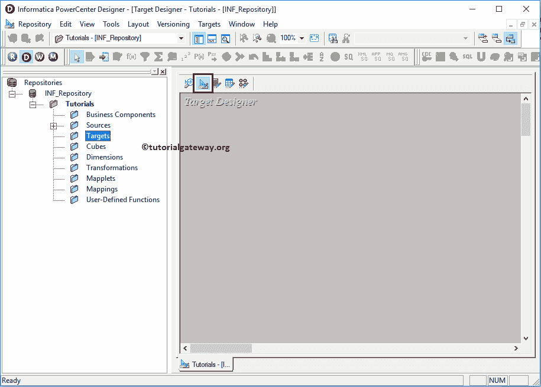
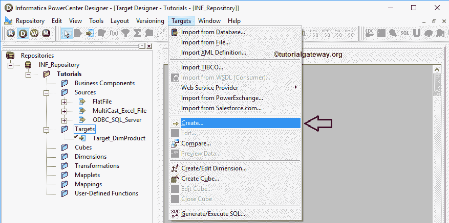
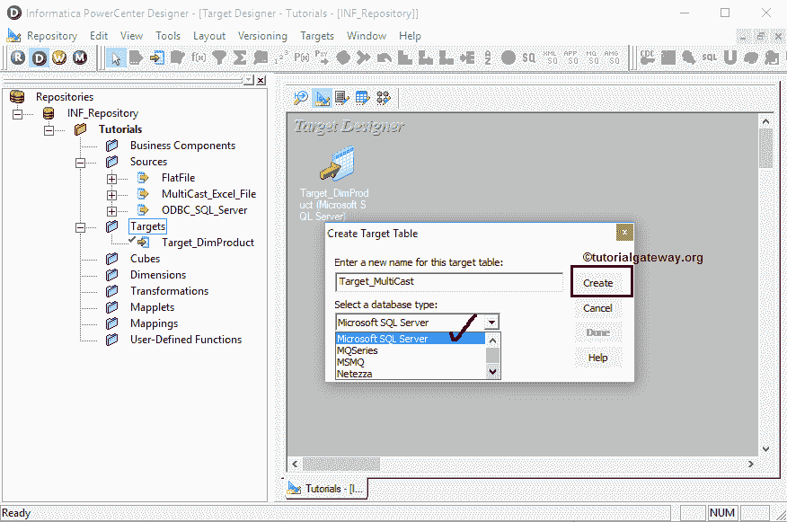
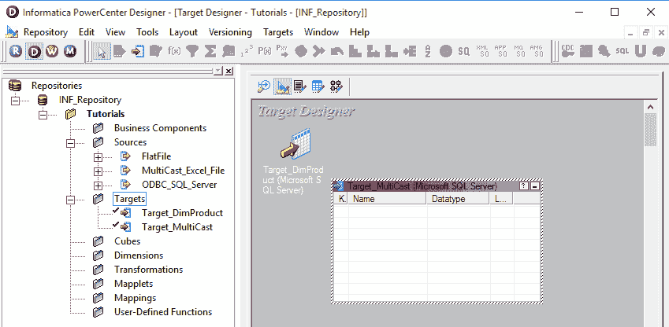
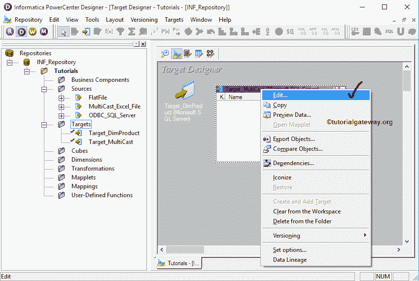
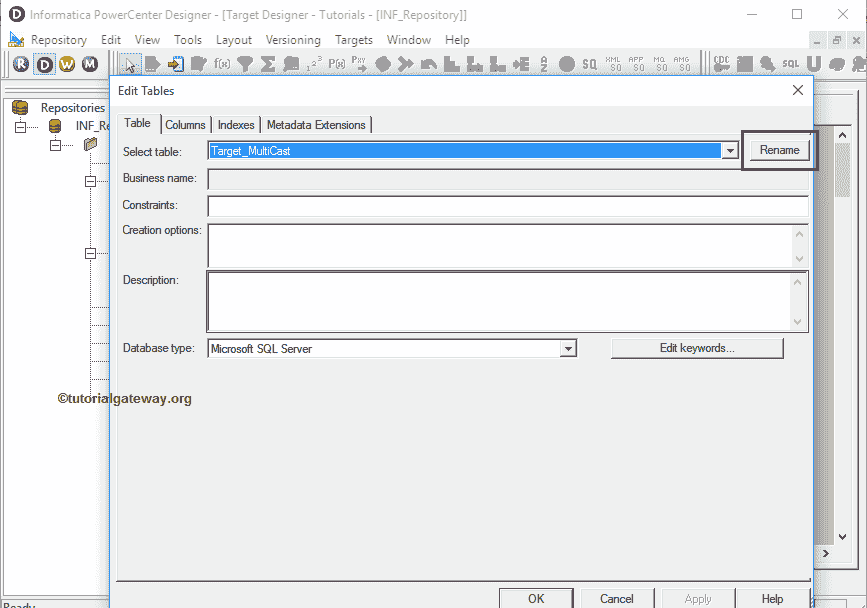
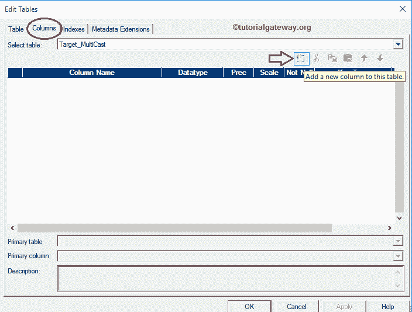
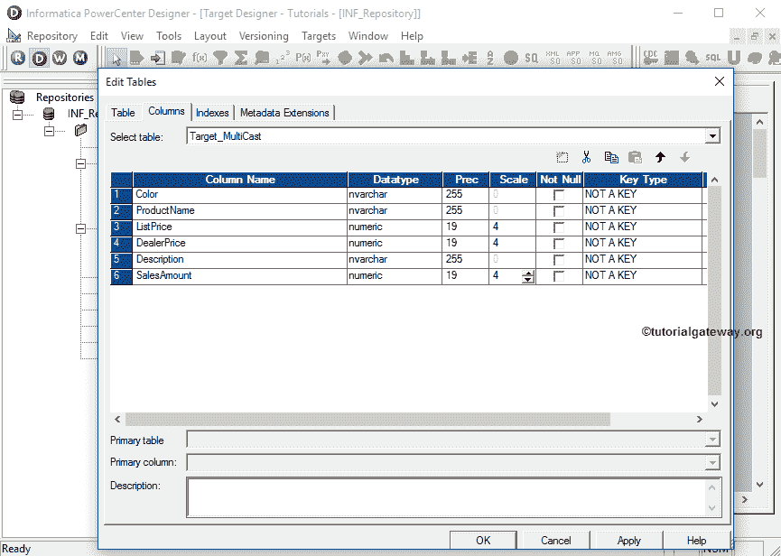
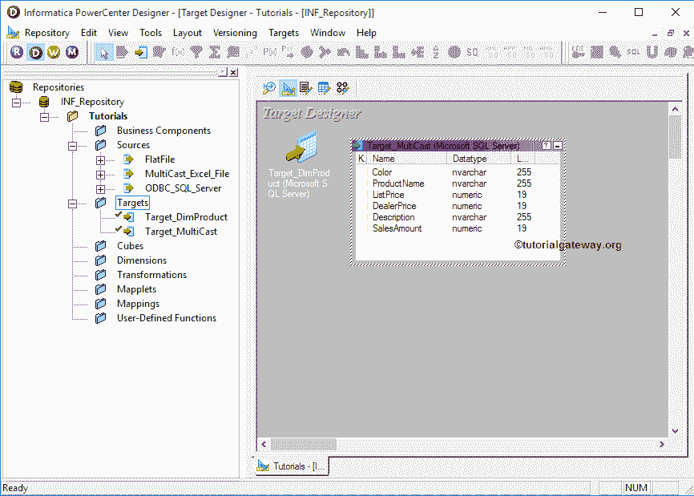

# 在信息中创建目标表

> 原文：<https://www.tutorialgateway.org/create-target-table-in-informatica/>

在本文中，我们将通过一个例子向您展示如何在 Informatica 中创建一个目标表，并将其用作转换后数据的目标表。例如，如果我们没有符合需求的表结构，那么这个选项可能是有益的。

## 如何在信息系统中创建目标表

在我们开始在 Informatica 中创建目标表之前，首先使用您的管理员凭据连接到 Informatica 存储库服务，然后导航到目标设计器。

请参考 Informatica 文章中的[目标设计器，了解目标设计器画面。从下面的截图可以观察到我们在](https://www.tutorialgateway.org/target-designer-in-informatica/)[信息港](https://www.tutorialgateway.org/informatica/)目标设计器。

提示:菜单栏中的目标菜单仅在您位于目标设计器部分时可用。

接下来，请导航到菜单栏中的目标菜单。从下面的截图中，您可以观察到 Informatica PowerCenter 设计器中的可用目标列表。在这个例子中，我们的任务是从头开始在 Informatica 中创建一个目标表。因此，我们选择了创建选项。

选择创建选项后，将显示一个名为创建目标表的新窗口:

*   为此表输入新名称:请为此新表提供唯一的名称。我们将 Target_Multicast 指定为该表的新名称
*   选择数据库类型:请从可用数据库列表中选择所需的数据库类型。这里我们选择的是微软的 SQL 服务器

填写完详细信息后，请单击创建按钮，在我们的信息中心目标设计器中创建新的空表。

我们在 Informatica 目标设计器中创建了一个新的空目标表。

要添加新列，我们可以通过右键单击表定义并选择编辑来编辑表定义..选项。

选择编辑后..选项，将打开一个名为“编辑表格”的新窗口。在表选项卡中，我们可以通过单击重命名按钮来重命名表名。请根据您的要求

进行更改

要更改或修改现有表，我们必须导航到列选项卡。这里我们想添加新的列，所以，请选择第一个按钮(在剪刀符号之前)，如下所示。它会打开一个空行来添加列名、数据类型、精度(如果需要)、比例(如果需要)。

如果是主键，则将键类型更改为主键，并勾选“非空”选项(如果您的列不允许空值)

我们添加了六列，其中包含三种 NVarchar 数据类型和三种 Numeric 数据类型。添加所需列后，点击【确定】关闭【编辑表格】窗口

从下面的截图中，可以看到我们在 Informatica 中新创建的目标表。以及我们工作区内的表定义(列名和适当的数据类型)。

注意:我们在 Informatica PowerCenter 目标设计器中创建的目标表将只存在于目标设计器中。如果您想将此表定义添加到 SQL Server，我们必须遵循我们在[使用源定义](https://www.tutorialgateway.org/create-informatica-target-table-using-source-definition/)文章创建目标表中指定的步骤(从步骤 1 到步骤 8 开始)