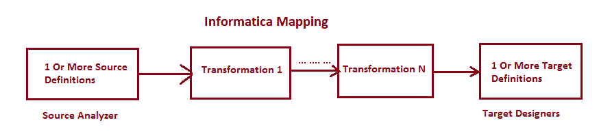
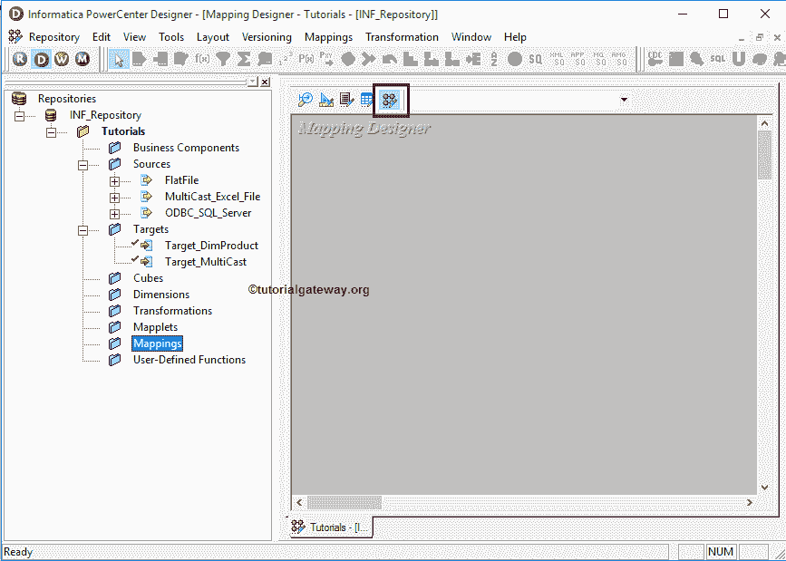
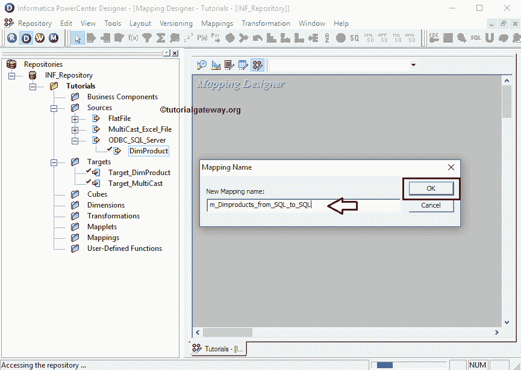
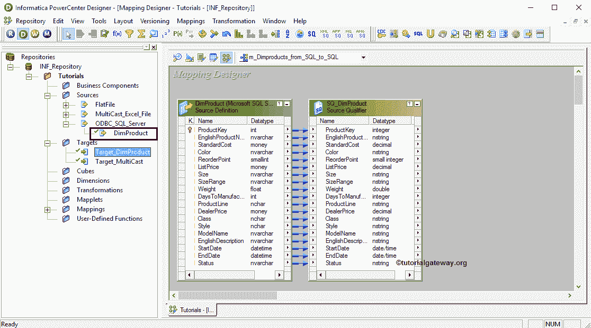
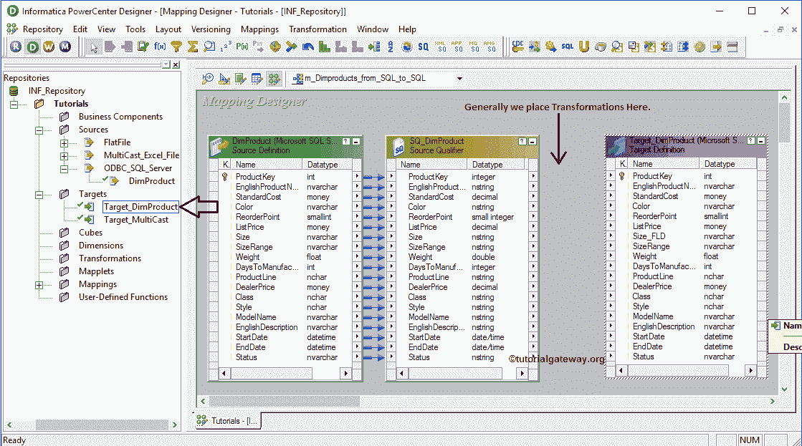
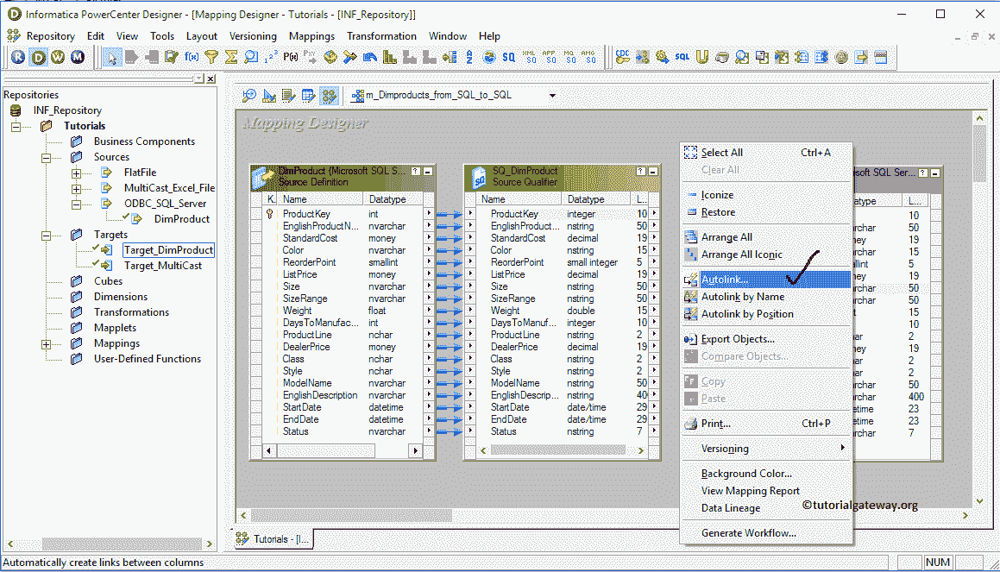
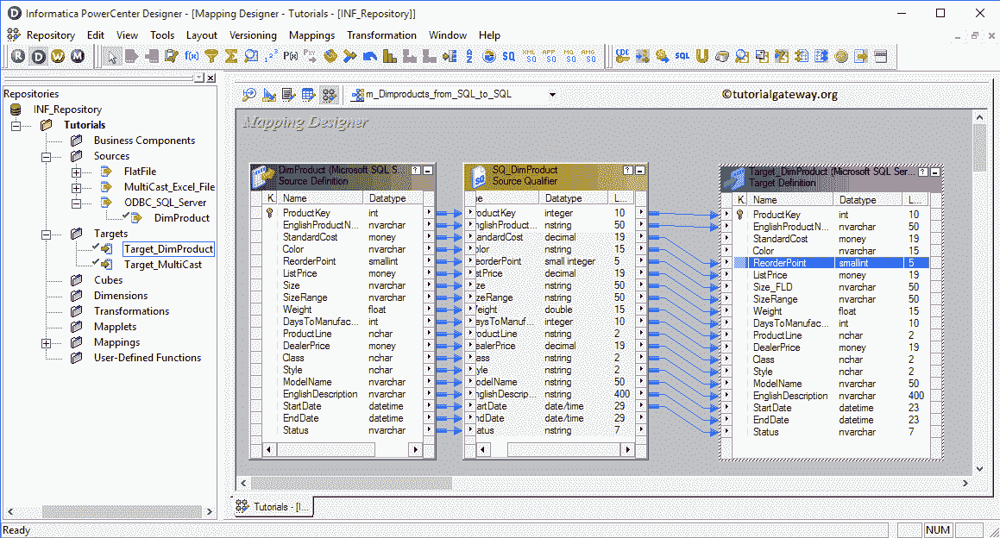
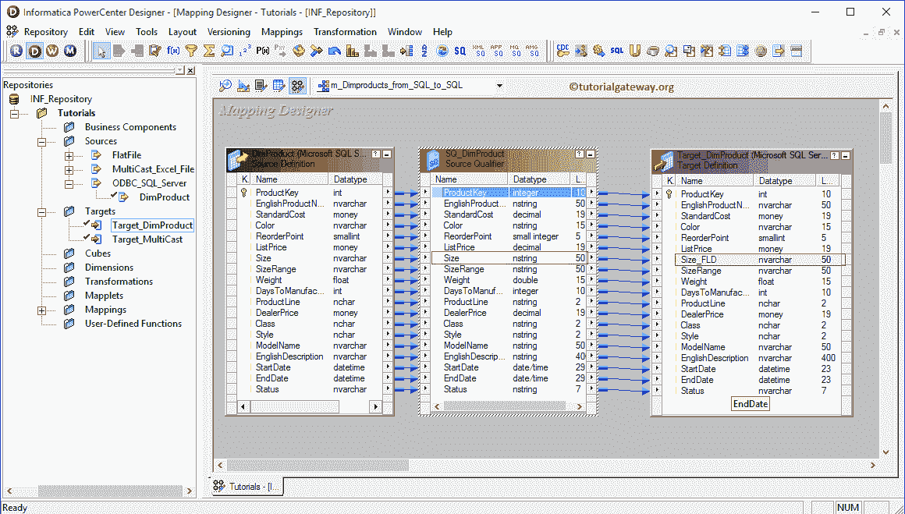
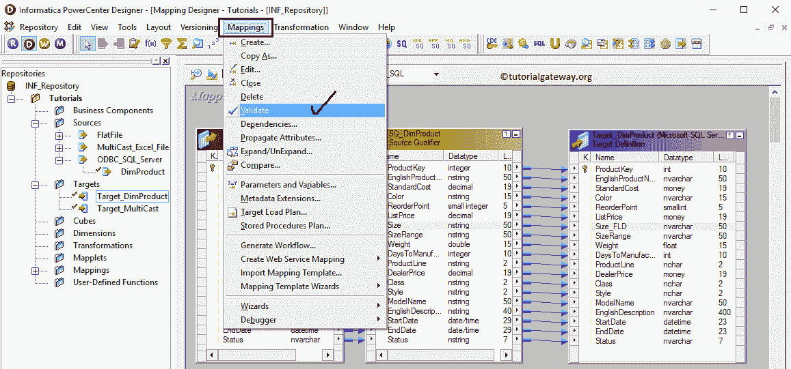

# Informatica 映射

> 原文：<https://www.tutorialgateway.org/informatica-mapping/>

Informatica 映射表示源表和目标表之间的数据流。或者我们可以说它定义了数据转换的规则。为了创建 Informatica 映射，我们需要一个或多个源定义、一个或多个目标定义和转换。

下面的截图将向您展示 Informatica 地图的图示。

从上面的截图中，您可以观察到 Informatica 中的每个映射都应该包含以下组件:

*   源定义:在这里，我们将使用我们在源分析器中创建的一个或多个源。请参考[Informatica 源分析器](https://www.tutorialgateway.org/informatica-source-analyzer/)文章了解其功能。
*   转换:使用不同类型的可用转换修改源数据。
*   目标定义:在这里，我们将使用我们在目标设计器中创建的一个或多个目标。请参考 Informatica 文章中的[目标设计器了解其功能。](https://www.tutorialgateway.org/target-designer-in-informatica/)

## Informatica 地图设计器

在我们开始 Informatica 映射之前，首先连接到 Informatica 存储库服务。

为了连接存储库服务，我们必须提供[管理控制台](https://www.tutorialgateway.org/informatica-admin-console/)凭证。因此，请提供[信息](https://www.tutorialgateway.org/informatica/)用户名和密码，并点击连接按钮。

提示:在这里，您必须提供安装 Informatica 服务器时指定的管理员用户名和密码。

连接成功后，请导航至菜单栏中的工具菜单。下面的截图将显示 Informatica PowerCenter 设计器中可用工具的列表。

在本文中，我们将解释 Informatica 映射。因此，请选择映射设计器选项。

选择映射设计器选项后，我们将进入映射设计器屏幕。

提示:只有在“映射设计器”部分中，菜单栏中的“映射菜单”才可用。否则，它不会出现。

步骤 1:要创建新映射，请导航到菜单栏中的映射菜单，并选择创建..选项。它将打开“名称”窗口。在这里，您必须为这个 Informatica 映射编写唯一的名称，然后单击“确定”按钮。

步骤 2:将 DimProducts 源定义从“源”文件夹拖放到映射设计器中。拖动源后，PowerCenter 设计器将自动创建名为源限定符的默认转换。

步骤 3:将 Target_DimProducts 目标定义从目标文件夹拖放到 Informatica 映射设计器中。

提示:通常，我们在源定义和目标定义之间放置一个或多个转换，我们将在下面的教程中介绍它们。

步骤 4:我们必须将源限定符与目标定义连接起来。informatica[power center Designer](https://www.tutorialgateway.org/informatica-powercenter-designer/)提供了多种连接方式。第一种方法是，右键单击映射设计器中的空白区域将打开上下文菜单。请选择自动链接..从中选择。

第二种方法是选择源限定符中的所有列，并将它们拖到目标定义中。在这两种方法中，如果列名不匹配，我们必须手动附加它们。

从下面的截图中，您可以看到我们在源中有一个大小列，在目标中有一个大小 _FLD 列。在这些情况下，自动链接或拖动列不会链接它们。因此，请选择所需的列(大小)，并将其拖动到目标列(大小 _FLD)以创建连接。

注意:Informatica 映射设计器允许我们通过选择链接并删除它来删除错误的连接。

步骤 5:让我们通过转到映射菜单栏并选择验证选项来验证它。

