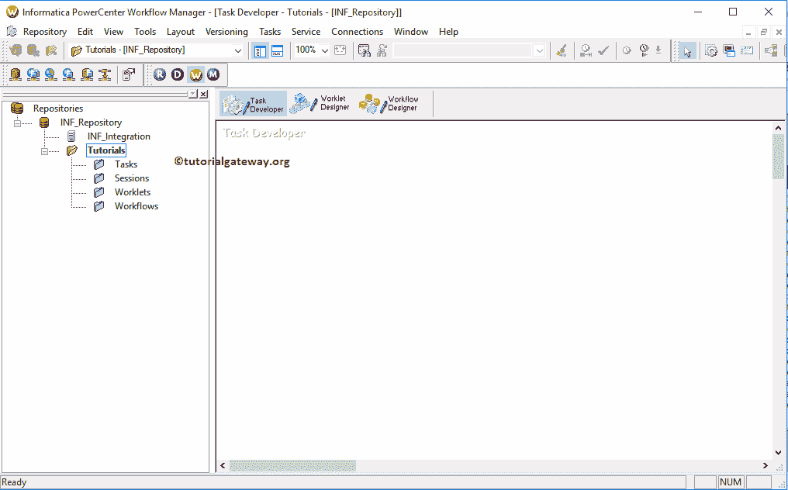

# 信息会话

> 原文：<https://www.tutorialgateway.org/session-in-informatica/>

Informatica 中的会话是一组指令，告诉 Informatica 集成服务何时以及如何将数据从源移动到目标。

在 Informatica 中，我们必须为每个映射创建一个会话任务，因为映射只是一个结构定义，会话会将数据从源移动到目标。Informatica 中有两种类型的会话:

*   不可重用的会话任务:我们在工作流设计器中创建的会话任务是不可重用的。
*   可重用会话任务:我们在 Informatica Task Developer 中创建的会话任务是可重用的

注意:在 Informatica 中创建不可重用的会话之前，我们必须配置工作流管理器，以便与数据库和集成服务进行通信。

在本文中，我们将通过一个例子向您展示如何在 Informatica 中创建不可重用的会话。对于这个例子，我们将使用我们在上一篇文章中创建的映射。

## 在信息中创建会话

在 Informatica 中创建不可重用会话遵循三个步骤，因此您必须遵循相同的过程:

*   步骤 1:配置源和目标连接。在这个例子中，我们是一个到 SQL Server 关系数据库的连接。
*   步骤 2:创建一个工作流管理器来与 Informatica 集成服务进行通信
*   步骤 3:在信息中创建会话

首先，连接到 Informatica 存储库服务。要连接到存储库服务，我们必须提供 [Informatica 管理控制台](https://www.tutorialgateway.org/informatica-admin-console/)凭据，因此，请提供适当的 [Informatica](https://www.tutorialgateway.org/informatica/) 用户名和密码，然后单击连接按钮。

从下面的截图中，你可以观察到我们在任务开发者中。

### 配置源和目标连接

在我们开始在 Informatica 中创建 Session 之前，我们必须设置关系数据库连接。为此，请导航到连接菜单并选择关系选项。

选择关系选项后，将打开一个名为关系连接浏览器的新窗口。它帮助我们创建到关系数据库的连接。

对于这个 Informatica 会话示例，我们使用 SQL 作为我们的源数据库，这就是为什么我们选择 Microsoft SQL Server 作为选择类型

从下面的截图中，您可以观察到，目前，我们没有任何关系连接。要创建新的，请单击“新建”按钮。

单击“新建”按钮后，将打开一个名为“连接对象定义”的新窗口。

*   名称:请为此连接指定唯一的名称。
*   用户名:您必须指定用户名来连接数据库。
*   密码:在这里，提供上述用户的密码。
*   数据库名称:请指定要使用的数据库的名称。对于本例，我们使用的是 AdventureWorksDW2014。
*   服务器名:在这里，你必须写你的服务器实例名。

填写完详细信息

后点击确定按钮

我们需要为目标数据库再创建一个连接字符串。虽然我们可以使用上面提到的步骤来创建，但是我们希望使用复制方式来复制上面的连接..选项。

它将打开目标的连接对象定义窗口，因此，请指定连接名称、数据库名称和其余详细信息。

注意:一旦我们配置了数据库连接，我们就必须在工作流管理器中创建一个工作流。我们将在下一篇文章中解释这一点。

### 信息系统中不可重用的会话

要在信息中创建不可重复使用的会话，请导航到任务菜单并选择创建选项。

接下来，您必须在 Informatica 中为这个不可重用的会话任务输入一个新名称。这里我们把名字指定为 s _ DimProducts _ from _ SQL _ to _ SQL

单击“创建”按钮后，将打开一个名为“映射”的新窗口。在这里，我们必须选择要与此会话关联的映射。从下面的截图中，你可以观察到，目前我们只有一个映射，所以我们正在选择它。

提示:请参考 [Informatica Mapping](https://www.tutorialgateway.org/informatica-mapping/) 文章，了解以下指定映射 m _ DimProducts _ from _ SQL _ to _ SQL

中的数据转换

我们新创建的 Informatica 会话任务已添加到工作流管理器中。在我们添加或链接到 Informatica 工作流之前，我们必须更改一些属性并配置源和目标的连接字符串。为此，请双击我们的信息会话任务

双击信息会话任务将打开以下窗口。在常规选项卡中，我们可以将会话任务重命名为更有意义的名称。请不要忘记提供任务的有效描述。

如果此任务失败，则失败父项:请选中此选项。如果此会话任务失败，则工作流将失败。

在属性选项卡中，我们有三个必须为关系数据库配置的公共属性。

$Source 连接值:该属性将关系源信息存储在$Source 变量中。因此，我们必须通过单击下面标记的箭头来配置源连接。

单击箭头后，将打开一个名为“连接浏览器”的新窗口。由于我们使用 SQL 作为我们的源数据库，我们选择微软 SQL 服务器作为选择类型。接下来，我们选择已经创建的连接，即 AdventureWorksDW

提示:如果您想在此之前创建一个新的连接，您可以使用“新建”按钮。

$Target 连接值:该属性将关系目标信息存储在$Target 变量中。因此，我们必须通过单击下面标记的箭头来配置目标连接。

对于本例，我们使用 SQL 数据库作为目标，因此，我们选择了 Microsoft SQL Server 作为选择类型，选择 Informatica 目标作为目标数据库名称

向后写兼容的会话日志文件:如果选中此选项，Informatica 会以文本格式生成会话文件，以便我们以后查看。否则，它将只产生二进制格式。

在配置对象中，我们必须配置日志选项和错误处理。虽然我们有许多属性，但我们正在讨论和配置该窗口中最常见的属性。

*   保存这些运行的会话日志:请在此指定整数。例如，如果指定 3，最后三个会话将保存到我们的 Informatica 会话日志文件中
*   出错时停止:请指定您希望会话容忍的错误数。例如，如果指定 3，会话将一直运行，直到遇到三个错误。

在映射选项卡中，我们必须配置源、目标连接和一些常见属性。首先，让我们通过单击“源”文件夹中的 Dimproducts 源来配置源连接。

在连接中，选择关系类型旁边的箭头按钮以打开关系连接浏览器。此窗口帮助您配置源连接(新建、修改等)。

这里，我们使用的是上一步创建的 Connection 变量，即:$Source

现在，让我们通过单击目标文件夹中的目标产品来配置目标连接。

在连接中，选择关系类型旁边的箭头按钮以打开关系连接浏览器。这里，我们使用的是上一步创建的连接变量，即$Target

提示:您也可以选择“使用对象”选项，并选择数据库名称。

在目标属性中，我们必须配置两个常见属性，它们是:

目标加载类型:如果目标表有索引，则使用标准类型。否则，请选择批量类型。请记住，大容量类型插入数据的速度比普通类型快，但它不适用于索引表。

截断目标表选项:通过复选标记，此选项将从目标表中截断现有数据。它帮助我们为每次成功运行插入新数据。

创建完信息会话任务后，我们必须将工作流与会话任务链接起来。