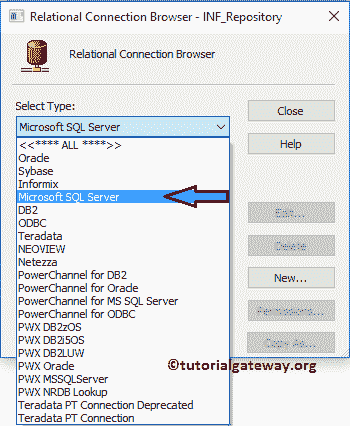
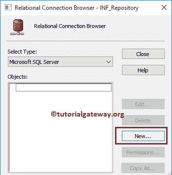
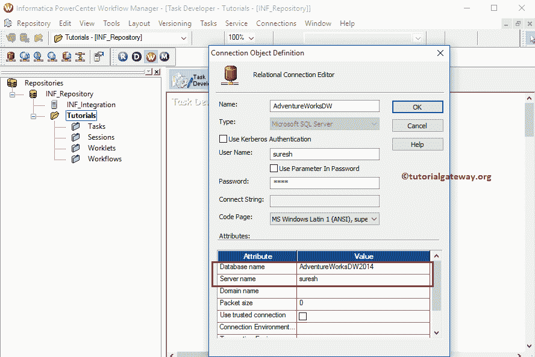
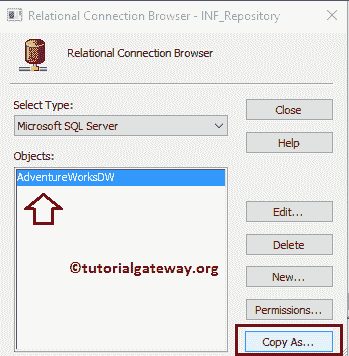
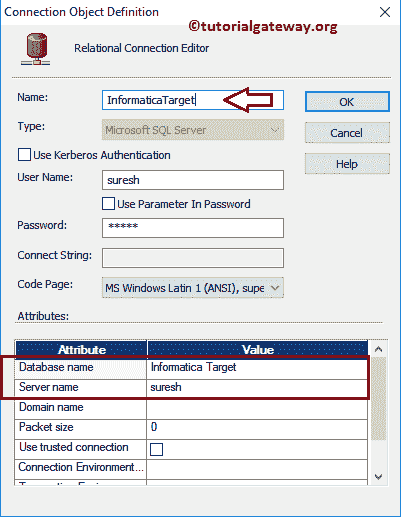
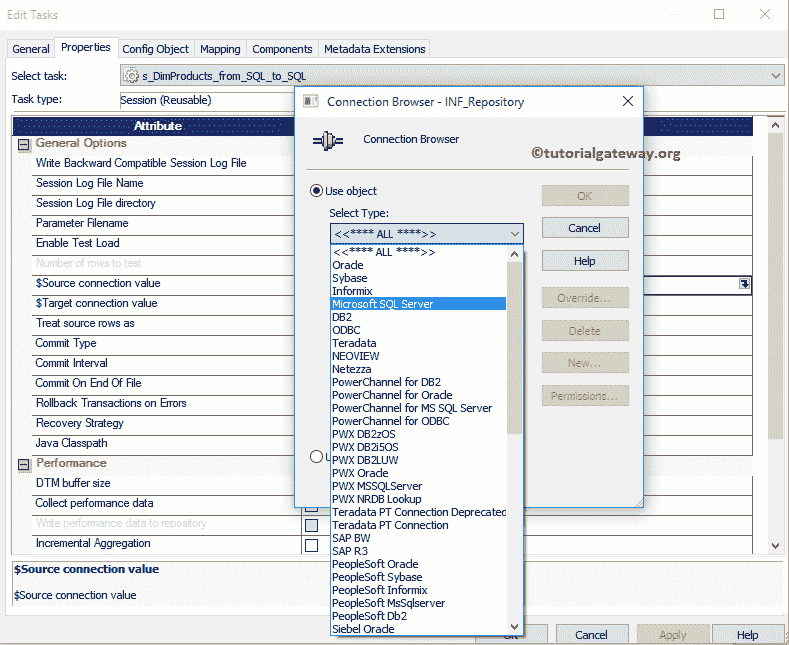

# Informatica 中的可重用会话

> 原文：<https://www.tutorialgateway.org/reusable-session-in-informatica/>

在本文中，我们将通过一个例子向您展示如何在 Informatica 中创建可重用会话。对于这个例子，我们将使用我们在上一篇文章中创建的映射。

## 在Informatica中创建可重用会话

在 Informatica 中创建可重用会话遵循两个步骤。所以你必须遵循同样的程序:

*   步骤 1:配置源和目标连接。在本例中，我们连接到了 SQL Server 关系数据库。
*   步骤 2:在 Informatica 中创建可重用会话

在 Informatica 中创建可重用会话之前，请连接到存储库服务。要与之连接，请输入[Informatica管理控制台](https://www.tutorialgateway.org/informatica-admin-console/)凭证。因此，请提供适当的用户名和密码，并点击连接按钮。

从下面的截图中，可以看到我们在 [Informatica](https://www.tutorialgateway.org/informatica/) 目标设计器中。

### 配置源和目标连接

在我们开始在 Informatica 中创建可重用会话之前，我们必须设置关系数据库连接。为此，请导航到连接菜单并选择关系选项。

选择关系选项将打开一个名为关系连接浏览器的新窗口。它帮助我们创建到关系数据库的连接。

对于这个 Informatica 可重用会话示例，我们使用了 SQL 作为我们的源数据库。所以，选择微软 SQL Server 作为选择类型

从下面的截图来看，我们没有任何关系连接。要创建一个新的，点击新建按钮。

单击新建按钮将打开一个新窗口连接对象定义

*   名称:此连接的唯一名称。
*   用户名:连接数据库的用户名。
*   密码:为上述用户提供密码。
*   数据库名称:要使用的数据库的名称。在这个演示中，我们使用的是 AdventureWorksDW2014。
*   服务器名称:在这里，写下您的服务器实例名称。

填写完详细信息

后点击确定按钮

我们需要为目标数据库再创建一个连接字符串。虽然我们可以使用前面讨论的步骤来构建，但是我们使用复制方式来复制上面的连接..选项。

它打开目标的“连接对象定义”窗口。因此，请指定连接名称、数据库名称和其余详细信息。

### Informatica 中的可重用会话

要在 Informatica 中创建可重用会话，请在任务开发人员中，导航到任务菜单并选择创建选项。

选择创建选项后，将打开创建任务窗口。请从下拉列表中选择会话任务

接下来，您必须为这个 Informatica 可重用会话任务输入一个新名称。这里我们把名字指定为 s _ DimProducts _ from _ SQL _ to _ SQL

单击“创建”按钮后，将打开一个名为“映射”的新窗口。在这里，我们必须选择要与此会话关联的映射。从下面的截图来看，目前我们只有一个映射，所以我们正在选择它。

提示:请参考 [Informatica Mapping](https://www.tutorialgateway.org/informatica-mapping/) 文章，了解以下指定映射 m _ DimProducts _ from _ SQL _ to _ SQL

中的数据转换

我们新创建的 Informatica 可重用会话任务被添加到任务开发人员中。在我们添加或链接到 Informatica 工作流之前，我们必须更改一些属性并配置源和目标的连接字符串。为此，双击我们的会话任务

双击会话任务将打开以下窗口。在常规选项卡中，我们可以将会话任务重命名为更有意义的名称。请不要忘记在 Informatica 中提供此可重用会话的任务描述。

在属性选项卡中，我们有三个必须为关系数据库配置的公共属性。

$Source 连接值:该属性将关系源Informatica 存储在$Source 变量中。因此，我们必须通过单击下面标记的箭头来配置源连接。

单击箭头后，将打开一个名为“连接浏览器”的新窗口。由于我们使用 SQL 作为我们的源数据库，我们选择微软 SQL Server 作为选择类型

接下来，我们选择已经创建的连接，即 AdventureWorksDW

提示:如果您想创建新的连接，请使用“新建”按钮创建一个连接。

$Target 连接值:该属性将关系目标Informatica 存储在$Target 变量中。因此，我们必须通过单击下面标记的箭头来配置目标连接。

对于本例，我们使用 SQL 数据库作为目标，因此，我们选择了 Microsoft SQL Server 作为选择类型，选择 Informatica 目标作为目标数据库名称

向后写兼容的会话日志文件:如果您选中此项，Informatica 会以文本格式生成会话文件，以便我们稍后查看。否则，它只会以二进制格式生成。

在配置对象中，我们必须配置日志选项和错误处理。这里，我们正在考虑和配置该窗口中最常见的属性。

*   保存这些运行的会话日志:请在此指定整数。例如，如果指定 3，最后三个会话将保存到我们的会话日志文件中
*   错误停止:您希望允许多少个错误。例如，如果我们指定 3，会话将一直运行，直到遇到三个错误。

在映射选项卡中，配置源、目标连接和一些常规属性。首先，让我们通过单击“源”文件夹中的“双产品源”来设置源连接。

在连接中，选择关系类型旁边的箭头以打开关系连接浏览器。此窗口有助于配置源连接(创建、修改)。这里，我们使用了我们在前面步骤中创建的连接变量，即:$ Source

现在，让我们通过单击目标文件夹中的目标产品来配置目标连接。

在连接中，选择关系类型旁边的箭头按钮以打开关系连接浏览器。这里，我们使用我们在前面步骤中创建的连接变量，即:$Target

在目标属性中，配置两个常见属性，它们是:

*   目标加载类型:如果目标表有索引，则使用普通类型，否则使用批量类型。大容量类型插入数据的速度比普通类型快，但它不支持索引表。
*   截断目标表选项:它从目标表中截断数据。它帮助我们为每次成功的运行插入新的数据。

一旦您完成创建会话任务，我们必须在使用它之前验证任务。为此，导航到任务菜单并选择验证选项。

从下图可以看出，我们在 Informatica 中的可重用会话是有效的。

